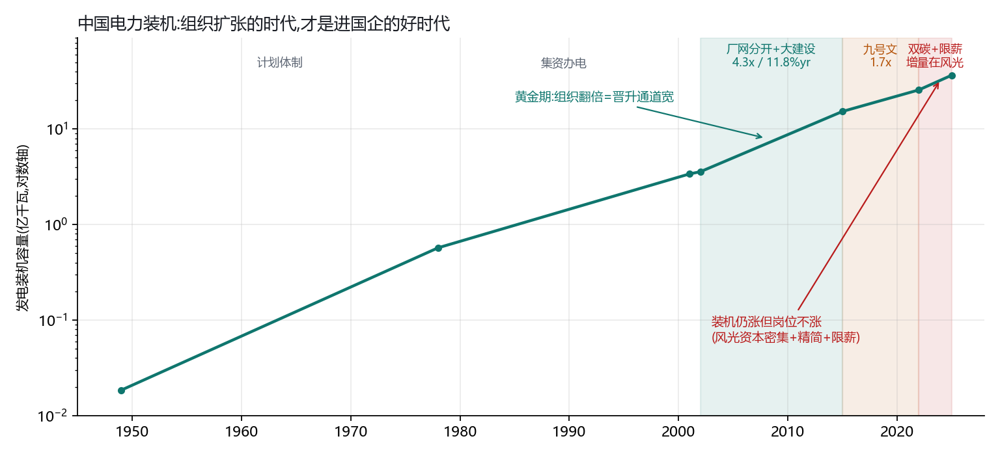
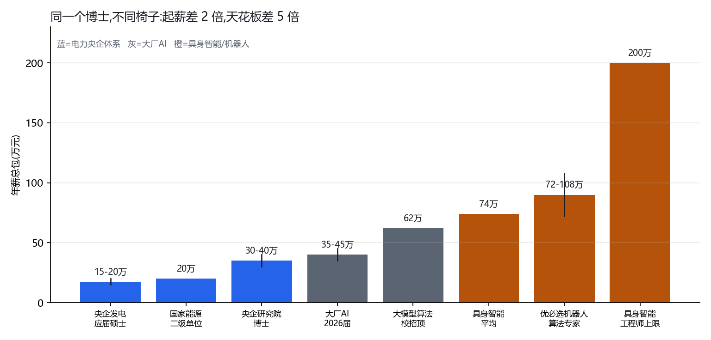
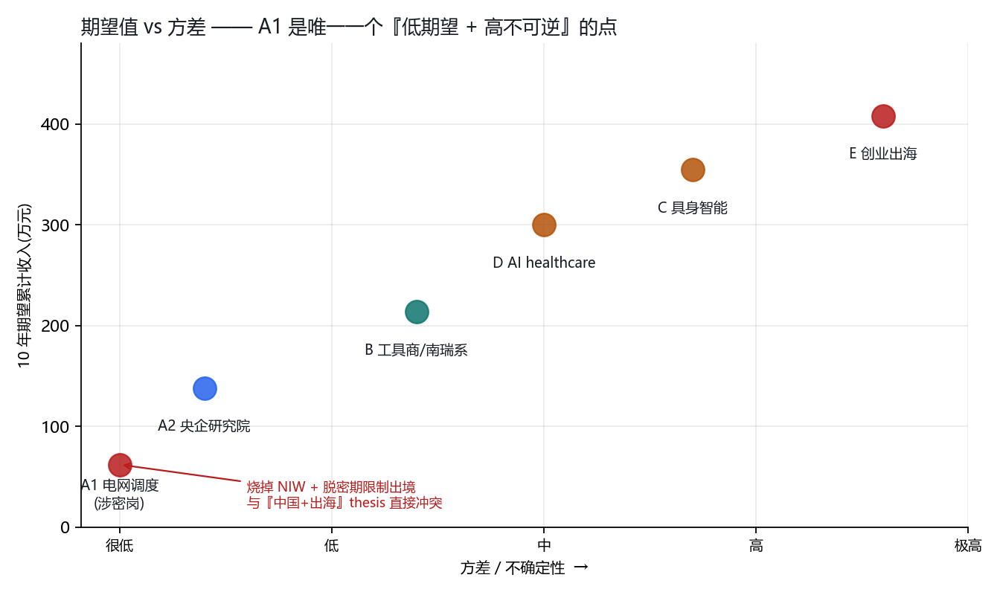

# 进中国电力央企搞 AI —— 期望值与概率分析

## 历史横切 · 优劣势拆解 · 人生情景推演

**日期**: 2026-09-16 · **性质**: 职业路径分析(非投资建议、非职业咨询)
**触发问题**: "如果我入职电力公司搞 AI 动态平衡发电分配或者电力机器人,有前途吗?—— 只说国内,国企央企。我要横向对比历史、理性纯粹地分析对我的优劣势、期望收益的概率分析。可以出一些人生假设。"
**承接**: `studies/电力需求与电力公司盈利_百年实证_2026-09-16/`(百年实证框架)
**个人 profile 来源**: `career-thesis/2026-ai-healthcare-v2/_personal/nick-profile.md`

---

## ⚠️ 阅读前必须知道的三件事

1. **本文的概率是结构化主观估计,不是实测数据。** 薪酬、装机、财务、法规条文全部有一手来源(见附录),但"P(进得去)=45%"这类数字是我基于 profile 的判断,可以被你直接推翻。
2. **我不是职业顾问。** 这是把百年实证的租金捕获框架 + 期望值方法套到你的 profile 上,不是"你应该做 X"。
3. **本文越过了你 v2 方法论的正确顺序。** 你自己定的规则是 fit 只能在 step 3 注入;这里我用百年研究代替了 step 1–2,直接跳到 fit。**所以它是方向判断,不是岗位判断。**

---

## 0. 结论先行

> **"AI 动态平衡发电分配"这条路,在你的约束下几乎是封死的 —— 不是因为技术没前途,是因为一条法规。**
> **"电力机器人"这条路方向对,但你想进的那一层(电力央企)是错的一层;而且这个赛道的真实规模比宣传小一个数量级。**
> **真正和你 profile 匹配、且租金在那一层的,是"卖工具给电力系统的公司",不是"电力公司"。**

### 四条硬结论

| # | 结论 | 依据 |
|---|---|---|
| 1 | **电网调度类岗位对你实际是封闭的** | 涉密人员规定:不得具有境外永久居留权,**配偶同样**;出境需审批;离岗有脱密期。你 NIW 已批 —— 进去 = 烧掉这张牌 + 接受出境限制,**与你已锁定的"中国+出海"thesis 正面冲突** |
| 2 | **进电力国企的黄金期是 2002–2015,已经结束** | 装机 3.57→15.25 亿 kW,**4.3 倍 / 11.8%yr**,组织翻倍扩张 = 晋升通道宽。2022–25 装机仍 +12.5%,但**增量几乎全在风光(资本密集非人力密集)+ 同期限薪精简** → 装机增长与岗位增长已脱钩 |
| 3 | **发电集团的利润是煤价的反函数,不是需求的函数** | 2021–22 华能国际累计亏 176 亿、大唐发电亏 109 亿(煤价 1296 元/吨 +24.2%);2022 年底大唐扭亏至 +67 亿;2024 大唐净利 +66%,驱动力是"燃煤成本下降"。**同期用电量一直在涨。** 这是百年研究 §6.1 的中国版 |
| 4 | **电力机器人赛道的真实规模比宣传小 41 倍** | 咨询口径 2025 市场 274.8 亿(电力占 88.5%)→ 243 亿;**两家上市纯玩家真实营收合计约 6 亿**,且亿嘉和营收 −5.91% 并亏损、申昊机器人业务 −11.69%。**两家的机器人业务都在萎缩** |

---

# 第一部分:历史横切

## 1. 五个时代 —— 组织是否在扩张,决定了进去的人的命运



| 时代 | 装机(亿 kW) | CAGR | 倍数 | 组织状态 / 对个人的含义 |
|---|---|---:|---:|---|
| 1949–1978 | 0.02 → 0.57 | 12.6% | 30.9x | **电力工业部**,计划体制。铁饭碗、分房、子弟顶班 |
| 1978–2001 | 0.57 → 3.38 | 8.0% | 5.9x | 改革开放集资办电。身份仍是"干部",待遇平均主义 |
| **2002–2015** | **3.57 → 15.25** | **11.8%** | **4.3x** | **厂网分开 + 大建设 —— 黄金期。五大圈地建厂,组织翻倍扩张** |
| 2015–2022 | 15.25 → 25.64 | 7.7% | 1.7x | 九号文、售电侧放开。煤电过剩,利用小时下降 |
| 2022–2025 | 25.64 → 36.50 | 12.5% | 1.4x | 双碳 + 煤价冲击 + AI 叙事。**限薪 + 精简** |

### 1.1 制度断点

| 年份 | 事件 | 对在岗者的影响 |
|---|---|---|
| 1997-01 | 国家电力公司成立 | 政企分开启动 |
| 1998-03 | **撤销电力工业部** | 身份从"干部"变"企业员工" |
| **2002-12** | **五号文:国家电力公司拆为两网五大** | 人跟资产走。**与纺织/煤炭不同,电力没有大规模下岗** —— 因为当时正要大建设 |
| **2015-03** | **九号文:管住中间、放开两头** | 售电侧引入社会资本,但输配电价仍管制 |
| 2020– | 双碳 + 煤价冲击 | 利润剧烈波动,组织进入精简期 |

### 1.2 这张表最重要的一行

**央企的晋升本质是组织金字塔。装机翻 4 倍 = 岗位翻倍 = 晋升快。**

2002–2015 进去的人,现在是中层和高层 —— 他们赶上的不是"电力有前途",是**组织在扩张**。

而 2022–2025 装机年化 12.5% 看起来同样漂亮,但:

- 增量几乎全在**风光**,而风光是资本密集不是人力密集 —— 建一个同容量风电场需要的人远少于煤电
- 同期在**限薪 + 人员精简**
- **结论:"装机还在涨"和"你的晋升通道还在开"已经脱钩了。**

这正是百年研究里反复出现的那条规律的职业版:**需求增长是真的,不代表进去的人拿得到。**

## 2. 发电集团的利润 = 煤价的反函数

| 时间 | 事实 |
|---|---|
| 2021–2022 | 华能国际累计亏损 **>176 亿**,大唐发电 **>109 亿** |
| 2022 | 北方港 5500 大卡动力煤均价 **1296 元/吨(+24.2%)** |
| 2022 年底 | 大唐集团扭亏为盈,净利 **67.08 亿**(上年 **−241.62 亿**) |
| | 华电集团净利 140.47 亿(**+287%**),华能集团 161.2 亿(+61.2%) |
| 2024 | 大唐集团利润总额 +35%、净利润 **+66%** —— 驱动力是"**燃煤成本下降**" |

> **这几年用电量一直在涨。利润却从 −241 亿到 +67 亿再到 +66%。**
> **受管制电价 + 市场化燃料 = 最坏的组合。**
> **对求职者的含义:你的奖金包随煤价波动,而你对煤价零影响力。**

## 3. 租金在哪一层 —— 同一个电力系统,三把椅子

| 椅子 | 代表 | 2024/25 表现 | 百年研究里的对应 |
|---|---|---|---|
| **① 发电集团**(卖电的) | 华能 / 大唐 / 华电 / 国电投 | 利润 −241 亿 → +67 亿,随煤价 | **铁路公司股东** |
| **② 电网**(输配的) | 国网 / 南网 | 输配电价管制,稳定但封顶 | 受监管公用事业 |
| **③ 工具商**(卖系统设备的) | **国电南瑞** | 营收 385→574 亿(+10%/yr)<br>归母净利 48→76 亿(+11%/yr)<br>调度自动化市占 **>50%,近乎独占**<br>**2025H1 海外营收 +139.18%** | **Brassey / GE / Cisco** |

> **南瑞是这个系统里唯一一个"营收利润双位数稳定增长 + 海外爆发"的。**
> 它卖调度系统给电网,自己不发电、不输电。
> **而它的海外 +139% 恰好对上你 profile 里"出海/全球化"这一条。**

## 4. 出海通道的真实规模

| | |
|---|---|
| 2022 年中国电力企业在"一带一路"国家签约 | **288 个项目**,合同额 **$2,174 亿**,占海外电力合同 63.9% |
| 主要模式 | **EPC 总承包占 76–80%** |
| 投资领域 | 水电清洁能源 48%、火电 21%、输变电 16% |

**这条通道是真的,而且是 EPC 主导 —— 需要的是"能在海外现场把系统装起来并卖出去"的人,不是"在总部写算法"的人。** 这恰好是你 HydroSense 已经做过的事(2 万传感器、5 国部署)。

---

# 第二部分:你的优劣势 —— 逐条硬核

## 5. 优势(五条,每条都有具体证据)

| # | 优势 | 为什么在这个赛道稀缺 |
|---|---|---|
| 1 | **硬件 + 传感器 + 跨国现场部署**(HydroSense 2 万传感器、5 国) | 这是电力机器人/巡检最难的部分。算法有人做,**能把设备装到 5 个国家的现场并收到钱的人极少** |
| 2 | **影像 DL(光声 + 临床转化)** | 巡检的核心是**影像异常检测**(可见光/红外/激光雷达)。影像→影像是短迁移,不是从零学 |
| 3 | **ML 系统工程(SGLang 开源)** | 会训模型的人多,**会做推理系统工程的人少**。边缘部署/模型压缩在机器人上直接用得上 |
| 4 | **双语 + 明确的出海偏好** | 对上南瑞海外 +139%、一带一路 $2,174 亿。**中国电力出海最缺的就是"技术+商务+跨文化"三合一** |
| 5 | **年龄 28–29 + 应届博士身份** | 国网海外留学生通道博士线 ≤33 岁。**你还在窗口内,但这是一次性的** |

## 6. 劣势(八条,按杀伤力排序)

### 🔴 6.1 涉密门槛 —— 这一条可能直接终结"AI 动态平衡发电分配"

《保守国家秘密法》配套规定,涉密人员:

- 必须中国国籍,**不得具有外国国籍或境外永久居留权/长期居留许可**
- **配偶同样**要求中国公民且无境外居留权
- **出境需审批**;离岗后有**脱密期**,期内限制出境与择业

**电网调度系统 = 关键信息基础设施 + 国家安全 → 几乎必然是涉密岗。**

你的状态:**NIW(EB-2 国家利益豁免)I-140 已批。**

| 精确判断 | |
|---|---|
| I-140 已批 ≠ 已取得永居 | 技术上此刻不构成"已取得境外永久居留权" |
| 但进涉密岗 = **主动放弃这条已到手的通道** | 且未来十年不能再走 |
| 政审会看 6 年美国经历 + 已批 NIW | 即使不自动排除,也是显著减分项 |
| 配偶条件同样适用 | 这是家庭决策不只是个人决策 |

> **代价 = 烧掉 NIW + 接受出境限制。**
> **而你 profile 里已锁定"中国+出海""喜欢全球化/跨地理"。**
> **这两件事在同一个人身上不能同时成立。**

### 🔴 6.2 专业不对口 —— 央企招聘按专业目录卡

国家电网 2026 海外留学生招聘:

- **电气类**本科即可;**非电类(计算机等)需硕士以上**
- 博士 **≤33 岁**(截至 2026-06-30)
- 必须 **2025-07-01 至 2026-06-30 毕业**,且 **2026-08-31 前**完成教育部留服认证
- **专业一致性**:本硕跨专业需提供课程相关性证明

**光声成像 + 深度学习 ≠ 电气工程。** 在一个按专业目录做硬筛的体系里,这是结构性障碍,不是"简历写得好就能过"。

### 🟡 6.3 编制身份 —— 央企有四类用工

原正式工 / 合同制 / **劳务派遣** / **业务外包**。

- 派遣工与正式工"同工不同酬",薪酬福利晋升差距大
- **外包员工没有资格评职称或晋升**
- 海归博士常见入口是**研究院**而非主业 —— 研究院待遇不差(博士 30–40 万),但**离核心业务远**

### 🟡 6.4 限薪天花板

- 2014 年央企负责人薪酬制度改革;工资总额实行**备案/核准制**
- 央企研究院博士年薪 **30–40 万**;在京二级单位转正到手 **~20 万**
- **例外通道存在**:对稀缺科技人才可"一人一议"突破限薪(如山东可达同职级平均工资 **6 倍**)
- **但这个例外要求你的专业正好是该央企的战略稀缺方向 —— 光声成像不是**

### 🟡 6.5 组织不再扩张

见 §1。2002–2015 的晋升红利已经结束。

### 🟡 6.6 党员身份(推测)

央企管理岗晋升事实上需要。你 6 年在美国,大概率没有。**这不影响技术岗,但封死管理通道。**

### 🟡 6.7 应届窗口是一次性的

国网要求 2025-07 至 2026-06 毕业 + 8 月底前学历认证。**错过这个窗口只能走社招,而社招对非对口专业更难。**

### 🟡 6.8 与 profile 的偏好冲突

你自己写的:"不喜欢纯运营/履约"、"风险偏好中高"、"喜欢深度分析 + 长周期 + 多学科融合"。

**央企主业的日常大量是运营和流程。** 这不是好坏问题,是匹配问题。

---

# 第三部分:期望值与概率分析

## 7. 六条路径的 10 年现金 NPV

折现率 5%(职业收入不该用股权折现率)。单位:万元人民币。

| 路径 | 首年 | 增速 | 10 年封顶 | **10y NPV** | **P(进得去)** | 风险调整 NPV |
|---|---:|---:|---:|---:|---:|---:|
| **A1 电网/发电央企主业**(调度/AI 平衡) | 32 | 8% | 90 | 347 | **18%** | 62 |
| **A2 央企研究院/二级单位**(非涉密) | 35 | 9% | 110 | 397 | 45% | 179 |
| **B 电力设备/软件工具商**(南瑞系/民企) | 45 | 11% | 160 | 557 | 55% | 307 |
| **C 具身智能/机器人**(电力是客户之一) | 74 | 13% | 300 | 1,003 | 40% | 401 |
| **D AI healthcare 主线**(原 thesis) | 60 | 12% | 250 | 777 | 50% | 389 |
| **E 家族传感器 + 电力/基建出海**(创业) | 25 | 20% | 500 | 467 | 25% | 117 |

**⚠️ A1 的 18% 还是高估的** —— 它没有把涉密门槛作为硬约束扣进去。如果你不放弃 NIW,**A1 的真实概率接近 0**。

## 8. 薪酬对照 —— 同一个博士,不同椅子



| 岗位 | 薪酬 |
|---|---:|
| 央企发电集团 应届硕士总包 | 15–20 万 |
| 国家能源集团 在京二级单位转正到手 | ~20 万 |
| **央企研究院 博士年薪** | **30–40 万** |
| 大厂 AI 算法 2026 届应届 | 35–45 万(顶尖 50 万+) |
| 大模型算法 校招薪酬天花板 | 月薪 5.2 万 ≈ 62 万 |
| **具身智能赛道平均** | **月薪 6.2 万 ≈ 74 万** |
| 优必选 机器人学习算法专家 | 月薪 6–9 万 ≈ 72–108 万 |
| **具身智能算法工程师上限** | **200 万** |
| 星海图 应届博士总包(个例) | 500 万 |

> **起薪差 2 倍(30–40 万 vs 74 万),十年后差距放大到 3–5 倍**(央企受工资总额管控封顶约 90–110 万,市场化路径无硬顶)。

## 9. 情景树 —— 每条路径的分支结局

### A2 央企研究院 · 期望值 **134 万**(10 年累计)

| 概率 | 结局 | 10y | 波动 |
|---:|---|---:|---|
| 35% | 进了但做"AI 示范项目",技能不可迁移,靠编制稳定 | 95 万 | 低 |
| 40% | 技术骨干/中层,年薪 70–90 万,体制内天花板 | 150 万 | 低 |
| 15% | 转到国网国际/出海条线,做海外电网项目 | 200 万 | 中 |
| 10% | 三年内离开,带走的技能在市场上折价 | 110 万 | 中 |

### B 工具商(南瑞系)· 期望值 **219 万**

| 概率 | 结局 | 10y | 波动 |
|---:|---|---:|---|
| 30% | 产品/算法骨干,随南瑞海外 +139% 出海 | 280 万 | 中 |
| 40% | 稳定技术岗,年薪 100–140 万 | 210 万 | 低 |
| 20% | 公司周期下行(参考亿嘉和/申昊),被动转岗 | 130 万 | 高 |
| 10% | 跳到甲方或创业 | 250 万 | 中 |

### C 具身智能 · 期望值 **349 万**

| 概率 | 结局 | 10y | 波动 |
|---:|---|---:|---|
| 25% | 押中赢家,股权兑现 | 600 万 | 极高 |
| 35% | 公司活着但没上市,现金薪酬高 | 320 万 | 高 |
| 30% | 2–3 年内公司出局,**技能仍值钱**,再就业 | 240 万 | 高 |
| 10% | 赛道整体去泡沫(参考光伏 2013),薪酬腰斩 | 150 万 | 极高 |

### E 创业(传感器出海)· 期望值 **378 万**

| 概率 | 结局 | 10y | 波动 |
|---:|---|---:|---|
| 15% | 做成区域龙头 | 1,200 万 | 极高 |
| 35% | 稳定现金流生意,年利润 200–400 万 | 420 万 | 高 |
| 35% | 勉强维持,机会成本巨大 | 120 万 | 高 |
| 15% | 失败,损失 3–5 年 | 60 万 | 极高 |

## 10. 期望值 vs 方差 vs 可迁移性



| 路径 | 10y 期望(万) | 方差 | 技能可迁移性 |
|---|---:|---|---|
| **A1 电网调度**(涉密岗) | **62** | 很低 | **最低 —— 且不可逆** |
| A2 央企研究院 | 138 | 低 | 低 —— 体制内经验对外部市场折价 |
| B 工具商(南瑞系) | 214 | 中 | 中 —— 电力 know-how + 产品经验 |
| D AI healthcare | 300 | 中高 | **高 —— 与 PhD 直接对口** |
| C 具身智能 | 355 | 高 | **高 —— 算法/机器人技能全行业通用** |
| E 创业出海 | 408 | 极高 | 高 —— 但绑定在自己身上 |

> **🔴 A1 是全表唯一一个"低期望 + 高不可逆"的点。**
> 低期望可以接受(换稳定);高不可逆可以接受(换高回报)。
> **但"低期望 + 高不可逆"没有任何补偿机制 —— 这是投资里的负期望赌局。**

## 11. 电力机器人赛道的真实规模 —— 41 倍缺口

| | |
|---|---:|
| 咨询口径 2025 智能巡检机器人市场 | 274.8 亿(电力占 88.54%)→ **电力巡检 243 亿** |
| 亿嘉和 2025 总营收 | **5.51 亿(−5.91%)**,归母净利 **−0.42 亿(亏损)** |
| 申昊科技 2025 智能机器人业务 | **0.45 亿(−11.69%)** |
| **两家合计 vs 号称市场** | **≈6 亿 vs 243 亿 = 41 倍缺口** |

**三种解释,每一种都对求职者不利:**

1. 咨询报告数字虚高(智研/观研类报告的常见问题)→ 赛道比宣传小得多
2. 国网智能等体系内供应商吃掉绝大部分 → **民企玩家只能捡剩下的**
3. 统计口径含无人机/固定监测等非机器人品类 → 真正的"机器人"盘子更小

> **无论哪种,结论一致:两家纯玩家的机器人业务都在下滑。这不是一个正在起飞的赛道。**
> **这正是百年研究 §20 弧线里的第 5 段"反证出现"——只不过这次反证出现得很早。**

---

# 第四部分:人生假设 —— 五个情景,十年后

> 以下是推演,不是预测。每个情景给 35 岁(2032)和 38 岁(2035)两个切片。

## 情景一:进国网/发电集团研究院(为此放弃 NIW)

**2032(35 岁)**:研究院技术骨干,年薪 60–75 万,北京户口,有房贷。做的是"AI+电力"的示范性项目,论文能发,但很难说清楚自己做的东西每年为公司挣了多少钱。孩子在读小学。**已经三年没出过国 —— 不是不想,是流程麻烦。**

**2035(38 岁)**:两条岔路。一条是升到部门副主任,年薪 90 万左右,进入管理通道(但没党员身份会卡);另一条是发现技术上被外面甩开了 —— 你还在做电网负荷预测,外面的人在做世界模型。**这时候想出去,会发现市场对"央企研究院 10 年"的定价远低于你的预期。**

**这个情景最真实的代价不是钱,是可逆性的丧失。**

## 情景二:进南瑞系 / 电力设备工具商

**2032**:产品或算法骨干,年薪 90–120 万。因为南瑞海外在爆发,你大概率被派过一到两次海外项目(东南亚/中东/非洲)。**你的双语和跨国部署经验在这里第一次被真正定价。**

**2035**:两条岔路。一条是成为海外事业部的技术负责人,年薪 140–160 万,手里有真实的海外项目履历;另一条是电力资本开支周期下行(参考 2002–05 燃气电厂、2008 造船),公司收缩,你被动转岗。**但即使是坏的那条,你带走的"电力系统 know-how + 海外交付经验"仍然可卖。**

## 情景三:进具身智能/机器人公司(电力是客户之一)

**2032**:年薪 120–180 万 + 期权。你在做的可能是通用机器人,电力巡检只是其中一个落地场景。**你的影像 DL + 硬件部署背景在这里是加分项而不是转行。**

**2035**:三条岔路。25% 概率公司上市/被收购,期权兑现,你 38 岁财务自由度大幅提升;35% 概率公司活着但没上市,你现金薪酬高但期权是纸;**30% 概率公司已经死了,但你的技能仍在市场上值钱 —— 这是关键,失败的下行是有底的。**

**这个情景的本质:高方差,但下行有底。** 和百年研究里 Cisco 的教训一致 —— 工具商赚建设期的租金,建设期结束会回吐,**但技能不会被没收。**

## 情景四:回到 AI healthcare 主线(你原来的 thesis)

**2032**:年薪 100–150 万。专业最对口,不需要转行成本。你的 PhD、Roswell Park 临床转化经验、npj Imaging 发表全部直接变现。

**2035**:成为某个细分领域(影像 AI 的某个适应症)的技术负责人或创业者。**这条路的期望值(300 万)不是最高的,但它是"零转行成本 + 高可迁移性"的唯一组合。**

## 情景五:家族传感器 + 电力/基建出海(创业)

**2032**:两种可能。要么你把 HydroSense 的传感器网络能力迁移到电力/基建监测,跟着一带一路的 EPC 走出去,年利润 200–400 万;要么还在挣扎,而你已经 35 岁,**机会成本是前面四条路里任何一条的确定性收入。**

**2035**:15% 概率做成区域龙头(1,200 万+);35% 概率稳定现金流生意;**50% 概率是"勉强维持"或"失败"。**

**这条路的特殊性:它调用的是你已经做成过一次的能力,不是要新学的。** 但它也是唯一一条会让你 35 岁时"什么都还没有"的路。

---

# 第五部分:判据

## 12. 我的判断

**"AI 动态平衡发电分配" —— 不建议,理由是结构性的不是技术性的:**

1. 涉密门槛让它与你的 NIW 和出海 thesis 不兼容
2. 专业不对口在按目录筛选的体系里是硬障碍
3. 期望值最低(62 万风险调整 NPV)且不可逆性最高
4. 发电集团的利润随煤价波动,你对它零影响力

**"电力机器人" —— 方向对,但椅子要坐对:**

- ❌ 进**电力公司**做机器人 = 甲方,是"使用者"那一层,拿不到租金
- ✅ 进**给电力公司卖机器人/系统的公司** = Brassey 那把椅子
- ⚠️ 但两家上市纯玩家的机器人业务都在萎缩 → **不要把宝押在"电力巡检"这个单一场景上,要押在"机器人/具身智能"这个更大的池子里,电力只是其中一个客户**

## 13. 如果一定要在电力这条线上找位置,优先级

| # | 位置 | 理由 |
|---|---|---|
| **1** | **南瑞系 / 电力软件工具商的海外条线** | 租金在这一层(净利 +11%/yr);海外 +139% 对上你的出海诉求;不涉密(海外业务反而需要有国际背景的人) |
| **2** | **具身智能/机器人公司,电力作为客户场景之一** | 薪酬 2 倍;技能可迁移;下行有底 |
| 3 | 国网国际 / 电力 EPC 的海外技术岗 | 一带一路 $2,174 亿是真的;EPC 占 76–80% 需要现场交付能力 —— 你有 |
| 4 | 央企研究院(非涉密) | 稳定,但期望值和可迁移性都低 |
| ❌ | 电网调度 / 涉密岗 | 见 §6.1 |

## 14. Kill Criteria —— 什么情况下推翻本文结论

| 触发 | 方向 |
|---|---|
| 你确认**不打算要美国绿卡**,且配偶也无境外身份 | 🟢 A1 重新变成可选项,但仍受专业目录限制 |
| 国网/发电集团给出**"一人一议"突破限薪**的 offer | 🟢 A2 的期望值需上修 |
| 亿嘉和/申昊的机器人业务**连续两年恢复双位数增长** | 🟢 电力机器人赛道判断需重估 |
| 南瑞海外营收增速**掉回 20% 以下** | 🔴 出海通道的窗口在关闭 |
| 具身智能赛道出现**光伏 2013 式的整体去泡沫** | 🔴 C 路径的期望值腰斩(百年研究 §16) |
| 你拿到**具体 offer**(任何一条路径) | ⚠️ 本文的概率估计全部作废,改用实际条件重算 |

## 15. 建议的下一步

**按你自己 v2 方法论的正确顺序,平行开一条线:**

```
career-thesis/2026-power-and-robotics/
  step-1-macro-sizing        中国电力AI + 具身智能 子赛道定量(不看 Nick)
  step-2-value-chains        画 甲方→工具商→零部件→算法 的租金分布
  step-3-rent-capture-and-fit  这时才注入 nick-profile
  step-4-positions           具体公司×角色
  step-5-money-lens-check    人工 synthesis
```

**和 AI healthcare 那条线并排比。** 我的怀疑是:**跑完 step 3 你会发现"具身智能/机器人"在你 profile 上的 fit 分不低于 healthcare,因为它调用的是你已经做成过一次的能力(硬件+传感器+跨国部署+影像),而不是要新学的。**

但那要跑完才知道 —— 本文只是方向判断。

---

## 附录 A:一手来源

**法规**:[中华人民共和国保守国家秘密法](http://www.npc.gov.cn/cwhhdbdh/c4186/c13494/c13504/c13515/201905/t20190523_400547.html) · [涉密人员在岗保密要求 — 国家保密局](https://www.gjbmj.gov.cn/n1/2018/0625/c409092-30083559.html) · [中央企业工资总额管理办法 — 国资委](http://www.sasac.gov.cn/n2588035/n2588320/n2588335/c20166687/content.html) · [国资委 规范中央企业劳务派遣用工管理](http://wap.sasac.gov.cn/n2588035/n2588320/n2588335/c20192203/content.html)

**招聘**:[国家电网招聘平台](https://zhaopin.sgcc.com.cn/sgcchr/static/home.html) · [国网国际发展有限公司 2026 校招](https://zhaopin.sgcc.com.cn/sgcchr/static/unitPart.html?id=dc908d3208d04cd1ba249fad0c457562&obj_id=10737000) · [中国南方电网 2026 校园招聘公告](https://www.cpnn.com.cn/news/zhaopinxinxi2023/202510/t20251020_1839111.html) · [国家能源投资集团 2026 直招公告](https://zhaopin.chnenergy.com.cn/annc/showgg?id=1db9d6c7-41d1-4599-801b-52db2d466528)

**行业财务**:[新华网 五大发电集团上市公司年报解读](http://www.news.cn/energy/20220505/809df2482db243fcbda9b364181cd63b/c.html) · [人民日报 五大发电集团盈利能力分化](http://paper.people.com.cn/zgnyb/pc/content/202411/11/content_30030895.html) · [国电南瑞 2024 年报摘要](https://file.finance.qq.com/finance/hs/pdf/2025/04/29/1223374375.PDF) · [亿嘉和 2025 年报](https://finance.sina.com.cn/stock/aiassist/yjbg/2026-04-28/doc-inhwaicu8453593.shtml) · [申昊科技 2025 年报解读](https://finance.sina.com.cn/stock/aigc/stockfs/2026-04-29/doc-inhwckrq6802163.shtml)

**电改史 / 装机**:[人民日报 45 年成就电力强国](https://paper.people.com.cn/zgnyb/html/2023-12/04/content_26031005.htm) · [社科院工经所 百年中国电力工业发展](http://gjs.cass.cn/kydt/kydt_kycg/202111/t20211125_5377089.shtml) · [中发〔2015〕9 号文全文](https://www.ne21.com/news/show-64828.html) · [中国电力体制改革备忘录 2002](https://www.chinanews.com.cn/2002-12-30/26/258825.html)

**出海**:[中国一带一路网 中企海外项目](https://www.yidaiyilu.gov.cn/p/24369.html) · [国资委 中国华电一带一路建设纪实](http://www.sasac.gov.cn/n4470048/n13461446/n14398052/n14556027/n14556095/c14557482/content.html)

**薪酬**:[新华网 科锐国际薪酬指南 具身智能算法工程师年薪或达 200 万](http://www.news.cn/tech/20260311/945f2d1b05ad4b7283531b2e826f4208/c.html) · [2026 具身赛道薪酬](https://www.tmtpost.com/7990195.html) · [2026 届大厂 AI 秋招](https://www.wondercv.com/blog/BsN2umNJ.html)

**Repo 内衔接**:`studies/电力需求与电力公司盈利_百年实证_2026-09-16/` · `career-thesis/2026-ai-healthcare-v2/_personal/nick-profile.md` · `companies/gev/2026-09-05/` · `companies/ceg/2026-06-22/`

## 附录 B:方法局限

- **所有概率是结构化主观估计**,不是实测。P(进得去)、分支概率、封顶值全部可被推翻
- 薪酬区间来自公开招聘信息和猎头报告,**个体差异极大**;央企"一人一议"通道无法定价
- 10 年 NPV 用 5% 实际折现,未计入:户口、住房、医疗、子女教育等非现金福利 —— **这些对央企路径是显著加分,本文低估了 A2**
- 未做:具体公司的岗位调研、内部人访谈、offer 级别的条件比较
- **涉密岗的判断基于公开法规条文**;具体岗位是否涉密需以实际招聘公告和用人单位说明为准
- 本文不构成职业建议;作者不是职业顾问
