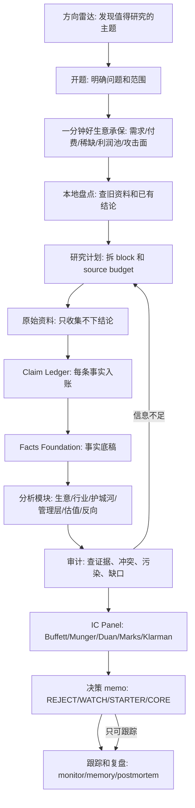

# Investment Research Pipeline Detailed

创建: 2026-06-15

目标: 把我们的投研流程从“框架很多”整理成一条可以每天执行的流水线。每一步都要回答四个问题:

1. 输入是什么
2. 具体怎么做
3. 产出什么文件
4. 过不了关时不能往下走到哪里

核心原则: 方向雷达只是入口，不是投研本身。完整能力包括方向发现、一分钟好生意承保、证据工程、会计和财务趋势验证、产业链和护城河分析、管理层判断、反向失败分析、估值、安全边际、仓位纪律、跟踪复盘。

先选方向，再用一句话讲清楚为什么可能是好公司；先理解经济机器，再用证据和财报验证；先算风险，再谈收益；先承保未来 owner earnings，再让价格和安全边际最后登场。

---

## 0. 总流程图



---

## 0.1 完整投研能力地图

方向雷达只解决一个问题: **研究什么**。

它不解决:

- 事实是不是真的
- 生意是不是好
- 管理层是否可信
- 护城河是否可持续
- 价格是否便宜
- 风险是否可承受
- 应不应该买、买多少、什么时候卖

所以完整 research pipeline 必须分成 **10 个能力层**:

| 能力层 | 核心问题 | 对应产出 |
|---|---|---|
| 1. Direction Selection | 现在值得研究什么 | research_queue.md |
| 2. Business Thesis / Quality Gate | 一分钟能否讲清为什么是好生意；证据后能否承保 | `one_page_quality_company_checklist.md`, `business_model.md` |
| 3. Evidence Engineering | 哪些事实是真的 | raw/, claim_ledger.csv, facts.md |
| 4. Accounting Trend Validation | 财报趋势是否验证经济机器，哪里出现反证 | financial_quality.md, model/*.csv |
| 5. Industry / Value Chain | 钱在产业链哪里被赚走 | value_chain_map.md |
| 6. Moat / Bottleneck | 为什么别人抢不走 | moat_map.md, bottleneck_map.md |
| 7. Operator Underwriting | 谁在经营，性格和激励如何 | operator_underwriting.md |
| 8. Inversion / Risk | 如果失败，会怎么失败 | inversion_map.md |
| 9. Valuation / Margin Of Safety | 价格是否足够便宜；市场已经相信了什么 | valuation.md |
| 10. Decision / Monitoring | 买不买、买多少、错了怎么办 | memo-v1.md, monitor.md, postmortem.md |

如果只做第 1 层，就是选题号；如果第 2 层讲不清楚，后面最多是资料整理；如果做到第 1-6 层，是行业和生意研究；如果做到第 1-10 层，才是买方投资研究。

---

## 0.2 四条主线

所有项目都同时跑四条线:

### A0. 生意本质线

```text
one-minute thesis -> demand -> payer -> scarce control point -> profit pool -> attack surface
```

作用: 防止我们一上来沉迷财报和估值，先回答“这家公司为什么可能是好生意”。

### A. 事实线

```text
source -> raw -> claim_ledger -> facts -> audit
```

作用: 防止我们被故事骗。

### B. 理解线

```text
one-minute thesis -> business model -> value chain -> moat -> operator -> inversion
```

作用: 判断这是不是一个好生意，以及为什么好。

### C. 决策线

```text
financial trends -> owner earnings -> valuation -> margin of safety -> verdict -> monitor
```

作用: 用财报趋势验证未来经济质量，再判断价格、赔率、仓位和跟踪纪律。

方向雷达只在四条线之前提供入口。它不替代任何一条线。

---

## 1. Stage A: 方向雷达

目的: 决定“研究什么”，不是决定“买什么”。

### 输入

- 美股投资网、Serenity、投行研报标题、财经媒体、公司公告、财报日历、IPO 日历、监管事件
- 本地 `notes/videos/`、`research_queue.md`
- 已有框架: `frameworks/topic_selection_engine.md`

### 具体怎么做

每个候选方向先填这个 10 行表:

```text
Theme:
Why now:
Capital flow evidence:
Bottleneck:
Listed companies:
Primary sources needed:
Catalyst:
Key metric:
Kill condition:
Initial direction score:
```

然后用六个雷达打分:

| 雷达 | 要问的问题 | 例子 |
|---|---|---|
| Capex | 大公司真正在往哪里花钱 | AI 数据中心、TPU、GPU、光通信、电力 |
| Bottleneck | 哪个环节短期扩不出来 | 光模块、电力、先进封装、内存、监管审批 |
| Catalyst | 什么事件会逼市场重估 | 财报、GTC、Google I/O、WWDC、IPO、政策 |
| Dislocation | 股价是否比基本面动得更快 | SaaS 被 AI 恐慌错杀、UNH 暴跌 |
| Institutional Debate | 专业资金到底在争什么变量 | AI capex 是价值创造还是 FCF 黑洞 |
| Narrative Gap | 市场叙事哪里太懒 | “AI 受益股”但说不清收入路径 |

### 产出

- `research_queue.md` 新增一条候选
- 如果是公司: 准备创建 `companies/<ticker>/research_status.md`
- 如果是主题: 准备创建 `sectors/<theme>/plan.md`

### 通过标准

方向评分:

- 0-8: 停，不研究
- 9-14: 放 watchlist
- 15-19: 开简短 research note
- 20-24: 开 full research plan

### 禁止

- 因为标题说“必买”“暴涨”“all in”就开题
- 因为 KOL 有神秘履历就跳过证据
- 在方向阶段直接给买入结论

---

## 2. Stage B: 开题

目的: 把一个模糊兴趣变成一个可回答的问题，并先过“一分钟好生意承保”。如果一句话讲不清为什么可能是好公司，就先补理解，不直接进入估值。

### 输入

- 方向雷达表
- 用户的问题
- 研究对象: company / sector / theme / rumor / method
- `frameworks/one_page_quality_company_checklist.md`

### 具体怎么做

先写清楚 8 件事:

```text
Research question:
Object:
Ticker / universe:
Geography:
Time horizon:
Decision needed:
Output artifact:
Non-goals:
```

然后写一段 **One-minute thesis**:

```text
One-minute thesis:
[公司] 为 [长期、反复、真实的需求] 服务；
[付钱的人] 愿意持续付钱，因为 [不付钱会损失什么]；
公司控制 [稀缺节点/关键资源]，所以 [利润池] 会被它拿走；
随着规模扩大，[边际经济/资本强度] 让收入更容易/更难变成 owner earnings；
竞争者最难攻击的是 [护城河]，最危险的攻击面是 [反向失败路径]。
```

如果写不出，就把缺口写进 `Open questions`，并把 verdict ceiling 先压到 `INFO-GAP/WATCH`。

例子:

```text
Research question:
Google 是否仍能控制商业意图入口，并把 AI 时代的收入增长转成 owner earnings？当前价格是否给足安全边际？

Object:
Alphabet / GOOGL, GOOG

Time horizon:
10 年 business ownership + 3 年 AI capex digestion

Decision needed:
REJECT / WATCH / STARTER / CORE

Non-goals:
不做短线财报赌博，不根据单个 KOL 观点下结论。

One-minute thesis:
Google 控制全球最强的商业意图入口；用户主动搜索问题、商品和服务时，广告主愿意为高意图流量付钱。真正要研究的是 AI 会增强这个入口，还是绕过这个入口，以及 AI capex 会不会把收入增长吃掉。
```

### 产出

- `companies/<ticker>/research_status.md`
- 或 `sectors/<theme>/plan.md`

### 通过标准

研究问题必须能被证据回答。不能是“它会不会涨”，而应该是:

- 收入质量是否变差
- capex 是否能转成 owner earnings
- 护城河是否被 AI 攻破
- 管理层是否值得信任
- 价格是否低于保守内在价值
- 一分钟 thesis 中哪一个环节最可能错

---

## 3. Stage C: 本地盘点

目的: 先看自己已有资料，避免重复劳动，也避免忘记旧判断。

### 输入

- ticker / 公司名 / 主题关键词

### 具体怎么做

在仓库根目录跑:

```powershell
rg -n "<ticker|company|theme|keyword>" .
rg --files | rg "<ticker|company|theme|keyword>"
```

要找四类东西:

1. 旧 memo
2. 视频笔记
3. source policy / framework
4. 已有 facts / claim ledger / valuation

### 产出

在 `research_status.md` 写:

```text
Local inventory:
- Existing files:
- Existing conclusions:
- Existing source IDs:
- Stale or conflicting points:
- Reusable modules:
```

### 通过标准

必须能回答:

- 我们以前有没有研究过
- 以前结论是什么
- 哪些资料已经过期
- 哪些结论没有 source_id

---

## 4. Stage D: 研究计划

目的: 把研究拆成可以暂停、恢复、审计的 block。

### 输入

- 开题问题
- 本地盘点
- `sources/source_policy.md`
- `companies/_step0_plan_template.md`

### 具体怎么做

公司研究默认先做 **1 个 thesis gate + 12 个证据 block**。Block 00 是第 2 层的开题假设版，不是单独能力层:

| Block | 名称 | 要解决的问题 | 主要来源 |
|---|---|---|---|
| 00 | Business Thesis / Quality Gate | 一句话能否讲清长期需求、付费理由、稀缺控制点、利润池、护城河、攻击面 | `one_page_quality_company_checklist.md`, 本地旧 memo |
| 01 | Identity | 公司到底是谁，业务边界是什么 | 10-K, IR, SEC |
| 02 | Segment Revenue | 钱从哪里来，各业务增长如何 | 10-K, 10-Q |
| 03 | Unit Economics | 每条收入线赚钱吗，利润率如何 | filings, calls |
| 04 | 10y Financial Trends | 10 年收入、利润、FCF/share、ROIC、股本趋势；验证 thesis，而非静态打分 | SEC/XBRL |
| 05 | Industry Map | 所处行业结构和竞争格局 | filings, B1/B2 |
| 06 | Value Chain | 产业链上下游和瓶颈 | filings, supplier/customer data |
| 07 | Moat | 护城河机制和被攻击面 | filings, product data, competitors |
| 08 | Operator | 创始人、CEO、CFO、董事会、激励 | proxy, bios, letters |
| 09 | Ownership | 大股东、内部人、13F、回购 | 13F, proxy, Form 4 |
| 10 | Risk/Inversion | 如果它失败，会怎么失败 | risk factors, lawsuits, regulation |
| 11 | Valuation | owner earnings、情景、IRR、安全边际 | model, filings |
| 12 | Sentiment/Catalyst | 市场在争什么，未来看什么 | B1/B2/C/D |

每个 block 写:

```text
Block name:
Questions:
Sources to fetch:
Expected output:
Stop condition:
What to skip:
```

### 产出

- `step0_plan.md`
- `raw/` 目录

### 通过标准

没有 plan，不开始收资料。  
每个 block 都必须有来源清单和停止条件。
Block 00 不通过时，不直接进入 valuation；先补生意理解或放回 watchlist。证据完成后，同一层必须在 `business_model.md` 写承保版。

---

## 5. Stage E: 原始资料收集

目的: 收集证据，不写观点。

### 输入

- `step0_plan.md` 当前 pending block

### 具体怎么做

每个 raw block 只做五件事:

1. 记录 source URL/path
2. 记录 retrieval date
3. 记录 source tier
4. 摘出关键原文或 close paraphrase
5. 标出可能进入 claim ledger 的 claim

文件格式:

```text
companies/<ticker>/raw/block01_identity.md
companies/<ticker>/raw/block02_filings.md
...
```

### 产出

- `raw/block<N>_<name>.md`

### 通过标准

raw 文件里不允许出现:

- “所以可以买”
- “这证明它是好公司”
- “我觉得”

raw 阶段只保存证据和待核验问题。

---

## 6. Stage F: Claim Ledger

目的: 把文章、财报、视频、研报里的话拆成可审计的 claim。

### 输入

- `raw/*.md`
- `sources/source_policy.md`

### 具体怎么做

创建:

```text
companies/<ticker>/claim_ledger.csv
```

字段:

```text
source_id,claim,value,unit,as_of,retrieved_at,source_type,
source_url_or_path,original_excerpt,reliability_note,destination
```

source_id 命名:

```text
GOOG.A1.2025K.001
GOOG.A1.2026Q1.001
GOOG.B1.REUTERS.20260615.001
GOOG.C2.TRADESMAX.20260428.001
GOOG.D1.X.20260615.001
```

destination 只能是:

- `EVIDENCE`
- `INTERPRETATION`
- `SENTIMENT`
- `OPEN_QUESTION`

### 产出

- `claim_ledger.csv`

### 通过标准

关键数字必须有:

- value
- unit
- as_of
- source_id

社交媒体、YouTube、小红书、X、Reddit 不能进 `EVIDENCE`，只能进 `SENTIMENT` 或 `OPEN_QUESTION`。

---

## 7. Stage G: Facts Foundation

目的: 形成一个事实底稿，让后面的分析模块都吃同一份事实。

### 输入

- `claim_ledger.csv`
- `raw/*.md`

### 具体怎么做

创建:

```text
companies/<ticker>/facts.md
```

结构:

```markdown
# Facts

## EVIDENCE
只放 A1/A2/B1 支撑的事实。

## INTERPRETATION
放 sell-side、行业研究、专业媒体分析。

## SENTIMENT
放社媒、视频、论坛、市场情绪。

## OPEN QUESTIONS
放还没验证的问题。

## Contradictions
放冲突数字和冲突说法。

## Minimum Coverage Check
列哪些模块已经够用，哪些还不够。
```

### 产出

- `facts.md`

### 通过标准

facts.md 里每条关键事实都必须能回到 `source_id`。  
如果 facts 不完整，后面只能到 `INFO-GAP` 或 `WATCH`。

---

## 8. Stage H: 分析模块

目的: 从事实走向判断。模块可以并行，但都必须引用 facts 和 claim ledger。

### H1. Business Thesis / Quality Gate

问题:

- 一分钟 thesis 是否成立: 长期需求、付费理由、稀缺控制点、利润池、护城河、攻击面是否能讲清
- 公司怎么赚钱
- 谁付钱，为什么付钱
- 不付钱的客户会损失什么
- 收入是否经常性
- 单位经济是否变好
- 10 年后这门生意还在不在
- 十年后是更强，还是只是更大

输出:

```text
business_model.md
```

### H2. Revenue And Financial Trend Quality

问题:

- 10 年 revenue、gross margin、operating margin、FCF/share、ROIC、股本、SBC、capex intensity 怎么变
- 财务趋势是否验证 H1 的经济机器，还是给出反证
- 收入增长是否真的创造价值，还是靠更重资本、更高营销、更高 SBC 换来
- SBC、折旧、capex、营运资本是否扭曲利润
- 回购是否创造价值，还是掩盖稀释
- 哪些趋势是拐点: margin、cash conversion、capex/OCF、FCF/share、稀释、负债

输出:

```text
financial_quality.md
model/financial_history.csv
```

### H3. Industry And Value Chain

问题:

- 行业谁赚钱
- 谁有定价权
- 成本从哪里来
- 需求增长传导到哪里
- 上游/下游有没有卡点

输出:

```text
value_chain_map.md
```

### H4. Bottleneck / Chokepoint

适用:

- AI 基建
- 半导体
- 机器人
- 电力
- 云
- 医药制造
- 航天/国防供应链

固定链条:

```text
market story
-> system change
-> required parts
-> value-chain layers
-> scarce constraints
-> public companies
-> evidence grade
-> repricing path
-> what could prove it wrong
```

输出:

```text
bottleneck_map.md
```

### H5. Moat Technical Analysis

问题:

- 护城河到底是什么
- 是品牌、网络效应、规模、数据、分发、切换成本、成本优势，还是监管
- 护城河有没有财务表现支撑
- 如果我是竞争对手，我攻击哪里

输出:

```text
moat_map.md
```

### H6. Operator Underwriting

问题:

- 创始人是否还影响公司
- CEO 是产品型、运营型、财务型，还是政治型
- CFO 是否保守
- 董事会是否约束管理层
- 激励是否鼓励长期价值
- 管理层有没有“说一套做一套”

输出:

```text
operator_underwriting.md
```

### H7. Inversion / Failure Map

问题:

- 如果我想让这家公司失败，我会怎么做
- 哪个风险一旦发生，会永久损害内在价值
- 哪些只是短期波动
- 哪些风险已经在价格里，哪些没有

输出:

```text
inversion_map.md
```

### H8. Valuation

估值最后登场。必须至少做四层:

1. 市场已经相信什么: 当前价格隐含的增长、利润率、capex、退出倍数
2. Owner earnings bridge
3. Base / bear / bull scenario
4. 10 年 IRR 和 margin of safety

问题:

- 当前价格隐含什么增长和利润率
- 如果增长放缓，是否仍有合理回报
- capex 是维护性还是增长性
- 估值是否依赖过多乐观假设
- 价格是否给了“我们对 H1-H7 判断可能错”的保护

输出:

```text
valuation.md
model/scenario_model.csv
```

---

## 9. Stage I: 审计

目的: 防止自己被叙事、KOL、标题、模型或欲望带跑。

### 输入

- facts.md
- claim_ledger.csv
- 所有分析模块

### 具体怎么做

填写审计清单:

```text
Source coverage:
Key claims without source_id:
Conflicting numbers:
Stale facts:
D1/C2 contamination:
Math/model errors:
Missing primary sources:
Management claims not verified:
Valuation assumptions too aggressive:
Risks not quantified:
Verdict ceiling:
```

### Verdict ceiling 规则

| 信息完整度 | 最高结论 |
|---|---|
| < 40% | INFO-GAP |
| 40%-60% | WATCH |
| 60%-80% | STARTER |
| > 80% | CORE 可讨论 |

### 产出

```text
audit.md
```

### 通过标准

如果审计发现:

- 没有 primary source
- valuation 没完成
- inversion 没完成
- owner/operator 没完成
- 关键数字没有 source_id

则不能进入 `STARTER` 或 `CORE`。

---

## 10. Stage J: IC Panel

目的: 让不同投资人格框架批判同一份事实。

### 输入

- facts.md
- audit.md
- valuation.md
- moat_map.md
- operator_underwriting.md
- inversion_map.md

### 具体怎么做

每个角色只回答自己的问题:

| 角色 | 必问 |
|---|---|
| Buffett | 这是不是能持有 10 年的好生意？owner earnings 是什么？价格是否足够便宜？ |
| Munger | 如果它失败，最可能败在哪里？激励是否有毒？有没有愚蠢风险？ |
| Duan | 你懂这个生意吗？用户价值是否清楚？管理层是否靠谱？贵不贵？ |
| Marks | 市场共识是什么？周期位置在哪里？赔率是否不对称？ |
| Klarman | 下行保护在哪里？安全边际是否真实？ |
| Serenity | 如果是技术/供应链主题，真正瓶颈在哪里？是否可替代？ |

### 产出

```text
ic_panel.md
```

### 通过标准

IC panel 不能新增未经来源支持的事实。  
它只能解释、批判、加权已有事实。

---

## 11. Stage K: 决策 Memo

目的: 把研究变成可执行、可复盘的结论。

### 输入

- 所有上游文件

### 具体怎么做

创建:

```text
memo-v1.md
```

结构:

```markdown
# Investment Memo

## One-line Verdict

## What Has To Be True

## Evidence For

## Evidence Against

## Business Quality

## Moat

## Operator

## Inversion

## Financial Quality

## Valuation

## Margin Of Safety

## Position Decision

## Kill Criteria

## Monitoring Plan
```

### 结论等级

| Verdict | 含义 |
|---|---|
| REJECT | 逻辑或证据不成立 |
| INFO-GAP | 信息不足，不能判断 |
| WATCH | 值得跟踪，但不够买 |
| STARTER | 可讨论研究仓/小仓 |
| CORE | 高理解度、高质量、高赔率、高安全边际 |

### 通过标准

memo 必须写:

- 我错在哪里会知道
- 哪个事实会让我改变主意
- 下次什么时候更新

---

## 12. Stage L: 跟踪、更新、复盘

目的: 让研究活着，而不是写完就死。

### 输入

- memo-v1.md
- kill criteria
- 财报日历
- 监管/产品/行业催化剂

### 具体怎么做

创建:

```text
memory.md
monitor.md
postmortem.md
```

`memory.md` 记录长期不变:

- 生意模式
- 护城河
- 管理层性格
- 关键风险

`monitor.md` 记录要盯的变化:

- quarterly revenue
- margin
- FCF
- capex
- RPO/backlog
- customer wins
- regulation
- competitive attacks
- valuation

`postmortem.md` 在 3/6/12 个月复盘:

- 当初判断对在哪里
- 错在哪里
- 是事实错、估值错、时机错，还是心理错
- 下次流程怎么改

---

## 13. Google 的下一步具体执行

当前 Google 不应该直接写总 memo，应该先补证据底座。

下一批只做 5 个文件:

```text
companies/googl/claim_ledger.csv
companies/googl/facts.md
companies/googl/moat_map.md
companies/googl/inversion_map.md
companies/googl/valuation.md
```

顺序:

1. 从 FY2025 10-K、Q1 2026 10-Q/earnings、proxy、Berkshire 13F、H&H 13F 建 `claim_ledger.csv`
2. 汇总收入、Cloud、capex、FCF、buyback、治理、持仓到 `facts.md`
3. 拆 Search/Ads、YouTube、Cloud、TPU、Android/Chrome 的护城河
4. 反向问: AI answer、监管、capex、广告迁移、组织速度如何让 Google 失败
5. 做 owner earnings 和 10 年 IRR 情景

Google 当前关键问题:

```text
AI 是否削弱搜索广告，还是提高 query depth 和商业转化？
TPU/数据中心 capex 是护城河，还是 FCF 黑洞？
Cloud 增长和 RPO 能否支持长期资本回报？
Page/Brin/Pichai 的治理组合是优点还是风险？
Berkshire 买入代表安全边际，还是特殊交易结构？
```

---

## 14. 每次开工的固定口令

以后任何一个标的或主题，都从这 7 句开始:

```text
1. 我们到底要回答什么问题？
2. 本地有没有旧资料？
3. 这个方向为什么现在值得研究？
4. 需要哪些一手来源？
5. 哪些只是社媒或视频线索？
6. 哪个事实会改变结论？
7. 做完后最高允许给什么 verdict？
```

如果这 7 句答不清，就先不开 full research。
