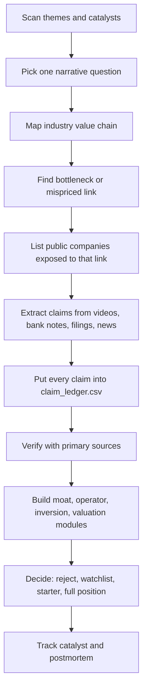

# Meigu Touziwang Content Playbook

Purpose: extract a reusable research and content workflow from the local
`notes/videos/` archive for the channel "美股投资网" / `tradesmax`.

This playbook treats the channel as an idea and hypothesis source, not as
validated evidence. Any claim from these notes must still pass the source
policy and claim-ledger process.

## Local Evidence Reviewed

- Archive size: 123 video research notes in `notes/videos/`.
- Years covered: 2024: 48 notes, 2025: 58 notes, 2026: 17 notes.
- Most frequent tickers in file names:
  - NVDA: 58
  - TSLA: 31
  - AMD: 22
  - AVGO: 13
  - SPY: 13
  - SMCI: 10
  - GOOG: 10
  - AAPL: 9
  - ARM: 8
  - TSM: 6
- Most frequent title patterns:
  - AI: 31
  - 分析: 23
  - 潜力: 20
  - 财报: 18
  - 必买: 17
  - 深度: 16
  - 预测: 16
  - 抄底: 11
  - 风险: 5
  - 暴跌: 5

Representative samples:

- Apple single-company deep dive: `2024-01-07_s0NqQsYMu8k_美股深度分析-苹果还有救吗-值不值得抄底-aapl_note.md`
- AI power bottleneck: `2024-04-05_m8oS-DJ-Pkk_美股-ai耗电-3只电力能源股必买-ceg-vst_note.md`
- SaaS disruption by AI: `2026-02-05_yuOT451BsKA_美股软件股还有救吗-几大投行研报-揭秘ai能否摧毁saas行业-goog-pltr-mndy-ddog-u_note.md`
- Big-tech earnings preview: `2026-04-28_RCh6v_Ao6mY_美股-本周科技巨头财报预测-amzn-googl-meta-aapl_note.md`

## Core Observation

Their real process is not "pick a stock, then write something." It is closer
to:

1. Find the market narrative currently being repriced.
2. Turn that narrative into a concrete question.
3. Map the question onto a value chain.
4. Identify the scarce or misunderstood link.
5. Translate that link into listed companies.
6. Attach near-term catalysts and key metrics.
7. Give a simple stance, price level, or watchlist.

In short: theme first, mechanism second, ticker third.

## Topic Selection Engine

They appear to pick topics from five recurring sources.

### 1. Catalyst Calendar

Examples:

- Earnings previews: NVDA, GOOGL, META, AAPL, AMZN.
- Conference previews: GTC, WWDC.
- IPO/new listing windows: CRWV, FIGMA, RKLB/FIREFLY themes, Bullish/MIAX.
- Macro/policy events: Fed, tariffs, election, Trump trade.

The article angle usually asks: "What single metric will decide whether the
market reprices this stock?"

### 2. Dominant Market Theme

From the archive, the dominant theme is AI. But they rarely stop at "AI is
good." They repeatedly move from AI to second-order bottlenecks:

- GPU supply
- ASIC and custom silicon
- memory and storage
- optical networking
- power and nuclear energy
- data centers and neoclouds
- software disruption
- robotics, autonomy, defense data systems

This is the part worth learning. The edge is often in the second or third
derivative of the obvious theme.

### 3. Market Dislocation

Common title forms:

- "暴跌后是否抄底"
- "机构抛售/散户加仓"
- "危机信号"
- "风险预警"
- "泡沫是否存在"

The design is: start from price movement or fear, then ask whether the market
reaction is emotional or fundamental.

### 4. Institutional Research Translation

Several notes explicitly reference Morgan Stanley, Goldman Sachs, Bernstein,
hedge funds, analyst targets, dark-pool/options activity, or "institutional
view." Their advantage is packaging institutional material into a retail-facing
thesis.

For our process, this is useful only as a lead. The original report, filing,
earnings call, or data source must be found before a claim can become evidence.

### 5. "Next X" and Underfollowed Beneficiaries

Recurring frames:

- "下一个英伟达"
- "除了英伟达"
- "不为人知的潜力公司"
- "产业链个股机会"
- "必买10只股"

This is a watchlist-generation machine. It is not a final investment process.

## Article / Video Structure

The typical structure:

1. Hook: a sharp question, fear, opportunity, or previous successful call.
2. Market setup: why this topic matters now.
3. Mechanism: the business or technology logic behind the theme.
4. Value-chain map: upstream/downstream beneficiaries.
5. Company-by-company pass:
   - what it does
   - why it benefits
   - key financial or operating metric
   - catalyst
   - valuation or target level
   - risk
6. Simple conclusion: buy/watch/avoid, entry price, target, or event to watch.
7. Engagement call: comments, membership, watch next topic.

For investment research, we should keep steps 2-5 and remove the marketing
pressure from steps 1 and 7.

## Why They Can "Deep Dive"

They can look deep because they use repeatable templates:

- A fixed set of public company documents and market data.
- Repeated coverage of the same theme, especially AI infrastructure.
- Analyst-report scaffolding.
- A supply-chain/bottleneck lens.
- Reusable financial checks: revenue growth, EPS, EBITDA, operating margin,
  capex, backlog/RPO, customer contracts, price target.
- A strong narrative question that narrows the search space.

Depth comes less from knowing everything and more from asking the same few
questions against many companies:

- What is the demand shock?
- What resource becomes scarce?
- Who controls the resource?
- Who has capacity, cost advantage, or distribution?
- What financial metric will prove it?
- What catalyst forces the market to notice?

## What We Should Copy

Copy:

- Theme-to-value-chain thinking.
- Bottleneck hunting.
- Catalyst-aware research.
- "One key metric" framing before earnings.
- Company comparison inside a theme.
- Explicit price/valuation assumptions, but only after verification.
- Keeping prior calls and predictions trackable.

Do not copy blindly:

- Sensational titles.
- "必买" certainty.
- Unverified price targets.
- Opaque data claims.
- Social proof and marketing language.
- Treating short-term market reaction as business truth.

## Source Treatment In Our Research OS

Default classification:

- Channel transcript/video note: D1 social/media lead.
- Mentioned bank research: B2 if original report summary is all we have;
  higher only if original report or direct excerpt is available.
- Company filings, earnings releases, investor decks: A1/A2.
- Market data, analyst consensus, options/dark-pool claims: must identify data
  vendor before use.

Rule:

No claim from this channel can directly support a BUY verdict. It can only
create a question, hypothesis, or lead until independently verified.

## Adapted Pipeline For Us

## Google Application

For Alphabet / Google, the useful borrowed questions are:

- What is the market's current fear: AI destroying search, capex destroying FCF,
  regulation, or cloud competition?
- What is the one metric that proves or disproves the fear?
- In AI search, is the bottleneck distribution, model quality, inference cost,
  data, ad monetization, or trust?
- Does TPU/custom silicon create a durable cost advantage?
- Does AI Overview increase query depth and commercial conversion, or reduce
  publisher/ad-click economics?
- Does Cloud RPO/backlog translate into high-return capex, or just a capex race?
- Which part of Google's moat is being attacked, and which part is getting
  stronger?

## Operating Rule

Use 美股投资网 like a fast scout:

1. It can point us to a battlefield.
2. It can suggest the bottleneck.
3. It can name candidate tickers.
4. It cannot decide capital allocation for us.

Our edge must come from verification, accounting, valuation, inversion, and
temperament.
