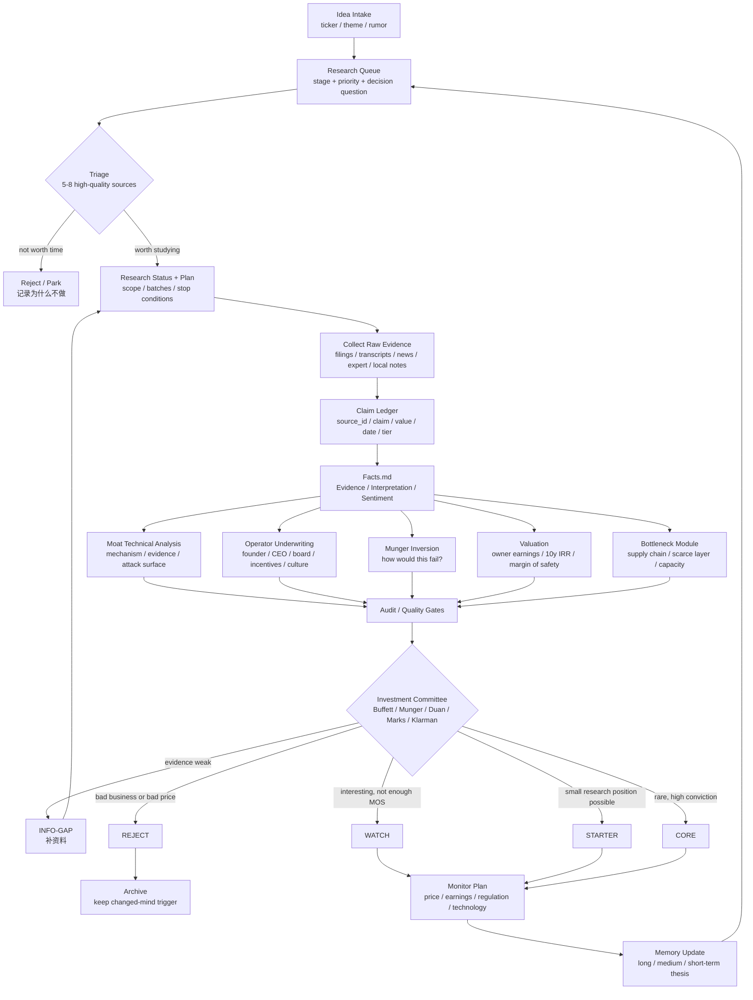
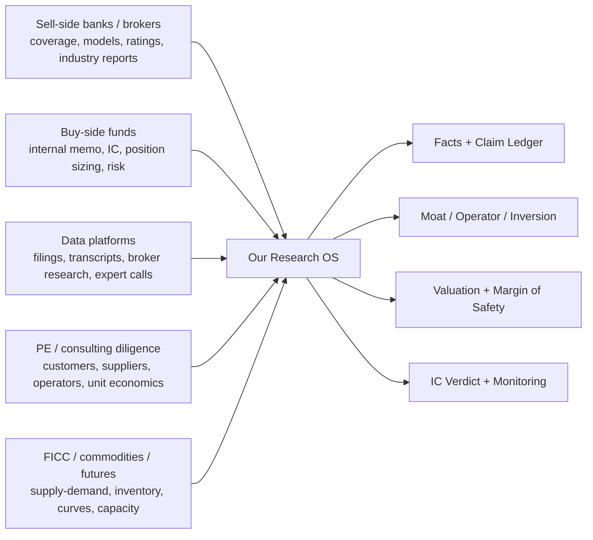

# Research OS Flowchart

创建: 2026-06-15

这张图是小型买方研究部的完整流程。它不是一次性完美流程，而是可迭代的工作系统。

---

## Institutional Mapping

---

## Why This Flow Exists

| Flow step | Institutional analogue | Why it exists |
|---|---|---|
| Research queue | Buy-side idea funnel | 注意力和时间是稀缺资源，不是每个故事都值得深研 |
| Triage | Desk analyst quick screen | 快速排除明显没有证据、明显不懂、明显太贵的 idea |
| Raw evidence | Sell-side / buy-side source gathering | 防止先有结论后找证据 |
| Claim ledger | Data platform / compliance discipline | 每个数字和判断可追溯 |
| Facts split | Research report content control | 事实、解读、情绪不能混 |
| Moat analysis | Fundamental equity research | 判断十年后利润池还在不在 |
| Operator underwriting | PE/buy-side diligence | 资本交给谁配置很重要 |
| Inversion | Risk committee / behavioral process | 主动找会让自己错的路径 |
| Valuation | Equity research / PM decision | 好公司不等于好价格 |
| IC verdict | Buy-side investment committee | 把研究变成行动或不行动 |
| Monitor/memory | Portfolio management | 研究不是一次性报告，要跟踪和复盘 |

