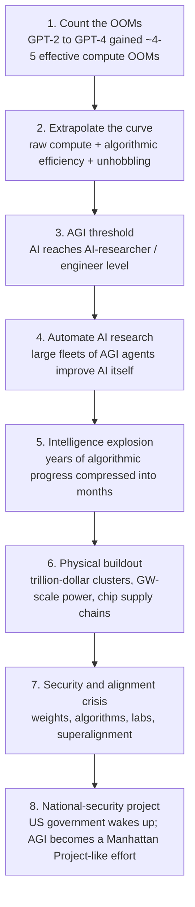
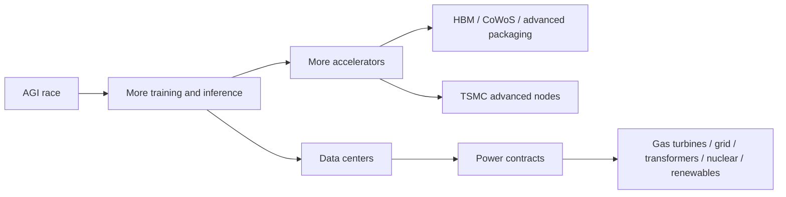

# Aschenbrenner AI Development Pipeline

Source: Leopold Aschenbrenner, *Situational Awareness: The Decade Ahead* (June 2024).  
Local PDF: `I:\yc_research\2026 investment yanda\sources\papers\aschenbrenner_situational-awareness_2024-06.pdf`

This note is a process map of the argument, not a full chapter-by-chapter summary. The useful question is: **if his model is right, what sequence does AI development follow, and where are the bottlenecks?**

## One-Line Thesis

Aschenbrenner's core pipeline is:

**effective compute keeps compounding -> AGI around 2027 -> AGI automates AI research -> intelligence explosion -> trillion-dollar compute clusters -> power/chip/security bottlenecks -> government-led national-security AGI project.**

## Pipeline Map



## Stage 1: Count the OOMs

He starts from the historical jump from GPT-2 to GPT-4.

| Element | Meaning |
|---|---|
| OOM | Order of magnitude, roughly 10x |
| Effective compute | Not just GPUs. It combines raw compute, algorithmic efficiency, and product/tooling changes that make the model more capable. |
| Core claim | GPT-2 to GPT-4 represented about 4-5 effective compute OOMs. |

The important move is that he treats AI progress as a semi-regular curve in effective compute space. He is not saying every benchmark is linear forever; he is saying that if the last jump produced GPT-4, then a comparable jump could plausibly produce AI systems at human researcher/engineer level.

## Stage 2: Extrapolate the Curve

He splits future progress into three drivers:

| Driver | Rough role in his model | Practical meaning |
|---|---:|---|
| Raw compute | ~0.5 OOM/year | More GPUs, larger clusters, more training runs |
| Algorithmic efficiency | ~0.5 OOM/year | Better architectures, training recipes, data, inference efficiency |
| Unhobbling | qualitative boost | Turning chatbots into agents that use tools, plan, browse, code, act, and self-correct |

The key idea is that AI capability does not only come from bigger models. A model can become much more useful if it is connected to memory, tools, scaffolding, code execution, search, long-horizon planning, and agent loops.

## Stage 3: AGI Threshold

His forecast is that around 2027, AI systems could reach the level of an AI researcher or software engineer.

In the paper's logic, AGI does not mean "magic consciousness." It means:

- can do economically valuable cognitive work;
- can execute long technical tasks;
- can help with AI research and engineering;
- can be copied and run in parallel at massive scale.

This last point is what makes the argument explosive. A human AI researcher is scarce. A competent AI researcher-agent can be duplicated.

## Stage 4: Automate AI Research

Once AI can do AI research, the feedback loop changes.

Normal software:

```text
humans improve tools -> tools help humans -> humans improve tools again
```

His AGI loop:

```text
AI improves AI -> improved AI improves AI faster -> recursive acceleration
```

This is the bridge from "AGI" to "superintelligence." The claim is not merely that AGI is useful. The claim is that AGI attacks the bottleneck that created it: AI research labor.

## Stage 5: Intelligence Explosion

The next claim is that years of algorithmic progress could be compressed into a short period.

| Before AGI | After AGI, in his model |
|---|---|
| A limited number of top researchers push the frontier | Millions/billions of AI agents can be deployed |
| Research cycles take months or years | Research cycles may become much faster |
| Capability progress remains mostly human-paced | Capability progress becomes machine-paced |

This is the most controversial part of the pipeline. It depends on whether AI research can really be automated, whether experiments can be run fast enough, whether data/evaluation bottlenecks bind, and whether models can reliably generate genuinely new algorithmic ideas.

## Stage 6: Physical Buildout Becomes the Bottleneck

This is the part most relevant to investment and macro analysis.

Once the race becomes "build and run enormous AI systems," the bottleneck shifts from pure software to industrial capacity.



His key claim: **power becomes the largest hard constraint.**

### Table 4 Logic: Largest Training Clusters

| Approx year | Scale claim | Power implication |
|---|---|---|
| 2022 | GPT-4-scale cluster | ~10 MW |
| 2024 | one more OOM | ~100 MW |
| 2026 | million-H100-equivalent scale | ~1 GW |
| 2028 | ten-million-H100-equivalent scale | ~10 GW |
| 2030 | hundred-million-H100-equivalent scale | ~100 GW |

The exact numbers are back-of-envelope, but the direction matters: AI development becomes a power, permitting, chips, packaging, and construction problem.

## Stage 7: Security and Alignment Crisis

After AGI becomes strategically important, model weights and algorithmic secrets become national-security assets.

His concerns:

- frontier labs are not secure enough against state actors;
- stealing weights or algorithmic secrets could shift global power;
- alignment is unsolved for systems smarter than humans;
- rushed deployment creates catastrophic risk;
- private labs may not be structurally capable of handling the endgame.

This is where his argument moves from "technology forecast" to "state capacity forecast."

## Stage 8: Government-Led Project

His endgame is a US government-led or government-controlled AGI project, analogous in spirit to the Manhattan Project.

The reason is simple in his model:

```text
superintelligence = decisive economic and military advantage
```

If that is true, then AGI cannot remain a normal startup race. National security agencies eventually wake up, and the center of gravity moves from San Francisco labs to classified government facilities.

## Investment-Relevant Translation

The paper's investable value is not "buy every AI stock." By 2026, many first-order AI winners may already be priced aggressively.

The more useful lens is bottleneck mapping:

| Layer | Question |
|---|---|
| Models | Are frontier capabilities still compounding? |
| Compute | Are GPU/ASIC orders still constrained by supply rather than demand? |
| Memory/packaging | Are HBM and CoWoS still the binding constraints? |
| Foundry | Is leading-edge wafer capacity expanding fast enough? |
| Power | Are hyperscalers locking power, gas turbines, grid equipment, nuclear, and IPP contracts? |
| Security/state | Are export controls, classified projects, or defense procurement becoming more central? |

## What Would Falsify or Weaken the Pipeline?

| Failure point | What to watch |
|---|---|
| Scaling slows | New models stop improving meaningfully despite more compute |
| Agents disappoint | AI remains good at demos but bad at long-horizon autonomous work |
| AI research automation fails | AI helps coding but does not materially accelerate frontier research |
| Physical constraints bite harder than expected | power, chips, HBM, packaging, and permitting slow the curve |
| Economic ROI disappoints | capex rises but revenue/productivity gains fail to justify it |
| Regulation/security intervenes early | governments restrict or redirect frontier development before explosion dynamics |

## Clean Reading

The fairest reading is:

> Treat the paper as a internally consistent scenario for what happens if effective compute continues to compound and AI research becomes automatable.

The strongest part of the paper is the bottleneck framework: **compute demand turns into a physical supply-chain and power-grid race.**

The weakest or most uncertain part is the timeline: **AGI by 2027 and rapid intelligence explosion require several hard assumptions to hold at once.**

