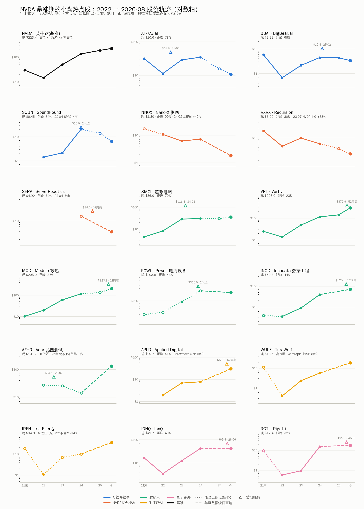
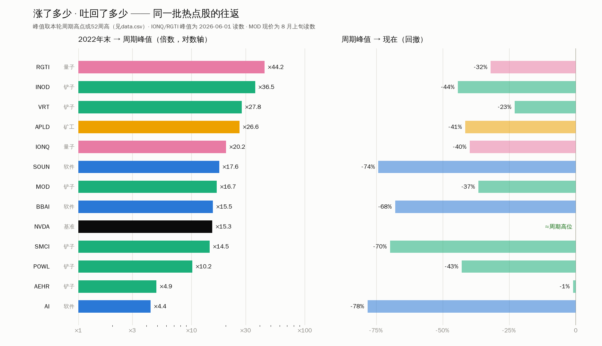

# NVDA 暴涨期的小盘热点股：当年的新闻明星，2022 → 今天

## Snapshot

- Topic: NVDA 2023–2024 暴涨期间被新闻反复炒作的美股小盘"沾光股"盘点：它们当年为什么上头条、股价从 2022 年走到 2026-08 变成了什么样
- Universe: 18 只（17 只小盘/中小盘 + NVDA 基准），按五波叙事分组
- Method: 新闻热点由当期报道证据确认（谁、何时、为何上头条）；价格轨迹用**年末收盘 + 波段峰值 + 2026-08 现价**拼出（本环境网络策略拦截行情源，无法拉日线，见 §5 数据方法与限制）
- Last updated: 2026-08-13（现价截至 2026-08-04 ~ 08-12 不等，逐票见 `data.csv`）
- 上下文链接: `macro/ai_zeitgeist_timeline.md`（本文 §4 直接挂到该时间轴的 2026Q3 切片）；`companies/iren/2026-08-12/`（IREN 现价取自该档案）
- 产出物: `chart1_trajectories.png`（18 票轨迹小倍数图）· `chart2_roundtrip.png`（涨幅 vs 回吐）· `data.csv`（逐点数据 + 置信度 + 来源）· `charts.py`（可重跑）

---

## 0. 一句话结论

**当年沾 NVDA 光上头条的小盘股，四年后只有"把电力和机柜租给 AI 的"跑赢了 NVDA 本尊；所有靠"叙事沾光"的（软件讲故事的、被 13F 点名的）几乎全部往返归零。** 以 2022 年末为基数：NVDA ×15.3（现价≈周期高位）；跑赢它的是 WULF ×46、IREN ×33、RGTI ×30、VRT ×21、INOD ×20（前三个基数是濒死价/仙股价，见表注）；而 SOUN、BBAI、AI、NNOX、RXRX、SERV 距各自峰值 -68% ~ -90%，C3.ai 现价甚至低于 2022 年末。中间态是卖铲人：涨得最实（有订单），但在 2026 年"算力还稀缺吗"的重定价里也吐回了 23% ~ 44%。

---

## 1. 当年哪些小盘股是新闻热点 —— 五波叙事

### 1.1 第一波（2023 年初）：ChatGPT 妖股三剑客 —— AI、BBAI、SOUN

ChatGPT 出圈后第一批被散户和媒体锁定的"纯 AI 标的"，特征是**市值小、名字像、亏损大**。财联社当时统计：2023-01-03 → 02-06 五周内，C3.ai（占了 "AI" 这个代码的便宜）+148.87%，BigBear.ai +736.99%，SoundHound +207.63%［s1］。这一波与 NVDA 2023-05 财报核爆共振（NVDA 单日 +24%，当晚 C3.ai 盘后再 +33%［s1b］）。

- **AI (C3.ai)**：2023-06 冲到 ~$48.9 后一路证伪：FY2026 营收 $250M、同比 **-36%**，创始人 Siebel 因健康退位（2025-09）又复位（2026-05-08），现价 $10.63，市值 $1.59B，比 IPO 时缩水 82%［s8］。
- **BBAI**：SPAC 时代高点 $16.12（2022-04）→ 2022 年末 $0.67 仙股 → 2023 年初 +737% → 2024 年末军工 AI 叙事再点火 → 2025-02-13 见 $10.36 → 现价 $3.33，2026 YTD -36%［s7］。
- **SOUN**：这只票横跨第一、三波，见 1.3。

### 1.2 第二波（2023–2024）：卖铲人主升浪 —— SMCI 领衔，VRT/MOD/POWL/INOD/AEHR 跟随

叙事从"谁做 AI"切到"谁给 AI 供货"，小盘卖铲人成为财经媒体的日常头条：

- **SMCI（超微电脑）**：本轮最大的小盘造神案。2022 +87%、2023 +246%，2024-03-13 收盘峰 $118.81（拆分调整后），2024-03-18 进入 S&P 500 —— 从小盘股到标普成分只用了一轮行情。随后 2024-08 兴登堡做空 + 审计师安永辞任 + 退市危机，2024-12 独立调查"未发现舞弊"后反弹，2024 全年只剩 +6%［s2/s6］。2026-08 财报：单季新订单 >$600 亿、毛利率 17.6% 翻倍，单日 +10.6% 到 $35.96 —— 业务活着，但股价仍距峰 **-70%**［s6b］。
- **VRT（Vertiv，电源/散热）**：数据中心基建的"标配持仓"。2022 年末 $13.66 → 52 周高 $379.94（×27.8）。2025Q4 有机订单 +252%、backlog $150 亿［s12］。
- **MOD（Modine，液冷）**：百年老厂靠数据中心散热改命，2022 年末 $19.34 → 52 周高 $323.25（×16.7）［s13］。
- **POWL（Powell，配电设备）**：数据中心+再工业化电力订单，2024-11 峰 ~$365，×10.2［s14］。
- **INOD（Innodata，AI 训练数据工程）**：微盘股（2022 年末 $3.43）靠给 Magnificent 7 做数据标注 2024 年 +4 倍多，52 周高 $125.14（×36.5），Q2'26 营收 +58% 创纪录［s15］。
- **AEHR（Aehr，晶圆级烧机测试）**：2023 年作为 SiC/碳化硅概念冲 $54.1，随电动车周期跌回 $10 区；2026 年靠 **AI 处理器烧机测试**第二春：单季订单 $60.7M（+500% YoY），FY27 指引隐含 +160~200%，现价 $131.7 ≈ 历史高位区［s16］。周期换了，公司还是那家公司。

### 1.3 第三波（2024）：NVDA 13F "点石成金" —— SOUN、NNOX、RXRX、SERV

2024-02-14，NVDA 首次以 13F 披露持仓（Arm、SoundHound、Recursion、Nano-X、TuSimple），次日：**SOUN +67%、NNOX +49%、RXRX +24%**［s3/s4］。媒体口径："英伟达买了什么，什么就涨"。这是本轮行情里最纯粹的"沾光"机制——持仓金额其实小得可笑（SOUN $3.7M、NNOX $38 万）。

- **SOUN**：NVDA 2017 年就参与其 $75M 融资［s3］；13F 后从 $2 区一路炒到 2024-12-26 的 $24.98（2022 年末仅 $1.42，×17.6）。2025-02 NVDA 披露**清仓** SOUN/SERV/NNOX［s5b］，叠加 DeepSeek 效率恐慌，2025 年跌去大半；2026-08 现价 $6.45，距峰 **-74%** —— 尽管公司本身 Q2'26 营收 $61.9M 创纪录、上调全年指引到 $230–260M［s5］。**故事没死，估值死了。**
- **NNOX（Nano-X，AI 医学影像）**：13F 当日 +49% 是它最后的高光；现价 $1.80，距 2021 年末 **-90%**［s9］。
- **RXRX（Recursion，AI 制药）**：2023-07 NVDA $50M PIPE 注资当日 +78%［s10b］；2026-02 NVDA 13F 显示**已全部退出**；Q3'25 营收同比 -80%，现价 $3.22［s10］。
- **SERV（Serve Robotics，送餐机器人）**：2024-07 NVDA 披露 10% 持股，单日 +187%（$2.63 → 盘前 $10.55）［s11］；2025-02 NVDA 清仓披露后崩；2026 年 Uber 又终止合作、指引砍到 $9–10M，现价 $4.92 创 52 周新低［s11b］。**同一只票把"点石成金→点金还石"走完了全程。**

### 1.4 第四波（2023–2026）：矿工转身 —— APLD、WULF、IREN

比特币矿工把矿场（电力接入 + 土地 + 机柜）转租给 AI 算力，是唯一一波**越走越强**的小盘叙事，因为它们卖的不是故事，是签了长约的电：

- **APLD（Applied Digital）**：2022 年末 $1.91 的仙股，先拿 NVDA 参投背书，2025-06 与 CoreWeave（NVDA 系算力云）签 2×15 年、总额 ~$70 亿租约（250MW，北达科他 Ellendale），当日 +42%［s17］；52 周高 $50.73，现价 $29.69。
- **WULF（TeraWulf）**：2022 年末 $0.40 濒死 → 转型 HPC 托管 → 2026 年拿下 **Anthropic 20 年、~$190 亿肯塔基数据中心租约**，盘前 +17%；Q2'26 营收 71% 已来自 HPC 租赁；现价 $18.46、市值 $9.15B［s18］。
- **IREN（Iris Energy）**：lab 已单独开题（`companies/iren/2026-08-12/`）：现价 $34.83，市值距 6/22 峰值 -34%，2022 年末 $1.06 起步 ×33［s19］。

### 1.5 番外（2024Q4–2025）：量子插曲 —— 黄仁勋一句话的行情

严格说是"NVDA 概念"的镜像波：2024Q4 量子小盘集体暴涨（RGTI 2022 年末 $0.58 → 2024 年末 $15.34）。2025-01-08 黄仁勋一句"真正有用的量子计算机还要 15–30 年"，**当天量子板块集体崩盘**（他后来自嘲"我一句话让整个行业股价跌了 60%"）；2025-03-20 GTC 上公开认错"I was wrong"，还是没拉回来［s21］。此后量子股自己走出独立周期：2025 大年 → 2026 年初风险偏好回撤 → 6–7 月再跌 30% → 8 月初一周反弹 20%+；IONQ $41.72、RGTI $17.45、QBTS $21.83（8/4 读数）［s20］。**教训与 13F 波同构：当一个板块的定价锚是黄仁勋的一句话，它就会死于黄仁勋的另一句话。**

---

## 2. 2022 → 今天：股价都走成了什么样

### 总表（价格单位 USD；倍数以 2022 年末收盘为基数）

| 票 | 波次 | 2022末 | 周期峰值（时点） | 现价（2026-08） | 距峰 | 22末→峰 | 22末→今 | vs NVDA(×15.3) |
|---|---|---:|---:|---:|---:|---:|---:|:--|
| **NVDA** 基准 | — | 14.61 | ≈现价 | 223.40 | ≈0 | — | **×15.3** | — |
| AI (C3.ai) | 软件 | 11.21 | 48.87 (23-06) | 10.63 | -78% | ×4.4 | ×0.9 | 大幅跑输 |
| BBAI | 软件 | 0.67ᵃ | 10.36 (25-02) | 3.33 | -68% | ×15.5 | ×5.0 | 跑输 |
| SOUN | 软件/13F | 1.42ᵃ | 24.98 (24-12) | 6.45 | -74% | ×17.6 | ×4.5 | 跑输 |
| NNOX | 13F | 10.72 | 13F日+49% (24-02) | 1.80 | -90%ᵇ | — | ×0.2 | 归零级 |
| RXRX | 13F | 5.50 | 注资日+78% (23-07) | 3.22 | -80%ᵇ | — | ×0.6 | 归零级 |
| SERV | 13F | —ᶜ | 18.64 (52周高) | 4.92 | -74% | — | — | 跑输 |
| SMCI | 铲子 | 8.21 | 118.81 (24-03) | 35.96 | -70% | ×14.5 | ×4.4 | 跑输 |
| VRT | 铲子 | 13.66 | 379.94 (52周高) | 292.96 | -23% | ×27.8 | **×21.4** | **跑赢** |
| MOD | 铲子 | 19.34 | 323.25 (52周高) | ~205 | -37% | ×16.7 | ×10.6 | 跑输 |
| POWL | 铲子 | 35.8ᵈ | ~365 (24-11) | 208.63 | -43% | ×10.2 | ×5.8 | 跑输 |
| INOD | 铲子 | 3.43 | 125.14 (52周高) | 69.76 | -44% | ×36.5 | **×20.3** | **跑赢** |
| AEHR | 铲子 | 27.1ᵈ | 132.99 (≈现价) | 131.72 | ≈0 | ×4.9 | ×4.9 | 跑输(但在高位) |
| APLD | 矿工 | 1.91ᵃ | 50.73 (52周高) | 29.69 | -41% | ×26.6 | **×15.5** | ≈打平 |
| WULF | 矿工 | 0.40ᵃ | 未核实 | 18.46 | — | — | **×46**ᵃ | **跑赢** |
| IREN | 矿工 | 1.06ᵃ | 市值峰 6/22 | 34.83 | -34%ᵉ | — | **×32.9**ᵃ | **跑赢** |
| IONQ | 量子 | 3.43 | 69.28 (26-06-01) | 41.72 | -40% | ×20.2 | ×12.2 | 略跑输 |
| RGTI | 量子 | 0.58ᵃ | 25.63 (26-06-01) | 17.45 | -32% | ×44.2 | **×30.1**ᵃ | **跑赢** |

ᵃ 基数是 2022 年末深熊底（濒死价/仙股价，BBAI $0.67、WULF $0.40、RGTI $0.58 都是当年被判死刑的价格），倍数因此偏高——但这恰恰就是"从绝望到狂热"的真实往返幅度。
ᵇ NNOX/RXRX 距峰按 2021 年末近似基数算（本轮波段峰未足额核实）。
ᶜ SERV 2024-04 才上市，无 2022 基数。
ᵈ 近似值（模型知识，±10% 量级），见 `data.csv` 置信度列。
ᵉ IREN 为市值口径（期间有增发稀释），取自 `companies/iren/2026-08-12/`。
参考基准：罗素 2000 全收益 2022 -20.44% / 2023 +16.93% / 2024 +11.54%［s23］——这批票的任何一段主升浪都与小盘整体无关，纯粹是叙事资金。

---

## 3. 轨迹类型学 —— 同一波新闻热点的四种结局

**A. 事件烟花型（涨因一条新闻，跌回原点）：AI、BBAI、SOUN、NNOX、RXRX、SERV。**
触发事件全是"别人做了什么"（ChatGPT 出圈、NVDA 买了我、NVDA 财报核爆），不是"自己赚了什么"。四年后全部距峰 -68% ~ -90%。最能说明问题的是 SOUN：公司营收创纪录、指引上调，股价照样 -74%——**当初不是营收把它抬上去的，营收也就接不住它**。13F 波的三只（SOUN/NNOX/SERV）还多一层机制性下场：NVDA 清仓披露之日，就是叙事反向执行之时。

**B. 真订单兑现型（涨得实，2026 也照样吐）：SMCI、VRT、MOD、POWL、INOD。**
订单、营收、backlog 都是真的（VRT backlog $150 亿、SMCI 单季订单 $600 亿）。但 2026 年市场切到"算力还稀缺吗/要收据"模式（见 `macro/ai_zeitgeist_timeline.md` 2026Q2–Q3 切片）后，估值从成长股框架掉向周期股框架，距峰仍吐回 23%–70%。**基本面真，护不住估值框架切换。** SMCI 另有公司治理折价：同一份 AI 服务器订单，装在会计有前科的壳里就只值三折。

**C. 二次点火型（第一个故事死了，第二个故事更大）：AEHR、APLD、WULF、IREN。**
AEHR 的 SiC 故事随电动车死了，2026 年靠 AI 烧机测试回到历史高位；三家矿工把"挖币"换成"把电和机柜长约租给 CoreWeave / Anthropic / hyperscaler"。共同点：**它们手里有实物资产（电力接入、厂房、测试机），故事可以换，资产还在**。这是全表唯一整组跑赢/追平 NVDA 的（WULF ×46、IREN ×33、APLD ×15.5）——代价是它们在 2022 年先跌掉了 90%+，拿住的前提是你在濒死价没有卖。

**D. 未定型：量子组（IONQ、RGTI、QBTS）。**
不靠营收、不靠租约，靠"下一个大叙事"的期权定价，波动率本身就是产品。2026 年内 -30% 与一周 +20% 交替出现，与 A 组的区别只在故事还没到证伪日。

**横向读法：** 把 §2 表格竖着看——"22末→峰"列人人都是十倍股，"22末→今"列只剩租电的和 NVDA 自己。**新闻热点决定你在峰值那一列排多高，商业模式决定你在今天这一列剩多少。**

---

## 4. 给 lab 的接口

- **挂到思潮时间轴**：本表是 `macro/ai_zeitgeist_timeline.md` 的小盘股横截面验证——2026Q3"稀缺性叙事解构"在 B 组（卖铲人集体距峰 -23%~-44%）和 C 组（租约股反而抗跌）的分化里被直接观测到。"AI with receipts" 的 receipts，在小盘股世界里 = 长约租金。
- **给 trading-desk 的纪律条款候选**（供 `discipline.md` 参考，非本文结论）：
  1. 13F/持仓披露类利好 = 事件烟花，D+1 之后不追（SOUN +67%、SERV +187% 的后续路径是同一条）；
  2. 凡是"某大佬一句话"能引爆的板块，等它死于另一句话（量子 2025-01-08）；
  3. B 组型标的的风险不在财报 miss，在估值框架切换季（成长 → 周期），盯 zeitgeist 时间轴而不是盯单票。
- **research_queue 候选**：C 组"资产租赁化"是否可前瞻筛选——2026 年还有哪些"手里有电/厂房/设备、股价还在讲旧故事"的小盘（下一个 AEHR/WULF）？

## 5. 数据方法与限制（读数前必看）

1. **环境限制**：本会话运行在远程容器，网络策略只放行 GitHub/包管理域名；Yahoo/stooq/macrotrends 等行情源全部被代理拦截（`EGRESS_BLOCKED`）。因此**没有日线/周线序列**，轨迹由"年末收盘 + 波段峰值 + 现价"三类锚点拼成，图 1 的形状是示意性折线，不是走势图。
2. **逐点置信度**（`data.csv` 的 confidence 列）：`S`=本轮网络检索命中（约 60% 的点）；`R`=仓库既有档案；`D`=由 S 级数据推算（如 NVDA 2025 年末 = 现价 ÷ (1+YTD)）；`M`=模型训练知识中的高置信公开数字；`L`=模型近似值（**±10% 量级，禁止外引**，图中空心点）。
3. **已知的脏数据处理**：检索中 stockscan 类页面的"年初/年末"字段存在系统性年份错位（例：把 NVDA 2025 年初标为 $301——与已核实的 2024 年末 $134.29 直接矛盾），此类"closed the year at"句式数据一律弃用；SOUN 2025 年末、MOD/POWL/INOD/APLD/WULF/IREN 2025 年末未获可靠源，图中以缺口虚线明示，未做插值。
4. **口径**：全部为拆分调整价（SMCI 2024-10 与 NVDA 2024-06 各有 10:1 拆分）；现价日期在 8/4–8/12 间不齐一，逐票见 `data.csv`；MOD 现价为 8 月上旬读数（~$198–212 区间取 $205）。
5. 复跑：`python3 charts.py`（依赖 matplotlib + 文泉驿字体）。

## 6. Sources

- [s1] 财联社/遠見（2023-02）：[一文读懂：华尔街追逐哪些ChatGPT概念股](https://www.cls.cn/detail/1260452)；[2023美股AI概念股](https://www.gvm.com.tw/article/99475) — 2023-01-03→02-06 AI +148.87% / BBAI +736.99% / SOUN +207.63%
- [s1b] 财联社（2023-05-31）：[AI概念股继续"暴走"！C3.ai一夜涨超33%](https://www.cls.cn/detail/1365019)
- [s2] Yahoo Finance（2024-12）：[Super Micro stock had a wild ride in 2024](https://finance.yahoo.com/news/super-micro-stock-had-a-wild-ride-in-2024--heres-why-193718911.html) — 2022 +87% / 2023 +246% / 2024 +6%、审计危机时间线
- [s3] CNBC（2024-02-15）：[Nvidia holdings disclosure pumps up shares of small AI companies](https://www.cnbc.com/2024/02/15/nvidia-holdings-disclosure-pumps-up-shares-of-small-ai-companies.html) — SOUN +67% / NNOX +49% / RXRX +24%
- [s4] Bloomberg（2024-02-14）：[Nvidia Has Stakes in Arm, SoundHound, Recursion](https://www.bloomberg.com/news/articles/2024-02-14/nvidia-reports-stakes-in-arm-soundhound-and-biotech-company)
- [s5] TradingView/stockscan：SOUN ATH $24.98（2024-12-26）、ATL $0.93（2022-12-22）、现价 $6.4x（8/12）；gurufocus：2024-12-31 收 $20.66；[Motley Fool（2025-11-15）](https://www.fool.com/investing/2025/11/15/where-will-soundhound-ai-stock-be-in-3-years/)：2025 年内 -27%
- [s5b] Yahoo（2025-02）：[Nvidia Sells Stakes in SoundHound AI, Serve Robotics, and Nano-X](https://finance.yahoo.com/news/nvidia-sells-stakes-soundhound-ai-151150874.html)
- [s6] Macrotrends：SMCI ATH 收盘 $118.81（2024-03-13）；Investing.com：现价 $35.96（8/12）
- [s6b] [TradingKey（2026-07）：SMCI +24%, $60B backlog](https://www.tradingkey.com/analysis/stocks/us-stocks/262049895-super-micro-computer-smci-stock-surges-24-percent-july-23-2026-tradingkey)；Yahoo（2026-08）：FQ4'26 毛利率 17.6%
- [s7] stockscan/CNN/WallStreetZen：BBAI ATH $16.12（2022-04-06）、2022末 $0.674、52周高 $10.36（2025-02-13）、现价 $3.33（8/12）、YTD -36.11%（7/24）
- [s8] stockanalysis/Morningstar：AI 现价 $10.63（8/8）、市值 $1.59B、1年 -49%；[BusinessWire（2026-05-12）：FY26 营收与 Siebel 复任](https://www.businesswire.com/news/home/20260512004509/en/)
- [s9] CNN/stockanalysis：NNOX 2024末≈$7.20、现价 $1.795（8月中）
- [s10] finviz/CNN：RXRX $3.22（8/9）、52周高 $7.18；[Investing.com：NVIDIA sells entire stake（2026-02）](https://www.investing.com/news/stock-market-news/recursion-pharmaceuticals-stock-falls-after-nvidia-sells-entire-stake-93CH-4510786)
- [s10b] [Recursion IR（2023-07-12）：NVIDIA $50M 投资](https://ir.recursion.com/news-releases/news-release-details/recursion-announces-collaboration-and-50-million-investment)
- [s11] [Investing.com（2024-07）：SERV surges as NVIDIA discloses stake](https://www.investing.com/news/stock-market-news/serve-robotics-surges-as-nvidia-discloses-large-stake-432SI-3527107) — +187%、$2.63→$10.55
- [s11b] stockinvest/stockanalysis：SERV 现价 $4.92、52周 $5.02–18.64、Q2'26 Uber 终止合作
- [s12] stockanalysis/CNN：VRT $292.96（8/12）、52周 $118.70–379.94；[Barchart：2025 +23%、Q4'25 订单 +252%](https://www.barchart.com/story/news/34026598/)；[TIKR（2026-07）：YTD +57%](https://www.tikr.com/blog/vertiv-stock-is-up-57-ytd-in-2026-can-it-still-deliver-10-annual-returns)
- [s13] Morningstar/CNN：MOD ~$198–212（8月上旬）、52周 $111.18–323.25；Zacks：[MOD vs VRT 对比系列](https://finance.yahoo.com/news/vertiv-vs-modine-stock-edge-133600659.html)
- [s14] stockinvest/Google Finance：POWL $208.63（8/11）
- [s15] Investing.com/CNN：INOD $69.76（8/5）、52周 $34.23–125.14、Q2'26 +58%
- [s16] Investing.com/Morningstar：AEHR $131.72（8/12）、52周 $16.38–132.99、订单 $60.7M +500%、FY27 指引 $130–150M
- [s17] Morningstar/CNN：APLD $29.69（8/11）、52周 $13.17–50.73；[Yahoo：CoreWeave 15年 $7B 租约](https://finance.yahoo.com/news/applied-digital-coreweave-ink-15-134329313.html)；[老虎：单日 +42%](https://www.itiger.com/hans/news/1129610991)
- [s18] CNBC/WallStreetZen：WULF $18.46、市值 $9.15B、Q2'26 营收 $44.8M（71% HPC）、Anthropic 20年 ~$19B 租约
- [s19] 仓库档案 `companies/iren/2026-08-12/README.md`：IREN $34.83（8/12）、市值距 6/22 峰 -34%
- [s20] [24/7 Wall St（2026-08-06）：量子三票 6/1→8/4 读数与反弹](https://247wallst.com/investing/2026/08/06/3-quantum-computing-stocks-worth-the-speculative-bet-in-august/)
- [s21] [CNBC（2025-01-08）：Quantum stocks plunge after Huang's 15-30 years](https://www.cnbc.com/2025/01/08/quantum-stocks-like-rigetti-plunge-after-nvidias-huang-says-the-computers-are-15-to-30-years-away.html)；[CNBC（2025-03-20）：Huang says was wrong](https://www.cnbc.com/2025/03/20/nvidia-ceo-huang-says-was-wrong-about-timeline-for-quantum-computing.html)；[TechCrunch：Huang 自嘲 -60%](https://techcrunch.com/snippet/2984317/jensen-huang-jokes-about-quantum-computing-stock-crash-he-caused)
- [s22] financecharts/slickcharts 检索：NVDA $223.40（8/12）、1年 +22.51%、YTD +20.30%；[Forbes（2026-08-10）：$500B AI financing 传闻日挫 $130B 市值](https://www.forbes.com/sites/antoniopequenoiv/2026/08/10/nvidia-stock-loses-130-billion-in-market-value-as-firm-reportedly-enters-500-billion-ai-financing-deal/)
- [s23] LSEG/FTSE Russell chartbook：罗素2000 2022 -20.44% / 2023 +16.93% / 2024 +11.54%
- 模型知识补充点（M/L 级，主要为 2021–2024 年末收盘）逐点标注于 `data.csv`，未列入上表来源。
