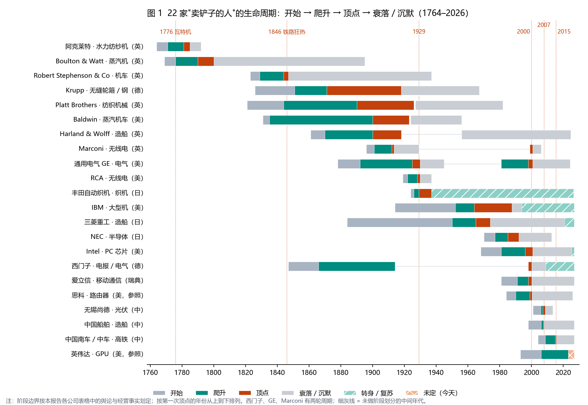
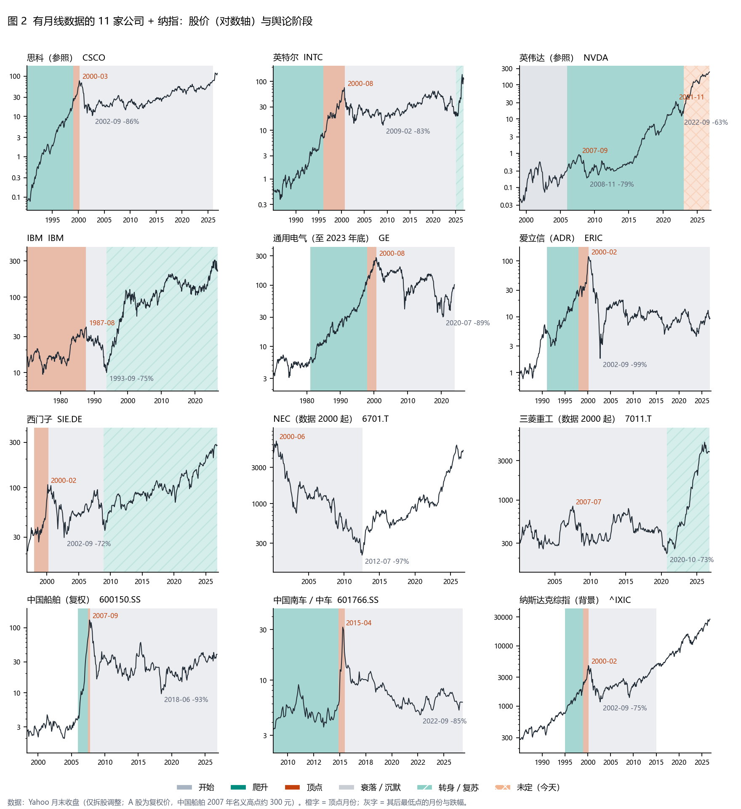
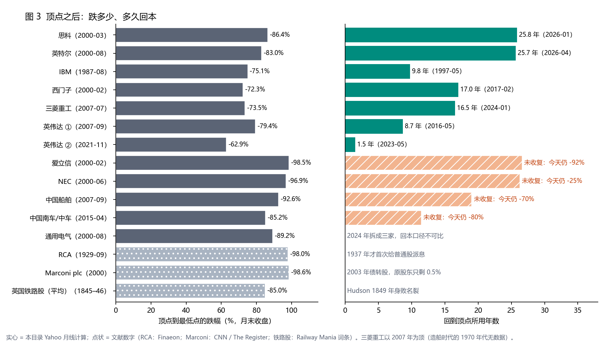

# 卖铲子的人：历史上的"英伟达"们，舆论怎么走完一个周期

## —— 20 家生产力爆发的关键设备商，加思科、英伟达两个参照：开始、爬升、顶点、衰落 / 沉默

**日期**: 2026-10-06 · **性质**: 产业史 / 舆论史研究（非个股卡）· **姊妹篇**: `studies/铲子百年实证_2026-09-23`（"卖铲子的人"长期赚不赚钱）、`studies/电力大国百年_英日中_2026-10-03`
**触发问题**: "找出历史上类似于英伟达、思科的科技公司，中国、美国、日本、英国、欧洲都算上……我想要的是开始、爬升、顶点、衰落 / 沉默，这四个时期每一个公司的舆论情况。"

**怎么读这份报告**: 每家公司一张四行表（开始 / 爬升 / 顶点 / 衰落·沉默），每行写"当时谁在说什么"、一个当时的数据、来源编号（见附录 A）。第 11 节把 22 家放在一起，找每个阶段反复出现的舆论信号；第 12 节拿这些信号对照今天的英伟达。

> **标注规则**：方括号里的编号（如 [BW1]）对应附录 A 的来源；标"背景"的是公认史实，但本批没有逐条找到来源；标"未核实"的是流传很广、但找不到原始出处的说法。股价数字凡是写"月末"的，都来自本目录 `data/prices_monthly.json`（Yahoo 月线）。

---

## 0. 结论先行

> **20 家公司卖的东西，需求全部兑现了**：蒸汽机、纺纱机、机车、轮船、电报、发电机、收音机、大型机、芯片、路由器、基站、光伏板、高铁，今天都还在用。
> **但每一家的舆论都走完了同一条弧线**：开始时被嘲笑或被砸，爬升时成为全民围观的奇观（事故和丑闻都打不断它），顶点时变成国家骄傲、领袖的话变成格言、股价被冠以"史上第一"，然后在买家停止采购、替代技术出现或专利 / 垄断到期时转入衰落，最后是沉默：没人再讨论它。
> **顶点从来不是在"大家开始担心"时出现的，而是在"大家已经不担心"时出现的。** 在本研究找到的记录里，22 家没有一家在顶点那几年的主流舆论是悲观的。

### 七条硬结论

| 结论 | 证据 |
|---|---|
| **1. 开始期的主流声音是"不可能"和"抢饭碗"** | 1825 年《Quarterly Review》：机车比驿马车快一倍"荒唐可笑"[RS2]；1832 年 Baldwin 交完第一台机车说"那是我们的最后一台"[BA1]；1768 年纺工闯进哈格里夫斯家砸毁珍妮机[AW1]；1901 年 Marconi 横跨大西洋收报，唯一见证人是他的助手，爱迪生公开怀疑[MA1]。**中国三家是例外**：政府在开始期就出资、背书，舆论从第一天起就是正面的 |
| **2. 爬升期，事故和丑闻打不断爬升** | 1830 年议员 Huskisson 在铁路通车典礼上被碾死，铁路照建[RS4]；1994 年 Pentium 除法 bug 计提 4.75 亿美元，Intel 照样登顶[IN3]；2011 年温州 7·23 事故，舆论喊"不要带血的速度"，三年后中车股价涨 5 倍[CR4]；英伟达 2008 年单日 −31%、2018 年四季度 −54%，都在爬升期内[NV2][NV3] |
| **3. 顶点期有六个反复出现的舆论信号** | ① 领袖的话变成格言（"I sell here, sir, … POWER"、"第二次工业革命才刚开始"）；② 股价被冠以"史上第一"（第一只 300 元 A 股、第一家万亿美元公司的预言）；③ 国家骄傲和政治人物背书（总理当"超级推销员"、"造船立国"）；④ 散户狂热或操纵（RCA 资金池、263 个铁路法案）；⑤ 政治反弹在顶点就开始（反垄断、专利诉讼、贸易战）；⑥ 卖家给买家融资、产能成倍扩张（GE 的 EBASCO、多晶硅规划产能是需求的 6 倍）。见 §11.3 |
| **4. 衰落的触发几乎从来不是"需求消失"** | 而是三件事：**买家的资本开支掉头**（3G 运营商花 2,000 亿美元买牌照后，设备采购从 +25% 变成 −25%[ER5]；2008 年 BDI 崩盘、船东弃单[CS2]）；**替代技术**（柴油取代蒸汽、韩国 DRAM 取代日本、移动芯片绕开 PC）；**专利或垄断到期**（瓦特 1800 年、阿克莱特 1785 年） |
| **5. 衰落期的舆论分三步：否认 → 愤怒 → 沉默** | 否认：1930 年 Baldwin 董事长说蒸汽机车会统治"至少到 1980 年"[BA4]。愤怒：西门子 2006 年甩卖手机业务导致明基移动破产，同年给管理层加薪 30%，舆论哗然[SI3][SI4]；Geddes 报告说英国造船业的衰落是"管理层和工会的共同失败"[HW4]。沉默：爱立信今天的股价仍比 2000 年低 92%（月末），已经很少有人谈论它 |
| **6. 顶点之后，中位数跌 84%；收复的多数要 10–26 年，4 家至今没收复** | 有月线的 12 个顶点：跌幅 63%–98.5%，中位数约 −84%；收复的 7 个里，英伟达两次用了 8.7 年和 1.5 年，其余 5 个用了 9.8–25.8 年（思科 25.8 年、英特尔 25.7 年、西门子 17.0 年、三菱重工 16.5 年、IBM 9.8 年）；爱立信、NEC、中国船舶、中国南车 / 中车至今未收复。文献里的 RCA、Marconi 跌了 98%–99%。见图 3 |
| **7. 活下来的，都改了"卖什么"** | 丰田自动织机把织机利润投进汽车（社内有人反对）[TO4]；Intel 1985 年退出自己发明的 DRAM、裁掉近三分之一的人[IN1]；IBM 1993 年从硬件转向服务[IB6]；三菱重工的造船收入占比从 40% 降到 15%，2020 年代靠防务与能源复苏[MH4]；西门子剥离手机、整改合规后，2017 年收复 2000 年高点 |

### 对英伟达的一句话（判据，不是建议）

> **英伟达今天的舆论，已经出现了"顶点期"六个信号里的至少五个**（格言、史上第一、国家与地缘政治、政治反弹、卖家投资买家，见 §12）。**历史上，从顶点转入衰落的触发信号是"买家的资本开支掉头"、"买家自己造铲子"和"第一次下调指引"**：截至 2026-10-06，第一个本研究没有核查到，第二个正在部分发生，第三个还没有出现。DeepSeek 那天的单日 −17% 不算，因为它不是公司自己的盈利预警，而且很快收复。

---

## 1. 方法：选谁、怎么划阶段、"舆论"指什么

**选谁**：一轮生产力爆发里，**所有参与者都必须买它的关键设备**的那家公司，即"卖铲子的人"。从 25 个以上的候选里选出 20 家，覆盖英国、德国、瑞典、美国、日本、中国，时间从 1764 年到 2026 年；另加思科（互联网泡沫）和英伟达（今天）两个参照，共 22 家。造船业和日本半导体这类"一个国家一整个行业"的，用一家代表公司（Harland & Wolff、三菱重工、NEC）。

**四个阶段的定义**：

| 阶段 | 定义 | 典型舆论 |
|---|---|---|
| **开始** | 技术或公司刚诞生，还没有大订单 | 不信、嘲笑；或者怕（抢饭碗） |
| **爬升** | 订单和产能快速扩张，被公众看见 | 奇观、围观、自豪；事故会引发质疑但不改变方向 |
| **顶点** | 份额、估值、名声最高、舆论最一致的那几年 | "这次不一样"、国家骄傲、领袖封神 |
| **衰落 / 沉默** | 份额或股价长期下行，或从公共讨论中消失 | 否认 → 愤怒 → 沉默 |
| 转身 / 复苏（附加） | 换了"卖什么"之后重新增长 | — |

**"舆论"指什么**：当时的报刊和杂志、议会 / 国会记录、公司领袖的原话、民间的行为（围观、砸机器、散户涌入、求职热度、裁员），以及后来史学家对当时风气的描述。19 世纪以前的舆论只能从行为和少数文字里看到。

**两个偏差要提防**：
1. **幸存者偏差**：留下记录的往往是赢家和大失败者，平平无奇的供应商没有故事。
2. **名言伪造**：越有名的"当时人的蠢话"越可能是后人编的。下表三条本研究找不到原始出处，所以正文不引用：

| 流传的说法 | 状态 |
|---|---|
| 1878 年英国议会委员会说爱迪生电灯"对大西洋彼岸的朋友够用了，但不值得务实或科学的人关注" | **未核实**：只在"名人蠢话"合集里出现，找不到委员会记录 |
| 瓦特说高压蒸汽的鼓吹者 Trevithick"该被绞死" | **未核实**：可查到的是 Boulton & Watt 曾对 Trevithick 发出禁令[BW5]，但找不到这句话 |
| 思科 CEO Chambers 说"每家公司都会变成互联网公司" | **未核实原话**：可查到的是他 1998 年说"新经济就是互联网经济"[CI3]，正文改用可查的那句 |

另外，"泰坦尼克号不沉"并不是船厂说的：1911 年《The Shipbuilder》杂志写的是"实际上不会沉"（practically unsinkable），Harland & Wolff 坚称从未把它宣传成不沉之船[HW3]。

---

## 2. 第一次工业革命：纺纱机与蒸汽机（英国）

### 2.1 阿克莱特：水力纺纱机与工厂体系（附：哈格里夫斯的珍妮纺纱机）

**为什么像英伟达**：阿克莱特卖的不只是机器，而是"机器 + 工厂组织方式 + 专利授权"，靠授权、入股和出租参与大量工厂（背景）。珍妮机的发明人哈格里夫斯反而没赚到。

| 阶段 · 年份 | 主流舆论（谁在说什么） | 当时的一个数据 | 来源 |
|---|---|---|---|
| **开始** 1764–1771 | 手工纺工认为机器在抢饭碗：1768 年一群纺工闯进哈格里夫斯家，砸毁他的珍妮机，他被迫搬到诺丁汉 | 一台珍妮机干 8 个人的活，纱价随之下跌 | [AW1] |
| **爬升** 1771–1781 | 工厂主追捧，工人砸厂：1779 年兰开夏反机器骚乱，阿克莱特在 Birkacre（Chorley）的工厂被毁，Robert Peel 在 Altham 的工厂也被毁 | 1779 年 10 月 Birkacre 厂被毁 | [AW2] |
| **顶点** 1781–1785 | 阿克莱特自信到说自己能"替国家还清国债"（Baines 1835 年的《英国棉纺织业史》转述）。1781 年起他起诉侵权者；侵权已经遍地都是，几家棉纺厂主联合申请撤销他的专利。业内很多人盼着这个"傲慢自负的人"倒台 | 1785 年专利以说明书不充分为由被撤销 | [AW3][AW4] |
| **衰落 / 沉默** 1785–1792 | 垄断没了，行业爆发式扩张；但阿克莱特本人仍是最大的单一纺纱商，1786 年封爵。工人的愤怒没有停：1811–1816 年卢德运动砸的是整个机器体系 | 1792 年去世，身家约 50 万英镑 | [AW4][AW5][AW6] |

**结局**：专利是锁，锁被法院打开后，铲子变成了人人都能造的东西，但先赚到钱的人已经赚到了。

### 2.2 Boulton & Watt：蒸汽机

**为什么像英伟达**：卖的是那个时代最核心的动力设备，而且不按台卖，而是**按效果收租**：每年收取"比旧式蒸汽机省下的燃料费"的三分之一，直到专利 1800 年到期。

| 阶段 · 年份 | 主流舆论（谁在说什么） | 当时的一个数据 | 来源 |
|---|---|---|---|
| **开始** 1769–1775 | 瓦特 1769 年取得专利，但第一位合伙人 Roebuck 1773 年破产（背景）；Boulton 接手后，议会 1775 年同意把专利延长到 1800 年，国家站在发明者一边 | 专利延长 25 年 | [BW2] |
| **爬升** 1776–1789 | 1776 年作家 Boswell 参观 Soho 工厂，Boulton 对他说："先生，我这里卖的是全世界都想要的东西：动力（POWER）。"这句话成了技术史上最有名的推销词之一 | 年费 = 每台机器省下燃料费的 1/3 | [BW1][BW2] |
| **顶点** 1790–1800 | 最大客户康沃尔铜矿主越来越把年费看成负担，铜价下跌时尤其如此。Hornblower 的复式蒸汽机 1791 年进入康沃尔；Boulton & Watt 1792 年在议会阻止他的专利延期，1796 年起诉，1799 年胜诉，Hornblower 的生意随之崩溃 | 1800 年约 500 台在用 | [BW2][BW3] |
| **衰落 / 沉默** 1800–1895 | 专利一到期，Trevithick 的高压蒸汽、Woolf 等改进纷纷出现。后人对此争论至今：Boldrin & Levine 等认为瓦特的专利压住了高压蒸汽二十年；Selgin & Turner 认为这是神话。Boulton & Watt 此后成了一家普通机械厂（背景） | 1800 年专利到期 | [BW4][BW5] |

**结局**：按效果收费的模式非常赚钱，但收租越狠，客户和对手越想绕开它。锁一到期，舆论马上把它从"进步的引擎"改写成"阻碍进步的垄断者"。

### 2.3 Platt Brothers：纺织机械（奥尔德姆）

**为什么像英伟达**：19 世纪末世界最大的纺织机械厂，给英国、印度、日本、美国、中国、俄国、南美的新纱厂供货。

| 阶段 · 年份 | 主流舆论（谁在说什么） | 当时的一个数据 | 来源 |
|---|---|---|---|
| **开始** 1821–1844 | 一家地方机械作坊。奥尔德姆在 1840 年代超过曼彻斯特和博尔顿，成为"纺纱之都"，Platt 跟着城市一起长大 | 1844 年买下 Hartford New Works | [PL1][PL2] |
| **爬升** 1844–1890 | 城市和公司合二为一：John Platt 1865 年起任奥尔德姆议员；公司自称世界最大的纺织机械厂，一度是世界最大的机械厂 | 1890 年代估计提供了奥尔德姆近一半的就业 | [PL3] |
| **顶点** 1890–1926 | "世界纺纱之都 + 世界最大纺机厂"是奥尔德姆人的身份认同；没有人认为兰开夏的地位会动摇 | 1900 年前后雇员 1.2 万–1.5 万人（另一记载为近 2 万）；1926 年奥尔德姆纱锭 1,770 万，史上最高 | [PL1][PL2][PL3] |
| **衰落 / 沉默** 1927–1982 | 1927 年第一次没派息：兰开夏本土市场几乎干涸，瑞士、德国、法国、日本的竞争空前激烈。1929 年 Platt 花 10 万英镑买下丰田 G 型自动织机在日中美以外的独家专利，想用对手的技术自保；同一笔交易在日本被当成"日本技术获世界认可"的骄傲（见 §9.2） | 1982-03-18 上午 10:30，Stone-Platt 所有厂门关闭，接管人入驻 | [PL4][TO1][TO3] |

**结局**：老霸主向新霸主买技术，是衰落期最典型的动作之一。它说明老霸主已经看清了替代技术，只是自己的组织造不出来。

---

## 3. 铁路时代：机车与轮箍

### 3.1 Robert Stephenson & Co：世界第一家机车厂（英）

| 阶段 · 年份 | 主流舆论（谁在说什么） | 当时的一个数据 | 来源 |
|---|---|---|---|
| **开始** 1823–1829 | 1825 年《Quarterly Review》："还有什么比'机车速度是驿马车两倍'更荒唐可笑的？我们宁可相信伍利奇的居民愿意被康格里夫火箭打出去，也不会把自己交给这样一台机器" | 到 1830 年，机车速度已是驿马车的三倍以上 | [RS1][RS2] |
| **爬升** 1829–1844 | 1829 年 Rainhill 机车比赛，1 万到 1.5 万人从利物浦、曼彻斯特赶来围观，有乐队，酒馆生意兴隆，火箭号是唯一跑完全程的机车。1830 年利物浦—曼彻斯特铁路通车当天，议员 Huskisson 被机车碾过身亡，这是第一起轰动全国的铁路事故，但铁路照建 | 火箭号均速 12 英里 / 时，最高 30；1838 年 400 名工人，"有铁路的地方，几乎都有这家的机车" | [RS1][RS3][RS4] |
| **顶点** 1844–1847 | 铁路狂热：全民买铁路股，"铁路之王" George Hudson 成为英雄 | 1846 年议会通过 263 个新铁路公司法案，规划 9,500 英里；同年公司积压 224 台机车订单 | [RS1][RS5][RS6] |
| **衰落 / 沉默** 1847–1937 | 1846–47 年铁路股腰斩，投资者发现 Hudson 用股本发股息，1849 年他身败名裂。机车厂没有倒，但大铁路公司开始在 Crewe、Swindon 自建机车厂（背景），独立机车厂从"唯一供应商"变成"众多供应商之一" | 1850 年初铁路股平均比高点跌 85%；1937 年与 Hawthorn Leslie 合并，1944 年被 Vulcan Foundry 收购 | [RS1][RS5][RS6][RS7] |

**结局**：铁路狂热中亏钱最多的是买铲子的人（铁路公司股东），不是卖铲子的人。卖铲子的人输在后面一步：最大的客户决定自己造铲子。

### 3.2 Krupp：无缝铁路轮箍（德）

| 阶段 · 年份 | 主流舆论（谁在说什么） | 当时的一个数据 | 来源 |
|---|---|---|---|
| **开始** 1826–1850 | 没有舆论：1826 年 14 岁的 Alfred Krupp 接手父亲留下的作坊，生产几乎停顿 | 7 名工人，负债 1 万塔勒 | [KR1] |
| **爬升** 1851–1870 | 1851 年伦敦世博会，Krupp 展出一块 2 吨重、毫无瑕疵的铸钢锭，"轰动了工业界"，埃森工厂一举成名。1852 年做出无缝铁路轮箍：火车提速后，只有它不会断裂，公司的三环标志就是三只轮箍 | 钢锭重量是此前任何铸件的两倍多 | [KR1][KR2] |
| **顶点** 1871–1918 | 普法战争中 Krupp 铸钢炮胜过法军铜炮，Alfred 被称为"大炮之王"。公司给工人盖住宅、学校，设保险，埃森成了"国中之国"，"克虏伯人"对公司和家族的忠诚不亚于对国家 | 1887 年员工 7.5 万（埃森 2.02 万） | [KR1] |
| **衰落 / 沉默** 1918–1967 | 二战使用强迫劳动，纽伦堡第十案判 Alfried Krupp 12 年，他只服刑 3 年便被美方赦免。1966–67 年衰退中出现信贷危机，家族唯一的儿子不愿接班，1967 年公司转归基金会所有。《时代》周刊的标题是"一个家族帝国的终结" | 克虏伯股票此前从未上市交易 | [KR3][KR4][KR5] |

**结局**：卖铲子的人转行卖炮，舆论从"工业奇迹"变成"战争贩子"。这是 22 家里唯一一家衰落主因是道德和政治、而不是技术的公司。

### 3.3 Baldwin Locomotive Works：蒸汽机车（美）

| 阶段 · 年份 | 主流舆论（谁在说什么） | 当时的一个数据 | 来源 |
|---|---|---|---|
| **开始** 1831–1834 | 创始人自己都不信：1832 年第一台机车"Old Ironsides"性能不达标，铁路公司压价，Baldwin 说"那是我们的最后一台机车"。后来他研究了一台 Stephenson 造的英国机车，改进后才继续 | 合同价 4,000 美元，最后按 3,500 美元结算；1834 年造了 5 台 | [BA1] |
| **爬升** 1835–1900 | 美国铁路扩张，Baldwin 成为全美最大的蒸汽机车厂 | 累计造了 7 万多台 | [BA2] |
| **顶点** 1900–1923 | 费城的工业象征；1906 年开始在 Eddystone 建 600 英亩的新厂 | 1906 年一年交付 2,666 台，雇工 1.8 万多人 | [BA2][BA3] |
| **衰落 / 沉默** 1924–1956 | 1920 年代中期美国铁路开始长期衰退。1930 年董事长 Vauclain 演讲：蒸汽技术的进步将保证蒸汽机车统治"至少到 1980 年"，"将来回头看，铁路柴油化的程度不会超过电气化" | 1935 年破产；柴油机车市场份额从未超过 13%；1956 年停产 | [BA3][BA4][BA5] |

**结局**：技术代际一换，霸主出局。董事长否认替代技术的那篇演讲，是 22 家里"否认期"最清楚的一份记录。

### 3.4 中国南车 / 中国中车：高铁装备（中）

| 阶段 · 年份 | 主流舆论（谁在说什么） | 当时的一个数据 | 来源 |
|---|---|---|---|
| **开始** 2004–2008 | 国家主导"引进、消化、吸收、再创新"（背景）。2008-08-01 京津城际开通，铁道部说这是世界上唯一能跑 350 公里 / 时的线路；同月中国南车 A+H 上市 | 北京到天津从 70 分钟缩到 30 分钟；IPO 募资 14.8 亿美元 | [CR1][CR2] |
| **爬升** 2008–2014 | 2010-12 CRH380A 跑出 486.1 公里 / 时，未改装量产列车的世界纪录，"中国速度"成为骄傲。2011-07-23 温州动车追尾，35 人死亡，舆论急转为质疑："人们要速度，但不要带血的速度"，但同一批评论也说"高铁不会停滞"。2013–14 年李克强被称为"超级推销员""最强营销总监" | 2014 年李克强向 12 个国家推介中国高铁 | [CR3][CR4][CR5] |
| **顶点** 2014-12 – 2015-06 | 南北车合并 + "高铁出海"，股民把它叫"中国神车" | 股价从 5.80 元涨到停牌前 29.45 元（+408%），盘中一度接近 40 元，市盈率约 80 倍；月末 2014-10 → 2015-04 +447% | [CR6][CR7] |
| **衰落 / 沉默** 2015-06 – 今 | 复牌后几乎腰斩。此后舆论关注回到高铁项目本身，股票从公共讨论中消失 | 月末 2015-04 → 2022-09 −85%；今天 6.19 元，仍比高点 −80% | [CR8] |

**结局**：技术和订单都是真的，今天它仍是全球最大的轨道交通装备商（背景）。亏钱的是在"国家骄傲 + 总理推销 + 合并题材"三者叠加的那几个月买入的人。

---

## 4. 造船：三个国家，三个世纪

### 4.1 Harland & Wolff：代表英国造船业

| 阶段 · 年份 | 主流舆论（谁在说什么） | 当时的一个数据 | 来源 |
|---|---|---|---|
| **开始** 1861–1870 | 贝尔法斯特皇后岛上的一家新船厂（背景）；英国已是世界造船中心 | — | [HW1] |
| **爬升** 1870–1900 | 造船工人是英国工资最高的"劳工贵族"，住在英国和爱尔兰最好的工人住宅里 | 1890 年代英国造了全世界约 75% 的船 | [HW1][HW2] |
| **顶点** 1900–1918 | 1911 年《The Shipbuilder》说泰坦尼克号"实际上不会沉"；戴平顶帽的造船工人是东贝尔法斯特的象征。1912 年泰坦尼克号沉没，但没有终结船厂 | 1913 年英国仍占世界造船 58%；船厂历史最高峰时 3.5 万员工 | [HW1][HW2][HW3] |
| **衰落 / 沉默** 1956–2024 | 1966 年 Geddes 报告列出成本高、交期长、设施老、劳资关系差、管理差，结论是："管理层和工会共同未能解决劳资关系问题，……让这个行业在金钱和名誉上都付出了沉重代价。"1969、1974 年立起的两座巨型龙门吊"参孙"和"歌利亚"是德国克虏伯造的 | 1950 年代世界造船量翻倍，英国份额从 40% 降到 15%；1975 年国有化，到 1988 年政府专项援助 4.85 亿英镑；2019、2024 年两次进入破产管理 | [HW4][HW5][HW6][HW7] |

### 4.2 三菱重工：代表日本造船业

| 阶段 · 年份 | 主流舆论（谁在说什么） | 当时的一个数据 | 来源 |
|---|---|---|---|
| **开始** 1884–1950 | 1884 年三菱租下官营长崎造船所，此后长期是国策和军工企业（背景） | — | [MH5] |
| **爬升** 1950–1965 | 1956 年日本超过英国成为世界第一造船国，"造船立国"成为国家叙事 | 1961 年长崎造船所下水量世界第一；1965 年日本份额 44%，第二名瑞典 9% | [MH1][MH2] |
| **顶点** 1965–1974 | 1960–70 年代日本商船建造量世界第一，超大型油轮订单接到手软 | 1970 年前后日本约占世界造船 50% | [MH1][MH3] |
| **衰落 / 沉默** 1974–2020 | 两次石油危机后超大型油轮需求骤减，造船被定性为"构造不况业种"（结构性萧条行业）；1978 年被指定为特定不况产业，国家要求削减 35% 产能 | 1980、1988 年两轮调整，产能被削减约 50%；造船占三菱重工营收从 1975 年 40% 降到 1985 年 15% | [MH1][MH4] |
| 转身 2020– | 防务与燃气轮机带动复苏（背景） | 月末 2020-10 → 2026-02 股价 ×22 | 数据 |

### 4.3 中国船舶（600150）：代表中国造船业

| 阶段 · 年份 | 主流舆论（谁在说什么） | 当时的一个数据 | 来源 |
|---|---|---|---|
| **开始** 1998–2005 | 前身沪东重机上市，一家普通的船用柴油机公司（背景） | — | — |
| **爬升** 2006 – 2007-06 | "中国造船超越韩国"：2007 上半年中国新接订单同比 +165%，首次超过韩国；集团注入造船资产，股价半年从 30 元涨到 300 元 | 2007 年预增净利润 950%–1,050% | [CS1] |
| **顶点** 2007-07 – 2007-10 | 2007-10-11 股价 300 元，两市唯一一只 300 元股，"比茅台还贵"（茅台当时 173 元） | 市值超 2,000 亿元；2007 年中国新接订单 9,845 万载重吨，占世界 42% | [CS2][CS3] |
| **衰落 / 沉默** 2007-11 – 今 | 不到一个月跌到 160 元，2008-04 约 100 元，2008-10 约 30 元。中新网 2008-08 的标题是"沪深第一高价股 10 个月大跌超八成"。9·15 后 BDI 从 1 万点以上崩跌，船东延期交船或弃单。2016–17 年连续亏损，2018-04 被 *ST。知乎上的回顾标题："股价从 300 跌到 19，13.3 万股东心里苦" | 复权价月末 2007-09 → 2018-06 −93%；2019 年南北船联合重组，2024 年吸收合并中国重工，订单规模全球第一，但股价今天仍比 2007 年 −70% | [CS2][CS4][CS5][CS6] |

**三国造船的共同点**：每一次换霸主，都是新国家以更低的成本接走全球订单（英国 → 日本 → 韩国 / 中国）；每一次顶点都出现在全球航运订单的高峰（1913、1973、2007）；顶点之后，三国都由政府出面兜底（英国国有化、日本强制削减产能、中国南北船合并）。

---

## 5. 电气化：电报、发电机与电力系统

### 5.1 西门子（德）

| 阶段 · 年份 | 主流舆论（谁在说什么） | 当时的一个数据 | 来源 |
|---|---|---|---|
| **开始** 1847–1865 | 1847 年 Werner von Siemens 做出指针电报机，1848 年拿下欧洲第一条长途电报线的合同 | 柏林—法兰克福一期 670 公里，1849 年投用 | [SI1] |
| **爬升** 1866–1914 | 1866 年提出发电机原理，1870 年建成伦敦—加尔各答印欧电报线（背景）。但第一名并不稳：到一战前，后来者 AEG 已是德国最大的电气公司，"远远领先西门子"，1907 年 AEG 是世界最大的商业公司 | — | [SI2] |
| **顶点**（第二轮）1998–2000 | 电信设备泡沫，西门子与爱立信、诺基亚同属欧洲电信设备巨头（背景） | 月末高点 2000-02 | 数据 |
| **衰落** 2000–2008 | 2005 年把亏损的手机业务交给台湾明基，还倒贴一笔钱；2006-09 明基移动破产，报纸、工会，甚至保守派政客都批评西门子"不负责任"。同期监事会宣布给管理层加薪 30%，员工和公众哗然。2006-11 有 200 名警察搜查总部，内部调查发现 1999 年以来 13 亿欧元可疑支付 | 月末 2000-02 → 2002-09 −72%；2008 年美德两国罚款合计 16 亿美元，当时史上最大的反贿赂罚款 | [SI3][SI4][SI5] |
| 复苏 2008– | 整改合规、剥离消费业务（背景） | 2017-02 收复 2000 年高点；今天是 2000 年高点的 2.6 倍 | 数据 |

### 5.2 通用电气 GE（美）

| 阶段 · 年份 | 主流舆论（谁在说什么） | 当时的一个数据 | 来源 |
|---|---|---|---|
| **开始** 1878–1892 | 1878 年 9 月爱迪生在《纽约太阳报》宣布要用电灯系统取代煤气；10 月消息电传到伦敦、巴黎，煤气股恐慌。电灯迟迟没来，煤气股收复失地，"爱迪生因制造这场混乱而饱受指责" | Imperial Continental 跌 7 点，Gas Light & Coke 跌 7.5 点 | [GE1] |
| **爬升** 1892–1925 | 1896 年进入道指最初的 12 只成分股（背景）。1905 年 GE 设立 EBASCO，专门给"购买 GE 设备的电力公司"提供融资和管理：**卖铲子的人给买铲子的人放钱** | 1925 年 EBASCO 系是美国和外国电力公司的最大持有者，控制全美 10% 以上的电力公司 | [GE2] |
| **顶点** 1925–1929 | "新时代"牛市中的工业蓝筹（背景） | 1929–1932 年股价跌约 90%–97%（拆股口径不同） | [GE3] |
| **衰落** 1929–1945 | 1935 年《公用事业控股公司法》强制拆散 EBASCO 这类控股帝国 | — | [GE2] |
| **第二轮** 1981–2024 | 韦尔奇被《财富》1999 年评为"世纪经理人"；2000 年 GE 是全球市值最高的公司。2008 年 GE Capital 在隔夜市场借不到钱，靠巴菲特等投资者紧急注资。2018 年被移出道指，结束了 111 年的成员资格；策略师说："问题不是会不会，而是什么时候。"2024 年拆成三家 | 市值 140 亿 → 4,000 亿美元以上（韦尔奇任内），2000 年近 6,000 亿；2018 年 12.95 美元，比 2000-08 高点 60 美元 −78% | [GE4][GE5][GE6][GE7] |

**结局**：GE 走了两轮完整周期。两轮的顶点都伴随着同一件事：**GE 在给买家融资**（1920 年代的 EBASCO，2000 年代的 GE Capital）。

---

## 6. 无线电：1910–1920 年代的"AI"

### 6.1 Marconi（英）

| 阶段 · 年份 | 主流舆论（谁在说什么） | 当时的一个数据 | 来源 |
|---|---|---|---|
| **开始** 1896–1901 | 1901-12 Marconi 宣布横跨大西洋收报，欢呼和怀疑并存：唯一的见证人是他的助手 Kemp，信号弱到无法驱动自动记录器，爱迪生等人公开质疑，很多人认为电波不会沿地球曲面传播。两个月后他在贝尔、Steinmetz、Pupin 等人见证下用墨水记录器收报，怀疑才平息 | — | [MA1] |
| **爬升** 1901–1911 | 船载无线电普及（背景） | 1911 年英国 Marconi 股价 2.43 英镑 | [MA2] |
| **顶点** 1912 | 泰坦尼克号沉没，两名 Marconi 报务员成为英雄，卡帕西亚号救起 705 人。股价暴涨；同年爆出 Marconi 丑闻：劳合·乔治、Rufus Isaacs 等大臣在政府合同谈判期间买入美国 Marconi 股票 | 美国 Marconi 股三天涨 25 点；英国股价涨到 9 英镑 | [MA2][MA3][MA4] |
| **衰落 / 沉默** 1913–1929 | 丑闻和一战之后，1929 年通信业务与 Eastern Telegraph 合并，即后来的 Cable & Wireless；制造业务 1946 年被 English Electric 收购（背景） | — | — |
| **第二轮** 1999–2006 | 英国 GEC 1999 年改名 Marconi，卖掉国防业务、押注电信设备，复制思科（背景）。2001-07 盈利预警停牌、股价崩跌 | 股价从 12.5 英镑跌到约 18 便士；2003 年债转股，原股东只剩 0.5% | [MA5][MA6] |

### 6.2 RCA 美国无线电公司（美）

| 阶段 · 年份 | 主流舆论（谁在说什么） | 当时的一个数据 | 来源 |
|---|---|---|---|
| **开始** 1919–1922 | 国家意志：应美国政府要求，GE 的 Owen Young 把美国 Marconi 改组为 RCA，防止外国控制美国无线电；规定高管必须是美国公民、多数股份由美国人持有 | 1922 年只有 0.2% 的家庭有收音机，全年销售 6,000 万美元 | [RC1][RC2] |
| **爬升** 1922–1927 | 收音机热：RCA 既卖收音机，又做广播节目，是 1920 年代最热门的科技股 | 1929 年行业销售 8.43 亿美元，是 1922 年的 14 倍 | [RC2][RC3] |
| **顶点** 1928–1929 | 1929 年 3 月，RCA 在交易所的专员 Meehan 组织"资金池"，用媒体软文和对倒交易制造热度，一周多赚了近 500 万美元 | 股价从 1925 年 85 美元涨到 1929 年 549 美元（拆股前） | [RC3][RC4] |
| **衰落 / 沉默** 1929–1937 | 股价崩盘；1935 年 Meehan 成为 SEC 起诉的第一个个人，被逐出交易 | 1929-09 114.75 美元 → 1932 年 2.50 美元（−98%）；直到 1937 年才第一次给普通股派息 | [RC4][RC5][RC6] |

**结局**：RCA 后来在电视时代再起，1986 年被 GE 收购（背景）。它说明了一点：**卖铲子的公司活下来，不等于在顶点买入它的股东活下来。**

---

## 7. 计算机与芯片

### 7.1 IBM：大型机（美）

| 阶段 · 年份 | 主流舆论（谁在说什么） | 当时的一个数据 | 来源 |
|---|---|---|---|
| **开始** 1914–1952 | Watson 1914 年把"THINK"口号带进打孔卡公司 CTR，1924 年改名 IBM | — | [IB1] |
| **爬升** 1952–1964 | 计算机行业里，IBM 是"白雪公主"，对手是"七个小矮人"（Burroughs、Univac、NCR、Control Data、Honeywell、GE、RCA） | GE 和 RCA 在 1970 年代退出计算机业 | [IB2] |
| **顶点** 1964–1987 | 《财富》1966 年称 System/360 是"IBM 的 50 亿美元赌博"；1970 年代流行一句话："没有人因为买 IBM 被开除。"1969 年司法部提起反垄断诉讼要拆分 IBM，拖了 13 年，1982 年以"缺乏依据"撤诉 | S/360 投入约 50 亿美元，约为当年营收的两倍；约 70% 大型机份额 | [IB3][IB4][IB5][IB7] |
| **衰落** 1987–1993 | 1993 年华尔街和硅谷普遍认为 IBM 是"注定被拆分和破产的官僚恐龙"。新 CEO Gerstner："IBM 现在最不需要的就是愿景"，接着说它需要"一系列非常务实、市场驱动、高度有效的策略" | 1993 年亏损 80 亿美元；月末 1987-08 → 1993-09 −75% | [IB6][IB8] |
| 转身 1993– | 从硬件转向服务（背景） | 1997-05 收复 1987 年高点，用了 9.8 年 | 数据 |

### 7.2 NEC：代表日本半导体（日）

| 阶段 · 年份 | 主流舆论（谁在说什么） | 当时的一个数据 | 来源 |
|---|---|---|---|
| **开始** 1899–1977 | 1899 年作为日本第一家外资合资企业成立（与美国西电合资，背景） | — | — |
| **爬升** 1977–1985 | 1977 年社长小林宏治提出"C&C"（计算机与通信融合）。1979 年 Vogel 的《日本第一》英日双语畅销 | 1978–1987 年日本在大宗半导体的全球份额从 28% 升到 50%；美国 DRAM 份额从 70% 跌到 20% | [NE1][NE2][NE3] |
| **顶点** 1985–1992 | NEC 是全球营收最大的半导体公司，PC-98 是日本"国民电脑"。美国的反弹在顶点开始：1986 年美日半导体协议；1987 年里根对日本芯片征 100% 关税；1987-07-01 九名国会议员在国会大厦前用大锤砸碎一台东芝收录机 | 1991 年 PC-98 占日本 PC 市场 60% 以上 | [NE2][NE4][NE5][NE6] |
| **衰落 / 沉默** 1992–2012 | 日本半导体进入"冰河期"，韩国崛起。1999 年 NEC 和日立合并内存业务成立尔必达，2002 年分拆 NEC 电子 | 2012 年尔必达破产，日本制造业史上最大的破产；NEC 股价月末 2000-06 → 2012-07 −97%，今天仍比 2000 年 −25% | [NE2][NE4][NE7] |

### 7.3 Intel：PC 时代的芯片（美）

| 阶段 · 年份 | 主流舆论（谁在说什么） | 当时的一个数据 | 来源 |
|---|---|---|---|
| **开始** 1968–1981 | 一家做存储器的创业公司（背景） | — | — |
| **爬升** 1981–1995 | 1985 年被日本 DRAM 打败，Grove 问 Moore："如果我们被撤换，新 CEO 会怎么做？"答案是"退出存储器"。Grove 后来说这是"我们做过的最好的商业决定"。1991 年"Intel Inside"广告起初被质疑太贵，后被《广告时代》称为史上最有效的联合广告。1994 年 Pentium 除法 bug：Intel 先说普通用户"2.7 万年才遇到一次"，只给能证明有科学需要的人换货，IBM 随即停售 Pentium 电脑，Intel 最终全面召回 | 1985 年裁员 7,000 多人，近三分之一；"Intel Inside"首期 2.5 亿美元；1995-01 计提 4.75 亿美元 | [IN1][IN2][IN3] |
| **顶点** 1996–2000 | Grove 出版《只有偏执狂才能生存》，"Wintel"统治个人电脑（背景） | 2000-08 市值 5,090 亿美元 | [IN4][IN5] |
| **衰落 / 沉默** 2000–2025 | 先后输给台积电和英伟达。2024-08-02 单日暴跌，暂停股息、裁员 15% | 月末 2000-08 → 2009-02 −83%；2024-08-02 单日 −26%，1974 年以来最差；裁员 1.5 万人 | [IN6] |
| 收复 2026 | — | 2026-04 月末收盘首次回到 2000-08 水平，用了 25.7 年 | 数据、[IN7] |

---

## 8. 电信与互联网：思科的同伴

### 8.1 爱立信（瑞典）

| 阶段 · 年份 | 主流舆论（谁在说什么） | 当时的一个数据 | 来源 |
|---|---|---|---|
| **开始** 1876–1990 | 1876 年成立，长期是瑞典最大的企业 | 1990 年（GSM 商用前一年）营收约 80 亿克朗 | [ER1][ER2] |
| **爬升** 1991–1997 | GSM 1991 年商用，爱立信主导移动通信系统 | 1990 年代移动系统全球份额 40% 以上 | [ER2] |
| **顶点** 1998 – 2000-03 | 瑞典的国家骄傲，"这个国家在高科技领域敏捷的象征"；交易最活跃的股票 | 2000 年移动业务营收 2,000 亿克朗，占集团 80%；2000-03 市值 1.8 万亿克朗，斯德哥尔摩全市场市值 4.8 万亿克朗，是瑞典 GDP 的两倍 | [ER2][ER3][ER4] |
| **衰落 / 沉默** 2000 – 今 | 欧洲运营商花约 2,000 亿美元买 3G 牌照，剩下的钱不够买设备，采购从一年 +25% 变成 −25%。2001-03-12 盈利预警，一季度增长预期从 15% 下调到零。《时代》周刊："瑞典工业的骄傲变成了一只仙股。" | 预警当天 −21.5%；2000 年 −34%、2001 年 −52%；员工从 10.7 万砍掉一半；2002 年配股 300 亿克朗；ADR 今天仍比 2000 年 −92% | [ER3][ER4][ER5][ER6][ER7] |

### 8.2 思科（参照，美）

| 阶段 · 年份 | 主流舆论（谁在说什么） | 当时的一个数据 | 来源 |
|---|---|---|---|
| **开始** 1984–1990 | 一家斯坦福夫妇创办的路由器公司（背景）；1990-02 上市，需求火爆 | 上市市值 2.24 亿美元 | [CI1] |
| **爬升** 1990–1998 | 互联网的"管道工"，美国增长最快的公司之一 | 1990 年代表现最好的单只股票：1990 年投 1 万美元，到 2000 年值 100 多万 | [CI1][CI2] |
| **顶点** 1999 – 2000-03 | CEO Chambers："第二次工业革命才刚刚开始，企业和政府都在找思科这个互联网专家帮它们转型。"2000 年超过 GE 成为全球市值最高的公司，分析师说它可能是第一家万亿美元公司 | 约 5,000 亿美元市值 | [CI3][CI4] |
| **衰落 / 沉默** 2000–2025 | 2001-04 计提过剩库存、裁员 | 计提 22.5 亿美元，裁员 8,500 人；月末 2000-03 → 2002-09 −86%；2025-12 才第一次收在 2000 年纪录之上（约 25 年） | [CI5][CI6] |

---

## 9. 能源转型与成功转身

### 9.1 无锡尚德：光伏组件（中）

| 阶段 · 年份 | 主流舆论（谁在说什么） | 当时的一个数据 | 来源 |
|---|---|---|---|
| **开始** 2001–2005 | 地方政府扶持：施正荣只带了 40 万美元找无锡市政府讲"未来光伏世界"，市政府让 8 家国企凑钱入股 | 国企出资 650 万美元 | [SU1] |
| **爬升** 2005-12 – 2007 | 2005-12-14 纽交所上市，第一家在美国主板上市的中国民营企业；2006 年施正荣成为中国首富，被叫作"光伏教父""太阳能之父" | 上市后股价很快到 40 美元；身家 22–23 亿美元 | [SU1][SU2] |
| **顶点** 2007–2008 | 全国上马光伏和多晶硅：巨大的利润吸引大量资金"纷纷扎进多晶硅产业淘金" | 2007 年产量 360 兆瓦、营收超 100 亿元、市值超 100 亿美元；2008 年股价逼近 90 美元；多晶硅每公斤 500 美元仍供不应求；规划 2010 年多晶硅产能超 10 万吨，而 2008 年国内需求只有 1.7 万吨 | [SU2] |
| **衰落 / 沉默** 2008–2013 | 金融危机后价格崩跌；2011-08 美国发起"双反"调查。2013 年破产后，舆论转向反思："从无锡尚德破产重整案看政府与市场的关系"（人民网理论频道） | 2012-10 终裁，尚德税率最高（35.97%）；2013-03-20 一笔 5.41 亿美元可转债到期，破产重整 | [SU1][SU3] |

**结局**：需求是真的，2010 年代全球光伏装机暴涨（背景），但产能翻倍之后价格崩了。尚德是 22 家里从顶点到破产最快的一家（约 5 年）。

### 9.2 丰田自动织机：从织机到汽车（日）

| 阶段 · 年份 | 主流舆论（谁在说什么） | 当时的一个数据 | 来源 |
|---|---|---|---|
| **开始** 1924–1926 | 1924 年豊田佐吉完成 G 型自动织机（不停车自动换梭），1926 年创立公司 | — | [TO1] |
| **爬升** 1926–1929 | 欧美技术人员称它为"魔法织机"。1929 年世界最大的纺机厂 Platt 出高价买下专利；日本方面认为这项发明让"日本的纺机工业和纤维产业跃升到世界水平" | 10 万英镑，约合当时 100 万日元 | [TO1][TO2][TO3] |
| **顶点** 1929–1937 | 1933 年儿子喜一郎在社内设汽车部；社内有人反对把织机赚的钱投进前途未卜的汽车。1937 年汽车部分离为丰田汽车工业 | 月产 2,000 台的汽车厂要 3,000 万日元，而织机公司资本金只有 600 万日元 | [TO4] |
| 转身 / 沉默 1937–2026 | 织机成了配角，公司变成丰田集团的持股、零部件与叉车公司（背景）。2025 年丰田集团宣布将它私有化，股东嫌价低 | 收购价两次上调，从 16,300 日元提到 20,600 日元，总额约 5.9 万亿日元，日本企业间最大的并购；2026-06-01 退市 | [TO5][TO6] |

**结局**：22 家里最成功的转身。和 Platt 正好构成一对：英国老霸主买下日本新霸主的织机专利，日本新霸主拿这笔钱的同一个时代，把未来押在了汽车上。

---

## 10. 英伟达（参照）：舆论走到了哪里

| 阶段 · 年份 | 主流舆论（谁在说什么） | 当时的一个数据 | 来源 |
|---|---|---|---|
| **开始** 1993–2006 | 一家游戏显卡公司；1999-01 上市，同年 GeForce 256 被称为"第一颗 GPU" | — | [NV1] |
| **爬升** 2006–2022 | 爬升期内三次深跌：2008-07 笔记本显卡封装缺陷，计提最高 2 亿美元，随后被投资者集体诉讼；2018 年四季度"加密货币宿醉"；2022 年科技股下跌 | 2008-07 单日 −31%；2018 年四季度 −54%，标普 500 表现最差；月末 2021-11 → 2022-09 −63% | [NV2][NV3]、数据 |
| **今天** 2023 – 2026-10 | 2023 年黄仁勋："AI 的 iPhone 时刻。"2025-01-27 DeepSeek 发布后单日暴跌，随后收复。2025-07-10 成为第一家收盘市值 4 万亿美元的公司。2026-10-02 再创新高，董事会追加 1,500 亿美元回购授权 | DeepSeek 当天 −17%，市值蒸发 5,890 亿美元，史上最大单日蒸发；2026-10 市值约 5.7 万亿美元 | [NV4][NV5][NV6][NV7] |

---

## 11. 四个阶段的舆论规律：22 家放在一起看

### 11.1 开始期："不可能"和"抢饭碗"

| 类型 | 例子 |
|---|---|
| **专家嘲笑** | 1825 年《Quarterly Review》嘲笑机车[RS2]；1901 年爱迪生等人质疑 Marconi[MA1]；1878 年爱迪生被指责"制造混乱"[GE1] |
| **创业者自己都不信** | Baldwin："那是我们的最后一台机车"[BA1]；丰田社内反对把织机利润投进汽车[TO4] |
| **饭碗受威胁的人动手** | 1768 年纺工砸哈格里夫斯家[AW1]；1779 年 Birkacre 厂被毁[AW2] |
| **国家出资背书（中国三家 + RCA）** | 无锡 8 家国企出资[SU1]；高铁"引进消化吸收"（背景）；RCA 应美国政府要求成立[RC1] |

**规律**：开始期的嘲笑几乎都在技术层面（太慢、太弱、不可靠），而事后看，技术层面的怀疑没有一次是对的。**国家背书的开始期没有嘲笑，但它的顶点往往更陡**：中国船舶、中车、尚德的顶点都只有几个月到一年。

### 11.2 爬升期：奇观、骄傲，事故打不断

- **公众围观**：Rainhill 1–1.5 万人[RS3]；1851 年世博会 Krupp 钢锭"轰动工业界"[KR2]；CRH380A 486.1 公里 / 时[CR3]。
- **事故和丑闻不改变方向**：Huskisson 之死（1830）、Pentium bug（1994）、温州 7·23（2011）、英伟达 2008 年坏芯片，**每一次舆论都转为质疑，但订单都没停**。原因很简单：在爬升期，买家没有替代品。
- **在爬升期主动换赛道的公司活得最久**：Intel 1985 年退出 DRAM[IN1]，丰田 1933 年做汽车[TO4]。

### 11.3 顶点期：六个反复出现的信号

| 信号 | 历史例子（年份） | 英伟达（2023–2026） |
|---|---|---|
| **① 领袖的话变成格言** | Boulton"我卖的是 POWER"（1776）[BW1]；Chambers"第二次工业革命才刚开始"（1999–2000）[CI3]；韦尔奇"世纪经理人"（1999）[GE4]；Grove"只有偏执狂才能生存"（1996）[IN4] | "AI 的 iPhone 时刻"（2023）[NV4]：**已出现** |
| **② 股价被冠以"史上第一"** | 中国船舶"第一只 300 元股、比茅台还贵"（2007）[CS2]；思科"可能是第一家万亿美元公司"（2000）[CI4]；GE"全球市值第一"（2000）[GE5]；斯德哥尔摩股市市值 = 2 倍 GDP（2000）[ER3] | 第一家 4 万亿美元公司（2025）[NV6]，约 5.7 万亿（2026-10）[NV7]：**已出现** |
| **③ 国家骄傲、政治人物背书** | 李克强"超级推销员"（2014）[CR5]；日本"造船立国"[MH1]；爱立信"国家敏捷的象征"[ER4]；《日本第一》（1979）[NE3]；Krupp"大炮之王"[KR1] | 美国出口管制把英伟达芯片变成地缘政治筹码；多国推"主权 AI"（背景）：**已出现** |
| **④ 散户狂热或操纵** | 1846 年 263 个铁路法案[RS5]；RCA 资金池（1929）[RC3]；"中国神车"（2015）[CR6]；Marconi 股三天涨 25 点（1912）[MA4] | 本研究未核查散户持仓数据：**未核实** |
| **⑤ 政治反弹在顶点就开始** | 阿克莱特专利诉讼（1781–85）[AW4]；Hornblower 案（1792–99）[BW3]；IBM 反垄断（1969）[IB5]；美日半导体协议和砸东芝（1986–87）[NE2][NE6]；Marconi 丑闻（1912）[MA2]；美国对尚德"双反"（2011–12）[SU1] | 美国出口管制；中国市场监管总局 2025 年对英伟达的反垄断调查（背景）：**已出现** |
| **⑥ 卖家给买家融资、产能成倍扩张** | GE 的 EBASCO 控制全美 10% 以上的电力公司（1925）[GE2]；GE Capital（2000 年代，背景）；多晶硅规划产能是需求的 6 倍（2009）[SU2]；Baldwin 600 英亩新厂（1906）[BA3]；3G 运营商的 2,000 亿美元牌照（2000）[ER5] | 2025 年起英伟达宣布向 OpenAI 等客户投资（背景）：**已出现** |

**顶点期的从业者**：这几年，铲子公司是当地最好的工作。奥尔德姆近一半人靠 Platt 吃饭[PL3]，贝尔法斯特造船工人是英国工资最高的"劳工贵族"[HW2]，埃森的"克虏伯人"有公司住宅和保险[KR1]，Baldwin 1906 年雇了 1.8 万人[BA2]。**衰落时，他们也是最先付出代价的人**：Intel 1985 年裁掉近三分之一[IN1]，爱立信员工砍掉一半[ER6]，Platt 1982 年一个上午关掉全部厂门[PL4]。

### 11.4 衰落 / 沉默期：否认 → 愤怒 → 沉默

| 步骤 | 例子 |
|---|---|
| **触发：买家掉头** | 3G 设备采购从 +25% 到 −25%[ER5]；BDI 崩盘、船东弃单[CS2]；1920 年代美国铁路衰退[BA3]；思科 22.5 亿美元库存计提[CI5] |
| **触发：替代技术 / 买家自己造** | 柴油（Baldwin）；韩国 DRAM（NEC）；大铁路公司自建机车厂（Stephenson，背景）；丰田织机（Platt） |
| **触发：锁到期** | 瓦特专利 1800 年到期[BW4]；阿克莱特专利 1785 年被撤销[AW4]；1935 年法律拆散 EBASCO[GE2] |
| **否认** | Vauclain 1930 年："蒸汽至少统治到 1980 年"[BA4]；Intel 1994 年"2.7 万年才遇到一次"[IN3] |
| **第一次盈利预警 = 舆论转向的那一天** | 爱立信 2001-03-12 当天 −21.5%[ER3]；Marconi 2001-07 停牌[MA5]；Intel 2024-08-02 −26%[IN6] |
| **愤怒：从"太强"变成"背叛"** | Hudson 用股本发股息（1849）[RS6]；西门子明基事件 + 加薪 30%（2006）[SI3][SI4]；Geddes"劳资双方的共同失败"（1966）[HW4]；尚德之后的"政府与市场"反思[SU3] |
| **沉默** | 爱立信今天仍比 2000 年 −92%；中车仍比 2015 年 −80%；中国船舶仍比 2007 年 −70%（均为月末数据） |

### 11.5 转身的人：改的是"卖什么"，不是"卖得更好"

| 公司 | 转身 | 当时的阻力 | 结果 |
|---|---|---|---|
| 丰田自动织机 | 织机 → 汽车（1933） | 社内反对，资金是资本金的 5 倍[TO4] | 丰田汽车 |
| Intel | DRAM → 微处理器（1985） | "我们发明了 DRAM"的情感[IN1] | 赢得 PC 时代 |
| IBM | 硬件 → 服务（1993） | "恐龙"，市场预期它会被拆分[IB6] | 9.8 年收复 |
| 西门子 | 剥离手机与消费业务、整改合规（2005–2008） | 明基事件和贿赂丑闻[SI3][SI5] | 2017 年收复，今天是 2000 年高点的 2.6 倍 |
| 三菱重工 | 造船 → 多元重工、防务、能源 | 国家强制削减产能[MH1] | 2020-10 → 2026-02 股价 ×22 |

**没转身的**：Baldwin（否认柴油）、Platt（买对手专利自保）、爱立信（仍在卖基站，今天仍比 2000 年 −92%）、NEC 的 DRAM（与日立合并后破产）。

---

## 12. 对照英伟达：舆论信号清单（判据，不是建议）

**顶点期六个信号，英伟达已出现五个（④ 未核实）；其中 ③⑤⑥ 的依据是本研究没有逐条核查的公认事实（背景），①② 有来源。** 历史上，这六个信号出现之后，顶点可以持续几个月（中国船舶、中车、尚德），也可以持续二十多年（IBM 1964–1987、Krupp 1871–1918、Platt 1890–1926）。**所以"顶点信号齐了"本身不是卖出信号；决定什么时候转入衰落的，是下面三个触发信号。**

| 触发信号（历史上从顶点转入衰落） | 历史例子 | 英伟达（截至 2026-10-06） | 下一步怎么跟踪 |
|---|---|---|---|
| **A. 买家的资本开支掉头**（增速转负） | 3G 采购 +25% → −25%[ER5]；BDI 崩盘、弃单[CS2]；1920 年代铁路衰退[BA3] | 本研究未核查 | 每季度看四大云厂商和主要 AI 实验室的资本开支指引：**增速放缓不算，下调才算** |
| **B. 最大的买家自己造铲子** | 大铁路公司在 Crewe、Swindon 自建机车厂（背景）；Platt 被丰田织机替代 | 部分发生：谷歌 TPU、亚马逊 Trainium 等自研芯片（背景） | 看自研芯片在大客户采购里的份额 |
| **C. 公司第一次下调指引** | 爱立信 2001-03-12[ER3]；思科 2001-04[CI5]；Intel 2024-08[IN6] | 未出现。DeepSeek 那天的 −17% 是外部冲击，且已收复，不算 | 看英伟达自己的季度指引 |
| （辅助）领袖否认替代技术 | Vauclain 1930[BA4]；Intel 1994[IN3] | 本研究未核查 | — |
| （辅助）锁到期 | 瓦特 1800；阿克莱特 1785 | CUDA 生态是"锁"（姊妹篇 `铲子百年实证` 的"带锁的铲子"），本研究没有证据表明它在松动 | 看主流框架对非 CUDA 硬件的支持程度 |

### 对现有组合的映射（判据，不是建议）

- **NBIS 站在"买铲子的人"一侧**：它买 GPU、建数据中心。历史上，资本开支过度时最先受伤的往往是买铲子的人：1846–1850 年铁路股平均 −85%[RS5]，3G 运营商花 2,000 亿美元买牌照后元气大伤[ER5]。**对 NBIS 来说，触发信号 A 比对英伟达更直接。**
- **GOOGL 两侧都占**：它是资本开支最大的买家之一，同时用 TPU 自己造铲子，类似 19 世纪在 Crewe、Swindon 自建机车厂的大铁路公司（背景）。触发信号 B 对英伟达是坏消息，对 GOOGL 不一定是。
- **组合层面**：BTC、GOOGL、NBIS 三只都暴露于同一个"AI + 流动性"因子（这是此前已知的组合特征）。如果英伟达进入衰落期，历史显示的不是一只股票下跌，而是**整条供应链的资本开支一起收缩**（2001 年的思科、爱立信、Marconi 同时出事）。

---

## 附录 A：来源（按公司）

**阿克莱特 / 哈格里夫斯**
- [AW1] [James Hargreaves (Wikipedia)](https://en.wikipedia.org/wiki/James_Hargreaves)
- [AW2] [Richard Arkwright (Wikipedia)](https://en.wikipedia.org/wiki/Richard_Arkwright) · [Shudehill Mill (Wikipedia)](https://en.wikipedia.org/wiki/Shudehill_Mill)
- [AW3] [Victorian Web: Richard Arkwright](https://victorianweb.org/technology/inventors/arkwright.html)（"还清国债"转引自 E. Baines《History of the Cotton Manufacture in Great Britain》, 1835）
- [AW4] [History of Information: Invalidation of Arkwright's Patent](https://www.historyofinformation.com/detail.php?id=4679) · [Historic UK: Richard Arkwright](https://www.historic-uk.com/HistoryUK/HistoryofBritain/Richard-Arkwright/) · [Madame Gilflurt: An Entrepreneurial Life](https://www.madamegilflurt.com/2014/07/sir-richard-arkwright-entrepreneurial.html)
- [AW5] [MoneyWeek: 3 August 1792, Richard Arkwright dies](https://moneyweek.com/402678/3-august-1792-richard-arkwright-dies)
- [AW6] [Luddite (Wikipedia)](https://en.wikipedia.org/wiki/Luddite)

**Boulton & Watt**
- [BW1] [Engines of Our Ingenuity: "I sell here, sir, what all the world desires to have — POWER"](https://uh.edu/engines/powersir.htm)
- [BW2] [Boulton and Watt (Wikipedia)](https://en.wikipedia.org/wiki/Boulton_and_Watt) · [Lumen: Boulton and Watt](https://courses.lumenlearning.com/suny-worldhistory/chapter/25-3-2-boulton-and-watt/)
- [BW3] [Jonathan Hornblower (Wikipedia)](https://en.wikipedia.org/wiki/Jonathan_Hornblower)
- [BW4] [Selgin & Turner, "Strong Steam, Weak Patents"](https://econfaculty.gmu.edu/pboettke/workshop/Fall2009/Selgin.pdf) · [Mises: James Watt, Monopolist（Boldrin & Levine 观点）](https://mises.org/mises-daily/james-watt-monopolist)
- [BW5] [EBSCO: Patenting of the High-Pressure Steam Engine](https://www.ebsco.com/research-starters/history/patenting-high-pressure-steam-engine)

**Platt Brothers**
- [PL1] [Platt Brothers (Wikipedia)](https://en.wikipedia.org/wiki/Platt_Brothers)
- [PL2] [Global Threads MCR: Global Shifts](https://globalthreadsmcr.org/global-shifts/)
- [PL3] [Grace's Guide: Platt Brothers](https://www.gracesguide.co.uk/Platt_Brothers) · [Grace's Guide: John Platt](https://gracesguide.co.uk/John_Platt)
- [PL4] [R. H. Eastham, Platts Textile Machinery Makers](http://stanwardine.com/platt_book/Platts_RH_Eastham.htm)

**Robert Stephenson & Co / 铁路**
- [RS1] [Robert Stephenson and Company (Wikipedia)](https://en.wikipedia.org/wiki/Robert_Stephenson_and_Company)
- [RS2] [Quote Investigator: Locomotives twice as fast as stagecoaches (1825)](https://quoteinvestigator.com/2019/08/26/locomotive/)
- [RS3] [Rainhill trials (Wikipedia)](https://en.wikipedia.org/wiki/Rainhill_trials) · [Historic UK: Rainhill Trials](https://www.historic-uk.com/HistoryUK/HistoryofBritain/Rainhill-Trials/)
- [RS4] [Amusing Planet: William Huskisson, Railway's First Victim](https://www.amusingplanet.com/2022/01/william-huskisson-railways-first-victim.html)
- [RS5] [Railway Mania (Wikipedia)](https://en.wikipedia.org/wiki/Railway_Mania)
- [RS6] [George Hudson (Wikipedia)](https://en.wikipedia.org/wiki/George_Hudson)
- [RS7] [Science Museum Group: Robert Stephenson & Hawthorns](https://collection.sciencemuseumgroup.org.uk/people/ap186)

**Krupp**
- [KR1] [Alfred Krupp (Wikipedia)](https://en.wikipedia.org/wiki/Alfred_Krupp) · [Krupp (Wikipedia)](https://en.wikipedia.org/wiki/Krupp)
- [KR2] [1911 Encyclopædia Britannica: Krupp, Alfred](https://en.wikisource.org/wiki/1911_Encyclop%C3%A6dia_Britannica/Krupp,_Alfred)
- [KR3] [Krupp trial (Wikipedia)](https://en.wikipedia.org/wiki/Krupp_trial)
- [KR4] [Alfried Krupp von Bohlen und Halbach Foundation: History](https://www.krupp-stiftung.de/en/historie/)
- [KR5] [Time: West Germany: End of a Family Empire](https://time.com/archive/6630700/west-germany-end-of-a-family-empire/)

**Baldwin**
- [BA1] [Old Ironsides (locomotive) (Wikipedia)](https://en.wikipedia.org/wiki/Old_Ironsides_(locomotive))
- [BA2] [Penn State: Baldwin: Over 70,000 Built](https://pabook.libraries.psu.edu/literary-cultural-heritage-map-pa/feature-articles/baldwin-over-70000-built)
- [BA3] [Encyclopedia of Greater Philadelphia: Locomotive Manufacturing](https://philadelphiaencyclopedia.org/?p=25160)
- [BA4] [Samuel M. Vauclain (Wikipedia)](https://en.wikipedia.org/wiki/Samuel_M._Vauclain)
- [BA5] [American-Rails: Baldwin Locomotive Works](https://www.american-rails.com/baldwin.html)

**中国南车 / 中车**
- [CR1] [CSR Group (Wikipedia)](https://en.wikipedia.org/wiki/CSR_Group)
- [CR2] [Beijing–Tianjin intercity railway (Wikipedia)](https://en.wikipedia.org/wiki/Beijing%E2%80%93Tianjin_intercity_railway)
- [CR3] [China Railway CRH380A (Wikipedia)](https://en.wikipedia.org/wiki/China_Railway_CRH380A) · [Railway Gazette: China hits 486 km/h](https://railwaygazette.com/passenger/china-hits-486-km/h-in-high-speed-trials/35527.article)
- [CR4] 温州 7·23 事故后的评论（中国数字时代存档）：[环球时报评论](https://chinadigitaltimes.net/chinese/168622.html) · [168909](https://chinadigitaltimes.net/chinese/168909.html)
- [CR5] [中国政府网："中国超级推销员"李克强](https://www.gov.cn/xinwen/2014-12/27/content_2797647.htm) · [澎湃：2014 中国高铁出海，"最强营销总监"](https://m.thepaper.cn/newsDetail_forward_1290971)
- [CR6] [人民网：南北车"中国神车"](http://finance.people.com.cn/n/2015/0427/c1004-26907730.html)
- [CR7] [界面：南北车估值泡沫](https://www.jiemian.com/article/268070.html)
- [CR8] [中新网：中国中车复牌后几乎腰斩](https://www.chinanews.com.cn/stock/2015/06-23/7360772_2.shtml)

**Harland & Wolff / 英国造船**
- [HW1] [Encyclopedia.com: Shipbuilding (British)](https://www.encyclopedia.com/history/modern-europe/british-and-irish-history/shipbuilding) · [Harland & Wolff (Wikipedia)](https://en.wikipedia.org/wiki/Harland_%26_Wolff)
- [HW2] [Irish News: Harland & Wolff shipyard history](https://www.irishnews.com/news/northern-ireland/harland-wolff-shipyard-history-of-the-troubled-company-that-has-battled-on-against-all-odds-CG7TETYNSVB7LKKW76LEW4MVOA/) · [Extramural Activity: When All That Was Solid Melted Into Air](https://extramuralactivity.com/category/symbols/industry-hw-flax-rope/)
- [HW3] [History on the Net: Was Titanic Unsinkable?](https://www.historyonthenet.com/the-titanic-why-did-people-believe-titanic-was-unsinkable) · [Encyclopedia Titanica: The Shipbuilder special edition](https://www.encyclopedia-titanica.org/the-shipbuilder-olympic-and-titanic-special-contents.html)
- [HW4] [Geddes Committee (Wikipedia)](https://en.wikipedia.org/wiki/Geddes_Committee) · [Construction Physics: How the UK Lost Its Shipbuilding Industry](https://www.construction-physics.com/p/how-the-uk-lost-its-shipbuilding)
- [HW5] [Samson and Goliath (cranes) (Wikipedia)](https://en.wikipedia.org/wiki/Samson_and_Goliath_(cranes))
- [HW6] [Hansard, Commons, 26 May 1988](https://hansard.parliament.uk/html/Commons/1988-05-26/CommonsChamber)
- [HW7] [CNN: Titanic shipbuilder Harland & Wolff insolvent (2024)](https://www.cnn.com/2024/09/16/business/harland-wolff-titanic-shipbuilder-insolvent/)

**三菱重工 / 日本造船**
- [MH1] [日本海事広報協会：日本の造船は世界でトップ3](https://www.kaijipr.or.jp/mamejiten/fune/fune_18.html) · [日本造船の興隆と転機](https://pdcgs.or.jp/mission/history02) · [『歴史と経済』第 250 号](https://www.jstage.jst.go.jp/article/rekishitokeizai/63/2/63_38/_pdf/-char/ja)
- [MH2] [造船資料館報告（1961 年長崎造船所進水世界一、1965 年シェア 44%）](https://zousen-shiryoukan.jasnaoe.or.jp/wp/wp-content/uploads/report/sinsui-07.pdf)
- [MH3] [GlobalSecurity: Japanese Shipbuilding](https://www.globalsecurity.org/military/world/japan/industry-shipbuilding.htm)
- [MH4] [Mitsubishi Heavy Industries company history](https://www.company-histories.com/Mitsubishi-Heavy-Industries-Ltd-Company-History.html)
- [MH5] [三菱重工：沿革](https://www.mhi.com/jp/finance/mr2018/introduction/history.html)

**中国船舶**
- [CS1] [China Briefing：2007 年中国造船订单超越韩国](https://www.china-briefing.com/news/chinas-shipbuilding-tonnage-up-30-percent/) · [Navalia: China, world leader in ship orders](https://www.navalia.es/en/news/sectors-news/817-china-world-leader-in-ship-orders)
- [CS2] [新浪：中国船舶，300 元的巅峰时刻](https://finance.sina.cn/sa/2010-12-13/detail-ikftssan8920100.d.html?from=wap)
- [CS3] [China Briefing: China's shipbuilding tonnage up 30 percent](https://www.china-briefing.com/news/chinas-shipbuilding-tonnage-up-30-percent/)
- [CS4] [中新网：沪深第一高价股中国船舶 10 个月股价大跌超八成](https://www.chinanews.com/cj/ssgs/news/2008/08-27/1362330.shtml)
- [CS5] [中证网：中国船舶被实施退市风险警示（2018）](https://cs.com.cn/ssgs/ggjjd/20150607_83083/201804/t20180422_5781931.html) · [澎湃：南北船联合重组](https://www.thepaper.cn/newsDetail_forward_4780020) · [界面：中国船舶吸收合并中国重工](https://www.jiemian.com/article/13130065.html)
- [CS6] [知乎：2000 亿巨头崩塌，股价从 300 跌到 19](https://zhuanlan.zhihu.com/p/140391973)

**西门子**
- [SI1] [Siemens: Company development 1847–1865](https://www.siemens.com/global/en/company/about/history/company/1847-1865.html)
- [SI2] [AEG (Wikipedia)](https://en.wikipedia.org/wiki/AEG_(German_company))
- [SI3] [InformationWeek: Rest In Peace, BenQ Mobile](https://www.informationweek.com/it-leadership/rest-in-peace-benq-mobile) · [telecoms.com: BenQ fails to turn Siemens handsets around](https://telecoms.com/mobile-devices/benq-fails-to-turn-siemens-handsets-around)
- [SI4] [Mind: Siemens, strong increase in managers' wages outrages Germany](https://www.mind.eu.com/rh/en/article/siemens-strong-increase-in-managers-wages-outrages-germany/)
- [SI5] [SEC 2008-294: Siemens bribery](https://www.sec.gov/news/press/2008/2008-294.htm) · [NPR: Siemens hit with $1.6 billion fine](https://www.npr.org/2008/12/16/98317332/siemens-hit-with-1-6-billion-fine-in-bribery-case)

**GE**
- [GE1] J. Munro《Heroes of the Telegraph》（1883），爱迪生一章 · [Edison Papers: Gouraud to Edison, 1878-10-07](https://edisondigital.rutgers.edu/document/D7821F)
- [GE2] [Electric Bond and Share Company (Wikipedia)](https://en.wikipedia.org/wiki/Electric_Bond_and_Share_Company)
- [GE3] [New Low Observer: General Electric 1929–1932](https://www.newlowobserver.com/category/general-electric/)
- [GE4] [Seattle Times: Jack Welch, "manager of the century," dies](https://www.seattletimes.com/business/jack-welch-corporate-americas-manager-of-the-century-dies-at-84/)
- [GE5] [Morningstar: 5 Charts on GE's Fall From Grace](https://www.morningstar.com/stocks/5-charts-general-electrics-fall-grace) · [The Week: The fall of GE](https://theweek.com/articles/761357/fall-ge)
- [GE6] [CNBC: GE booted from the Dow (2018)](https://www.cnbc.com/2018/06/19/walgreens-replacing-ge-on-the-dow.html)
- [GE7] [Axios: GE completes split into 3 companies (2024)](https://www.axios.com/2024/04/02/general-electric-vernova-gev-stock)

**Marconi**
- [MA1] [IEEE ETHW: Reception of Transatlantic Radio Signals, 1901](https://ethw.org/Milestones:Reception_of_Transatlantic_Radio_Signals,_1901) · [Library of Congress: Guglielmo Marconi](https://guides.loc.gov/chronicling-america-guglielmo-marconi)
- [MA2] [Marconi scandal (Wikipedia)](https://en.wikipedia.org/wiki/Marconi_scandal)
- [MA3] [Jack Phillips (wireless operator) (Wikipedia)](https://en.wikipedia.org/wiki/Jack_Phillips_(wireless_operator))
- [MA4] [Encyclopedia Titanica: Wreck puts wireless stock up 25 points](https://www.encyclopedia-titanica.org/titanic-wreck-puts-wireless-stock-up-25-points.html)
- [MA5] [CNN: Marconi shares plunge (2001)](https://money.cnn.com/2001/07/05/europe/marconi/)
- [MA6] [The Register: Marconi shareholders to get only 0.5%](https://www.theregister.com/2002/08/29/marconi_shareholders_to_get_only/)

**RCA**
- [RC1] [RCA Corporation (Wikipedia)](https://en.wikipedia.org/wiki/RCA_Corporation)
- [RC2] [20th Century History Songbook: Radio in the Roaring Twenties](https://20thcenturyhistorysongbook.com/song-book/the-roaring-twenties/radio/)
- [RC3] [MoneyWeek: Michael Meehan's manipulation](https://moneyweek.com/economy/people/602420/great-frauds-in-history-michael-meehans-manipulation)
- [RC4] [Michael J. Meehan (Wikipedia)](https://en.wikipedia.org/wiki/Michael_J._Meehan) · [Pool operation (Wikipedia)](https://en.wikipedia.org/wiki/Pool_operation)
- [RC5] [Finaeon: RCA and the Roaring Twenties](https://finaeon.com/rca-and-the-roaring-twenties/)
- [RC6] [RCA Annual Report 1937](https://www.americanradiohistory.com/Archive-Station-Albums/Networks/NBC-Annual-Reports/RCA-Annual-Report-1937.pdf) · [Time: Surprised Stockholders](https://time.com/archive/6757638/business-surprised-stockholders/)

**IBM**
- [IB1] [IBM: The origins of THINK](https://ibm.com/history/think)
- [IB2] [Network World: Snow White and the Seven Dwarfs](https://www.networkworld.com/article/731914/lan-wan-snow-white-and-the-seven-dwarfs.html)
- [IB3] [T. A. Wise, "I.B.M.'s $5,000,000,000 Gamble", Fortune, Sept. 1966](https://www.cedix.de/Literature/History/FiveMillGamble1.pdf) · [IBM: System/360](https://www.ibm.com/history/system-360)
- [IB4] [InfoWorld: No one gets fired for buying IBM?](https://www.infoworld.com/article/2322970/no-one-gets-fired-for-buying-ibm.html)
- [IB5] [History of Information: U.S. v. IBM](https://www.historyofinformation.com/detail.php?id=923)
- [IB6] [Jonathan Gifford: Gerstner and the IBM turnaround](https://jonathangifford.com/gerstner-and-the-ibm-turnaround-vision-or-execution/)
- [IB7] [Computer History Museum: IBM System/360](https://www.computerhistory.org/revolution/mainframe-computers/7/161)
- [IB8] [The Tech Investor: IBM, the comeback of a sleeping giant](https://thetechinvestor1.substack.com/p/ibm-the-comeback-of-a-sleeping-giant)

**NEC / 日本半导体**
- [NE1] [IEEE ETHW: Oral History, Koji Kobayashi](https://ethw.org/Oral-History:Koji_Kobayashi)
- [NE2] [Semiconductor industry in Japan (Wikipedia)](https://en.wikipedia.org/wiki/Semiconductor_industry_in_Japan) · [1986 U.S.–Japan Semiconductor Agreement (Wikipedia)](https://en.wikipedia.org/wiki/1986_U.S.%E2%80%93Japan_Semiconductor_Agreement) · [SHMJ: Rise and Fall of Japanese Semiconductors](https://www.shmj.or.jp/makimoto/en/pdf/makimoto_E_01_20.pdf)
- [NE3] [Ezra F. Vogel (Wikipedia)](https://en.wikipedia.org/wiki/Ezra_F._Vogel)
- [NE4] [NEC (Wikipedia)](https://en.wikipedia.org/wiki/NEC)
- [NE5] [PC-98 (Wikipedia)](https://en.wikipedia.org/wiki/PC-98)
- [NE6] [Cornell 1980s blog: Smashing Toshibas](https://blogs.cornell.edu/1980s/2022/06/26/smashing-toshibas/) · [UPI 1987: Lawmakers hammer Toshiba](https://www.upi.com/Archives/1987/07/01/Lawmakers-hammer-Toshiba/3984552110400/)
- [NE7] [Taipei Times: Elpida bankruptcy (2012)](https://www.taipeitimes.com/News/biz/archives/2012/02/28/2003526519)

**Intel**
- [IN1] [NPR: Intel legends Moore and Grove (2012)](https://www.npr.org/transcripts/150057676)
- [IN2] [Intel: Ingredient Branding, "Intel Inside"](https://www.intel.com/content/www/us/en/history/virtual-vault/articles/end-user-marketing-intel-inside.html)
- [IN3] [Pentium FDIV bug (Wikipedia)](https://en.wikipedia.org/wiki/Pentium_FDIV_bug)
- [IN4] [Andrew Grove (Wikipedia)](https://en.wikipedia.org/wiki/Andrew_Grove)
- [IN5] [Yahoo Finance: $1,000 in Intel at the dot-com peak](https://finance.yahoo.com/news/heres-much-investing-1-000-142048982.html)
- [IN6] [Yahoo Finance: Intel shares set for record loss (2024-08)](https://finance.yahoo.com/news/intel-shares-set-fall-most-083323021.html) · [TechCrunch: Intel to lay off 15,000](https://techcrunch.com/2024/08/01/intel-to-lay-off-15000-employees/)
- [IN7] [TechRevolt: It took 26 years, but Intel shares clawed back](https://techrevolt.news/articles/it-took-26-years-but-intel-shares-have-finally-clawed-back-everything-the-dot-com-crash-took-from-them)

**爱立信**
- [ER1] [Ericsson (Wikipedia)](https://en.wikipedia.org/wiki/Ericsson)
- [ER2] [Ericsson history: Record growth for Ericsson](https://www.ericsson.com/en/about-us/history/changing-the-world/big-bang/record-growth-for-ericsson)
- [ER3] [Ericsson history: Historic highs](https://www.ericsson.com/en/about-us/history/changing-the-world/big-bang/historic-highs)
- [ER4] [Time: Ericsson's Wake-Up Call](https://time.com/archive/6894206/ericssons-wake-up-call/)
- [ER5] [Ericsson history: The bubble bursts](https://www.ericsson.com/en/about-us/history/changing-the-world/big-bang/the-bubble-bursts)
- [ER6] [Light Reading: Ericsson posts $380M 2Q loss (2002)](https://www.lightreading.com/business-management/ericsson-posts-380m-2q-loss)
- [ER7] [Ericsson: Ericsson sets terms for rights offering (2002)](https://www.ericsson.com/en/press-releases/2002/7/ericsson-sets-terms-for-rights-offering)

**思科**
- [CI1] [Encyclopedia.com: Cisco Systems](https://www.encyclopedia.com/economics/economics-magazines/cisco-systems-inc) · [AOL / Motley Fool: Cisco's big debut](https://www.aol.com/2013-02-16-ciscos-big-debut-and-fords-record-breaking-perform.html)
- [CI2] [Motley Fool 1998: Cisco](https://g.foolcdn.com/DDouble/1998/DDouble980219.htm)
- [CI3] [Cisco 1998: John Chambers redefines new economy as Internet economy](https://newsroom.cisco.com/c/r/newsroom/en/us/a/y1998/m09/cisco-ceo-john-chambers-redefines-new-economy-as-internet-economy.html)
- [CI4] [strategy+business: Why Cisco Fell](https://www.strategy-business.com/article/19984)
- [CI5] [CIO: What Went Wrong at Cisco in 2001](https://www.cio.com/article/266552/it-organization-what-went-wrong-at-cisco-in-2001.html) · [Cisco 8-K (2001)](https://www.sec.gov/Archives/edgar/data/0000858877/000089161801500638/f72390ex99-1.txt)
- [CI6] [CNBC: Cisco closes at record for first time since 2000 (2025-12-10)](https://www.cnbc.com/2025/12/10/ciscos-stock-closes-at-record-for-first-time-since-dot-com-peak-2000.html)

**无锡尚德**
- [SU1] [凤凰网：施正荣和他的尚德大败局](https://finance.ifeng.com/news/special/wxsddl/20130326/7822660.shtml) · [人民网《中国经济周刊》："光伏教父"退位](http://paper.people.com.cn/zgjjzk/html/2013-03/25/content_1218950.htm) · [Suntech Power (Wikipedia)](https://en.wikipedia.org/wiki/Suntech_Power) · [Forbes: Suntech collapses](https://www.forbes.com/sites/laurahe/2013/03/21/onetime-solar-billionaire-shi-zhengrong-suffers-blow-as-suntech-power-collpases/)
- [SU2] [每日经济新闻（2013）](https://www.nbd.com.cn/articles/2013-06-08/748249.html) · [凤凰网：多晶硅财富神话破灭](https://finance.ifeng.com/a/20110411/5282686_0.shtml) · [每日经济新闻（2010）：多晶硅](https://www.nbd.com.cn/articles/2010-08-30/366216.html)
- [SU3] [人民网理论：从无锡尚德破产重整案看政府与市场的关系](http://theory.people.com.cn/n1/2016/0802/c401815-28604378.html)

**丰田自动织机**
- [TO1] [トヨタ産業技術記念館：豊田佐吉](https://www.tcmit.org/research/toyodasakichi) · [Toyota Times: Platt Brothers](https://toyotatimes.jp/en/spotlights/1047.html)
- [TO2] [国立科学博物館：豊田 G 型自動織機（"マジック・ルーム"）](https://www.kahaku.go.jp/exhibitions/vm/past_parmanent/rikou/machines/toyotag.html)
- [TO3] [浜松だいすきネット：豊田佐吉（100 万円の技術供与）](https://hamamatsu-daisuki.net/industry/greatmen/greatmen02.html)
- [TO4] [トヨタ自動車：創業期の歴史](https://global.toyota/jp/company/trajectory-of-toyota/history/01/) · [the-shashi：トヨタ自動車の分離（1937）](https://the-shashi.com/tse/6201/decisions/toyota-motor-spinoff-1937/)
- [TO5] [日本経済新聞：豊田織機、4.7 兆円で非公開化](https://www.nikkei.com/article/DGKKZO89127870U5A600C2MM8000/) · [時事通信：株主は価格不満も](https://www.jiji.com/jc/article?k=2025061000092&g=eco)
- [TO6] [JPX：上場廃止（2026-05-12 公表）](https://www.jpx.co.jp/news/1023/20260512-12.html) · [日本 M&A センター（2026-03-24）](https://www.nihon-ma.co.jp/news/20260324_6201-23/)

**英伟达**
- [NV1] [dfarq: NVIDIA's IPO on January 22, 1999](https://dfarq.homeip.net/nvidias-ipo-on-january-22-1999/) · [Encyclopedia.com: NVIDIA Corporation](https://encyclopedia.com/books/politics-and-business-magazines/nvidia-corporation)
- [NV2] [Fortune: Miss by chipmaker Nvidia rattles investors (2008)](https://fortune.com/2008/07/03/miss-by-chipmaker-nvidia-rattles-investors) · [Computerworld: Nvidia hit with securities lawsuit](https://www.computerworld.com/article/1580916/nvidia-hit-with-securities-lawsuit-over-bad-graphics-chips.html)
- [NV3] [CNBC: Nvidia is the worst-performing S&P 500 stock this quarter (2018-12)](https://www.cnbc.com/amp/2018/12/21/nvidia-is-the-worst-performing-sp-500-stock-this-quarter.html)
- [NV4] [Stratechery: An Interview with Jensen Huang About AI's iPhone Moment (2023)](https://stratechery.com/2023/an-interview-with-nvidia-ceo-jensen-huang-about-ais-iphone-moment/)
- [NV5] [Forbes: Biggest market loss in history (2025-01-27)](https://www.forbes.com/sites/dereksaul/2025/01/27/biggest-market-loss-in-history-nvidia-stock-sheds-nearly-600-billion-as-deepseek-shakes-ai-darling/)
- [NV6] [Washington Post: Nvidia becomes first $4 trillion company (2025-07-10)](https://www.washingtonpost.com/technology/2025/07/10/nvidia-4-trillion-market-cap/)
- [NV7] [Crypto Briefing: Nvidia hits record high (2026-10)](https://cryptobriefing.com/nvidia-shares-record-high-buyback-rebound/)（二手报道；月末收盘新高本目录数据可证）

---

## 附录 B：数据与复现

| 文件 | 内容 |
|---|---|
| `scripts/fetch_prices.py` | Yahoo 月线：思科、英伟达、英特尔、IBM、GE、爱立信 ADR、西门子、NEC、三菱重工、中国船舶、中国中车 + 四个指数；时间戳先加 gmtoffset |
| `scripts/make_figures.py` | 图 1–3；阶段划分写在脚本的 `ROWS` / `PANELS` 里，依据是本报告的各公司表格 |
| `data/prices_monthly.json` | 月末收盘（close 只做拆股调整，A 股为复权价） |
| `data/recovery_stats.json` | 图 3 的顶点、最低点、收复月份、今天相对顶点 |

**口径与局限**：
1. 股价是**价格，不含分红**，回本年数会比含息口径偏长（思科、英特尔、IBM、西门子都长期派息）。
2. **GE** 的 Yahoo 历史价格已按 2023–24 年两次分拆调整，2024 年之后的价格只代表 GE Aerospace，所以图 3 不给 GE 的回本年数。
3. **丰田自动织机（6201.T）** 已于 2026-06-01 退市，Yahoo 不再提供数据；**RCA、Marconi、尚德**没有可下载的连续数据，图 3 用文献里的价格点（点状条）。
4. 18–19 世纪的六家都是合伙或家族企业，没有公开股价，舆论只能从报刊、议会记录和行为里看。
5. 阶段边界是判断，不是计算。边界挪一两年不改变结论，但"顶点持续多久"的数字对边界敏感。
