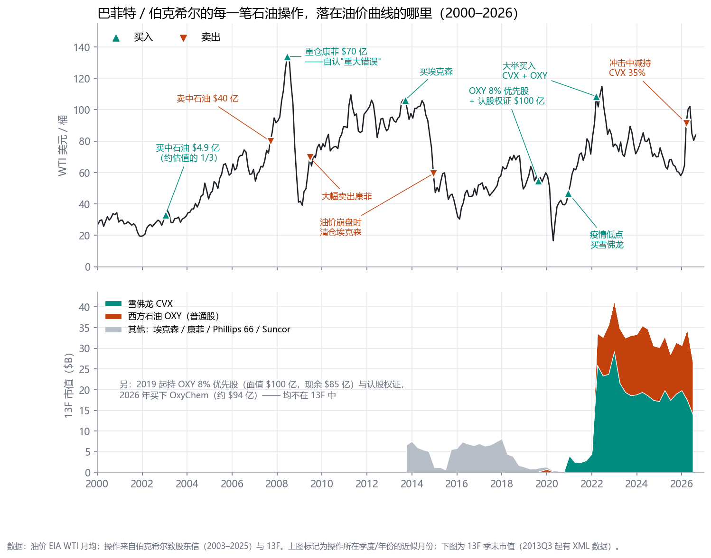
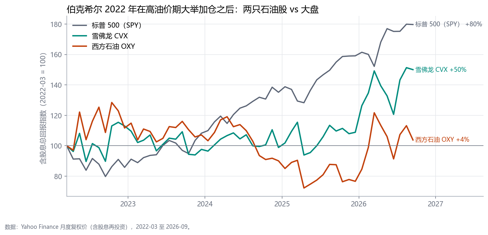
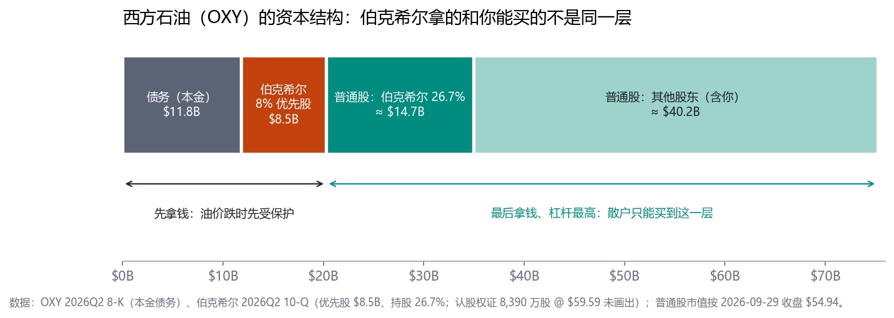
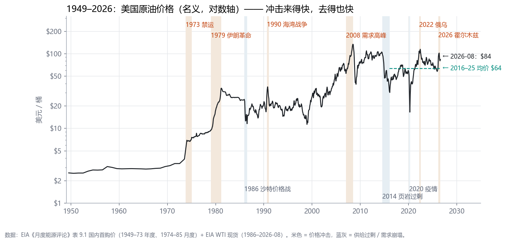
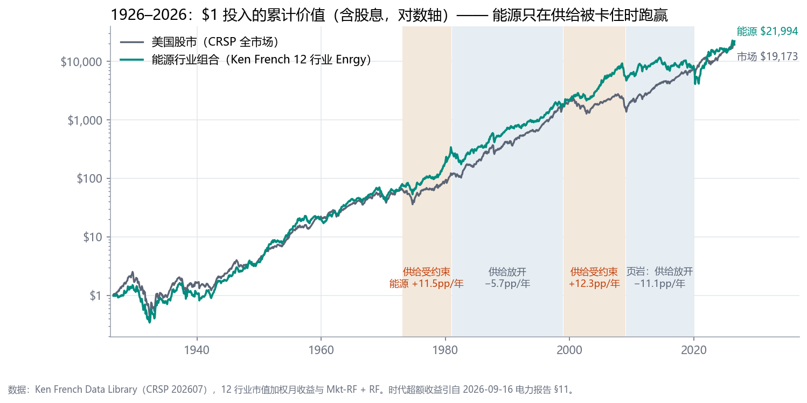
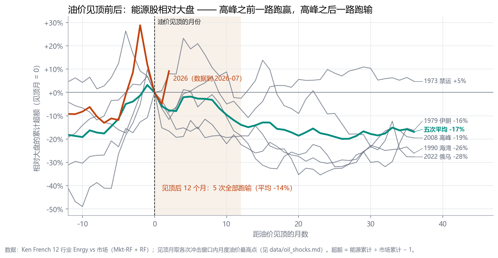
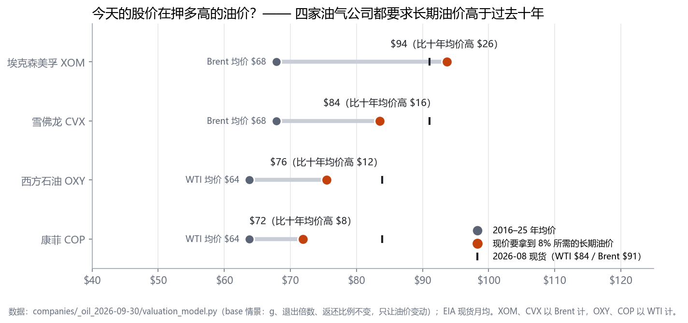

# 巴菲特与石油投资 —— 他怎么做、错在哪、今天该怎么用

**日期** 2026-09-30（2026-10-01 加图）· **性质**：长线投资学习专题（新研究方向）· 配套公司批次：`companies/_oil_2026-09-30/`（XOM / CVX / OXY / COP / KMI）
**证据**：巴菲特部分来自伯克希尔致股东信原文（2002–2025，`raw/letters/`）与 SEC 13F / 10-Q；油价来自 EIA；行业收益来自 Fama-French（CRSP）。信件内容以转述为主。
所有图和数字可用 `scripts/` 重跑（图：`scripts/make_figures.py`）。

---

## 0. 一句话

> **巴菲特在石油上赚大钱的两次，靠的是"买入价远低于正常化价值"或"用结构保护下行"；亏大钱的那次，是在油价顶部按顶部的预期买入。**
> **今天（霍尔木兹冲击之后），四家美国油气公司的股价都要求长期油价高于过去十年均价 —— 正是他 2008 年犯错时的局面。**
> **现在该做的是：列好名单、算好买入价、等。**

---

## 1. 他每一笔石油操作，落在油价曲线的哪里

**怎么读这张图**（青绿▲ = 买，橙▼ = 卖）：
- **赚大钱的**：2003 年在油价 $30 附近买中石油（买入价约为他估值的 1/3），2007 年价格追上价值时卖出，$4.9 亿变 $40 亿。
- **亏大钱的**：2008 年在 $134 的顶部重仓康菲 $70 亿，他自己在信里称之为"重大的主动犯错"，年底市值只剩 $44 亿。
- **全身而退的**：2014 年油价崩盘时清仓埃克森；2026 年霍尔木兹冲击中减持雪佛龙 35%。
- **低点出手的**：2020 年疫情低点买雪佛龙。
- **例外**：2022 年在 $100+ 的高油价期大举买入 CVX 和 OXY —— 结果见下图。

2022 年 3 月底到 2026 年 9 月底，含股息总回报：**标普 500 +80%，雪佛龙 +50%，OXY +4%**。
**高油价期买入的普通股，四年多大幅跑输大盘。** 这和 2008 年康菲的教训是同一件事，只是程度轻一些。

---

## 2. 从他的记录里提炼出的五条规律

### 规律 1：决定成败的是"买入价 vs 正常化价值"，不是对油价方向的判断
中石油是按价值约 37% 的价格买的；卖出是因为**价格追上了价值**，不是因为看空油价。
康菲则相反：2008 年他其实**看对了长期方向**（信里仍认为油价未来会远高于当时的 $40–50），但买入价已经包含了顶部油价，于是方向对了也亏钱。

### 规律 2：他不预测油价
2023 年信里他写道，没人知道油价在下一个月、一年或十年会怎样。他押的是**资产和经营者**（OXY 的美国资源、Hollub 采油的本事），不是油价。
注意，要和规律 1 一起读：**不预测油价，所以更不能在油价顶部付顶部的价格。**

### 规律 3：结构比标的更重要

同一家 OXY，伯克希尔拿到的是四种东西：**8% 优先股**（排在普通股前面，油价跌时先拿钱）、**认股权证 @ $59.59**（只在涨时有价值）、**普通股 26.7%**、以及全资买下的**化工业务 OxyChem**。
**散户只能买到图中最右边那一层。**"巴菲特持有 OXY"不等于"你买 OXY 就和他一样"。

### 规律 4：实际节奏是"低点买、冲击中卖"（2022 年是例外）
见第 1 节的图：2014 崩盘前后卖埃克森、2020 低点买雪佛龙、2026 冲击中减持雪佛龙。

### 规律 5：最终偏好"拥有整门生意"，而不是交易油价
买下 OxyChem；通过 BHE 直接拥有天然气管道（`unsourced_background`）；对 OXY "无限期持有、不控制"。
这和仓库 2026-09-16 电力报告 §11 的结论一致：**洛克菲勒不钻油，他控制炼油和管道这个瓶颈。**

---

## 3. 百年油价：冲击来得快，去得也快

米色带是历次价格冲击，蓝灰带是供给过剩。大多数冲击从开始到见顶只用 2–26 个月，**之后一年内油价普遍回落 18–48%**（1973 是例外）。
今天的 WTI 约 $84，仍明显高于 2016–2025 年均价 $64。

把 1926 年以来的能源股和大盘放在一起：**能源股只在供给被卡住的两段跑赢**（1973–80 OPEC、1999–2008 中国需求），
供给一放开（1981–98、2009–19 页岩）就每年跑输 6–11 个百分点。一百年下来终值相差不大（能源约 $2.2 万、市场约 $1.9 万）—— **超额收益全部来自那两段被卡住的供给。**

**这是对"现在要不要买"最直接的一张图。** 以每次油价见顶的月份为 0 点：
- **见顶之前**，能源股一路跑赢大盘；
- **见顶之后 12 个月，5 次全部跑输**（平均 −14%），36 个月后平均 −17%；唯一例外是 1973（+5%），那次高油价延续了十年。
- **2026 年**（橙线）：能源股在油价见顶前两个月（2026-03）就先见顶了，此后到油价见顶（2026-05）相对大盘回落约 22%；见顶后两个月又反弹约 9%（数据只到 2026-07），后面还在发生。

**所以 2026 年的核心问题是：这次像 1973（持续多年），还是像 1990 / 2022（几个月）？**
截至 2026-09 末：霍尔木兹通行量已接近战前水平（Kpler，secondary），沙特出口回到 2025 年月均水平，但停火未达成、美国对伊朗的海上封锁仍在。**更像 1990 / 2022，但尚未结束。**

---

## 4. 今天的股价在押多高的油价

对每家公司按"周期中间价"（WTI $65 / Brent $70）算所有者收益，再反解**"要让今天的股价拿到 8% 的 10 年回报，长期油价得是多少"**（橙点），和过去十年均价（灰点）、2026-08 现货（黑色短竖线）对比：

- **四家都要求长期油价高于十年均价**：埃克森要高 $26（Brent $94，甚至高于现货），雪佛龙高 $16，OXY 高 $12，康菲高 $8。
- 也就是说，**现在买入是在押"霍尔木兹之后，油价会停在比过去十年更高的新平台"**——押 1973 型，而不是 1990 / 2022 型。巴菲特 2008 年买康菲押的就是这件事。
- **唯一贴近买入线的是管道公司 KMI**（差约 4%）：它不赌油价，收过路费；风险在杠杆（2016 年股息砍了 69%，至今没恢复到 2014 年水平）。

---

## 5. 一张石油股检查清单（把巴菲特的方法翻译成可执行的问题）

| # | 问题 | 出处 | 本批怎么用 |
|---|---|---|---|
| 1 | **用周期中间价算所有者收益，不用当年盈利** | 康菲 2008 | base = 近十年均价；两个锚互相校验 |
| 2 | **现价要求的长期油价，是否高于十年均价？** | 图 6 | 高于 → 不买，等 |
| 3 | **你买的是资本结构里哪一层？** | 图 7 | OXY 普通股前面有 $203 亿优先索取权 |
| 4 | **公司在回购还是在发股票？** | 本库 09-01 / 09-28 两批 | CVX 用股票买 Hess（+14.5%）；COP 回购（−3.6%） |
| 5 | **油价跌 30% 时会不会被迫砍股息 / 增发？** | KMI 2015 | KMI 3.6x、OXY 债务 + 优先股 |
| 6 | **是在冲击中买，还是在冲击后的谷底买？** | 图 3 | 现在：冲击后回落期，尚非谷底 |
| 7 | **押的是资产和人，还是油价？** | 规律 2 | OXY：Hollub 已于 2026-06 退休 |
| 8 | **持有载体对我的税务身份友好吗？** | AB 卡 | 只选普通股公司，避开 EPD / ET 等合伙企业（非居民预扣 37%） |

---

## 6. 观察名单（等价格，不等故事）

| 名字 | 8% 买入价 | 现价 | 触发条件 |
|---|---:|---:|---|
| **KMI** | **$29.19** | $30.45 | 到价 + 净债务 / EBITDA ≤ 4x → 派独立 Checker 审 STARTER |
| COP | $97.75 | $125.44 | 到价；或 Willow 首油确认 2029 年初 |
| CVX | $142.09 | $204.38 | 到价（约是伯克希尔 2022 年加仓价） |
| XOM | $92.94 | $161.35 | 到价 |
| OXY | $29.08 | $54.94 | 到价；或本金债务 ≤ $10B 并开始赎回优先股 |

**什么情况下要重算**：长期油价共识（远期曲线 3–5 年段）站稳 WTI $75 以上 —— 说明市场开始接受"1973 型新平台"，那时 base 情景本身要改。下一个检查点：10 月中下旬 Q3 财报、约 11-14 伯克希尔 Q3 13F。

---

## 7. 局限（请当真）

1. **样本很小**：巴菲特约 10 笔石油投资；油价冲击 6 次正向、3 次负向。能看出方向，给不出概率。
2. **名义价格**：未做通胀调整，1970 年代的倍数被放大。
3. **能源股 ≠ 这五家公司**：Fama-French "Enrgy" 是整个行业的市值加权组合。
4. **估值是判断**：周期中间价、管理层计划给几成信用、退出倍数，换一个人会给出不同数字。**能确定的是方向**：四家生产商的现价都隐含高于十年均价的油价。
5. **部分事实为二手或背景常识**：CVX 敏感度、各家 2029–30 年目标、BHE 管道、霍尔木兹现状、图 4 中操作所在的月份（按季度 / 年份近似），均已标注。
6. **Checker ≠ Runner 未满足**：本批无卡提议 STARTER，未派独立 Checker；KMI 到价时需补。

---

## 附录 A：伯克希尔石油操作逐笔明细（2002–2026）

| 时间 | 标的 | 做了什么 | 结果 | 出处 |
|---|---|---|---|---|
| 2002–03 → 2007 | 中石油（H 股） | $4.88 亿买 1.3%，隐含公司价值约 $370 亿；他估约 $1,000 亿 | 市值升至约 $2,750 亿后全部卖出得 $40 亿，交税 $12 亿 | 2003–07 年信 |
| 2006 → 2014 | 康菲 COP | 2008 年加到 8,490 万股，成本 $70.1 亿 | 2008 年末市值 $44.0 亿；"重大的主动犯错"；2009 年大幅卖出，2014 年清仓 | 2008–12 年信、13F |
| 2013 → 2014 | 埃克森 XOM | 约 4,000 万股（年末成本 $37.4 亿） | 2014Q4 清仓，大致持平 | 2013 年信、13F |
| 2012 → 2019 | Phillips 66 | 康菲分拆所得；2014 年部分换成运营业务；2015–17 建到 8,069 万股 | 2018–19 年卖出 | 2014 年信、13F |
| 2019 | OXY 优先股 + 认股权证 | $100 亿，8% 年息，为收购 Anadarko 融资 | 现余 $85 亿，2029 起可按 105% 赎回；认股权证 8,390 万股 @ $59.59 | 2019 年信、10-Q |
| 2020Q4 | 雪佛龙 CVX | 4,850 万股，成本 $40.2 亿（约 $84） | — | 2020 年信、13F |
| 2022–2025 | CVX + OXY 普通股 | CVX 加到约 1.6 亿股；OXY 0 → 2.649 亿股（粗估成本约 $58） | 2022-03 → 2026-09 含息：CVX +50%、OXY +4%、SPY +80% | 13F、Yahoo |
| 2023 年信 | OXY | 打算无限期持有（27.8%），无意收购或经营；碳捕集经济性未证 | — | 2023 年信 |
| 2026Q1 | 雪佛龙 CVX | 冲击中卖出约 35%（约 $80 亿），季末价约 $207 | 剩 8,440 万股 | 13F、Bloomberg |
| 2026-01-02 | OxyChem | 约 $94 亿现金全资买下 | 伯克希尔运营子公司 | 2025 年信、10-Q |

## 附录 B：百年油价冲击对照表（`data/oil_shocks.md`）

| 冲击 | 起始 | 冲击前 → 极值油价 | 用时 | 极值后 12 月油价 | 极值后 12 月能源相对大盘 | 36 月 |
|---|---|---|---:|---:|---:|---:|
| 1973 阿拉伯禁运 | 1973-10 | $3.89 → $7.61 | 15 月 | +13% | −7% | +5% |
| 1979 伊朗革命 + 两伊战争 | 1979-01 | $9.47 → $34.59 | 26 月 | −18% | −19% | −16% |
| 1990 伊拉克入侵科威特 | 1990-08 | $18.45 → $36.04 | 2 月 | −36% | −19% | −26% |
| 2007–08 需求超级周期 | 2007-01 | $61.96 → $133.88 | 17 月 | −48% | −22% | −19% |
| 2022 俄乌战争 | 2022-03 | $91.64 → $114.84 | 3 月 | −39% | −2% | −28% |
| 2026 霍尔木兹断流 | 2026-03 | $64.51 → $102.13 | 2 月 | — | — | — |
| 1986 沙特价格战（谷） | 1986-01 | $24.51 → $11.59 | 6 月 | +84% | +30% | +21% |
| 2014 OPEC 不减产（谷） | 2014-07 | $105.79 → $30.32 | 19 月 | +76% | −0% | −19% |
| 2020 疫情 + 价格战（谷） | 2020-02 | $57.52 → $16.55 | 2 月 | +273% | −9% | +84% |

（名义价格；1986 年前为 EIA 国内首购价，之后为 WTI 现货；能源股 = Fama-French 12 行业 Enrgy；FF 数据截至 2026-07。）

## 附：文件与脚本

| 文件 | 内容 |
|---|---|
| `fig1`–`fig7` `*.png` ← `scripts/make_figures.py` | 本报告 7 张图（配色经 dataviz 校验脚本检查） |
| `巴菲特与石油投资_2026-09-30.pdf` ← `scripts/md_to_pdf.py`（仓库根目录） | 带图 PDF 版 |
| `scripts/fetch_letters.py` → `raw/letters/`、`data/letters_oil_hits.json` | 2002–2025 年致股东信原文与石油段落 |
| `scripts/fetch_brk_13f.py` → `data/brk_13f_oil.csv` | 伯克希尔 2013Q3–2026Q2 逐季石油持仓 |
| `scripts/fetch_oil_prices.py` → `data/eia_*` | EIA 油价 |
| `scripts/oil_shocks.py` → `data/oil_shocks.*` | 冲击对照表 |
| `data/yahoo_monthend_2022.json` | SPY / CVX / OXY 月末复权价（由日线取，截至 2026-09-29） |
| `companies/_oil_2026-09-30/` | 五家公司批次（估值模型、隐含油价、决策卡） |
