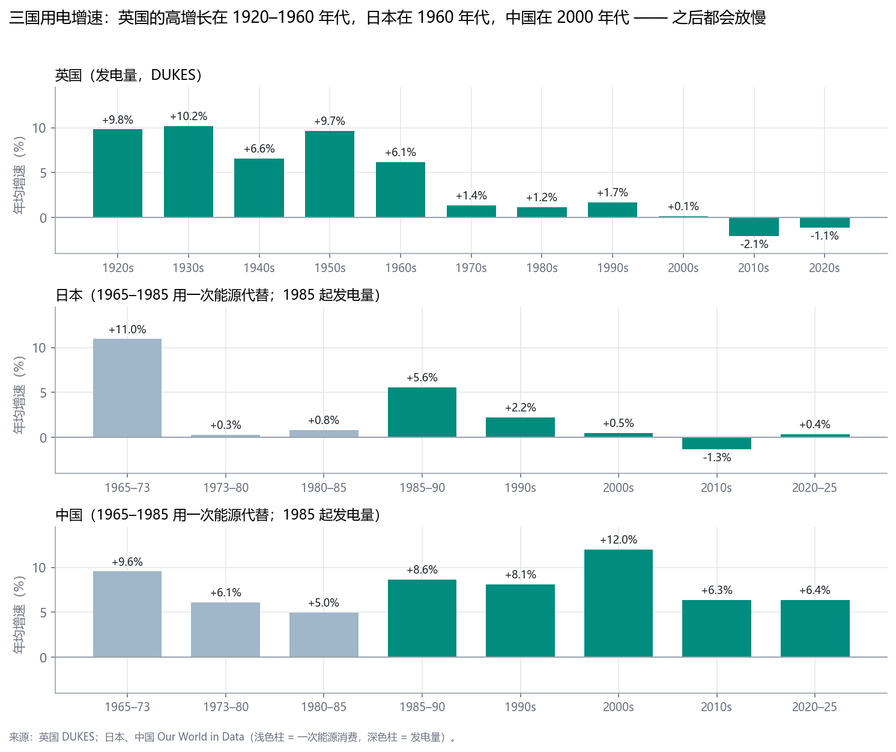
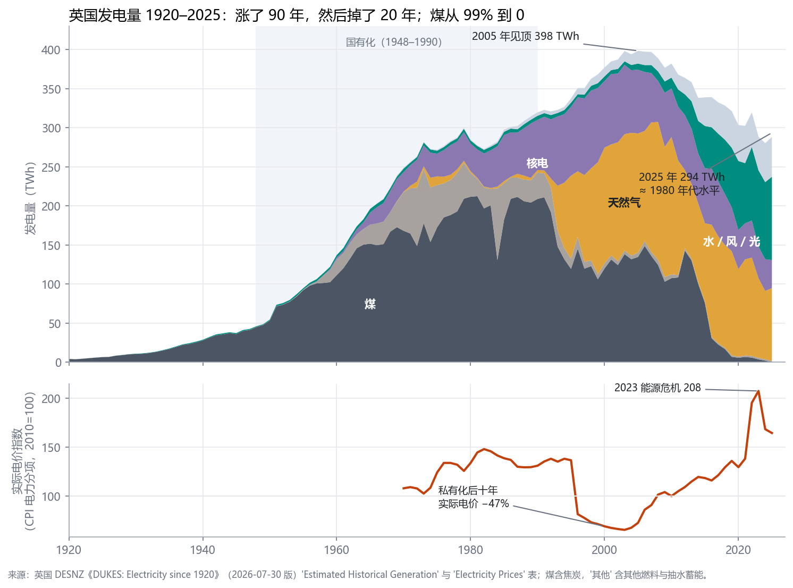
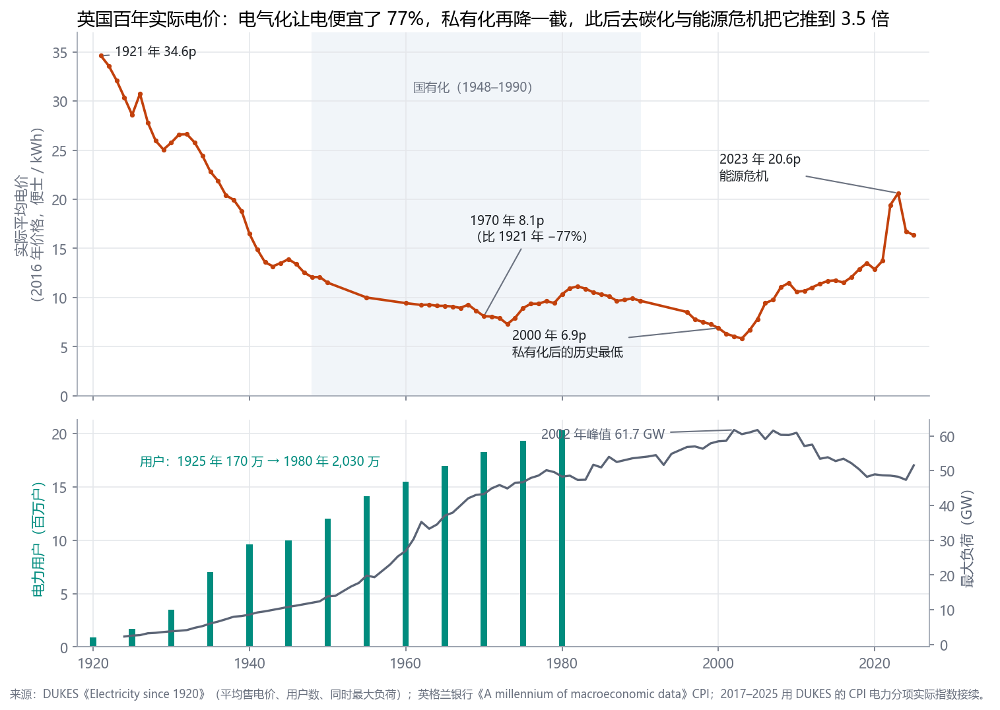
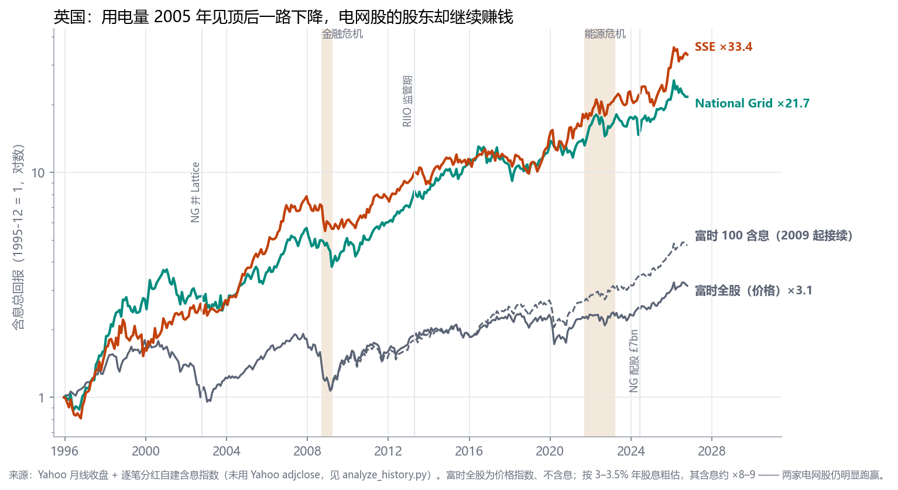
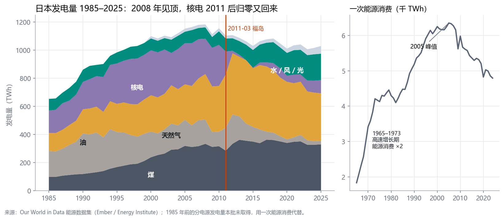
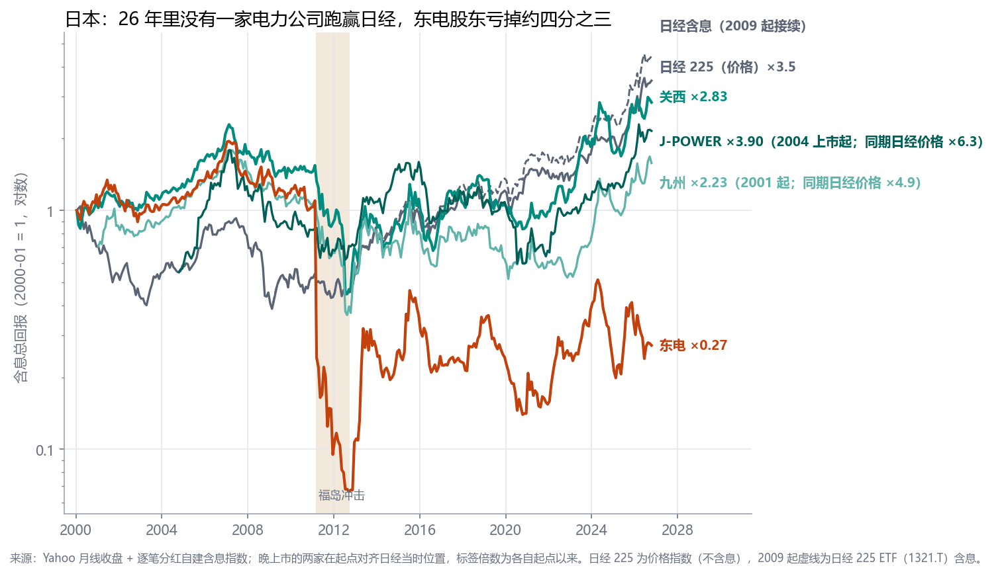
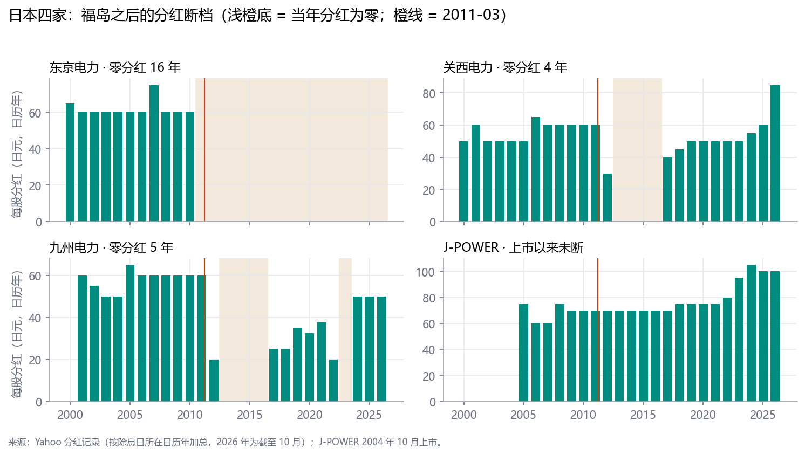
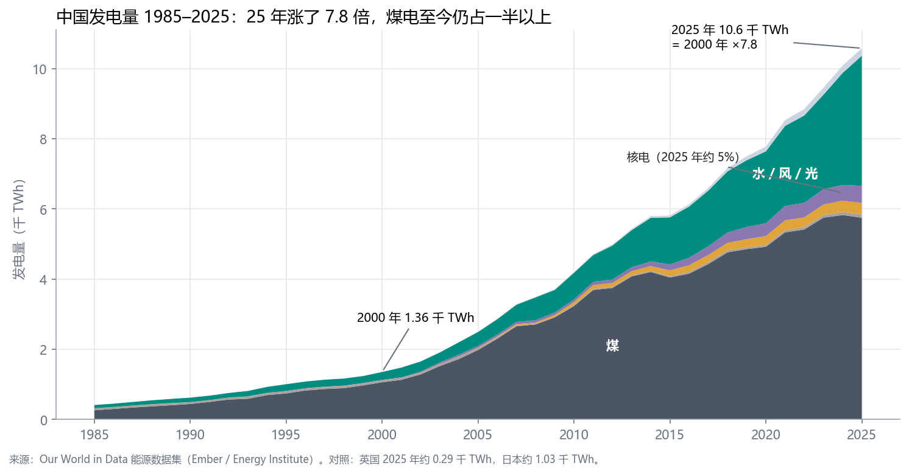
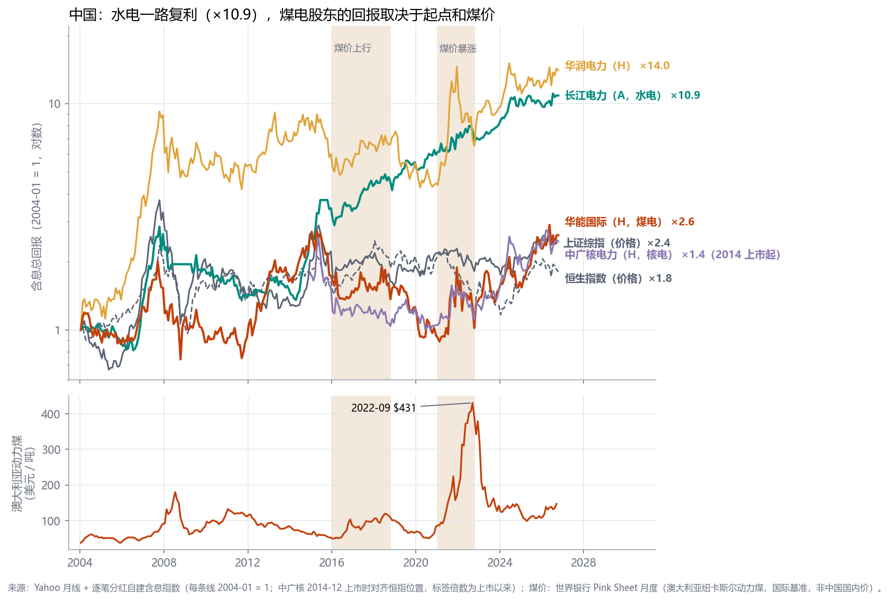
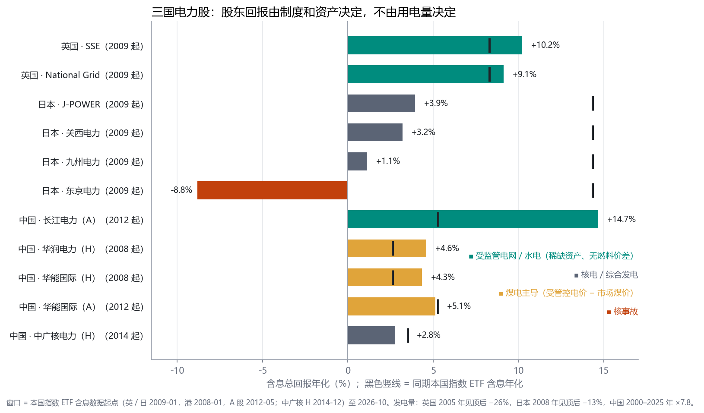

# 电力大国百年：英国、日本、中国

## —— 工业化、用电爆发、国家体制：电力公司的股东赚到钱了吗？

**日期**: 2026-10-03 · **性质**: 宏观 / 产业史研究（非个股卡）· **姊妹篇**: `studies/电力需求与电力公司盈利_百年实证_2026-09-16`（美国百年）
**触发问题**: "英国、日本、中国 —— 经历过工业革命、爆发过时代需求、有强势国家体制的大国。它们的电力史是怎么走的？每一次用电爆发，电力公司的股东赚到钱了吗？当时大众怎么想，后来怎么了？"

**一手数据**: 英国政府 DUKES《Electricity since 1920》（1920–2025 发电量、电价、用户数、最大负荷）· 英格兰银行《A millennium of macroeconomic data》（CPI、国债收益率）· Our World in Data 能源数据集（日本、中国，1965 / 1985 起）· 世界银行 Pink Sheet 煤价（1970 起）· Yahoo 月线 + 逐笔分红（自建含息）· 各公司一手财报（见附录 A）

> 标注"背景"的史实是公认史实，但本批没有用一手文件逐条核对；其余数字都来自本目录 `data/`。

---

## 0. 结论先行

> **三个国家的用电需求都兑现了，而且都兑现得很猛：英国 1920–1960 年代每十年增长 6–10%/年，日本 1965–1973 年能源消费 +11%/年，中国 2000 年代发电量 +12%/年。**
> **但电力公司的股东赚没赚到钱，和需求几乎没有关系。决定它的是三样东西：国家怎么定价（制度）、公司手里是什么资产（有没有燃料成本、会不会突然失效）、以及利率。**
> **电气化的价值，大部分流给了用户和国家，其次是上游燃料商；股东只有在"受监管资产 + 合理回报"或"零燃料成本的稀缺资产"这两种结构里，才稳定地拿到了一份。**
> **对在电力公司上班的人也一样：三国都有过"进电力 = 一辈子稳定 + 高于平均的收入"的年代，而每一次"高于平均"太显眼，就会招来政治回收（英国 1997 年暴利税、中国 2006 年垄断高薪整顿、日本东电事故后的降薪与诉讼）。稳定是真实的，超额是暂时的。**

### 六条硬结论（全部有数）

| 结论 | 证据 |
|---|---|
| **1. 需求最猛的年代，股东往往拿不到** | 英国 1926–1948 发电量 +8.9%/年，好处是实际电价 **−61%**，1948 年行业被国有化；中国 2000–2025 发电量 ×7.8，华能、华润股东 **2007-10 → 2020-12 含息亏掉约一半**（−44% / −52%） |
| **2. 需求下降的年代，股东反而赚** | 英国发电量 2005 年见顶后 **−26%**，National Grid 1995 年以来含息 **+10.5%/年**、SSE 1991 年以来 **+11.8%/年**，都跑赢富时 —— 因为电网按"资产 × 允许回报"收费，不按电量 |
| **3. 燃料价差型的电力公司，利润是燃料价格的镜像** | 中国煤价回升期（2015-06 → 2020-12）华能 H **−64%**、华润 −48%，同期水电长江电力 **+59%**；2022 年煤价峰值 $431/吨之后，煤电股 2020-12 → 2026-09 又 +176% / +221% |
| **4. 核电是"运行时最好、出事时最差"的资产，尾部风险分散不掉** | 关西电力（全部重启）2020-12 → 2026-10 含息 **+231%**；东京电力（事故方）含息最大回撤 **−97%**，**连续 16 个日历年零分红**，国家取得 67.5% 的完全摊薄股权 |
| **6. 进电力公司的人，和买电力股的人，走的是同一条路** | 制度保护期，电力是公认的好饭碗：日本"电气·燃气"至今是工资最高的行业（2025 年月薪 44.4 万日元），中国电力业 2010 年平均工资是全国的 **1.30 倍**。保护一变，员工先受冲击：东电 2011 年**降薪 20–25%**、依願退職**例年的 3 倍**；英国私有化后**劳动生产率六年翻倍**（同样的电用更少的人）；中国电网 2006 年"垄断高薪"成众矢之的，**工资总额冻结** |
| **5. 利率是被低估的那只手** | 英国电网股最好的 1995–2007 年（NG 含息 **+466%**），10 年国债收益率从 **8.2% 降到 4.9%**；日本电力股 2000–2011 年在日经 **−46%** 时含息 **+10% 到 +56%** —— 债券替代品属性，不是需求 |

### 三国 × 时代总表

| 国家 · 时代 | 用电增速 | 主流叙事 | 制度 | 谁拿走了价值 | 电力股东 |
|---|---:|---|---|---|---|
| 英国 1882–1926 | +8.5%/年（1920–26） | "电是城市的事" | 私营 + 市政割据 | — | 小而分散（背景） |
| 英国 1926–1948 | **+8.9%/年** | "国家电网" | 中央电力局建网 | **用户：实际电价 −61%** | 1948 年被国有化 |
| 英国 1948–1990 | +4.7%/年 | "电是公共服务" | 国有（CEGB） | 用户 + 纳税人承担 | **没有上市股东** |
| 英国 1990–2005 | +1.5%/年 | "私有化 + 市场纪律" | 私有化、独立监管 | 用户（−40%）**和**股东 | **NG +466%（1995–2007）** |
| 英国 2005–2026 | **−1.5%/年** | "净零 + 电网是瓶颈" | RIIO 受监管资产 | 电网股东；用户电价 ×3.5 | NG +10.5%/年（全期） |
| 日本 1951–1973 | 能源 **+11%/年** | "电力不足是增长瓶颈" | 九电力区域一体化垄断 | 工业用户 | 稳定（背景，无数据） |
| 日本 1973–1990 | +0.3–1.9%/年 | "原子力 = 准国产能源" | 同上 + 核电国策 | — | 泡沫期被推高（背景） |
| 日本 1990–2011 | +2.2% → +0.5%/年 | "孤儿寡妇股" | 分阶段自由化 | 股东：稳定分红 | **日经 −46% 时 +10–56%** |
| 日本 2011–2015 | 下降 | "安全神话崩溃" | 国家接管东电 | 国家、燃料出口国 | **东电 −93%**，三家零分红 |
| 日本 2015–2026 | −0.4% → +0.4%/年 | "重启 + GX + 数据中心" | 全面自由化 | 重启方的股东 | 关西 +231%，东电 +93% |
| 中国 1978–2002 | +8%/年 | "电荒：谁建电厂谁赚钱" | 集资办电、国家电力公司 | 早期投资者 | 华能 H 2000–2007 ×15.7 |
| 中国 2002–2008 | **+12%/年** | "五大发电跑马圈地" | 厂网分开 | 股东（牛市） | 华润 2005–2007 **+703%** |
| 中国 2008–2015 | +7.5%/年 | "煤电顶牛" | 煤电联动（滞后） | 煤炭企业 | 煤电股横盘 |
| 中国 2015–2020 | +6.0%/年 | "供给侧改革 + 新电改" | 市场化交易 | **煤炭企业** | **华能 H −64%**，长江 +59% |
| 中国 2020–2026 | +6.4%/年 | "能源安全 + 双碳 + 红利" | 容量电价、新能源市场化 | 水电股东；煤价回落后的煤电 | 华润 +221%，长江 +83% |

---

## 1. 方法与数据

| 数据 | 来源 | 范围 | 用途 |
|---|---|---|---|
| 英国发电量（分燃料）、平均售电价、用户数、最大负荷 | 英国 DESNZ《DUKES: Electricity since 1920》（2026-07-30 版） | 1920–2025 | 英国需求史、电价史 |
| 英国 CPI、Bank Rate、10 年期国债收益率 | 英格兰银行《A millennium of macroeconomic data》 | 1900–2016 | 实际电价、利率 |
| 日本 / 中国发电量与电源结构、一次能源消费 | Our World in Data（Ember / Energy Institute） | 发电 1985–2025，一次能源 1965–2024 | 日中需求史 |
| 动力煤价格 | 世界银行 Pink Sheet（澳大利亚纽卡斯尔） | 1970-01 → 2026-09 | 中国煤电周期 |
| 股价与分红 | Yahoo 月线收盘 + 逐笔分红，**自建含息指数** | 英 1991 / 1995 起，日 2000 起，中 2000 / 2003 起 | 股东回报 |
| 大盘对照 | 日经 225、富时全股、上证综指、恒指（价格）+ 指数 ETF（含息） | 见各图 | 对照 |
| 民间视角（舆论、就业、收入） | 国家统计局、厚生劳动省、英国议会记录、YouGov、朝日新闻调查，以及日经、钻石周刊、新华社、界面等当时报道 | 1925–2025 | 附录 C 逐条列出，均已打开原页核对 |

**局限（诚实列出）**：
- **英国 1948–1990 没有上市电力股**（国有化），日本电力股的可得数据从 2000 年开始，中国从 2000 / 2003 年开始。因此"高增长年代的股东回报"只能部分用数据、部分用背景叙述
- 日本 1985 年前的分电源发电量本批未取得（日本政府网站拒绝脚本下载，按规定不绕过），用一次能源代替
- 时代切分按"主流叙事切换点"而不是按股价拐点切，以避免事后拟合
- 本批修掉了三个会改变结论的数据坑：Yahoo 复权价对英股几乎不含分红（改为自建含息）；Yahoo 月线日期早一个月（东电 2011 年 3 月的暴跌原被标成 2 月）；九州电力 2026 年 9 月已退市换股（见附录 A）

---

# 第一部分：英国 —— 发明电网的国家（1882–2026）

## 2. 英国

### 2.1 需求史：涨了 90 年，掉了 20 年

| 期间 | 发电量年均增速 | 发生了什么 |
|---|---:|---|
| 1920s | **+9.8%** | 电灯、电车、工厂电动机 |
| 1930s | **+10.2%** | 国家电网建成；家庭电气化（用户 1930 年 350 万 → 1940 年 960 万） |
| 1940s | +6.6% | 战时工业 |
| 1950s | **+9.7%** | 战后重建、家电普及 |
| 1960s | +6.1% | 电暖、电视；核电站开始并网 |
| 1970s | +1.4% | 石油危机；去工业化开始 |
| 1980s | +1.2% | 煤矿大罢工（1984–85，背景）；服务业化 |
| 1990s | +1.7% | 私有化、"冲向天然气" |
| 2000s | +0.1% | **2005 年见顶 398 TWh** |
| 2010s | **−2.1%** | 能效、LED、制造业外移 |
| 2020–25 | −1.1% | 2025 年 294 TWh ≈ 1980 年代水平 |

**发电量 1920 年 4.3 TWh → 2005 年 398 TWh，85 年涨了 92 倍；然后 20 年掉了 26%。** 最大负荷 2002 年见顶 61.7 GW，2023 年只有 48.3 GW。

### 2.2 电价史：百年实际电价的三段

| 期间 | 实际电价（2016 年价格，便士 / kWh） | 同期需求 |
|---|---|---:|
| 1921 → 1970 | **34.6 → 8.1（−77%）** | 发电量 ×64 |
| 1970 → 1990 | 8.1 → 9.7（+20%，石油危机） | +1.3%/年 |
| 1990 → 2003 | **9.7 → 5.8（−40%，私有化后历史最低）** | +1.7%/年 |
| 2003 → 2023 | **5.8 → 20.6（×3.5）** | −1.5%/年 |
| 2025 | 16.3 | — |

**这是英国电力史最核心的一条规律：电价不是需求定的。** 需求最猛的 50 年，实际电价跌了 77% —— 规模经济、更大的机组、国家电网的联网效率，好处全部给了用户。需求在下降的 20 年，实际电价涨到 3.5 倍 —— 因为燃料（天然气）价格、碳成本，以及要靠电价回收的电网与可再生能源投资。**和美国一样（姊妹篇 §3.3）：电价是"资本开支 + 燃料"定的，不是需求定的。**

### 2.3 发电结构的四次换血

| 年 | 煤 | 天然气 | 核电 | 水 / 风 / 光 |
|---|---:|---:|---:|---:|
| 1920 | **99%** | 0 | 0 | 0 |
| 1948 | 98% | 0 | 0 | 2% |
| 1970 | 68% | 0 | 10% | 2% |
| 1990 | 65% | 1% | 20% | 2% |
| 2000 | 32% | **39%** | 23% | 2% |
| 2020 | 2% | 36% | 16% | 28% |
| 2025 | **0%** | 32% | 12% | **36%** |

煤 → 油 / 核（1960–70 年代）→ 天然气（1990 年代）→ 风电（2010 年代）。**每一次换血都伴随一次资本毁灭或转移**：国有化时期的核电由纳税人承担；1990 年代的"冲向天然气"让煤矿和煤电站提前退场；2010 年代的煤电站全部关闭（最后一座 Ratcliffe-on-Soar B 于 2024 年关闭，DUKES 电站清单）。

### 2.4 股东史：前半个世纪没有股东，后三十年股东赢了

| 窗口 | National Grid 含息 | SSE 含息 | 富时全股价格 | 10 年国债收益率 |
|---|---:|---:|---:|---|
| 1995-12 → 2007-12（私有化红利期） | **+466%** | **+683%** | +82% | 8.2% → 4.9% |
| 2007-12 → 2019-12（低利率 + RIIO） | +129% | +83% | +28% | 4.9% → 1.3%（2016） |
| 2019-12 → 2026-10（能源危机 + 电网扩张） | +67% | +134% | +35% | 回升（背景） |
| **全期年化** | **+10.5%/年（1995 起）** | **+11.8%/年（1991 起）** | 价格 ×3.1（1995 起） | — |

**1948–1990 年英国没有上市电力股**：1948 年国有化时，私营电力公司的股东换成了政府债券（背景）。这意味着英国电力需求增长最快的半个世纪（1920–1970），**股权投资者的位置要么是被国有化，要么根本不存在**。

### 2.5 思潮史：五个时代，大众信什么，后来怎么了

**① 1882–1926："电是城市的事"**
- **信念**：电像煤气和自来水，是地方事务。1882 年《电灯法》允许地方政府在一定年限后收购私营电力公司（背景）。
- **结果**：私营资本不愿长期投资，全国上百家小电站、不同电压和频率（背景）。1920 年英国发电量只有 4.3 TWh。
- **转折**：1926 年《电力（供应）法》设立中央电力局（CEB），建设全国 132kV 电网（背景）。**英国第一次证明了"联网"本身就是最大的效率来源**：装机 1926 年 4.7 GW → 1938 年 9.4 GW（DUKES）。

**② 1926–1948："国家电网"**
- **信念**：标准化、联网、大机组。
- **数据**：发电量 +8.9%/年，用户从 1925 年 170 万增长到 1945 年 1,000 万（DUKES），实际电价 −61%。
- **结局**：**需求和效率都兑现了，价值流向用户**；1948 年整个行业被国有化（背景）。

**③ 1948–1990："电是公共服务"，以及核电乌托邦**
- **信念**：国有化带来规模经济；1956 年 Calder Hall 成为世界第一座商业规模核电站（DUKES 电站清单，运行到 2003 年）。
- **数据**：1950s 需求 +9.7%/年、1960s +6.1%/年，实际电价 1970 年降到 8.1p（低点）。
- **结局**：1970 年代石油危机后需求增速掉到 1.4%/年，核电建设拖期超支、煤矿与政府对抗（背景）。**风险全部由纳税人和用户承担 —— 没有股东可以亏钱，也没有股东可以赚钱。**

**④ 1990–2005："私有化 + 市场纪律"**
- **信念**：竞争和监管激励会压低成本。
- **数据**：天然气发电占比 1990 年 1% → 2000 年 39%；实际电价 −40%（到 2003 年）；NG 1995–2007 含息 +466%、SSE +683%。
- **结局**：**这是三国百年里唯一一次"用户和股东同时赢"的时代** —— 但它同时也是国债收益率从 8.2% 降到 4.9% 的时代。1997 年政府对私有化公用事业征收一次性"暴利税"（背景）：**政治在回收超额利润**，和美国 1935、1978、2001 年同一个方向。

**⑤ 2005–2026："净零 + 电网是瓶颈"**
- **信念**：去碳化需要把电网扩建一倍以上。
- **数据**：发电量 −26%，煤电 34% → 0%，风光水 2% → 36%；实际电价 ×3.5；2022–2023 年能源危机（零售商大面积倒闭，背景）。NG 2025/26 年受监管资产 £66.4B（+12%），未来五年至少再投 £70B（NG 6-K）。
- **结局（至今）**：**需求下降，电网股东照样赚钱** —— 但要不断掏钱：NG 2024 年配股 £6.84B；SSE 为投资计划两次砍股息（FY2019/20 97.5p → 80p，FY2023/24 96.7p → 60p，Yahoo 分红记录）。

### 2.6 英国的盈利机制：受监管资产模型

> **电网利润 ≈ 受监管资产（RAV）× 允许回报 + 折旧 + 运营成本补偿**

RIIO-T3（2026 起）给英国输电的允许股本回报是 **5.70%（CPIH 之上的实际回报，55% 杠杆）**，高于上一期的 4.25–5.20%（NG 20-F）。**这个公式里没有"用电量"。** 所以英国给出的答案和美国一样：**受监管电网的股票是"允许回报 × 资产增长"的年金，买它是买监管和利率，不是买需求。**

### 2.7 民间视角：在电力公司上班、买电力股、交电费的人怎么想

| 年代 | 当时的主流看法 | 求职 / 收入 | 结局：他们得到想要的了吗 |
|---|---|---|---|
| 1920 年代 | 政府的韦尔委员会（1925）批评行业"大量开支没有用在最合适的地方，不仅浪费，还在给快速而高效的发展制造障碍" | 电是城市里少数人的东西：用户 1920 年仅 90 万户 | 用户 1920 → 1940 年增长约 10 倍，实际电价同期大跌，**好处给了用户** |
| 1948–1990 | 国有电力是工程师主导的公共机构（高层多为专业工程师） | 铁饭碗：CEGB 员工 1972 年 65,410 人、1982 年 55,487 人；全行业 1989 年 **131,178 人** | 稳定了 40 年；私有化后这份稳定结束 |
| 1990 私有化 | **全民热情**：12 家地区电力公司上市认购约 **10 倍**，超过 **500 万人**递交 1,275 万份申请，四分之一的申请只买 100 股 | 员工获赠免费股 + 配送股，**98%** 的合格员工参与，约 8.4 万名员工和 2.1 万名退休员工拿到了股票 | 小股东：之后十余年电力股大幅跑赢大盘（NG、SSE 见 §2.4）；员工：**劳动生产率六年翻倍** —— 同样的电，用了少得多的人（Newbery & Pollitt） |
| 1994–1997 | 舆论转向"肥猫"（fat cats）：私有化公用事业高管的薪酬与期权引发公愤（背景） | — | 1997 年工党政府对私有化公用事业征收 **£52 亿**一次性暴利税，理由是"当初卖得太便宜、早期监管太松"（下院图书馆） |
| 2021–2024 | 账单大涨后，公众对能源公司的满意度下降（YouGov 的解读） | — | 2021-07 → 2022-05 **29 家**售电商倒闭，波及约 **400 万户**，其中 Bulb（150 万户）进入特别管理；支持把能源公司收归国有的比例从 2017 年的 **53%** 升到 2024 年的 **71%**（YouGov） |

**英国的读法**：1990 年的"全民持股"是三国里唯一一次**普通人、员工和电网股东同时得利**的时刻 —— 但它也是一次财富转移：员工人数大幅减少，后来的用户在 2003–2023 年承受了 3.5 倍的实际电价。民意的钟摆从"私有化万岁"（1990 年超额认购 10 倍）摆到"收归国有"（2024 年 71% 支持），用了三十年。

---

# 第二部分：日本 —— 九电力体制与福岛（1951–2026）

## 3. 日本

### 3.1 需求史：先于福岛见顶

| 期间 | 年均增速 | 发生了什么 |
|---|---:|---|
| 1965–1973 | **+11.0%**（一次能源） | 高速增长：重化工业、家电三神器（背景） |
| 1973–1980 | +0.3%（一次能源） | 两次石油危机 |
| 1980–1990 | +1.9%（一次能源）；1985–90 发电 **+5.6%** | 泡沫经济 |
| 1990s | 发电 +2.2% | 泡沫破裂后的低增长 |
| 2000s | 发电 +0.5% | **2008 年见顶 1,184 TWh** |
| 2010s | 发电 −1.3% | 福岛、节电 |
| 2020–25 | 发电 +0.4% | 2025 年 1,030 TWh（较峰值 −13%） |

**日本的用电爆发集中在 1950–1973 年。** 此后五十年，增长一次比一次慢，**在福岛之前（2008 年）就已经见顶**。

### 3.2 结构：核电从 0 到 29% 到 0 再到 9%

| 年 | 煤 | 天然气 | 核电 | 水 / 风 / 光 |
|---|---:|---:|---:|---:|
| 1985 | 15% | 19% | **24%** | 12% |
| 2000 | 22% | 24% | **29%** | 8% |
| 2010 | 27% | 28% | 25% | 8% |
| 2014 | 33% | 42% | **0%** | 10% |
| 2025 | 32% | 33% | 9% | 18% |

1973 年石油危机之后，核电被定为"准国产能源"（背景），占比在 2000 年达到 29%。**2011 年之后三年归零**，缺口由进口 LNG 和煤补上 —— 日本的燃料进口账单与电价随之上升。

### 3.3 股东史：26 年里没有一家跑赢日经

| 窗口 | 东京电力 | 关西电力 | 九州电力 | J-POWER | 日经 225（价格） |
|---|---:|---:|---:|---:|---:|
| 2000 → 2011-02（福岛前） | +10% | +54% | +56% | +52%（2004 起） | **−46%** |
| 2011-02 → 2012-06（福岛冲击） | **−93%** | −53% | −47% | −15% | −15% |
| 2012-06 → 2020-12（停堆与重启） | +77% | +17% | +4% | −15% | +205% |
| 2020-12 → 2026-10（燃料危机后复苏） | +93% | **+231%** | +160% | **+255%** | +149% |
| **全期含息** | **×0.27（−4.8%/年）** | ×2.83（+4.0%/年） | ×2.23（+3.2%/年） | ×3.90（+6.4%/年） | 价格 ×3.5 |

### 3.4 思潮史：六个时代

**① 1951："民营、区域、一体化"**
- **设计**：战后"电力再编成"把全国按区域拆成九家发、输、配、售一体化的民营公司（九州电力 1951-05-01 设立，福证公告），电价按"总括原价"方式定（成本 + 合理回报，背景）。
- **含义**：**股东拿的是被监管者认可的回报，风险是"成本能不能转嫁"。** 这个设计在接下来的 60 年运行良好 —— 直到资产突然失效的那一天。

**② 1955–1973："电力不足是增长瓶颈"**
- **数据**：一次能源 1965–1973 年 +11.0%/年。大坝（黑部第四水电站 1963 年，背景）和大型燃油电站。
- **结局**：需求和建设都兑现了；**1973 年石油危机让燃油电站的燃料成本一夜暴涨**，成本转嫁滞后，电力公司第一次体会到"受监管电价 + 进口燃料"的组合风险（背景）。

**③ 1974–1990："原子力 = 准国产能源"**
- **信念**：没有资源的国家，核电是能源安全的答案（1974 年"电源三法"，背景）。
- **数据**：核电占比 1985 年 24%；日经 225 从 1985-01 的 11,992 涨到 1989-12 的 **38,916**，电力股在泡沫中同样被推高（背景）。
- **结局**：泡沫破裂后日经花了 34 年才回到 1989 年的高点（月末收盘 2024-02 首次超过）；**核电占比继续上升到 2000 年的 29%** —— 这个国策在接下来 20 年看起来完全正确。

**④ 1990–2011："孤儿寡妇股"**
- **信念**：区域垄断 + 稳定分红 = 类债券。
- **数据**：2000-01 → 2011-02 日经 −46%，四家电力股含息 **+10% 到 +56%**；每年分红 ¥50–75（Yahoo 分红记录）。零售电力从 2000 年起分阶段放开（背景），但实际竞争有限。
- **结局**：这是日本电力股作为"防御资产"最成功的十年 —— **它的回报来自"稳定"，而稳定来自一个隐含假设：核电不会出事。**

**⑤ 2011-03-11："安全神话崩溃"**
- **数据**：福岛第一核电站事故；核电占比 2010 年 25% → 2014 年 **0%**；东电 2011-02 → 2012-06 含息 **−93%**；2012-07 原子力损害赔偿·廃炉等支援机构认购东电 ¥1 万亿优先股，取得过半表决权（东电決算短信）。
- **结局**：东电从此零分红（16 个日历年），2026 年又因燃料デブリ取出准备作业一次计提 **¥9,030 亿**特别损失；关西 4 年、九州 5 年零分红。**区域垄断保护的是生意，不是股东 —— 一次事故之后，利润的分配顺序变成了：赔偿与廃炉 → 债权人 → 国家 → 普通股。**

**⑥ 2015–2026："重启 + 自由化 + GX / 数据中心"**
- **数据**：九州电力川内核电站在新规制标准下率先重启（2015，背景）；2016 年零售全面自由化（背景）；2022 年燃料价格暴涨叠加燃料费调整制度的上限与时滞，多家公司亏损，九州 2023 年再次零分红（Yahoo 分红记录）；关西核电利用率 84%（FY3/2026 短信）。
- **结局（至今）**：**重启方的股东拿到了补偿**（关西 2020-12 → 2026-10 +231%、J-POWER +255%）；数据中心与半导体工厂带来"需求再增长"的新叙事（背景）—— 而国家层面的发电量在 2020–2025 年只增长了 0.4%/年。

### 3.5 日本的盈利机制

> **受监管电价（成本转嫁）− 燃料成本 −（事故时）赔偿与廃炉**

日本给出的教训有两条：
1. **同一种资产，两种命运**：核电在关西手里（全部重启）是 2020 年以来最好的股票之一，在东电手里（事故方）是 26 年亏掉 73% 的股票。**买日本电力股，就是在买"不会再出事"这件事。**
2. **"受监管电价 + 进口燃料"是第二个结构性风险**：1973、2011–2014、2022 三次燃料冲击，三次都因为调价滞后而损害股东 —— 与中国煤电的结构相同（第三部分）。

### 3.6 民间视角：电力公司的"安定"，到底给了员工和股东什么

| 年代 | 当时的主流看法 | 求职 / 收入 | 结局：他们得到想要的了吗 |
|---|---|---|---|
| 2011 年前 | 电力公司 = 地方名门 + 铁饭碗；电力股 = "孤儿寡妇股" | 2005 年前后的就职人气排名里，东电在理科第 40 位、文科男生第 74 位，**学生选它的理由"安定"遥遥领先**（unistyle 回顾）；电气·燃气行业长期是工资最高的产业之一 | 十年里得到了：日经 −46% 时电力股含息仍为正，每年分红 ¥50–75 |
| 2011–2013（福岛后） | 舆论急转：2013 年朝日新闻调查**反对重启 58%、赞成 28%** | 东电 2011 年 6 月**一般职降薪 20%、管理职 25%**；2012 年度平均年收约 **620 万日元**，比事故前少约 140 万；新入职员工年收约 200 万日元，"离求职市场所说的'赢家'差得很远"（钻石周刊） | **没有得到**：2011 年度依願退職 **460 人，是往年的 3 倍以上**（日经）；到 2013 年累计约 1,400 人（J-CAST），流失以年轻人为主 |
| 2022 | 股东的愤怒走进法院 | — | 东京地方法院在股东代表诉讼中判决东电**旧经营层 4 人向公司赔偿 13 兆 3,210 亿日元**（日经；已上诉） |
| 2021–2025 | 电费上涨让民意转向：2023 年朝日调查**首次赞成重启多于反对**，2024 年 2 月为 **50% 对 35%** | 留下来的人：东电集团 2021 年平均年收回到 **819 万日元**，超过事故前；2025 年"电气·燃气·热供给·水道业"月薪 **44.4 万日元**，仍是全产业最高（厚生劳动省） | **留下来的员工拿回了收入；股东没有** —— 东电至今零分红，股价比 2007 年高点低约 87% |

**日本的读法**：电力公司员工和股东买的是同一样东西 —— "安定"。在福岛之前，两者都得到了；事故之后，员工先被降薪、承受社会压力（赔偿窗口的员工承受了大量指责，背景），十年后收入恢复；股东则被稀释、零分红，只剩下诉讼。**民意本身也在跟着电费走**：2013 年近六成反对重启，十年后电费上涨，赞成者第一次成了多数。

---

# 第三部分：中国 —— 人类史上最大的用电繁荣（1978–2026）

## 4. 中国

### 4.1 需求史

| 期间 | 年均增速 | 发生了什么 |
|---|---:|---|
| 1949 → 1978 | 发电量 43 → 2,566 亿千瓦时（背景，国家统计局公开数据） | 计划经济、重工业优先 |
| 1985–1990 | **+8.6%** | 改革开放、"电荒" |
| 1990s | +8.1% | 乡镇工业、外资工厂 |
| 2000s | **+12.0%** | 加入 WTO、重化工业、城镇化 |
| 2010s | +6.3% | 增速放缓但基数巨大 |
| 2020–25 | +6.4% | 电气化、数据中心、电动车 |

**中国 2025 年发电量 10,583 TWh，是 2000 年的 7.8 倍、英国的 36 倍、日本的 10 倍。** 煤电占比从 2000 年的 78% 降到 2025 年的 54%，水风光从 16% 升到 35%。

### 4.2 燃料价格史：中国电力公司真正的"需求"

| 期间 | 澳煤均价（$/吨） | 区间 |
|---|---:|---|
| 1970s | 20 | 8–32 |
| 1980s | 38 | 25–57 |
| 1990s | 35 | 25–41 |
| 2000s | 52 | 22–**180**（2008-07） |
| 2010s | 87 | 49–133 |
| 2020–2026 | **157** | 50–**431**（2022-09） |

### 4.3 股东史：同一个繁荣，三种命运

| 窗口 | 长江电力（水电） | 华能国际 H（煤电） | 华润电力（煤电→新能源） | 中广核 H（核电） | 澳煤 |
|---|---:|---:|---:|---:|---|
| 2005-01 → 2007-10（牛市） | +190% | +94% | **+703%** | — | $53 → $75 |
| 2007-10 → 2015-06 | +31% | +56% | −8% | — | $75 → $59（中间 2008-07 $180） |
| **2015-06 → 2020-12（煤价回升）** | **+59%** | **−64%** | **−48%** | −51% | $59 → $83 |
| 2020-12 → 2026-09 | +83% | +176% | +221% | +138% | $83 → $147（中间 2022-09 $431） |
| **全期年化（含息）** | **+12.2%（2003 起）** | +12.7%（2000 起）：2000–2007 ×15.7，之后 19 年仅 ×1.5 | +12.9%（2003 起）：2003–2007 ×10.6，之后 19 年仅 ×1.5 | +2.8%（2014 起） | — |
| **2007-10 → 2020-12** | — | **−44%** | **−52%** | — | — |

**中国用电量在 2007–2020 年间又翻了一倍多，华能和华润的股东 13 年含息亏掉了约一半。** 同期长江电力（没有燃料成本）一路复利。

### 4.4 思潮史：五个时代（背景，政策文件编号未在本批一手核对）

**① 1985–2002："电荒：谁建电厂谁赚钱"**
- **信念**：缺电是常态，电厂是印钞机。1985 年"集资办电"允许地方与外资投资电厂；华能国际在纽约（1994）、香港（1998）上市（背景）。
- **数据**：发电量 +8%/年；华能 H 2000–2007 含息 **×15.7**。
- **结局**：**这是中国电力股唯一一次"需求 + 估值 + 低燃料成本"同时站在股东一边的时代**，起点是极低的估值。

**② 2002–2008："厂网分开，五大发电跑马圈地"**
- **信念**：2002 年电改（国发 5 号文）拆分出五大发电集团与两大电网；全行业以每年上亿千瓦的速度新增装机（背景）。
- **数据**：2000 年代发电量 +12%/年；2005-01 → 2007-10 华润 +703%、长江 +190%。
- **结局**：2008 年煤价冲到 $180/吨，**"煤电联动"迟迟不调价**，火电行业大面积亏损（背景）。装机按需求外推建，燃料按市场价付，电价按政府节奏调 —— 股东夹在中间。

**③ 2008–2015："煤电顶牛"**
- **信念**：煤价和电价"联动"。
- **数据**：煤价从 2008 年高点回落到 2015 年的 $59；煤电股横盘（华能 H 2007-10 → 2015-06 +56%，华润 −8%）。
- **结局**：煤价下跌的年份火电利润创新高（姊妹篇 §8.1：2015 年上半年华能 +19.5%），**但股价没有因为"需求"上涨过，只因为"煤价"涨跌过。**

**④ 2015–2020："新电改 + 供给侧改革"**
- **信念**：2015 年新电改（中发 9 号文）放开售电、推动市场化交易；2016 年煤炭去产能（背景）。
- **数据**：煤价从 $59 回升；华能 H **−64%**、华润 −48%、中广核 H −51%；同期长江电力 **+59%**。
- **结局**：**去产能把价值从发电企业转移给了煤炭企业。** 需求在增长，电力股东在亏钱。

**⑤ 2021–2026："能源安全 + 双碳 + 红利"**
- **信念**：2021 年煤价暴涨、多省限电后，燃煤电量全部进入市场、电价浮动扩大到 20%；2023 年煤电容量电价；2025 年新能源上网电价全面市场化（136 号文）（背景）。长江电力被当作"中国版债券"。
- **数据**：煤价 2022-09 峰值 $431 → 2025 年均 $108；华能 2025 年利润 +42%，2026 上半年 −29%（电量、电价双降，华能半年报）；华润 2026 上半年可再生能源核心利润 **−31%**（华润中期业绩）。
- **结局（至今）**：煤价回落让煤电股反弹（2020-12 → 2026-09 华润 +221%）；**但新能源进入市场化电价后，"装机增长 = 利润增长"的等式正在失效** —— 这是下一轮的变量。

### 4.5 中国的盈利机制

> **煤电：（受管控的上网电价 − 市场化的煤价）× 电量**
> **水电：电量 × 电价 − 折旧 − 利息（没有燃料）**

华能 2025 年境内平均结算电价 **¥477/MWh（−3.5%）**，单位燃料成本 **¥267/MWh（−11.1%）**（华能年报）—— 利润由这两个价格的价差决定，需求只决定乘数。**这是"受监管电价 + 市场化燃料"这个最差组合的教科书样本**（与日本 1973、2011、2022 三次燃料冲击同构）。

### 4.6 民间视角："电老虎"、"铁饭碗"与"市场煤、计划电"

| 年代 | 当时的主流看法 | 求职 / 收入 | 结局：他们得到想要的了吗 |
|---|---|---|---|
| 1990 年代 | 电是"稀缺的奢侈品"，农村流传"**电老虎**"一词（新华社 2014 年回顾） | 供电部门手握"拉闸"权，是地方上最吃香的单位之一（背景） | 1998 年起农网改造、城乡同价（背景），"电老虎"逐渐变成"电保姆"（新华社标题） |
| 2000 年代 | 电力被视为**垄断高薪**的代表：2005 年审计署给电力行业贴上"系统工资增长过快"的标签；2006 年"以电力系统为代表的垄断行业过高收入"成为收入分配讨论的"**众矢之的**"（新浪 2006） | 2010 年电力、燃气及水的生产和供应业平均工资 **48,323 元**，是全国平均 37,147 元的 **1.30 倍**（国家统计局） | 国家电网要求 2006 年工资总额**不得超过 2005 年**；华电集团要求各级单位"规范本部员工的收入分配制度"（新浪 2006）—— **超额被政治回收** |
| 2008–2011 | "**市场煤、计划电**"：煤价随行就市，电价由政府定 | 秦皇岛 5500 大卡动力煤 2008 年从 570 元 / 吨涨到 1,000 元 / 吨（界面） | 五大发电集团火电板块**连亏四年、累计亏损 921 亿元**；2010 年新华社报道"十省火电企业陷入亏损，电厂已无钱买煤" —— 电厂员工所在的，是一个整体亏损的行业 |
| 2014–2015 | 国企薪酬改革 | 基层电网员工撰文抱怨"**层层降薪，基层员工也跟着倒霉**"，认为改革对象本应是企业负责人（界面 2015） | 电网"铁饭碗"的超额部分开始收缩 |
| 2021 | 东北"拉闸限电"：多个城市无预警停电，有的一次超过 12 小时，交通信号灯熄灭（维基百科汇总当时报道） | 东北电厂"每发一度电亏约 0.3 元"（当时媒体测算） | 华能国际 2021 年**亏损超百亿元**（中国基金报）；之后煤电电价放开上浮、容量电价出台 |
| 2024 | 电网仍是工科毕业生最热门的去向之一（背景），但"高薪"光环已褪 | 电力、热力、燃气及水业平均工资 **150,285 元**，全国 124,110 元 —— 溢价降到 **1.21 倍**；同期信息技术业 238,966 元、金融业 201,883 元（国家统计局） | **稳定还在，超额没了**：电力从"垄断高薪"变成"稳定的中上收入" |

**中国的读法**：电网的"铁饭碗"之所以稳，是因为它在电价体系里拿的是"过网费"，不承担煤价风险；电厂的饭碗就没那么稳，2008–2011、2016–2021 两轮煤价上涨都让火电整体亏损。**员工的命运和股东的命运高度同步**：煤电股东在 2007–2020 年含息亏掉约一半，同期火电员工所在的也是一个连年亏损的行业；而 2006 年"垄断高薪"被点名之后，电力业的工资溢价从 1.30 倍一路收窄到 1.21 倍。

---

# 第四部分：统一规律

## 5. 三国对照

| | 英国 | 日本 | 中国 |
|---|---|---|---|
| 需求轨迹 | 1920–2005 ×92，之后 −26% | 1965–73 +11%/年；2008 年见顶，之后 −13% | 2000–2025 ×7.8，仍在增长 |
| 国家体制 | 1948 国有化 → 1990 私有化 → 独立监管（RIIO） | 1951 九电力区域一体化垄断 → 分阶段自由化；事故后国家控股东电 | 国有发电集团 + 两大电网；电价由政府定、逐步市场化 |
| 价值被谁拿走 | 1921–1970 用户（电价 −77%）；1990–2005 用户与股东；2005 后电网股东 | 平时：股东稳定回报；事故后：国家与赔偿优先 | 煤价高时煤炭企业；电价管控下用户；水电资产的股东 |
| 股东结果（含息） | 电网股 +10–12%/年，跑赢大盘 | 26 年无一跑赢日经；东电 −73% | 水电 +12–15%/年；煤电与核电约等于或低于大盘 |
| 最大的风险 | 监管回报下调；为增长不断要股东出钱 | 核事故（不可分散）；燃料冲击 + 调价时滞 | 煤价；电价市场化；国企资本配置 |

## 6. 需求预测通常是对的 —— 价值流向了谁

三个国家、一百年，电气化的价值流向了四类人：

| 捕获者 | 例子（全部有数） |
|---|---|
| **用户** | 英国 1921–1970 实际电价 −77%、1990–2003 再 −40%；中国电价长期受管控 |
| **国家 / 纳税人** | 英国 1948–1990 国有化；日本东电国家取得 67.5% 完全摊薄股权；本批四家中国公司均为国有控股 |
| **上游燃料商** | 中国 2016–2022 煤价上行期，煤电股东亏损（华能 H −64%）；日本 1973、2011、2022 三次燃料冲击 |
| **稀缺资产 / 受监管资产的所有者** | 英国电网（NG +10.5%/年）；中国水电（长江电力 +12.2%/年）；日本重启后的核电（关西 2020 年后 +231%） |

**电力股东赚钱的三个条件**（三国一致）：
1. **利润不靠燃料价差**（收入跟受监管资产或零燃料成本的产出挂钩）；
2. **资产稀缺且不会突然失效**；
3. **监管者愿意给高于资本成本的回报**，且利率环境没有逆风。

英国电网满足 1 和 3，长江电力满足 1 和 2；日本电力公司在福岛之前看起来三条都满足，之后一条都不稳；中国煤电三条都不满足。

**与美国百年实证（姊妹篇）的对照**：美国公用事业 1926–2026 年跑输大盘 1.1pp/年，需求增速与超额收益的相关系数为负；赚钱的时代来自利率下行或行业破产后的低估值起点。英日中给出的是同一个结构 —— **需求预测通常是对的，问题是需求的价值流向了谁。**

## 6b. 饭碗与股票：三国的普通人得到想要的了吗

| | 他们想要什么 | 制度保护期 | 制度变化之后 |
|---|---|---|---|
| 英国电力员工 | 一辈子的工程师饭碗 | 1948–1990 国有，1989 年全行业 13.1 万人 | 1990 年拿到免费股（98% 参与），但劳动生产率六年翻倍 —— 岗位大幅减少 |
| 英国小股东（1990 年认购） | 便宜买入国家资产 | 认购超额约 10 倍，500 多万人申请 | 赚到了（以 NG、SSE 为代表的电力股含息 +10–12%/年），但 1997 年暴利税、2024 年 71% 民众支持收归国有 —— 政治随时可能回收 |
| 日本电力员工 | "安定"，全国最高的行业工资 | 2011 年前：如愿 | 东电：降薪 20–25%、离职潮；十年后留下的人收入恢复 |
| 日本电力股东 | 类债券的稳定分红 | 2011 年前：如愿 | 东电：−97%、零分红至今，只剩诉讼；关西：4 年零分红后，重启带来补偿 |
| 中国电网员工 | 铁饭碗 + 垄断高薪 | 2000 年代：工资是全国 1.3 倍 | 2006 年起被点名、冻结、降薪；2024 年溢价 1.21 倍 —— 稳定还在，超额没了 |
| 中国电厂员工 / 煤电股东 | 跟着用电繁荣一起涨 | 2002–2007 装机狂飙 | 煤价每涨一轮，行业整体亏损一轮；股东 2007–2020 含息约 −50% |

**一条贯穿三国的规律**：电力行业给普通人（员工和小股东）的，是**稳定而不是暴富**。稳定来自制度保护 —— 区域垄断、受监管回报、国有身份；而一旦收益显著高于社会平均（英国私有化后的高管薪酬与利润、中国 2000 年代的垄断高薪），**政治就会把超额收回去**；一旦资产出事或燃料暴涨（日本福岛、中国煤价），员工和股东一起承担。**花很大力气挤进去的人，最后多半得到的是"平稳"，而不是"大赢"** —— 例外只属于在制度变化前夜进场、且手里资产稀缺的少数人（1990 年认购电网股的英国人、2003 年买入长江电力的人）。

## 7. 对今天的 AI-电力叙事意味着什么（判据，不是建议）

- **日本**："数据中心 + 半导体 = 用电再增长"是 2020 年代的新叙事，而 2020–2025 年国家层面发电量只增长了 0.4%/年。按英国 1990 年代、中国 2008 年和美国 2023 年的经验，这类叙事最先兑现的是**稀缺资产重定价**（已经运行的核电），而不是行业整体利润。
- **英国**："电网是瓶颈"是真的 —— 但瓶颈的价值由监管者定价（RIIO-T3 5.70% 实际回报），并且股东要为扩建不断出资。
- **中国**：新能源市场化电价正在重演"装机按外推建、价格按市场来"的结构（华润 2026 上半年新能源利润 −31%）。
- **对用户组合**：这批资产真正与 AI 因子低相关（回报由利率、监管、本币、燃料价格驱动）。若要用于分散，判据按"制度 × 资产"而不是按需求故事：受监管电网 > 零燃料成本的稀缺资产 > 运行中的核电（接受尾部风险）> 燃料价差型发电（只在燃料周期高位后、按周期中位利润估值时）。

---

## 附录 A：十家公司的 pipeline 结论（截至 2026-10-03）

十家公司都按仓库 `lean-6module-v1.1` 走完了 6 个模块 + 估值 + 决策卡 + 机械新鲜度门（10/10 PASS）。完整 dossier 在 companies/（公司名）/2026-10-03/，批次脚本与汇总在 `companies/_power_majors_2026-10-03/`。**这里只列结论；本报告的主题是历史，不是买入。**

| 公司 | 价格 | base 10 年 IRR | buy_below（8%） | 结论 |
|---|---:|---:|---:|---|
| National Grid | 1146.50p | +8.2% | 1,169.13p | WATCH（Runner 提议 STARTER，待独立 Checker） |
| Kyuden HD（原九州电力） | ¥1969.50 | +8.0% | ¥1,962.02 | WATCH（完整度 53%） |
| 华润电力 | HK$19.44 | +8.1% | HK$19.53 | WATCH（完整度 52%） |
| SSE | 2447.00p | +6.9% | 2,238.78p | WATCH |
| J-POWER | ¥4016.00 | +5.3% | ¥3,244.84 | WATCH |
| 中广核电力（H） | HK$3.04 | +5.1% | HK$2.41 | WATCH |
| 长江电力 | ¥28.54 | +5.0% | ¥22.42 | WATCH |
| 关西电力 | ¥2632.50 | +4.9% | ¥2,047.51 | WATCH |
| 华能国际（H） | HK$6.04 | +4.1% | HK$4.54 | WATCH |
| 东京电力 | ¥524.00 | −3.5% | ¥170.25 | WATCH（实质回避：资本结构） |

**标的变更提醒**：九州电力（9508）已于 2026 年 9 月末退市，10-01 以 1:1 股份转移成为 Kyuden Holdings（642A）的全资子公司；Yahoo 把 642A 的价格拼到了 9508 的历史上（福冈证交所 2026-03-26 公告）。

## 附录 B：数据与脚本

| 文件 | 内容 |
|---|---|
| `scripts/fetch_history.py` | 下载 OWID、DUKES、世界银行煤价、英格兰银行千年数据（摘录）、Yahoo 月线 / 分红（已修正时间戳偏移） |
| `scripts/analyze_history.py` | 自建含息指数、分窗口回报、最大回撤、年度分红 → `data/history_stats.json` |
| `scripts/make_figures.py` | 本报告 10 张图 |
| `companies/_power_majors_2026-10-03/` | 十家公司 pipeline 的批次脚本、估值模型、PLAN / CHECKER / synthesis |

## 附录 C：民间视角的来源（均已打开原页核对）

| 事实 | 来源 |
|---|---|
| 1925 年韦尔委员会批评行业浪费 | [engineers.scot《Electricity Supply in Great Britain 1919–2023》](https://engineers.scot/office/resources/papers/private-elec-26th-june-final.pdf) |
| 1989 年英国电力行业 131,178 人；CEGB 1972 年 65,410、1982 年 55,487 人 | [Wikipedia: Central Electricity Generating Board](https://en.wikipedia.org/wiki/Central_Electricity_Generating_Board)（引政府统计） |
| 1990 年地区电力公司认购 10 倍、500 万人申请、98% 员工参与、8.4 万员工获股 | [英国下院辩论记录 1991-01-16](https://api.parliament.uk/historic-hansard/commons/1991/jan/16/electricity-privatisation) |
| 私有化后六年劳动生产率翻倍 | [Newbery & Pollitt，World Bank Viewpoint](https://documents1.worldbank.org/curated/en/233161468779130546/pdf/multi0page.pdf) |
| 1997 年暴利税 £52 亿及理由 | [下院图书馆 SN00338](https://commonslibrary.parliament.uk/research-briefings/sn00338/) |
| 2021–2022 年 29 家售电商倒闭、约 400 万户 | [议会公共账目委员会](https://committees.parliament.uk/committee/127/public-accounts-committee/news/174285/pac-ofgem-failures-come-at-considerable-cost-to-energy-billpayers/) |
| 能源公司国有化支持率 2017 年 53% → 2024 年 71% | [YouGov 2024-07-18](https://yougov.com/en-gb/articles/50098-support-for-nationalising-utilities-and-public-transport-has-grown-significantly-in-last-seven-years) |
| 东电 2005 年前后就职人气排名与"安定"理由 | [unistyle 专栏](https://unistyleinc.com/columns/148) |
| 东电 2011 年降薪、2012 年度平均年收、2021 年 819 万日元 | [钻石周刊 2021](https://diamond.jp/articles/-/278177) |
| 东电 2011 年度依願退職 460 人（往年 3 倍以上） | [日本经济新闻](https://www.nikkei.com/article/DGXNASDD0609T_W2A400C1TJ0000/) |
| 东电依願退職累计约 1,400 人 | [J-CAST 2013-12-07](https://www.j-cast.com/2013/12/07190739.html?p=all) |
| 股东代表诉讼 13 兆 3,210 亿日元判决 | [日本经济新闻 2022-07](https://www.nikkei.com/article/DGXZQODL137KH0T10C22A7000000/) |
| 朝日新闻重启民调 2013 年 58% 对 28%、2023 年逆转、2024 年 50% 对 35% | [日经 Energy Next 2024-03](https://project.nikkeibp.co.jp/energy/atcl/19/feature/00021/031100003/) |
| 2025 年电气·燃气行业月薪 44.4 万日元、全产业最高 | [厚生劳动省 令和 7 年工资构造基本统计调查](https://www.mhlw.go.jp/toukei/itiran/roudou/chingin/kouzou/z2025/dl/05.pdf) |
| "电老虎"到"电保姆" | [国家能源局转新华社 2014-05-22](http://www.nea.gov.cn/2014-05/22/c_133352316.htm) |
| 2005 年审计署"系统工资增长过快"、2006 年工资总额冻结 | [新浪 2006-07-20](https://news.sina.cn/sa/2006-07-20/detail-ikftpnny3661085.d.html) |
| 2010 年分行业平均工资 | [国家统计局](https://www.stats.gov.cn/sj/zxfb/202303/t20230301_1919259.html) |
| 2024 年分行业平均工资 | [国家统计局](https://www.stats.gov.cn/xxgk/sjfb/zxfb2020/202505/t20250516_1959826.html) |
| 2008 年煤价、五大发电 2008–2011 火电亏损 921 亿元 | [界面新闻](https://www.jiemian.com/article/3556454.html) |
| 2010 年"十省火电企业陷入亏损，电厂已无钱买煤" | [第一财经转新华网](https://www.yicai.com/news/585193.html) |
| 2015 年基层电网员工"层层降薪" | [界面新闻](https://www.jiemian.com/article/331670.html) |
| 2021 年东北拉闸限电 | [维基百科：2021 年中国大陆停电限电事件](https://zh.wikipedia.org/zh-hans/2021%E5%B9%B4%E4%B8%AD%E5%9C%8B%E5%A4%A7%E9%99%B8%E5%81%9C%E9%9B%BB%E9%99%90%E9%9B%BB%E4%BA%8B%E4%BB%B6) |
| 华能国际 2021 年亏损超百亿元 | [中国基金报](https://www.chnfund.com/article/AR2022032417375024772775) |
