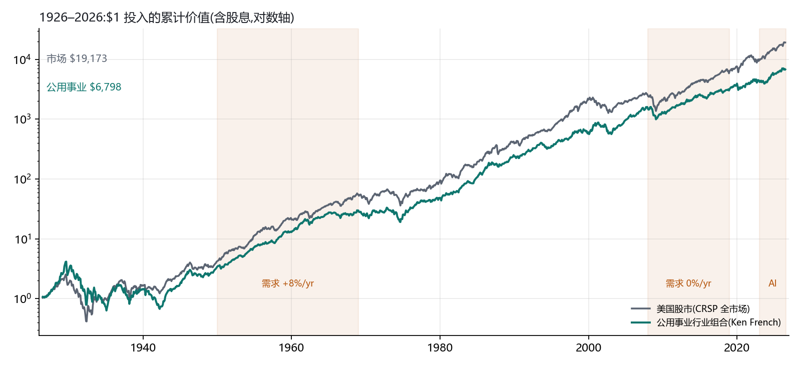
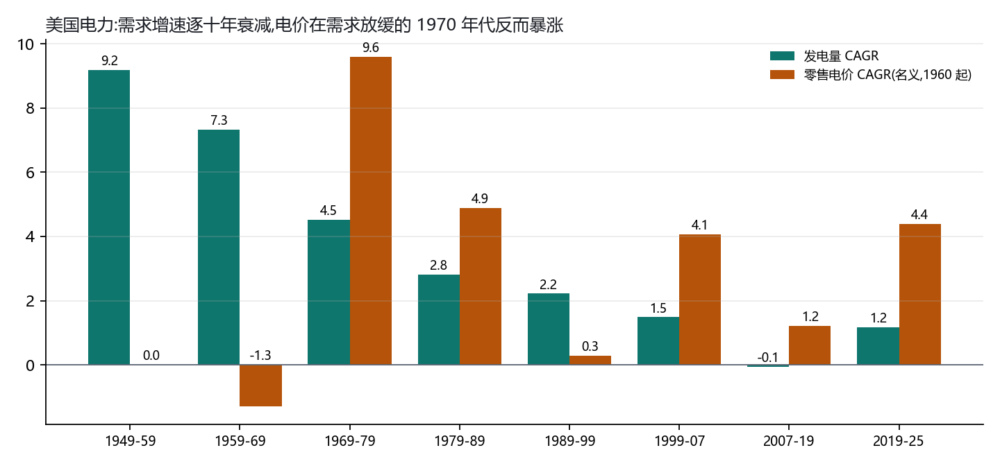
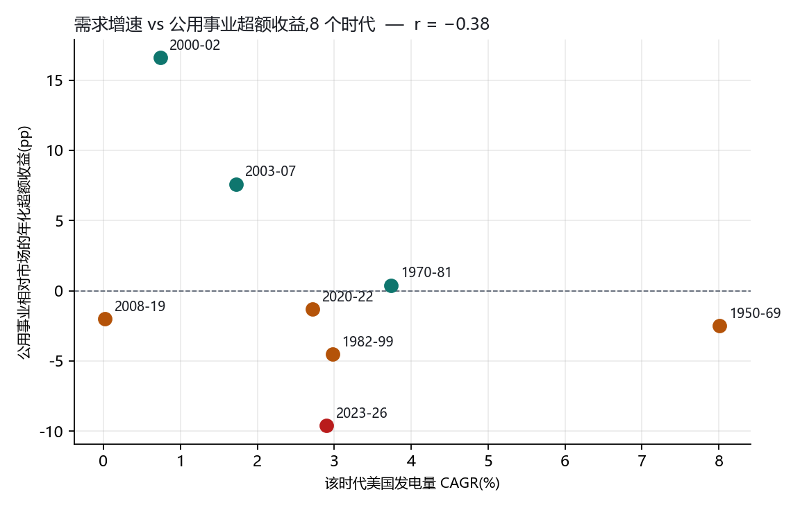
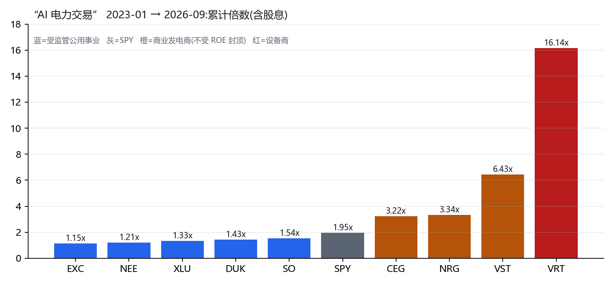

# 需求暴涨的能源与投入品,它们的生产者赚到钱了吗?

## —— 跨工业革命的百年实证(1845–2026),以电力为主轴

**日期**: 2026-09-16 · **性质**: 宏观/产业史研究(非个股卡)· **触发问题**:
"电力需求和电力公司赚钱与否是否真实存在关系?发电厂、电力公司、能源企业跟 AI 需求真有线性关系吗?
历史上能源与社会生产力的发展,真的代表这些电力公司赚钱吗?—— 不只电力:蒸汽、石油、钢铁、矿产,每一次工业革命里需求暴涨的投入品,它的生产者赚到大钱了吗?股票走了什么周期?当时大众怎么想?"

**一手数据**: Ken French / CRSP 12 行业月度收益(1926-07 → 2026-07)· EIA 月度能源评论表 7.1 / 7.2 / 7.6 / 9.8(1949–2025)· Yahoo 复权月线 17 只 · SEC / 学术 / 新闻一手考证(见附录)

---

## 0. 结论先行

> **需求增长是真的,几乎每一次都是真的。生产者的股东照样不赚钱,几乎每一次都不赚。**
> **原因不是需求预测错了 —— 恰恰是因为需求预测对了,资本才会涌进来把回报打到资本成本以下。**
> **赚钱的从来不是"卖那个东西的人",而是四类人:握有不可复制稀缺资产的人、掌握瓶颈环节的人、卖工具且有专利/寡头保护的人,以及用那个东西的人。**

### 五条硬结论(全部有数)

| # | 结论 | 证据 |
|---|---|---|
| 1 | **百年来美国公用事业股跑输大盘** | 1926-07→2026-07:公用事业 **9.22%/yr** vs 全市场 **10.35%/yr**($1→$6,798 vs $19,173);90 个滚动十年窗口只跑赢 **33 个(37%)** |
| 2 | **需求增速与公用事业超额收益的相关系数是负的** | 8 个时代,**r = −0.38**。需求增速最快的 1950–69(发电量 +8.0%/yr)跑输大盘 2.5pp/yr;需求零增长的 2008–19 跑输 2.0pp;**两个时代的绝对回报几乎一样(10.7% vs 7.4%)** |
| 3 | **电力公司的利润由三样东西决定,需求不在其中** | 受监管:**允许 ROE × 费率基础**(ROE 被锁在 9.5–9.8%);商业发电商:**供给短缺时的价格**;两者共同:**资本成本(利率)**。1982–99 公用事业 13.3%/yr,那段需求只有 3%/yr —— 是利率从 14% 降到 5% 给的 |
| 4 | **每一次"需求会大增"的叙事都以同一种方式收场** | Insull 1932(60 万股东归零)、核电 1970–88(WPPSS $22.5 亿违约、PSNH 破产)、商业发电商 1998–2005(Calpine $266 亿资产破产)、德国 2008–16(RWE −90%)—— **产能按外推建,需求按现实来,股东买单** |
| 5 | **AI 这三年验证了同一结构** | 2023-01→2026-09:SPY 1.95x,**XLU 1.33x(跑输 12pp/yr)**;赚钱的是不受 ROE 封顶、握有既有核电/燃气产能的商业发电商:**VST 6.43x、NRG 3.34x、CEG 3.22x**;以及设备瓶颈 **VRT 16.1x**。**这是稀缺资产重定价,不是"需求线性传导"** |

### 九个案例总表(跨工业革命)

| 案例 | 需求兑现了吗 | 生产者股票结局 | 谁真正赚了钱 | 大众思潮弧线 |
|---|---|---|---|---|
| 英国铁路狂热 1843–50 | ✅ 客货运持续增长 | 指数 2,062→741(**−64%**),股息 7%→2.4%,股价跌破发行价 | 铁路的**使用者**、土地、后来的整合者 | "铁路改变一切"→ 人人认购 → "not a bubble in the economic sense"但股东全输 |
| 宾州石油 1859–61 | ✅ 产量 2,000→200 万桶 | 油价 **$20→$0.10**,生产商成批破产 | **Rockefeller:控制炼油与管道(瓶颈),不产油** | "液体黄金"→ 挖到就发财 → 价格崩 → 联合限产 |
| 钢铁 1870–1990 | ✅ 美国工业化的骨架 | 钢价 $100→$15/吨(**−85%**);US Steel 1901 上市后 3 年跌破 $10,1916 才回 $100;1991 被踢出道指;2008 至今 **−70%** | **Carnegie:极端成本领先 + 纵向整合**;之后没人 | "钢铁是国力"→ 第一家十亿美元公司 → 九十年慢死 |
| 电力 1880–2026 | ✅ 美国发电量 1949–2025 **×15** | 百年跑输大盘 1.1pp/yr;三次 −36% 以上回撤;Insull 帝国 $16,000→$25 | **短暂:垄断期的 Insull;长期:用电的人**;监管把利润设计成"够用不超额" | 见 §7 六段 |
| 汽车 1900–1930 | ✅ 改变文明 | 数百家 → **3 家**;耐用品行业 1926–29 跑输大盘 | **整合后的幸存者**(1930–45 耐用品跑赢 +4.8pp)+ 石油 + 公路 | "人人一辆车"→ 数百家新公司 → 大萧条洗牌 |
| 航空 1903– | ✅ 客运量增长千倍 | **自 Kitty Hawk 以来行业累计净亏损**(Buffett) | 飞机租赁、机场、发动机(寡头)、乘客 | "征服天空"→ 永远的下一轮融资 |
| 光纤 1995–2002 | ✅ **但晚了 7 年** | ~$2 万亿投入,2001 年 **95% 是暗光纤**,2002 年利用率 2.7%;Global Crossing 负债 $124 亿破产;WorldCom 史上最大破产 | **Level 3 等以骨折价收购资产的人;以及所有互联网公司(用户)** | "流量每 90 天翻倍"(实际每年翻倍)→ 狂铺 → 崩 → 需求 2008 年才追上 2001 年的产能 |
| 光伏 2005–13 | ✅ 2011 年需求仍 **+30–40%** | 产能过剩 100%,组件价格崩;全球最大的 Suntech 2013 破产,Q-Cells 等十余家倒闭 | **装光伏的人(电价下降)**;后来的中国整合者 | "清洁能源革命"→ 产能翻倍 → 价格战 |
| 干散货航运 2003–08 | ✅ 中国铁矿石/煤需求真实 | BDI **11,793 → 663(−94%,7 个月)**,新船订单一起下水 | 中国钢厂(货主)、造船厂(短暂) | "中国超级周期永续"→ 全行业订船 → 供给砸盘 |

**九个案例,九次需求兑现,零次生产者股东作为一个群体赚到超额回报。** 唯一的部分例外是石油,而且只在供给受卡特尔/地缘约束的窗口期(1973–80、1999–2008),供给放开时(1981–98、2009–19)同样跑输 5–11pp/yr。

---

# 第一部分:电力 —— 数据最完整的百年样本

## 1. 方法与数据

| 数据 | 来源 | 范围 | 用途 |
|---|---|---|---|
| 公用事业行业组合月收益(市值加权,含股息) | Ken French Data Library,CRSP 12 行业 "Utils" | 1926-07 → 2026-07,1,201 个月 | 百年回报、分时代、回撤、滚动胜率 |
| 全市场月收益 | French 三因子 Mkt-RF + RF | 同上 | 对照基准 |
| 美国发电量 / 售电量 / 分部门 / 发电结构 | EIA Monthly Energy Review 表 7.1、7.2A、7.6 | 1949–2025 年度 | 需求史 |
| 零售电价(名义,含税) | EIA MER 表 9.8 | 1960–2025 | 价格史 |
| 个股复权月线 | Yahoo Finance | 最早 1972(ETR)→ 2026-09 | 分时代个股、AI 交易 |
| 1 个月国库券 | French RF | 1926–2026 | 利率环境(混淆变量) |

**局限(诚实列出):**
- French "Utils" 含电力、燃气、水务,不是纯电力;但电力占绝对主导
- 时代切分带主观性;我按"主流叙事切换点"切,而不是按股价拐点切,以避免事后拟合
- 8 个时代的相关系数只是描述性统计,不是因果证明
- 1949 年前无 EIA 数据,需求史与回报史的重叠期是 1949–2025

## 2. 百年回报总账

### 2.1 全期

| | 年化 | $1 → | 
|---|---:|---:|
| 公用事业(French Utils) | **9.22%** | **$6,798** |
| 全市场 | **10.35%** | **$19,173** |
| 差 | **−1.13pp/yr** | 市场是公用事业的 **2.8 倍** |

**滚动十年窗口 90 个,公用事业跑赢市场 33 个(37%)。**

### 2.2 分时代

| 时代 | 主流叙事 | 公用事业 | 市场 | 超额 | 月数 |
|---|---|---:|---:|---:|---:|
| 1926–1929 | Insull 帝国顶峰,"电力是新经济" | 32.4% | 16.8% | **+15.6%** | 42 |
| 1930–1934 | 大萧条 + Insull 崩盘 + PUHCA | −22.6% | −9.9% | **−12.6%** | 60 |
| 1935–1949 | 监管重建 / 战时 | 10.4% | 9.8% | +0.6% | 180 |
| **1950–1969** | **黄金二十年,需求 +8%/yr,"寡妇孤儿股"** | **10.7%** | **13.2%** | **−2.5%** | 240 |
| 1970–1981 | 油危机 / 通胀 / 核电超支 / 费率冲击 | 7.6% | 7.3% | +0.4% | 144 |
| 1982–1999 | 利率大降 + 放松管制 | 13.3% | 17.9% | **−4.5%** | 216 |
| 2000–2002 | 加州危机 + Enron | 1.8% | −14.8% | **+16.6%** | 36 |
| 2003–2007 | 商业发电商破产后重整 | **21.4%** | 13.8% | **+7.6%** | 60 |
| **2008–2019** | **需求零增长十二年,"死亡螺旋"** | **7.4%** | **9.3%** | **−2.0%** | 144 |
| 2020–2022 | 疫情 / 通胀 | 5.9% | 7.2% | −1.3% | 36 |
| **2023–2026** | **AI 数据中心** | **12.5%** | **22.0%** | **−9.6%** | 43 |

> **读法:公用事业跑赢大盘的时代只有三个 —— 1926–29(Insull 泡沫)、2000–02(大盘崩盘时的防御)、2003–07(行业破产潮之后的低估值起点)。**
> **没有一个是"需求大增"的时代。需求最猛的 1950–69 跑输,AI 叙事的 2023–26 跑输最多。**

### 2.3 最深回撤(含股息,峰→谷)

| 回撤 | 峰 | 谷 | 背景 |
|---:|---|---|---|
| **−84.8%** | 1929-09 | 1935-02 | Insull 帝国崩溃 + 大萧条 |
| **−42.6%** | 1972-11 | 1974-09 | 油危机 + 利率飙升 + 核电成本失控 |
| −37.9% | 2008-05 | 2009-02 | 金融危机 |
| −36.0% | 2001-05 | 2003-02 | Enron / 商业发电商破产潮 |
| −26.3% | 1968-11 | 1970-06 | 黄金二十年的**尾部** |
| −21.6% | 2020-01 | 2020-03 | 疫情 |

### 2.4 长期个股(复权含股息,1985-01 → 2026-09)

| | 年化 | 倍数 | 备注 |
|---|---:|---:|---|
| NEE(NextEra) | **13.07%** | 167x | 少数真正的复利机器:可再生能源开发 + 佛州费率基础 |
| SO(Southern) | 12.65% | 143x | |
| EXC(Exelon) | 10.33% | 60x | 曾持有全美最大核电队,2022 拆出 CEG |
| DUK(Duke) | 10.55% | 65x | |
| D(Dominion) | 10.21% | 57x | |
| AEP | 9.89% | 51x | |
| **PCG(PG&E)** | **3.11%** | **4x** | **两次破产(2001 加州危机、2019 山火)—— 监管/责任风险的活标本** |
| SPY(自 1993-02) | 10.77% | 31x | |

**同一个行业、同一段需求史,最好的和最差的差了 10 个百分点/年。** 决定差异的不是需求 —— 加州的需求和佛州一样在增长 —— 是**监管环境与责任分配**。

## 3. 美国电力需求史(EIA,1949–2025)

### 3.1 需求增速逐十年衰减

| 期间 | 发电量 CAGR | 售电 CAGR | 居民 | 商业 | 工业 |
|---|---:|---:|---:|---:|---:|
| 1949–1959 | **+9.19%** | +9.78% | +10.7% | +9.3% | +9.9% |
| 1959–1969 | **+7.32%** | +7.34% | +8.7% | +8.5% | +5.9% |
| 1969–1979 | +4.53% | +4.66% | +4.8% | +5.3% | +4.2% |
| 1979–1989 | +2.80% | +2.48% | +2.9% | +4.1% | +1.0% |
| 1989–1999 | +2.22% | +2.27% | +2.4% | +3.1% | +1.3% |
| 1999–2007 | +1.48% | +1.61% | +2.5% | +2.4% | −0.4% |
| **2007–2019** | **−0.05%** | **+0.10%** | +0.3% | +0.2% | −0.2% |
| 2019–2025 | +1.17% | +1.05% | +0.8% | +1.6% | +0.7% |

**发电量:1949 年 296 TWh → 2025 年 4,430 TWh,15 倍。** 2007–2019 整整十二年**零增长**;2019–2025 回到 1.2%/yr —— 这就是"AI 需求爆发"在国家层面的实际读数:**从零回到一点二**。

### 3.2 发电结构的四次换血

| 年 | 煤 | 气 | 核 | 水 | 油 | 风 | 光 |
|---|---:|---:|---:|---:|---:|---:|---:|
| 1950 | 46% | 13% | 0 | 30% | 10% | 0 | 0 |
| 1970 | 46% | 24% | 1% | 16% | 12% | 0 | 0 |
| 1990 | 52% | 12% | **19%** | 10% | 4% | 0 | 0 |
| 2005 | 50% | 19% | 19% | 7% | 3% | 0 | 0 |
| 2015 | 33% | 33% | 20% | 6% | 1% | 5% | 1% |
| 2025 | **17%** | **41%** | 18% | 6% | 0 | 10% | 7% |

每次换血都是一轮资本毁灭:1970 年代油改核(核电超支 10 倍)、1990 年代气改(2002–05 燃气商业电厂破产潮)、2010 年代煤改气改风光(煤电资产减值、德国 RWE −90%)。**需求侧只涨了 15 倍,供给侧换了四轮血 —— 股东的钱在换血里。**

### 3.3 电价史:需求放缓的年代,电价反而暴涨

| 期间 | 零售电价名义 CAGR | 同期需求 CAGR |
|---|---:|---:|
| 1960–1970 | **−0.57%** | +7.3% |
| **1970–1980** | **+10.70%** | +4.5% |
| 1980–1990 | +3.41% | +2.8% |
| 1990–2000 | +0.36% | +2.2% |
| 2000–2008 | +4.57% | +1.5% |
| 2008–2019 | +0.72% | 0.0% |
| **2019–2025** | **+4.38%** | +1.2% |

**1960 年代:需求 +7%,电价下跌 —— 规模经济与技术进步让边际成本下降,好处全部传给了用户。**
**1970 年代:需求增速腰斩,电价 +10.7%/yr —— 因为核电资本开支要靠费率回收。**
**这是电力行业最核心的一条规律:电价不是需求定的,是"资本开支 / 费率基础"定的。**

2019–2025 的 +4.38%/yr 是 1980 年代以来最快的电价上涨,而需求只有 1.2%。**同一个机制正在重演:$1.4 万亿 capex 要靠电价消化。**

## 4. 需求 × 回报:核心对照

| 时代 | 发电量 CAGR | 公用事业 | 市场 | 超额 |
|---|---:|---:|---:|---:|
| 1950–1969 | **8.01%** | 10.7% | 13.2% | **−2.5%** |
| 1970–1981 | 3.74% | 7.6% | 7.3% | +0.4% |
| 1982–1999 | 2.98% | 13.3% | 17.9% | −4.5% |
| 2000–2002 | 0.74% | 1.8% | −14.8% | **+16.6%** |
| 2003–2007 | 1.72% | 21.4% | 13.8% | **+7.6%** |
| 2008–2019 | **0.02%** | 7.4% | 9.3% | −2.0% |
| 2020–2022 | 2.72% | 5.9% | 7.2% | −1.3% |
| 2023–2026 | 2.90% | 12.5% | 22.0% | **−9.6%** |

**需求增速 与 超额收益:r = −0.38。需求增速 与 绝对回报:r = +0.14。**

### 逐时代解读:为什么会这样

**1950–1969,为什么需求最猛却跑输?**
三个原因叠加:① 需求 +8%/yr 意味着**资本开支 +8%/yr 以上**,公用事业是资本最密集的行业,增长要靠不断增发和发债;② 无风险利率从 1% 升到 6%(1950→1969),"债券替代品"被系统性去估值;③ 1950 年的起点估值已经反映了"电力永远增长"。**三条里没有一条和需求好坏有关 —— 需求越好,前两条越糟。**

**1982–1999,为什么需求只有 3% 却有 13.3%?**
利率从 14% 降到 5%。公用事业股的久期特征让它像一张长债。**那 13.3% 里绝大部分是利率给的,不是需求。** 但同期大盘 17.9%,所以还是跑输 4.5pp。

**2003–2007,唯一一次真正的"行业性跑赢"(+7.6pp):**
起点是 2001–03 的破产潮 —— Enron、NRG、Mirant、Calpine 相继倒下,估值到了底;供给侧被出清;利率还在低位;然后 2005 年后煤价/气价上涨让存量电厂的边际收入上升。**跑赢的前提是先经历一场行业性的资本毁灭。** 这和 1930–45 汽车业整合后幸存者跑赢是同一个形状。

**2008–2019,需求归零,回报为什么和黄金二十年差不多?**
因为盈利根本不挂钩需求。这十二年公用事业照样把费率基础做大 —— 换煤为气、上可再生、换输配电网 —— **capex 不需要需求增长来正当化,只需要监管批准。** ROE 9.5–9.8% × 增长的费率基础 = 6–7% 的盈利增长,加 3–4% 股息 = 10% 左右。**这是公用事业的真实回报公式,它里面没有"需求"这一项。**

**2023–2026,AI 叙事下为什么跑输最多(−9.6pp)?**
① 利率从 0 升到 5%,债券替代品被去估值;② 大盘被 AI 七巨头拉到 22%/yr;③ **AI 电力的收益没有流向公用事业指数** —— 流向了下一节要讲的另一群人。

## 5. 混淆变量:利率

| 时代 | 1 个月国库券均值 | 期初→期末 | 公用事业超额 |
|---|---:|---:|---:|
| 1950–1969 | 2.8% | **+5.2pp**(1%→6%) | −2.5% |
| 1970–1981 | 7.2% | **+7.5pp** | +0.4% |
| 1982–1999 | 6.1% | **−5.5pp**(14%→5%) | −4.5% |
| 2003–2007 | 2.9% | +3.6pp | +7.6% |
| 2008–2019 | 0.6% | +0.5pp | −2.0% |
| 2023–2026 | 4.5% | −1.2pp | −9.6% |

利率和超额收益的关系也不干净(2003–07 利率上行却跑赢),**但利率对公用事业绝对回报的解释力,远大于需求。** 1982–99 那 13.3% 的绝对回报是这张表里第二高的,而那是需求增速倒数第三的时代。

## 6. 盈利机制:电力公司到底靠什么赚钱

### 6.1 受监管公用事业(NEE / DUK / SO / AEP / D / PCG …)

> **净利润 = 费率基础 × 权益比例 × 允许 ROE**

- **允许 ROE 由州监管机构定**,不由市场定:2019 年前长期在 9.5–9.8%,2020 年起首次低于 9.5%
- **需求只通过一条路径进入**:需求 ↑ → 需要新建资产 → 费率基础 ↑ → 利润 ↑。但 **ROE 不变**,所以利润增速 = 费率基础增速,通常 6–8%
- **费率基础的增长要靠电价上涨消化**,而电价上涨受政治约束(affordability)。2019–25 电价 +4.4%/yr 已经触发消费者组织和州议会的反弹(见 §9.3)
- **需求不增长也能增长费率基础**:换设备、上可再生、修电网、应对山火 —— 这就是 2008–19 的故事
- **风险不对称**:ROE 有上限没下限。加州山火让 PG&E 两次破产,监管没有给它"补偿性 ROE"

**结论:受监管公用事业的股票是"9.5% ROE 的长久期年金 + 费率基础增长期权"。买它是买利率和监管,不是买需求。**

### 6.2 商业发电商 / IPP(VST / CEG / NRG / TLN;历史上的 Calpine / Mirant / Dynegy)

> **利润 = (批发电价 − 燃料成本)× 发电量 + 容量费收入**

- **电价由系统里最贵的那台边际机组决定。** 需求 ↑ 只有在供给跟不上时才转化为电价 ↑
- **供给会跟上,而且通常过头**:1998–2001 燃气机组狂建 → 2002 年批发电价崩 → 2003–05 破产潮
- **容量市场是"稀缺性定价"的显式版本**:PJM 容量价格 2024/25 年 $28.92/MW-day → 2025/26 年 **$269.92** → 2026/27 年 **$329.17**(触及 FERC 批准的价格上限)—— 十倍,其中数据中心贡献了 63%
- **但这个机制随时可以被政治改写**:2024-11 FERC 否决 Talen–AWS 共址方案当天,VST / CEG / TLN 集体大跌;PJM 市场监控反对 Crane 重启的豁免;消费者组织正在推动"数据中心成本改革"

**结论:商业发电商的股票是"存量稀缺资产 × 供需失衡持续时间"的期权。它确实和需求有关 —— 但是非线性的、有上限的、且政治会回收超额部分。**

### 6.3 两者共用:资本成本

公用事业是全市场杠杆最高的行业之一(债务 / 资本通常 50–60%)。利率是它的原材料成本。**这是为什么 1982–99 比 1950–69 好,也是为什么 2023–26 跑输。**

## 7. 思潮史:六个时代,大众信什么,后来怎么了

### 7.1 1920 年代:"电力是新经济,控股公司可以无限杠杆"

**信念**:Samuel Insull 的帝国 —— 85 家公司、$40 亿估值(1929)、层层金字塔式控股。60 万股东、50 万债券持有人,**"believed that they had entrusted their savings to a safe and secure electric utility enterprise"**。芝加哥的门房和教师把储蓄投进去。

**数据**:1926–29 公用事业年化 **32.4%**,超越大盘 15.6pp —— 百年最好的三年。

**结局**:1932 年芝加哥快速交通破产触发连锁,Insull Utility Investments **100 股从 $16,000 跌到 $25 无人接盘**。1935 年《公用事业控股公司法》(PUHCA)把整个行业按州拆散、限制杠杆、强制披露。**监管不是需求的结果,是股东灾难的结果。**

### 7.2 1954–1970:"Too cheap to meter" —— 核电乌托邦与永续 7%

**信念**:1954-09-16,原子能委员会主席 Lewis Strauss 对科学作家说他的孙辈会用上"too cheap to meter"的电。华尔街把公用事业叫"寡妇孤儿股"—— 稳定、增长、安全。需求 7–9%/yr 被视为物理定律,全行业按这个增速规划核电。

**数据**:1950–69 需求 +8.0%/yr,公用事业 10.7%/yr,**跑输大盘 2.5pp**。到 1968–70 已经先回撤 −26%。

**结局**:1973 年油危机 → 需求增速断崖到 2.5% → **产能按 7% 建的**。Seabrook 核电站成本从初估涨到 $52 亿(10 倍);WPPSS 在 1982 年放弃两座建了一半的核电站,1983-07 **$22.5 亿债券违约,美国史上最大市政债违约**;Public Service of New Hampshire 1988 年破产,**大萧条以来第一家破产的大型投资者所有公用事业**。1970–81 公用事业名义回报 7.6%,通胀 7–8%,**实际回报约零**。

**思潮转折**:从"电力永远增长"到"核电是无底洞"。1978 年 PURPA 法案强制公用事业向独立发电商购电 —— **这是放松管制的种子,种在核电失败的土壤里。**

### 7.3 1990 年代:"放松管制 = 复制航空和电信的成功"

**信念**:1992 年能源政策法、1996 年 FERC 888 号令、加州 1996 年放开。华尔街的模板是 Enron —— 把电当天然气一样交易。**商业发电商("merchants")会用市场纪律取代监管臃肿。** 1998 年后燃气轮机订单暴增,"speculative development of merchant gas projects" 遍地开花。

**数据**:1982–99 公用事业 13.3%/yr,跑输大盘 4.5pp(大盘在互联网泡沫)。

**结局**:2000–01 加州危机,$55.5 亿超额支付,大规模停电,PG&E 第一次破产;2001-12 Enron 破产;2003 年 NRG、Mirant 破产;**2005-12 Calpine 破产 —— $266 亿资产、$225 亿债务,当时全美最大的燃气电厂所有者**。"Enron emulators Aquila, CMS, Dynegy, El Paso, Reliant, Williams" 全部濒临崩溃。

**思潮转折**:从"市场比监管聪明"到"电力不是普通商品"。**这是"需求线性 + 市场定价"这个组合的第一次实盘失败,而它正是今天 AI-电力叙事的底层假设。**

### 7.4 2013 年:"死亡螺旋" —— 需求萎缩的叙事

**信念**:2013-01 爱迪生电力协会(EEI)发布《Disruptive Challenges》,作者 Peter Kind(前 Macquarie / BofA / Citi):屋顶光伏 + 储能会让用户脱网,负荷下降 10% 会让电价涨 20%,形成"死亡螺旋"。华尔街一度认真讨论公用事业的"终局"。

**数据**:2008–19 需求**零增长**,公用事业 7.4%/yr,只比黄金二十年低 3pp。

**结局**:**"To date, no major U.S. utility has experienced the predicted death spiral."** 报告的实际作用是发起了一场全国性的反净计量运动。

**这一段最有教育意义**:需求增长的叙事(1960s)错了,**需求萎缩的叙事也错了 —— 因为两者都假设盈利挂钩需求。** 它不挂钩。它挂钩费率基础。

### 7.5 2023–2026:"AI 数据中心 = 电力超级周期"

**信念**:
- EPRI(2026-02):数据中心占美国用电 4–5% → 2030 年 **9–17%**;弗吉尼亚 25% → 41–59%
- 投资者所有公用事业 capex 计划 $1.1 万亿(2025–29)→ **$1.3–1.4 万亿(2026–30)**,一年上调 21%
- PJM 容量价格十倍,数据中心贡献 63%
- 微软–Constellation 三里岛(Crane)重启 PPA 835 MW / 20 年;亚马逊–Talen 1.92 GW / 17 年;Meta–Constellation Clinton 1.1 GW / 20 年;重启核电 PPA 隐含 **$70–95/MWh**
- 华尔街语言:"picks and shovels"、"电力是 AI 的新瓶颈"

**已经出现的反证**:
- **幽灵负荷**:Wood Mackenzie —— 全美 1,066 GW 大负荷申请,公用事业实际会承诺 **298 GW,768 GW 会蒸发(72%)**;Exelon 65 GW 管线**只有 22% 可能落地**;ERCOT 大负荷队列一年从 63 GW 涨到 226 GW;PJM 上一次容量拍卖 $164 亿成本中 **$62 亿对应尚未建成的数据中心**。**"专家估计申请量是实际建设量的 5–10 倍"**
- **国家层面需求读数**:2019–25 发电量 CAGR **1.17%**。从零增长回到 1.2%,这就是"爆发"目前的全部
- **政治介入已经开始**:FERC 2024-11 否决共址;消费者组织(CUB)推动数据中心成本分摊改革;PJM 市场监控反对 Crane 豁免 —— **历史上政治介入的方向永远是压缩超额利润**(1935 PUHCA、1978 PURPA、2001 加州)

**数据(实盘检验,2023-01 → 2026-09)**:

| | 累计倍数 | 年化 | 类型 |
|---|---:|---:|---|
| SPY | 1.95x | +20.0% | 基准 |
| **XLU** | **1.33x** | **+8.1%** | 受监管公用事业 ETF |
| EXC | 1.15x | +3.9% | 受监管 |
| NEE | 1.21x | +5.4% | 受监管 |
| DUK | 1.43x | +10.2% | 受监管 |
| SO | 1.54x | +12.5% | 受监管 |
| **CEG** | **3.22x** | +37.5% | 商业发电商(核电) |
| **NRG** | **3.34x** | +39.0% | 商业发电商 |
| **VST** | **6.43x** | +66.1% | 商业发电商(核电+燃气) |
| **VRT** | **16.14x** | +113.5% | 设备(数据中心散热/电力) |

**"AI 电力交易"三年,受监管公用事业作为一个类别跑输大盘 12pp/yr。** 钱流向了两处:① **不受 ROE 封顶、握有既有核电和燃气产能的商业发电商** —— 他们的资产是"不可新建的"(美国一代人里没有一座大型核反应堆按时按预算建成);② **设备瓶颈**(变压器、涡轮机、散热)。

**这不是需求线性传导。这是稀缺资产重定价。** 而且注意 CEG 的核心上行(Crane 重启)已经**以固定价格卖给了微软 20 年** —— 股东拿到的是一次性重定价,不是"需求每涨 1%,利润涨 1%"。

**思潮的当前位置**:2026-Q3 的市场语言已经从"电力短缺"转向"AI with receipts"(要收据)—— 见 `macro/ai_zeitgeist_timeline.md`。幽灵负荷的数字正在进入主流讨论。**按七段弧线(§20),我们大约在第 4–5 段之间。**

### 7.6 六段思潮的共同结构

| 时代 | 真实的技术变化 | 被无限外推的东西 | 资本的反应 | 结局 |
|---|---|---|---|---|
| 1920s | 电气化 | 控股公司杠杆 | 金字塔 | −85% |
| 1950–70s | 核裂变 | 需求 7%/yr | 核电狂建 | 违约/破产/费率冲击 |
| 1990s | 燃气轮机 + 市场化 | "市场定价 + 需求线性" | 商业电厂狂建 | 2002–05 破产潮 |
| 2013 | 屋顶光伏 | 脱网 | 反净计量运动 | 什么都没发生 |
| 2023– | AI 算力 | 数据中心负荷 5–10 倍申请 | capex $1.4 万亿 + 容量价十倍 | ? |

**变的是技术,不变的是外推。**

## 8. 国际对照

### 8.1 中国:需求 +10%/yr 二十年,发电企业利润随煤价反向波动

2000–2020 中国用电量年均增长约 10%,发电量翻了近五倍。**但电价由政府定,煤价由市场定。** 2005 年上半年华能国际净利润 **−30~40%**(煤价上涨);2015 年上半年华电 +31%、大唐 +3.5%、华能 +19.5%、国电 +15.5%(煤价下跌)。**利润和需求无关,和煤价负相关。** 这是"受监管电价 + 市场化燃料"这个最坏组合的极端样本。

### 8.2 德国:政策驱动的供给冲击

Energiewende(可再生优先 + 退核)让批发电价崩塌:碳价从 2008 年 €20/吨跌到 2013 年不足 €3;可再生装机挤出化石机组的运行小时。**RWE 从 2007 年高点跌了约 90%**,E.ON 同等幅度;RWE 2014 年出现历史首次年度亏损 **€28 亿**;2016 年 RWE 和 E.ON 都被迫拆分为"传统"与"可再生"两家公司;行业 1998–2013 裁掉近四分之一员工。

**德国的需求没有塌 —— 是供给结构被政策强行改写。** 这说明电力公司的利润对"政策 / 供给"的敏感度,远高于对"需求"的敏感度。

## 9. AI 这一轮:三个必须回答的问题

### 9.1 需求是真的吗?

**部分是真的,而且这不重要。** EPRI 的 9–17% 区间本身就说明不确定性是三倍;Wood Mackenzie 的 72% 蒸发率说明申请量不能当需求;2019–25 的国家级读数只有 1.2%/yr。**但历史说:即使需求完全兑现(铁路、光纤、光伏都兑现了),生产者的股东也不赚钱。** 需求真不真是第二个问题,第一个问题是"供给会不会过头"。

### 9.2 供给会过头吗?

**受监管侧**:capex $1.4 万亿是**按申请量规划的**。如果 72% 的申请蒸发,费率基础照样建了,ROE 照样 9.5%,但**电价要涨得更多来消化**(因为分摊的用户没有增加)。这正是 1970 年代核电的形状:产能按外推建,需求按现实来,费率冲击,政治反弹。**受监管公用事业的下行不是亏损,是"费率案被驳回 + ROE 被下调 + 估值被去掉"。**

**商业侧**:燃气轮机产能是当前真实的硬瓶颈(GEV 的订单排到 2028+),所以短期内新增供给受限 —— 这是 VST / CEG 重定价的真实基础。但**历史上每一次硬瓶颈都在 3–5 年内被资本解决**(1998–2001 燃气轮机、2004–08 造船、2009–11 光伏多晶硅)。

### 9.3 政治会回收吗?

**已经在回收。** FERC 否决共址、PJM 市场监控反对豁免、CUB 推动成本分摊、多州议会审议数据中心专属费率。**历史上没有一次超额利润在政治上存活超过一个选举周期**:Insull → PUHCA(3 年);加州危机 → 重新监管(1 年);1970 年代费率冲击 → PURPA(5 年)。

---

# 第二部分:跨工业革命 —— 八个案例

## 10. 英国铁路狂热(1843–1850)

**需求**:真实。铁路彻底改变了英国的物流、劳动力市场和城市结构,客货运量此后持续增长几十年。

**生产者股票**:铁路股价 1843–45 平均上涨 106%;指数 1845-10-06 见顶 2,062,一个月内跌 20%,**1850-04 跌到 741,峰谷 −64%**;股价跌破原始发行价;**股息从 7% 跌到 1852 年的 2.4%**。投资者主体是"clerks, artisans, and rural gentry",损失以亿英镑计。

**谁赚了钱**:铁路的使用者(制造业、农业、城市),土地所有者,以及 1850 年代以后整合幸存线路的人。

**思潮**:"铁路改变一切"(对的)→ 议会一年批准数千英里 → 人人认购,分期付款制度让工薪阶层加杠杆 → 崩盘。**学术界的定论最有意思:"not a bubble in the economic sense, as railway shares were not obviously mispriced at the peak"** —— 也就是说,以当时可得的信息看,估值是合理的;**问题不是估值,是竞争:更多铁路 = 每条铁路的利润下降。**

## 11. 石油(1859–2026)

**宾州油田 1859–61**:产量从 2,000 桶(1859)到 50 万桶(1860)到 200 万桶(1861);**油价从 $20 跌到 $0.10**,1861 年均价 $0.49。生产商成批破产,被迫成立 Oil Creek Association 限产。

**谁赚了钱**:**Rockefeller —— 他不产油。** 他建了最好的炼厂做最低成本者,然后**收购管道,控制了从油田到铁路的运输瓶颈**。标准石油的利润来自控制流通环节,不来自油田。

**石油行业的百年数据(French "Enrgy")**:

| 时代 | 主题 | 石油 | 市场 | 超额 |
|---|---|---:|---:|---:|
| 1926–1929 | 汽车普及初期 | 5.7% | 16.8% | −11.1% |
| 1946–1972 | 战后需求暴涨 | 13.4% | 11.6% | +1.9% |
| **1973–1980** | **两次油危机,价格 ×10** | **18.9%** | 7.4% | **+11.5%** |
| 1981–1998 | 1986 崩盘 → 长熊 | 10.5% | 16.2% | −5.7% |
| **1999–2008** | **中国超级周期,$10→$147** | **11.7%** | −0.6% | **+12.3%** |
| 2009–2019 | 页岩革命,供给暴增 | 3.8% | 14.9% | **−11.1%** |
| 全期 | | 10.51% | 10.35% | +0.2% |

**石油是九个案例里唯一一个生产者阶段性大赚的。原因不是需求,是供给被卡特尔(德州铁路委员会 1930s–60s,OPEC 1973–)和地缘政治人为约束。** 供给一旦放开(1986 沙特增产、2009 页岩),同样跑输 5–11pp/yr。**它证明的恰恰是本文的规律:赚钱的条件是供给约束,不是需求增长。**

## 12. 钢铁(1870–2024)

**需求**:真实。钢是第二次工业革命的骨架 —— 铁路、桥梁、摩天楼、汽车、军舰。

**价格**:Bessemer 工艺让钢价从 1870 年 **$100/吨跌到 1890 年 $15/吨(−85%)**。

**谁赚了钱**:**Carnegie —— 极端成本领先 + 纵向整合(矿、焦、运输)+ 在每次萧条时逆势扩产。** 他赚的是"比所有人便宜"的钱,不是"钢需求大"的钱。1901 年他以 $4.8 亿把公司卖给摩根。

**生产者股票**:US Steel 1901 年成立,第一家十亿美元公司,控制全美 60% 产能。**股价 1904 年跌破 $10,1916 年才回到 $100;1991 年在道指待了 90 年后被踢出;2008 年高点至今总回报 −70%,同期标普 +400%。** 2023 年以 $150 亿卖给新日铁。

**思潮**:"钢铁是国力"→ 摩根整合 → 反垄断 → 九十年慢死。Buffett 1983 年信:"Major additional investment in a terrible industry usually is about as rewarding as struggling in quicksand."

## 13. 汽车(1900–1930)

**需求**:真实。汽车重塑了文明。

**生产者**:美国曾有数百家汽车制造商,大萧条后只剩 Ford、GM、Chrysler 和几家小厂。Packard、Peerless、Pierce-Arrow 全部消失。

**French "Durbl"(耐用品,含汽车)**:1926–29 汽车狂热顶峰 15.1% vs 市场 16.8%(**跑输**);**1930–45 整合期 9.4% vs 4.5%(跑赢 +4.8pp)**;1946–72 黄金期 12.9% vs 11.6%(+1.4pp)。

**读法**:**幸存者在洗牌之后跑赢,不是在需求爆发时跑赢。** 和电力 2003–07、和铁路 1850 年代一样。

## 14. 航空(1903–)

**需求**:客运量增长了千倍以上。

**生产者**:Buffett 1990 年信:**"The airline industry, in aggregate, has posted a net loss since its birth after Kitty Hawk despite the huge amounts of equity capital that have been injected into it."** 直到 2001 年美国航空业的累计利润只有约 $30 亿,之后又归零。他的名言:如果当年有资本家在 Kitty Hawk,应该把莱特兄弟的飞机打下来。

**谁赚了钱**:发动机寡头(GE / Rolls-Royce / Pratt)、飞机租赁、机场、旅客。

## 15. 光纤(1995–2002)—— 和 AI 电力最像的一个

**需求**:**真的,但晚了七年。** 互联网流量在真实地每年翻倍。

**外推**:华尔街和 WorldCom / UUNET 传播的口径是"每 90 天翻倍"。AT&T 的 Andrew Odlyzko 用实际流量数据指出是每年翻倍 —— 差了 4 倍,没人听。

**资本**:1995–2000 年约 **$2 万亿**铺了 8,000–9,000 万英里光纤。

**结局**:2001 年估计 **95% 是暗光纤**;《华尔街日报》2002 年估计利用率 **2.7%**。Global Crossing 2002 年破产,负债 $124 亿;WorldCom 造假 $110 亿后成为当时美国史上最大破产。**"The demand curve that the builders of 1998 had projected for 2001 arrived in 2008."**

**谁赚了钱**:Level 3 —— 靠着杠杆略低活下来,然后"systematically acquired distressed fiber assets at prices that would have been inconceivable during the mania";以及**所有用上了廉价带宽的互联网公司**(Google、Amazon、Netflix 都建在这批暗光纤上)。

**这个案例对 AI-电力的映射最直接**:需求预测方向对、幅度对、时间错;资本按最乐观时间表建;产能等需求等了七年;建产能的人破产,用产能的人成为新一代巨头。

## 16. 光伏(2005–2013)

**需求**:2011 年全球光伏需求仍 **+30–40%**。

**供给**:Suntech 2009–11 产能翻倍到 2,400 MW;全球组件产能过剩 **100%**;价格崩塌。

**结局**:2011 年起 Evergreen、SpectraWatt、Solar Millennium、Solon、Photowatt 相继倒闭;德国 Q-Cells 破产;**2013-03 全球最大的 Suntech 破产**。"despite global solar demand in 2011 increasing by around 30–40% compared to 2010."

**谁赚了钱**:装光伏的人(电价下降),以及十年后的中国整合者。

## 17. 干散货航运(2003–2008)

**需求**:真实。中国的铁矿石和煤炭进口把 BDI 推到史上最高。

**结局**:BDI **2008-05-20 见顶 11,793,七个月内跌到 663(−94%)**。"The 2008 collapse was as much about ship oversupply (massive newbuild orders had hit the water)" —— 全行业在顶部下的新船订单在底部交付。

**谁赚了钱**:中国钢厂(货主)、造船厂(短暂)。

---

# 第三部分:统一规律

## 18. 需求预测通常是对的 —— 这正是问题

九个案例的需求预测,方向全对,幅度大体对(光纤时间错了七年,但幅度最终对了)。**如果需求预测是错的,资本不会涌进来;正因为它是对的、而且人人都看得到,资本才会涌进来,直到把回报打到资本成本以下。**

一个投入品(电、钢、带宽、运力)的经济学特征决定了这个结局:
1. **无差异化** —— 一度电就是一度电,价格由边际成本决定
2. **资本密集、建设周期长** —— 决策时的需求预测到投产时已经过时
3. **进入壁垒低(或被政策打开)** —— 只要有钱就能建
4. **需求方是价格敏感的、有议价能力的大买家**(hyperscaler / 钢厂 / 互联网公司)

## 19. 价值流向哪里:四种捕获者

| 捕获者 | 机制 | 案例 |
|---|---|---|
| **① 不可复制的稀缺资产** | 供给无法响应价格 | 既有核电(CEG / VST / TLN,2023–26)、OPEC 油田(1973–80)、垄断期的 Insull(1926–29)|
| **② 瓶颈环节** | 控制流通/转换的咽喉 | Rockefeller 的管道与炼厂、GEV 的燃气轮机、Level 3 收来的骨干网 |
| **③ 有保护的工具供应商** | 专利 / 寡头 / 服务年金 | Boulton & Watt 的专利、发动机三巨头、VRT、ASML |
| **④ 使用者** | 投入品价格下降 → 他们的利润率上升 | 1960 年代电价下跌的所有工业、暗光纤上的 Google、廉价钢上的汽车业、廉价光伏的电站 |

**"卖那个东西的人"不在表里。** 除非他同时是 ①②③ 之一。

## 20. 思潮弧线的固定结构

| 段 | 大众叙事 | 股价 | 历史对应 |
|---|---|---|---|
| 1 怀疑 | "这东西没用 / 太贵" | 无人问津 | 1890 年代电灯、1994 年互联网 |
| 2 证明 | "真的有用" | 先行者暴涨 | Insull 1920s、Global Crossing 1998 |
| 3 外推 | "需求会永远这样增长" | 全行业重估 | "too cheap to meter"、"每 90 天翻倍"、"AI 需要无限电力" |
| 4 狂热 | "这次不一样,需求是真的" | 泡沫顶 | 1845、1929、2000、**2026?** |
| 5 反证出现 | "申请量 ≠ 需求"、"利用率只有 X%" | 分化 | 2026 幽灵负荷、2001 暗光纤 |
| 6 崩溃 | "行业结构性过剩" | −60% ~ −90% | 1850、1932、2002、2013 |
| 7 整合 | "幸存者终于赚钱了" | 从低基数跑赢 | 1850s 铁路、1930s 汽车、2003–07 电力 |

**注意第 3 段的措辞:每一次的外推都是"需求是真的"。这句话每次都对。它从来不是问题所在。**

## 21. 对 AI-电力叙事的映射

| 维度 | 像哪个历史案例 | 不像的地方 |
|---|---|---|
| "需求真实但被 5–10 倍外推" | 光纤 1998(90 天 vs 每年翻倍) | 这次外推者(hyperscaler)自己有钱、且在签长约 —— 部分风险已转移给买方 |
| 硬瓶颈(燃气轮机、变压器) | 1998–2001 燃气轮机、2004–08 造船 | 瓶颈方(GEV / VRT)已经 16x —— 重定价已发生 |
| 既有稀缺资产重定价 | 1973–80 石油 | 核电 PPA 是 15–20 年固定价 —— 上行被锁,不是随需求涨 |
| 受监管侧 capex $1.4 万亿 | **1970 年代核电** —— 按外推建,靠费率回收 | ROE 上限比 1970s 更紧,政治反弹更快 |
| 政治回收 | PUHCA、PURPA、加州 | 已经开始(FERC 共址、CUB) |
| 需求方 | 铁路/光纤的使用者最终最赚 | **hyperscaler 已经是全市场市值最大的公司 —— "使用者赚钱"这一条已经在价格里** |

---

# 第四部分:对配置的含义(判据,不是建议)

## 22. 用这套框架看现有仓位与候选

| | 属于哪类 | 历史框架说什么 | 现有卡 |
|---|---|---|---|
| **CEG** | ① 稀缺资产 | 重定价已发生(3.22x);Crane 上行已卖给 MSFT;下一步靠**新 PPA 价格**,且政治正在介入 | STARTER,$274(2026-06) |
| **VST** | ① 稀缺资产 + 商业燃气 | 6.43x 是九个案例里"第 2 段→第 4 段"的典型幅度;供给约束(涡轮机)3–5 年内会松 | 未建卡 |
| **GEV** | ② 瓶颈 | 涡轮机订单排到 2028+ 是真的;但 09-05 卡已发现 $180 亿"净现金"其实是客户预付款 —— **正是 1998 年燃气轮机订单潮的形状** | WATCH,$786 |
| **VRT** | ③ 工具 | 16x;历史上工具商的重定价先于且大于资产商,回落也是 | 未建卡 |
| **XLU / NEE / DUK / SO** | 受监管年金 | 买的是 9.5% ROE × 费率基础增速 + 利率;**不是 AI**。2023–26 跑输 12pp 本身就是市场在说这句话 | 未建卡 |
| **AI 的使用者**(MSFT / GOOGL / AMZN / META) | ④ 使用者 | 历史上最终赚钱的一类 —— 但已是市值最大的公司,"使用者溢价"已在价里 | 见 mega7 批次 |

## 23. Kill Criteria:AI-电力叙事(三态)

| Kill | 阈值 | 现状 | 触发含义 |
|---|---|:---:|---|
| **K-1 幽灵负荷** | 主要 ISO 大负荷队列**兑现率 < 25%** 被官方确认 | 🟡 Wood Mac 28%、Exelon 22% | 需求外推证伪,受监管 capex 变成 1970s 核电 |
| **K-2 容量价格回落** | PJM 容量价格连续两次拍卖低于 $150/MW-day | 🟢 $329(触顶) | 稀缺性定价结束,商业发电商回归成本定价 |
| **K-3 政治回收** | 任一大型 ISO 通过"数据中心专属费率 / 成本分摊"规则,或 FERC 二次否决共址 | 🟡 CUB 推动中,FERC 2024-11 已否一次 | 超额利润被立法回收(PUHCA 模式) |
| **K-4 供给瓶颈松动** | GEV 燃气轮机交付周期从 4 年降到 2 年以内 | 🟢 仍排到 2028+ | 商业发电商的护城河消失 |
| **K-5 费率反弹** | 任一大州 PUC 驳回主要费率案或下调 ROE 至 9% 以下 | 🟡 2019–25 电价 +4.4%/yr 已是 1980s 以来最快 | 受监管侧的"capex → 利润"链条被切 |
| **K-6 利率** | 10 年期美债 > 5% 持续两个季度 | 🟢 | 债券替代品被系统性去估值(1950–69 / 2023–26 模式) |

---

## 24. 回答你的三个问题

**Q1:电力需求和电力公司赚钱与否,是否真实存在关系?**
百年数据:**没有线性关系,时代间相关系数 −0.38。** 电力公司的利润由允许 ROE × 费率基础(受监管)、供给短缺时的价格(商业)、以及利率决定。需求只在"是否需要建新资产"这一步间接进入,而且不需要需求增长也能建。

**Q2:发电厂 / 电力公司 / 能源企业跟 AI 需求有没有真线性关系?**
**没有。有的是对不可复制既有资产的一次性稀缺重定价** —— 它是非线性的、被长约锁定的、由供给约束和监管决定的,而且政治正在回收。受监管公用事业的传导链是"capex → 费率基础 → 9.5% ROE",慢、封顶、且要靠涨电价消化。2023–26 的实盘已经给出答案:XLU 跑输大盘 12pp/yr,VST / CEG / NRG 3–6 倍,VRT 16 倍。

**Q3:历史上能源和社会发展、社会生产力,真的代表这些电力公司赚钱吗?**
**不代表 —— 而且不只是电力。** 铁路、石油、钢铁、汽车、航空、光纤、光伏、航运,九次工业革命级的需求暴涨,九次生产者股东作为群体没有拿到超额回报。**它们是社会进步的载体,不是受益人。受益人是使用它们的人、控制瓶颈的人、和卖工具的人。** 这不是意外,是投入品经济学(无差异化 + 资本密集 + 低壁垒 + 大买家)的必然,而对电力来说,监管更是**有意**把利润设计成"够用但不超额"。

**一句话:需求增长是文明的红利,不是生产者的红利。每一代投资者都要重新学一遍这句话,因为每一次的需求都是真的。**

---

## 附录 A:数据表

### A.1 French 公用事业 vs 市场,11 个时代(年化,含股息)
见 §2.2。原始文件 `data/ff12.csv`、`data/ff_factors.csv`(CRSP 2026-07 版本)。

### A.2 EIA 发电量 / 售电量 / 电价 / 结构
见 §3。原始文件 `data/eia_T07.01.csv`、`eia_T07.02A.csv`、`eia_T07.06.csv`、`eia_T09.08.csv`。

### A.3 个股分时代(复权含股息,年化)

| | 1999–2007 | 2008–2019 | 2020–2022 | 2023–2026 |
|---|---:|---:|---:|---:|
| SPY | 3.1% | 9.7% | 7.9% | 20.0% |
| XLU | 7.7% | 8.2% | 4.1% | 8.1% |
| NEE | 14.2% | 16.4% | 5.9% | 5.4% |
| DUK | 5.4% | 9.9% | 5.2% | 10.2% |
| SO | 15.0% | 9.9% | 5.9% | 12.5% |
| AEP | 7.2% | 11.6% | 9.5% | 11.8% |
| D | 13.2% | 10.3% | −7.9% | 9.1% |
| EXC | 20.3% | 0.2% | 11.6% | 3.9% |
| PCG | 4.3% | −4.2% | 0.3% | −4.1% |
| NRG | — | 1.2% | −1.8% | 39.0% |
| VST | — | — | 4.3% | 66.1% |
| CEG | — | — | — | 37.5% |

### A.4 PG&E:监管与责任风险的活样本

| 期间 | 倍数 | 事件 |
|---|---:|---|
| 2000-01 → 2001-12 | 1.08x | 加州危机,第一次破产(2001-04) |
| 2001-12 → 2004-12 | 1.66x | 重整 |
| 2017-09 → 2019-01 | **0.31x** | 山火责任,第二次破产(2019-01) |
| 2019-01 → 2020-07 | 0.54x | |
| 1985-01 → 2026-09 | 4x(3.11%/yr) | 同期 NEE 167x |

## 附录 B:一手来源

**数据**:Ken French Data Library(CRSP)· EIA Monthly Energy Review 表 7.1 / 7.2A / 7.6 / 9.8 · Yahoo Finance · EPRI *Powering Intelligence 2026* · PJM 容量拍卖结果 · Wood Mackenzie 大负荷队列分析 · EEI / PowerLines capex 计划 · S&P RRA 允许 ROE

**历史考证**:[UPI 1983 WPPSS 违约](https://www.upi.com/Archives/1983/07/25/WPPSS-defaults-on-225-billion-nuclear-plant-bonds/7039427953600/) · [TIME PSNH 破产](https://time.com/archive/6711467/bankruptcy-buried-under-a-nuclear-pile/) · [Energy Intelligence Calpine](https://www.energyintel.com/0000017b-a7aa-de4c-a17b-e7ea42ce0000) · [EBSCO Insull](https://www.ebsco.com/research-starters/history/insull-utilities-trusts-collapse) · [NRC "Too cheap to meter"](https://www.nrc.gov/reading-rm/basic-ref/students/history-101/too-cheap-to-meter) · [Minneapolis Fed 放松管制](https://www.minneapolisfed.org/article/2001/pulling-the-plug-on-electricity-deregulation) · [Costello & Hemphill 死亡螺旋](https://energia.pr.gov/wp-content/uploads/sites/7/2016/07/Attachment-RH-1-Costello-Hemphill-Death-Spiral-2014_Final-Pub.pdf) · [Utility Dive PJM](https://www.utilitydive.com/news/pjm-interconnection-capacity-auction-data-center/808264/) · [Utility Dive 幽灵负荷](https://www.utilitydive.com/news/a-fraction-of-proposed-data-centers-will-get-built-utilities-are-wising-up/748214/) · [EPRI 2026](https://powering-intelligence.epri.com/load-growth.html) · [Clean Energy Wire 德国](https://www.cleanenergywire.org/factsheets/german-utilities-and-energiewende) · [EIA 中国](https://www.eia.gov/todayinenergy/detail.php?id=53959) · [CEPR 铁路狂热](https://cepr.org/voxeu/columns/railway-mania-not-so-great-expectations) · [Odlyzko 铁路狂热](https://www-users.cse.umn.edu/~odlyzko/doc/mania02.pdf) · [PBS Rockefeller](https://www.pbs.org/wgbh/americanexperience/features/rockefellers-john/) · [Construction Physics US Steel](https://www.construction-physics.com/p/no-inventions-no-innovations-a-history) · [Buffett 1990 年信](https://som.yale.edu/sites/default/files/2021-12/Module8-Readng.pdf) · [Fabricated Knowledge 电信泡沫](https://www.fabricatedknowledge.com/p/lessons-from-history-the-rise-and) · [CNN Suntech](https://www.cnn.com/2013/03/20/business/china-suntech-bankrupt/index.html) · [WMU BDI 2008](https://commons.wmu.se/all_dissertations/496/)

**Repo 内衔接**:`macro/ai_zeitgeist_timeline.md`(思潮方法论)· `companies/ceg/2026-06-22/memo-v1.md` · `companies/gev/2026-09-05/decision_card.md` · `companies/_mega7_2026-06-19/mega7_synthesis.md` §6(单因子集中度)

## 附录 C:方法局限与未做

- French "Utils" 含燃气/水务;无 1949 年前的需求数据
- 时代切分为叙事切分,非统计最优;n=8 的相关系数仅描述性
- 未做:分国家的公用事业指数对照(英/日/欧)、允许 ROE 的逐年序列、AI 负荷兑现率的逐 ISO 追踪(可作为后续监控)
- 未给任何标的的买卖建议;§22 是框架映射,§23 是监控判据
