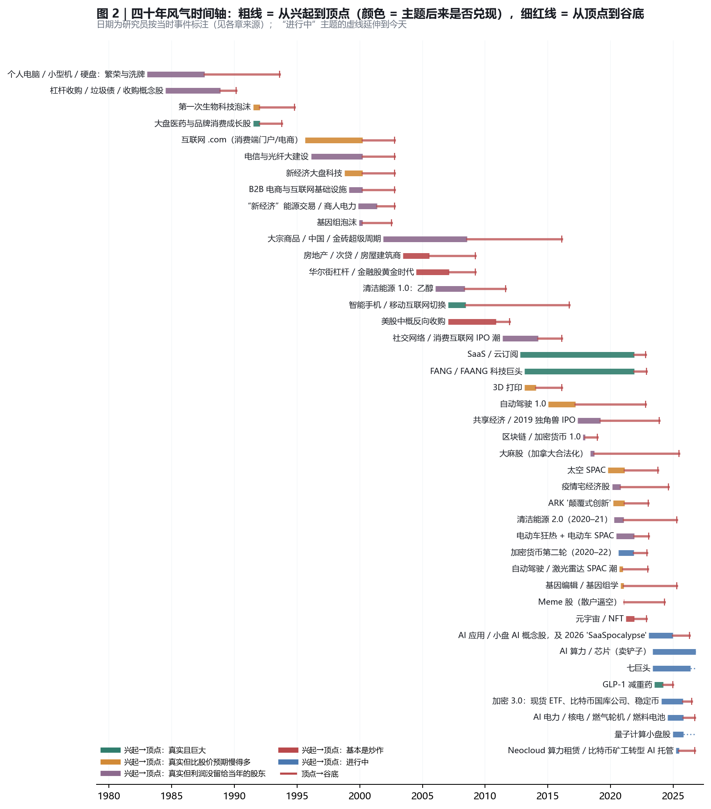
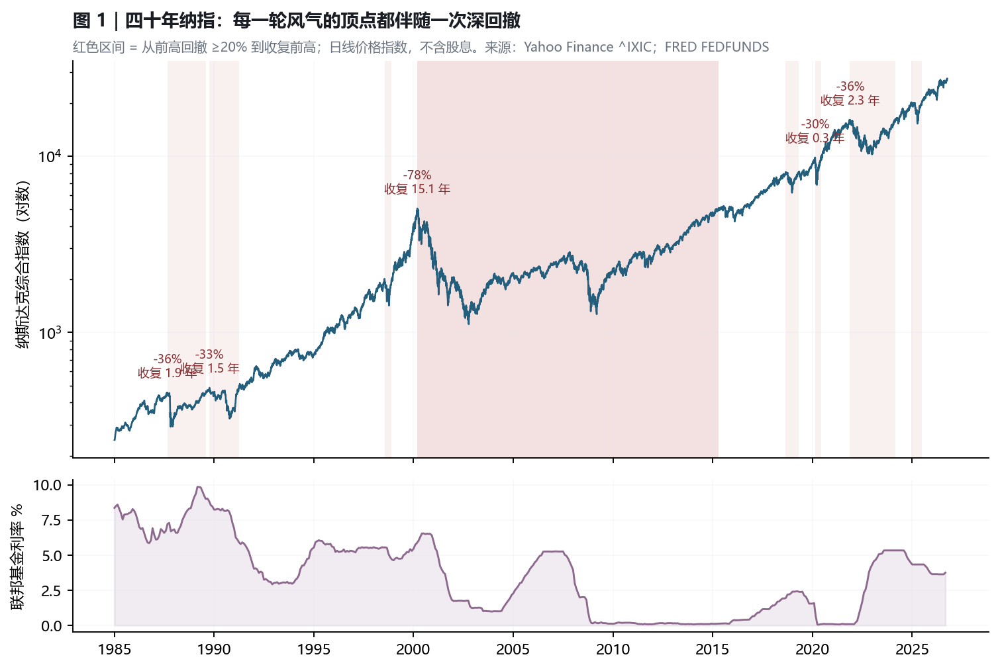
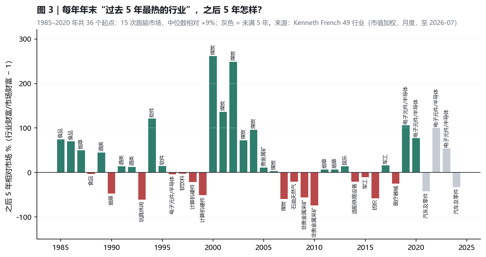
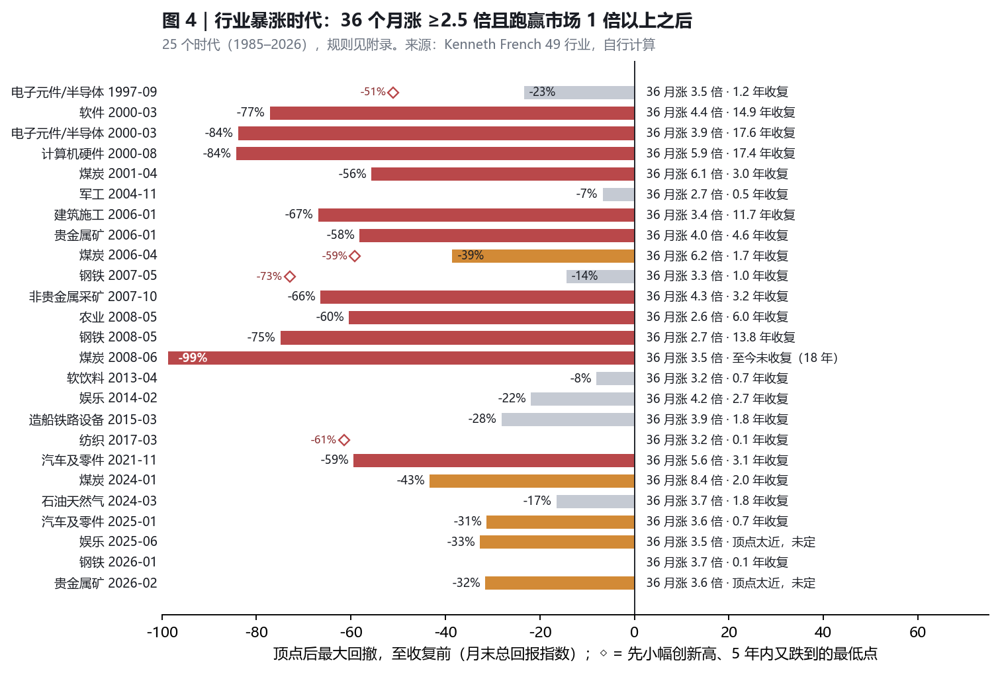
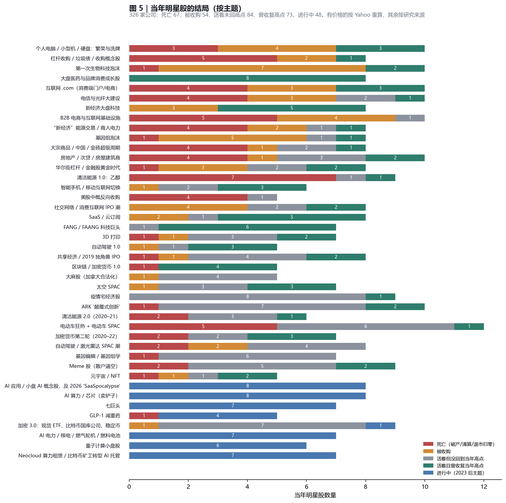
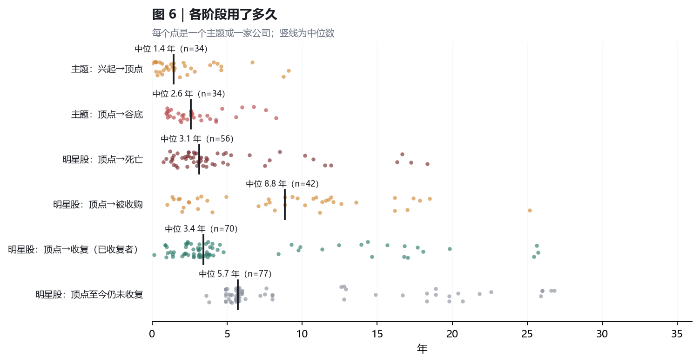
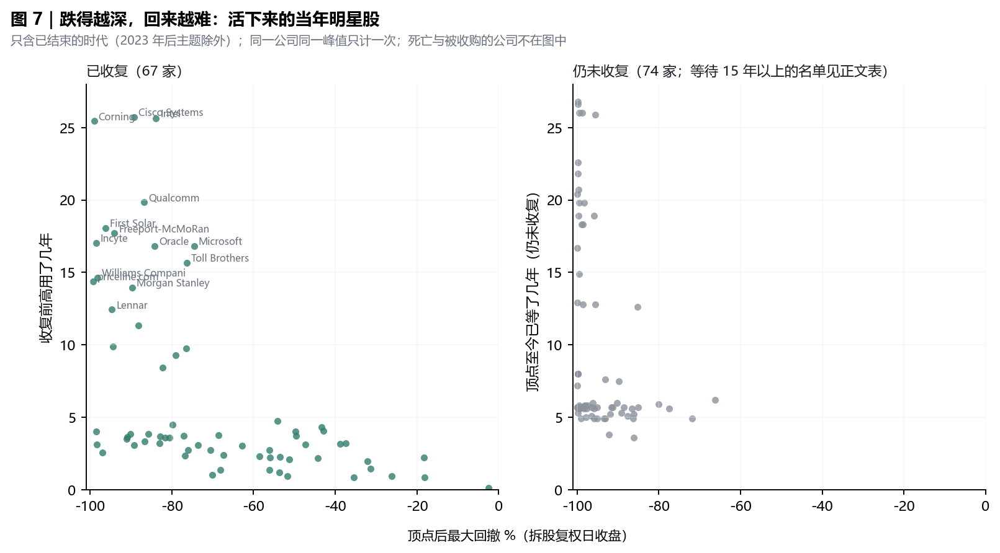

# 美股风气四十年

## 当年的明星，后来怎样了？

**1986–2026 兴衰、存活与用时统计 · 2026-10-06（价格截至 2026-10-05）**

{{AGG:n_themes}} 个投资风气 · {{AGG:n_companies}} 个“当年明星”席位（{{AGG:n_distinct_companies}} 家不同公司） · 纳指/标普 40 年回撤 · French 49 行业 1985–2026

**研究结论：40 年里，大多数风气所押的主题后来都是真的，但当年的明星股大多没有赚到钱。决定结局的通常不是“主题真不真”，而是三件事：谁拿到了利润池，公司靠不靠持续融资活着，以及买入时价格已经预支了多少年。**

本报告把“当年的风气”拆成三层来量：

- **市场层**：指数每次大回撤，要多久才回到前高；
- **行业层**：用不挑股票的行业组合，回答“最热的行业之后怎样”，这一层没有幸存者偏差；
- **公司层**：按当年的名单逐家追踪，查明哪些死了、哪些被收购、哪些活着却回不去，以及每一步用了多久。

事实都附来源，价格一律用 Yahoo 日线重算。研究资料，不构成投资建议。

<!-- PAGEBREAK -->

## 1. 先看结论

### 七个数字

1. **风气冲顶快，退潮也快。** 一个风气从兴起到顶点，中位数只有 **{{YRS:median_months_rise}} 年**；从顶点到谷底，中位数 **{{YRS:median_months_bust}} 年**。
2. **当年明星的结局：大约四个里只有一个“活着且曾回到高点”。** 已经结束的 {{AGG:n_closed}} 个明星席位里：
   - 死亡 **{{PCT:dead}}**（破产、清算、退市归零）；
   - 被收购 **{{PCT:acquired}}**，大多数收购价远低于当年高点；
   - 活着但从没回到当年高点 **{{PCT:survived_below_peak}}**；
   - 曾经收复高点 **{{PCT:survived_new_high}}**。

   到今天，有价格可查的 {{AGG:n_survivors_priced}} 个幸存席位里，只有 **{{AGG:n_survivors_now_above_peak}}** 个现价高于当年的峰值。
3. **跌得越深，回来越难。** 活下来的公司里：
   - 顶点后跌 50–80% 的，{{DDB:1.rate}} 后来收复了高点，中位用时 {{DDB:1.median_years_to_recover}} 年；
   - 跌 80–90% 的，收复率降到 {{DDB:2.rate}}；
   - 跌 95% 以上的，只有 {{DDB:4.rate}} 收复，收复者的中位用时是 **{{DDB:4.median_years_to_recover}} 年**。死掉的公司还不在这个统计里。
4. **死得快，卖得慢，回本更慢。**
   - 死亡的明星股，从顶点到死亡中位 **{{YRS:median_months_peak_to_death}} 年**；
   - 被收购的，从顶点到被收购中位 **{{YRS:median_months_peak_to_acquired}} 年**；
   - 收复高点的，中位用时 {{YRS:median_months_to_recover}} 年。但分布是两极的：2020 年代的浅跌 2–4 年就回来了，2000 年那批大盘科技用了 17–26 年（Microsoft 16.8 年，Cisco 25.7 年）。
5. **大多数风气押的主题是真的，只是比股价预期慢得多。** 已有结论的风气里，被判为“基本是炒作”的只有 5 个；最常见的判定是“真实，但利润没留给当年的股东”。主题从兴起到兑现，中位 {{TTR_MEDIAN}} 年；互联网、光纤、基因组、光伏、商人电力这类基础设施浪潮，用了 16–28 年。
6. **主题对了，只在一种情况下明星股也对。** 在“真实且巨大”的主题里（1990 年代初的大盘医药与品牌股、智能手机、FANG、SaaS、GLP-1），明星股收复高点的比例约 73%；其他各类只有 16–28%。差别在于，前者的龙头在风气开始时就已经盈利，或者很快就能盈利。
7. **指数会回来，当年的明星不一定。** 纳指 2000 年跌了 78%，用 15.1 年回到前高；标普只用了 7.2 年。指数能回来，靠的是成分股的新陈代谢：死掉的公司被剔除，新的赢家被纳入。行业层面也一样：在某个行业已经“明显暴涨”的第一个月买入，19 次里有 13 次在之后 5 年跑输市场，8 次连本金都亏了。

### 三个问题：用这份研究看下一个风气

| 问题 | 历史上的分水岭 | 例子 |
|---|---|---|
| 这个主题是真的吗？要几年才兑现？ | 基础设施类 16–28 年；消费应用类 4–7 年；“利好兑现日”常常就是顶点 | 电商占零售 10% 用了 20 年；加拿大大麻合法化当天就是股价顶点 |
| 利润池最后落在谁手里？ | 平台方和已经盈利的龙头 vs. 中介、渠道、借壳的公司、靠融资活着的公司 | 苹果 vs 诺基亚；礼来 vs 诺和诺德；Palantir vs C3.ai；B2B 交易所全军覆没 |
| 价格已经预支了多少年？ | 好公司在顶点买入，也要 14–26 年才能回本 | Cisco、Intel、Corning 收复 2000 年高点都用了约 25 年 |

<!-- PAGEBREAK -->

## 阅读地图

| 章节 | 回答什么问题 |
|---|---|
| 1 结论 | 七个数字，三个问题 |
| 2 方法 | 三把尺子；篮子怎么选；结局怎么判定；怎么防止代码复用 |
| 3 四十年时间轴 | 每个风气什么时候起、什么时候顶、什么时候底，用了多久 |
| 4 市场层 | 纳指、标普每次大跌，要多久回来；利率扮演什么角色 |
| 5 行业层 | 最热的行业之后 5 年怎样；行业暴涨时代的结局（没有幸存者偏差） |
| 6 公司层 | 死亡、被收购、活着、收复的比例和用时；跌幅与收复率；主题是否兑现 |
| 7–13 分时代 | 1985–94 / 1995–2002 / 2003–11 / 2012–19 / 2020–22（上、下）/ 2023–26，每个风气一张明星股结局表 |
| 14 规律 | 什么样的风气会死，什么样的会活；顶部信号清单；用时规律 |
| 15 对照今天 | AI 这一轮出现了哪些历史信号，哪些还没有出现 |
| 附录 | 年度最热行业表、方法细则、数据问题与陷阱、复跑说明 |

## 2. 怎么量：三把尺子

“当年的风气后来怎样了”很容易被回忆骗：今天还记得的，大多是活下来的公司。所以本研究用三把相互约束的尺子：

| 层 | 量什么 | 数据 | 优点 | 局限 |
|---|---|---|---|---|
| 市场层 | 纳指、标普每次 ≥20% 回撤的深度与收复用时 | Yahoo 日线价格指数，1985–2026 | 客观、完整 | 指数会剔除死掉的公司，掩盖个股 |
| 行业层 | 最热的行业之后 5 年怎样；行业暴涨时代的结局 | Kenneth French 49 行业，月度含股息，1981-01 至 2026-07 | **不挑股票，没有幸存者偏差** | 行业不等于主题（如“元宇宙”不是一个行业） |
| 主题/公司层 | 每个风气兴起、见顶、谷底的时间；当年明星股后来的生死与用时 | 7 组研究员按统一口径整理，带来源；有价格的公司用 Yahoo 日线重算 | 直接回答“哪些活了、哪些死了” | 篮子由人挑，已退市公司的价格常缺失 |

**公司层的四条规则**

1. **篮子按当年的口径来选**，不用今天的眼光挑。依据是当时的名单：ARKK 2021-01 的前十大持仓、Robinhood 2021-01-28 限制买入的 8 只股票、2000 年的“纳指四骑士”、Cramer 2013 年提出的 FANG 等，并刻意保留输家。每个主题的选法写在数据文件 `basket_method` 里。
2. **结局分五类**，截至 2026-10-05：
   - 死亡：破产、清算，或退市后股权基本归零；
   - 被收购：记录收购价相对峰值的比例；
   - 活着但没回到当年高点；
   - 活着且已创新高；
   - 进行中：2023 年以后的主题。
3. **价格一律重算。** 有 Yahoo 价格的公司，峰值、回撤、收复都用日线收盘价重算。“回到当年高点”按拆股复权价，不含股息，即大众说的“回本”；“持有至今的倍数”按含股息的复权价。研究员给出的峰值价只用来交叉核对。
4. **防止代码复用。** 同一个代码可能后来属于另一家公司，比如今天的 BBBY 是原 Overstock，SPWR 是 Complete Solaria，LAZR 是一只 ETF。核对方法有两种：用 Yahoo 价格加拆股倍数还原名义峰值，和研究员的峰值价比对；研究员判定已死、但 Yahoo 还有报价的，标记为冲突，结局按研究员的来源判定。

**“主题后来是否兑现”分五档**：真实且巨大 / 真实但比股价预期慢得多 / 真实但利润没留给当年的股东 / 基本是炒作 / 进行中。判定依据是采用率、收入、监管批准这类非股价证据，每条都附来源。**兑现用时**指从风气兴起到这些证据出现所隔的年数。

**这份研究不能回答的**：它不能告诉你下一个风气是什么，也不能证明某只股票会涨或跌。它只统计过去 40 年“被炒成风气”这件事本身的结局分布。不构成投资建议。

<!-- PAGEBREAK -->

## 3. 四十年时间轴：每个风气起于何时、顶于何时、底于何时



{{TABLE:themes}}

口径：兴起、顶点、谷底三个日期由研究员按当时的标志事件标注（来源见第 7–13 章及数据文件）；“兴起→顶点”“顶点→谷底”是两个日期之差。“明星股结局”一列是缩写：死=死亡，购=被收购，未回=活着但没回到当年高点，曾回=活着且曾收复高点，进行=进行中（2023 年后的主题）。进行中主题的“顶点”是到目前为止的高点，不计入用时中位数。

从时间轴能看出三个现象：

1. **风气是成群出现的。** 1999–2000、2006–2008、2020–2021 这三段，同时有 5–10 个风气在冲顶，背后是同一笔便宜的钱。2021 年最极端：宅经济、meme、ARK、元宇宙、加密、电动车 SPAC、激光雷达、太空、清洁能源、基因编辑，十个风气在 12 个月内先后见顶。
2. **冲顶短，兑现长。** 粗线（兴起到顶点）大多只有 1–2 年；但主题真正兑现常常要 10–28 年，见第 6.4 节。股价在第一段就把后面几十年都定价了。
3. **同一个主题会被炒好几轮。** 加密有 2017、2021、2024–25 三轮；清洁能源有 2007 和 2021 两轮；自动驾驶有 2015–18 和 2020–21 两轮；“电力”有 2000 年的商人电力和 2024 年的 AI 电力。每一轮的明星大多是新面孔，上一轮的明星很少能在下一轮重新领涨。

<!-- PAGEBREAK -->

## 4. 市场层：每一轮顶点之后，指数要多久回来



1985 年以来，纳指出现过 8 次 ≥20% 的回撤，标普 500 出现过 5 次。下表的“收复”指收盘价第一次回到前高。用的是价格指数，没有计入股息，所以算出的用时比持有人实际经历的略长。

{{TABLE:market}}

看三件事：

1. **真正的灾难只有一次。** 2000 年纳指跌了 78%，花了 **15.1 年** 才回到前高，纳指 100 用了 15.6 年。其他回撤都在 2.3 年内收复，包括 2022 年的 -36%。差别在于顶点时被买入的东西：2000 年买的是大量没有利润的公司，2022 年指数的权重主要在有利润的巨头身上。
2. **利率是开关，不是原因。** 1999-06 到 2000-05 美联储加息 175bp，2004–06 年加了 425bp，2022 年加了 425bp，每一轮风气都在加息周期中或之后见顶。但 2023 年利率在 5% 以上时，AI 行情照样启动。利率决定的是“没有利润的远期故事”值多少钱。
3. **指数掩盖了个股。** 2000 年那轮，标普只用了 7.2 年就收复前高，但当年的明星股大多再也没有回来，第 8 章会逐个列出。指数能回来，靠的是成分股的新陈代谢：死掉的公司被剔除，新的赢家被纳入。

## 5. 行业层：最热的行业，之后五年怎样？

这一层用 Kenneth French 的 49 个行业组合，月度、市值加权、含股息（[数据说明](https://mba.tuck.dartmouth.edu/pages/faculty/ken.french/Data_Library/det_49_ind_port.html)）。它有一个公司层做不到的好处：**不挑股票，因此没有幸存者偏差**。当年破产的公司，也按当时的权重算在行业回报里。

### 5.1 每年年末，“过去 5 年最热”的行业



1985–2020 年共有 36 个年末起点（之后都有完整的 5 年数据）：

- 之后 5 年跑输市场的有 **15 次**，跑赢 21 次。中位数是 **跑赢 9%**，在 49 个行业里中位排第 18。
- 同期“过去 5 年最冷”的行业，中位数是跑输 4%。冷门行业跑赢热门行业只有 14 次。
- **所以，“热门行业之后一定反转”这个说法，数据不支持。** 行业层面平均略有惯性。
- **但输的时候很惨**：1990 年的烟草（-47%）、1993 年的玩具（-61%）、1999 年的计算机硬件（-51%）、2007 年的煤炭（-60%）、2009–10 年的采矿（-56% 和 -74%）、2016 年的纺织（-58%）。

区别在于“热”的性质。1985–92 年的热门行业是食品、酒类、烟草这类利润稳定的消费品，它们的热来自盈利，而不是想象。真正崩掉的，都是被炒成风气的科技和资源行业。注意，相邻年份的起点高度重叠，36 个起点里真正独立的样本大约只有 8–10 个。

### 5.2 行业暴涨时代：36 个月涨 ≥2.5 倍、且跑赢市场 1 倍以上

为了找出真正“被炒成风气”的行业，换一个更严格的规则：某个行业 36 个月的总回报 ≥2.5 倍，同时相对市场 ≥2.0 倍，就算出现一次信号。连续的信号串成一个“暴涨时代”。顶点之后一旦回撤 ≥30%，这个时代就算结束。



{{TABLE:booms}}

1985–2026 年共 25 个暴涨时代：

- **16 个以 ≥30% 的回撤收场。** 这 16 个里，中位回撤 **-60%**，从顶点到谷底中位 **16 个月**，13 个已收复，中位用时 **55 个月（约 4.6 年）**。
- 最慢的三个都在 2000 年：软件 14.9 年，电子元件/半导体 17.6 年，计算机硬件 17.4 年。最惨的是 2008 年的煤炭：跌了 99%，18 年后仍未收复，这期间美国三大煤企全部破产（第 9 章）。
- **顶点是事后才知道的。** 更公平的检验是：在第一个信号月（当时就能看出“已经暴涨了”）买入，持有 5 年。有完整 5 年数据的 19 次里，**13 次跑输市场，中位数跑输 20%，8 次连本金都亏了**，持有期间相对买入价的最大浮亏中位数是 -42%。
- 但也有大赢家：1995 年的半导体（5 年 5.3 倍）、2000 年的煤炭（5.6 倍）、2005 年的采矿（2.7 倍）。**追涨暴涨中的行业，像一张中位数为负的彩票。**

口径：月末总回报指数，月内极值更深；完整的年度“最热行业”表见附录 B。

<!-- PAGEBREAK -->

## 6. 公司层：当年的明星，后来怎样了

### 6.1 结局：五类的比例



{{TABLE:agg}}

口径：一家公司如果在多个风气里都是明星（例如 Tesla 同时出现在 ARK、电动车、七巨头、自动驾驶四个风气里），每个风气各计一次，因为各自的峰值和买入时点不同。去重后共 {{AGG:n_distinct_companies}} 家不同的上市公司。FTX、Celsius、Cruise、Argo AI、Uber ATG、Waymo 这 6 个非上市主体保留在各章表格里作为背景，不计入统计。

- **1985–1994 年已经尘埃落定。** 30 多年过去，“活着但回不去”这一类已经清零：明星股要么死亡（25%），要么被收购（36%），要么收复了高点（39%）。今天“活着但回不去”的公司，时间拉长以后，大多也会落进这三类之一。
- **2003–2011 年死得最多（43%）。** 杠杆、大宗商品和造假是这一时代的三大死因。
- **1995–2002 年被收购得最多（37%）。** 大多是以峰值的零头被买走：Inktomi 是峰值的 0.7%，Sun 约 4%，HGS 约 13%。
- **2012–2019 年收复得最多（45%）。** 这一时代的明星里有 FANG 和 SaaS 龙头，而且它们在 2021 年的流动性狂潮里被再次推高。
- **2020–2022 年的明星，一半以上活着却回不去。** 这批公司大多还在交易，但普遍跌了 80–99%，其中不少做过反向拆股。

### 6.2 各阶段用了多久



- **主题从兴起到顶点**：中位 {{YRS:median_months_rise}} 年。最快的是 meme 股，只用了 15 天；最慢的是 FANG 和 SaaS，约 9 年。
- **主题从顶点到谷底**：中位 {{YRS:median_months_bust}} 年。
- **明星股从顶点到死亡**：中位 {{YRS:median_months_peak_to_death}} 年。最快的是 Pets.com，从上市到清算只有 9 个月；最慢的拖了十几年，比如 SunPower 撑到 2024 年。
- **明星股从顶点到被收购**：中位 {{YRS:median_months_peak_to_acquired}} 年。被收购往往不是“救赎”，而是在长期下跌之后以折价离场。
- **收复当年高点的明星股**：中位 {{YRS:median_months_to_recover}} 年，但分成两群：一群 2–5 年（多为 2010 年代以后的浅跌），另一群 14–26 年（2000 年和 2008 年那两批）。

### 6.3 跌得越深，回来越难



{{TABLE:dd_buckets}}

口径：只统计活下来的明星股（死亡和被收购的不在内），时代限于 2023 年以前，同一公司同一峰值只计一次，共 {{AGG:n_dd_bucket_companies}} 个。收复指拆股复权后的日收盘价重新超过当年的峰值。

这张表是整份研究里最接近“规律”的结果：**回撤深度几乎决定了回本的概率。** 跌 50–80% 的大多能回来；跌过 95% 的，七个里大约只有一个能回来，而且要等十几年。原因不复杂：跌 95% 意味着要涨 20 倍才能回本，这通常需要公司换一门生意，比如 Priceline 变成 Booking、Incyte 从基因组数据库转型做新药、Corning 靠 AI 光连接。

等了 15 年以上仍未收复的明星股：

{{TABLE:long_unrec}}

### 6.4 主题是真的吗？兑现用了多久

{{TABLE:verdict}}

{{TABLE:ttr}}

口径：“兑现”指出现采用率、收入、监管批准这类非股价证据，每一项的标志和来源都在表里。“兑现用时”从风气兴起算起。已有结论的风气里，兑现用时中位 {{TTR_MEDIAN}} 年（n={{TTR_N}}）。

两个要点：

1. **“真实但利润没留给当年的股东”是最常见的结局。** 互联网基础设施、光纤、光伏、大宗商品、大麻、电动车、疫情宅经济都属于这一类：需求真的来了，但被供给过剩、价格战、后来者或上游吃掉了。
2. **“基本是炒作”的明星股，收复率并不比“真实主题”低。** 原因是炒作股常常在**下一次狂热**里短暂回到高点：2017 年的区块链改名股（Riot、MARA、Kodak、Overstock）全部在 2020–21 年回到过高点，之后又跌回去。收复过，不等于持有的人赚到了钱。

<!-- PAGEBREAK -->

## 7. 1985–1994：技术是真的，钱没留给当年的股东

沃尔克压下通胀以后，联邦基金利率从 1984 年的 11% 降到 1986 年的 6.6%（[FRED](https://fred.stlouisfed.org/series/FEDFUNDS)）。中间被打断过两次：1987-10-19 股灾，道指单日跌了 22.6%；然后是储贷危机，RTC 最终关闭了 747 家储贷机构（[Fed History](https://www.federalreservehistory.org/essays/savings-and-loan-crisis)）。1990–91 年衰退之后，美联储把利率降到 1992 年底的 2.9%，这笔便宜钱催生了 1991–92 年的生物科技 IPO 窗口和大盘成长股行情。1994-02 开始加息，小盘成长股在 1994 年见底。

这个时代已经过去 30 多年，所有结局都已尘埃落定：**36 家明星股里，没有一家处在“活着但回不去”的中间状态。** 要么死了，要么被收购，要么收复了高点。

### 7.1 个人电脑、小型机与硬盘（1983-01 → 1987-08 → 1993-08）

- **起点**：1983-01《时代》周刊把“年度人物”换成了“年度机器”，也就是个人电脑。
- **利润被“标准化”拿走了。** IBM PC 用的是外购的 Intel 芯片和微软的 DOS，兼容机一拥而上，价格战打穿了硬件的利润。小型机厂商则被 PC 和工作站整体替代。
- **顶部信号**：硬盘厂 MiniScribe 把约 2.6 万块砖头装进硬盘箱，当作库存发往新加坡（1989 年）。行业的供给过剩，已经到了要靠造假撑业绩的程度。
- **结局**：
  - Wang 1992 年破产，旧股注销（[SEC](https://www.sec.gov/Archives/edgar/data/0000104519/000095013595002027/0000950135-95-002027.txt)）；
  - Commodore 1994 年被摘牌并清算；
  - DEC 1998 年被 Compaq 收购，作价约为 1987 年高点的 30%（[SEC](https://www.sec.gov/Archives/edgar/data/28887/0000950172-98-000075.txt)）；
  - IBM 从 1987 年的高点跌了 77%，用了 9.8 年才收复。
- **兑现**：2000 年美国 51% 的家庭有电脑，是 1984 年的五倍以上（[Census](https://www.census.gov/content/dam/Census/library/publications/2001/demo/p23-207.pdf)）。技术完全兑现，但 10 家明星里 3 家死亡、4 家被收购。真正的赢家，是卖“铲子”的微软。

{{TABLE:theme:pc_minicomputer}}

### 7.2 杠杆收购与垃圾债（1984 → 1988-11 → 1990-02）

- **机制**：Drexel 的“高度确信函”承诺为敌意收购找到融资，垃圾债从此成了收购的武器。
- **顶部信号**：
  - 1988 年 RJR Nabisco 的争夺战，以 KKR 每股 $109、总价 250 亿美元收场；
  - 目标公司为了自保，主动给自己加杠杆：Kroger 发了约 53 亿美元垃圾债，给股东派每股 $40 的现金。
- **转折**：1989-10-13，UAL 每股 $300 的收购没有募齐银行贷款，交易破裂，道指当天跌了 6.9%。随后 Campeau 旗下的 Federated 破产（1990-01），Drexel 和 Integrated Resources 在 1990-02-13 同一天申请破产，First Executive 成为当时最大的保险公司倒闭案（1991-04）。
- **意外：这个风气的赢家，是被收购公司的老股东。** RJR 的股东拿到 $109，Federated 的股东拿到 $73.50。输家是收购方、垃圾债的买家和经销商。UAL 熬过了 1994 年的员工持股重组，最后在 2006 年破产重整时旧股被注销（[SEC](https://www.sec.gov/Archives/edgar/data/100517/000110465906005256/a06-3892_18k.htm)）。
- **长期看**：杠杆收购作为一种生意活了下来（Blackstone 2007 年上市），但 1980 年代的那套垃圾债体系几乎全军覆没。

{{TABLE:theme:lbo_junk}}

### 7.3 第一次生物科技泡沫（1991 → 1992-01 → 1994-10）

- **起点**：Amgen 的 Epogen（1989）和 Neupogen（1991）获批，“下一个 Amgen”的故事开始了。1991 年，Immune Response 从 $2 7/8 涨到 $62 3/4，Synergen 从 $3 5/8 涨到 $70 3/4。
- **顶部信号**：融资窗口大开，1991–92 年生物科技公司公开发行募资 37 亿美元；1992-01 Synergen 的 CEO 和多名高管在 $65–73.50 之间卖出股票。
- **破灭**：Centocor 的脓毒症药 1992 年被 FDA 认为证据不足，1993 年 III 期失败（[SEC](https://www.sec.gov/Archives/edgar/data/708823/0000950130-94-000565.txt)）；Synergen 1993 年 III 期失败，单日跌掉 $29；Gensia 1994 年失败。
- **意外：被炒的药全部失败了，真正值钱的是“第二个分子”。**
  - Centocor 当时还在早期试验的 CenTNF，就是后来的 Remicade。1999 年 J&J 收购 Centocor 的价格，花了 7 年才回到 1992 年的高点。
  - Synergen 以约为高点 12% 的价格被 Amgen 收购，它失败的那个分子，后来作为类风湿药 Kineret 获批（[SEC](https://www.sec.gov/Archives/edgar/data/730358/0000950150-94-000746.txt)）。
  - Xoma 活了 34 年，两次反向拆股合计 1 换 300，2026-07 被收购时，折合 1992 年的原始股只值约 $0.13（[SEC](https://www.sec.gov/Archives/edgar/data/791908/000119312526302648/d165297d8k.htm)）。

{{TABLE:theme:biotech1}}

### 7.4 大盘医药与品牌消费股：“新漂亮 50”（1991 → 1992-01 → 1993-10）

- **怎么跌的**：
  - 医改预期：1992-01 到 1993-10，制药股经市场调整后跌了 52%，跌幅与克林顿医改方案的进展同步（[Ellison & Mullin](https://economics.mit.edu/research/publications/gradual-incorporation-information-pharmaceutical-stocks-and-evolution)）；
  - 1993-04-02“万宝路星期五”：Philip Morris 把万宝路降价 20%，当天股价跌了 26%，品牌股跟着一起跌。
- **结局**：本时代唯一没有任何死亡的篮子。8 家公司的回撤在 18–50% 之间，全部在 0.9–4.3 年内收复了高点。
- **这是“估值杀”和“业务被颠覆”最清楚的对照。** 前者是好生意遇上坏价格或政策冲击，几年内就回来了；后者是 Wang、DEC、Commodore，再也没有回来。

{{TABLE:theme:bluechip_growth_1992}}

<!-- PAGEBREAK -->

## 8. 1995–2002：互联网泡沫，40 年里最大的一次

1996-12，格林斯潘问市场是否处于“非理性繁荣”（[Fed](https://www.federalreserve.gov/boarddocs/speeches/1996/19961205.htm)），之后市场又涨了三年多。1998 年秋 LTCM 危机，美联储连降三次息，给最后一段狂热注入了流动性。1999 年美国有 476 家 IPO，首日平均涨 71%（[Ritter](https://site.warrington.ufl.edu/ritter/files/IPO-Statistics.pdf)）。

1999-06 到 2000-05，美联储加息六次到 6.5%。纳指在 2000-03-10 收于 5,048.62 见顶，2002-10-09 跌到 1,114，跌幅 78%。2001–2002 年，安然、世通的会计丑闻又把熊市拖长了一年。收尾的是《萨班斯-奥克斯利法案》，以及十家投行因研究报告利益冲突缴纳的 14 亿美元和解金（[SEC](https://www.sec.gov/news/press/2003-54.htm)）。

### 8.1 消费互联网 .com（1995-08 → 2000-03 → 2002-10）

- **赌什么**：上网的人会把注意力和购物全部搬到网上，先圈用户，利润以后再说。
- **起点**：1995-08 Netscape IPO 首日翻倍。
- **怎么死的**：资本市场 2000-03 关门，靠烧钱活着的公司无法再融资，现金一耗尽就倒闭。Pets.com 上市 9 个月即清算。需求也远远没跟上：1999Q4 线上零售只占美国零售的 0.6%。
- **兑现用了 20 年**：电商占美国零售的比例到 2019Q1 才首次达到 10%（[FRED](https://fred.stlouisfed.org/series/ECOMPCTSA)）。方向完全正确，时间表错了 15 年。
- **结局**：10 家里，Pets.com、Webvan、eToys、theGlobe 死亡；Netscape、AOL、Yahoo 被收购；Amazon、eBay、Priceline 活了下来。Amazon 跌了九成以上，到 2009-10 才回到 1999 年的高点。

{{TABLE:theme:dotcom_consumer}}

### 8.2 新经济大盘科技：纳指四骑士（1998-10 → 2000-03 → 2002-10）

- **赌什么**：卖“铲子”的大公司（PC、芯片、路由器、服务器、数据库）会随互联网无限增长，所以 100 倍市盈率买的也是确定性。
- **业务是真的，杀死股价的是估值和“客户先死”**。下游的 .com 和新兴电信运营商成批倒闭，订单断崖。Cisco 在 2001 年计提了 22.5 亿美元的超额库存损失。
- **收复用时**（日收盘价回到 2000 年高点）：Microsoft 16.8 年，Oracle 16.8 年，Qualcomm 19.8 年，Intel 25.6 年，**Cisco 25.7 年**（2025-12）。Sun、EMC 和旧 Dell 在收复之前就被收购了，Sun 的收购价只有 2000 年高点的约 4%。
- **判定**：这是“好公司 ≠ 好价格”最清楚的例子。8 家没有一家破产，但在顶点买入的人，要等 14–26 年才能回本，或者在回本之前就被以折价收购。

{{TABLE:theme:bigtech_horsemen}}

### 8.3 电信与光纤大建设（1996-02 → 2000-03 → 2002-10）

- **赌什么**：1996 年电信法放开竞争，互联网流量“每 100 天翻一番”。谁先铺满光纤，谁就吃下无限的带宽需求。
- **怎么死的**：
  - 供给泛滥。行业 5 年投入超过 5,000 亿美元，很多是设备商借钱给客户买自己的设备。新增长途光纤容量的利用率不到 2%（Brookings 2002）。
  - 需求被神话。实际流量大约每年翻一番，增长很快，但远远消化不了超建（Odlyzko）。
  - 再加上欺诈。世通把约 110 亿美元费用做成了资本开支。
- **兑现用了 28 年**：当年超建的长途光纤，到 2024 年才因为 AI 数据中心重新变得稀缺（Lumen 2024-08 的 50 亿美元光纤订单，[SEC](https://www.sec.gov/Archives/edgar/data/18926/000119312524193967/d858658dex991.htm)）。
- **结局**：10 家里，世通、Global Crossing、Nortel、360networks 破产；只有 Corning 在 2026-02 突破了 2000 年的高点，用了 25.4 年。

{{TABLE:theme:telecom_fiber}}

### 8.4 B2B 电商与互联网基础设施（1999-02 → 2000-03 → 2002-10）

- **赌什么**：企业采购会搬到第三方互联网“交易所”上，由 Commerce One、Ariba、VerticalNet 这类中介抽成；Exodus、Inktomi、Akamai 收“过路费”；CMGI 这类孵化器把这一切打包持有。十几只 1999 年中以后才上市的 B2B 股，6 个月里堆出了 1,250 亿美元市值（NYT 2000-05-07）。
- **商业模式被证伪**：GM、Ford、GE 等巨头自建了采购平台。企业间电子交易最终确实达到了万亿美元级，但主体是 ERP、EDI 和巨头的自建平台，不是当年的第三方交易所。
- **结局**：10 家里 5 家死亡，4 家以峰值的零头被收购（Inktomi 是峰值的 0.7%，Ariba 是 4.4%）。唯一还在上市的 Akamai，收入从 2000 年的 0.9 亿美元增长到 2025 年的 42 亿美元（约 47 倍），股价却 26 年都没回到 2000 年初的高点。

{{TABLE:theme:b2b_infra}}

### 8.5 基因组泡沫（1999-12 → 2000-03 → 2002-07）

- **赌什么**：人类基因组一测完，卖基因数据库、握基因专利的公司就会变成医药巨头。
- **怎么死的**：
  - 公共基因组计划在 24 小时内公开所有序列，“卖数据库”的稀缺性被釜底抽薪。2000-03-14 美英首脑声明数据应免费，当天生物科技指数跌了 12%。
  - 利好兑现即见顶：2000-06 宣布草图完成那天，Celera 反而下跌。
  - 2013 年最高法院裁定天然 DNA 不可专利（Myriad 案）。
- **兑现**：首批基因组时代新药在 2011 年获批，距峰值约 11 年；“千元基因组”在 2019 年实现，用了 19 年（[NHGRI](https://www.genome.gov/about-genomics/fact-sheets/DNA-Sequencing-Costs-Data)）。
- **结局**：8 家里 5 家以峰值的 9–29% 被收购。唯一创新高的 Incyte 靠的是转型做新药，不是基因组数据库。

{{TABLE:theme:genomics_2000}}

### 8.6 “新经济”能源交易与商人电力（1999-11 → 2001-05 → 2002-10）

- **赌什么**：电力放松管制后，交易平台（EnronOnline）和不受监管的商人电厂能把慢吞吞的公用事业变成高增长平台。
- **怎么死的**：
  - 欺诈加信用连锁：安然用特殊目的实体藏债，2001-12 破产。能源交易靠的是投资级信用，评级一降，交易对手就跑光。
  - 一部分繁荣本来就是假的。SEC 认定 Dynegy 用对倒交易虚增交易量。
  - 周期反转：高电价引发了建厂潮，带来过剩产能。
- **兑现用了 24 年**：“商人电力是高利润成长业务”这个股价假设，直到 2024–26 年 AI 用电潮才兑现：Vistra 2024 年涨了 258%，Constellation 在 2026-01 完成收购 Calpine。中间 20 年是 Mirant、Calpine、Dynegy 轮番破产。
- **对今天的意义**：今天的“AI 电力”主题（第 13 章），持有的正是当年这批资产的继承者。

{{TABLE:theme:energy_trading_merchant_power}}

<!-- PAGEBREAK -->

## 9. 2003–2011：同一笔便宜钱，吹了两个泡沫

2003-06 美联储把利率降到 1%，是 1958 年以来最低（[Fed](https://www.federalreserve.gov/boarddocs/press/monetary/2003/20030625/default.htm)）。2004-06 起连加 17 次到 5.25%。加息之后，房价先停涨，可调利率按揭随即重置。危机后利率回到零，QE2 又加了 6000 亿美元（[Fed](https://www.federalreserve.gov/newsevents/pressreleases/monetary20101103a.htm)），中国同时推出 4 万亿元刺激。这笔钱没有救活地产股，却让大宗商品股多涨了三年。

### 9.1 大宗商品 / 中国 / 金砖（2001-11 → 2008-07 → 2016-02）

- **赌什么**：中国需求永远不够，资源永远稀缺。起点是 2001-11 高盛 Jim O'Neill 提出 BRICs 这个词（[Goldman](https://www.goldmansachs.com/our-firm/history/moments/2001-brics)）。
- **需求是真的**：中国粗钢产量从 1999 年的 1.23 亿吨涨到 2011 年的 6.83 亿吨。铜价从 2003 年约 $1,650/吨涨到 2011-02 的 $9,881（[FRED](https://fred.stlouisfed.org/series/PCOPPUSDM)）。
- **顶部信号是在高位加杠杆收购**：Freeport 2007 年以 259 亿美元买 Phelps Dodge；Alpha 2011 年以 71 亿美元买 Massey；Cliffs 同年买 Consolidated Thompson。
- **怎么结束的**：高价把供给引了出来，美国原油产量从约 600 万桶/日增到近 1000 万桶/日，2016-02 WTI 收于 $26。煤企 Alpha（2015）、Arch 和 Peabody（2016）先后破产。Peabody 的重整计划写明旧股东不获分配（[PR Newswire](https://prnewswire.com/news-releases/amid-prolonged-industry-downturn-peabody-energy-takes-major-step-to-strengthen-liquidity-and-reduce-debt-through-chapter-11-protection-300250678.html)）。U.S. Steel 2008 年盘中最高 $196，17 年后日本制铁以每股 $55 收购。
- **判定**：真实，但利润没有留给当年的股东。Freeport 用了 17.7 年才回到 2008 年的价格高点；Transocean 至今只剩峰值的 3%。

{{TABLE:theme:commodities_bric}}

### 9.2 房地产 / 次贷（2003-06 → 2005-07 → 2009-03）

- **赌什么**：房价只涨不跌，住房自有率会一直上升。
- **顶部信号**：房屋建筑商板块 2005-07 就见顶了，比房价早一年。Wachovia 在高点以 255 亿美元收购 Golden West（[SEC](https://www.sec.gov/Archives/edgar/data/0000042293/000119312506122901/d425.htm)）；Icahn 出价 $22 收购 WCI 被拒，一年后 WCI 破产。
- **死亡顺序**：New Century（2007-04）→ Countrywide 以高点约一成的价格卖给美国银行（2008-07）→ IndyMac 被关闭（2008-07）→ 两房被接管（2008-09）→ WaMu 被查封（2008-09），这是美国史上最大的银行倒闭。
- **用时**：Case-Shiller 全国房价从 2006-07 跌到 2012-02，名义价格到 2017-01 才收复，用了约 10.5 年（[FRED](https://fred.stlouisfed.org/series/CSUSHPINSA)）。住房自有率至今没回到 2004 年的 69.2%。
- **意外**：同一个主题里，资产负债表决定生死。放贷机构几乎全军覆没，建房商 Toll 和 Lennar 却熬了过来并创了新高。

{{TABLE:theme:housing_subprime}}

### 9.3 华尔街杠杆（2004 → 2007-02 → 2009-03）

- **赌什么**：高杠杆加证券化，可以带来永久的高 ROE。2004 年 SEC 让五大投行进入自愿监管项目（CSE）。2008 年 SEC 主席自己承认这个项目“从一开始就有根本缺陷”（[SEC](https://www.sec.gov/news/press/2008/2008-230.htm)）。
- **结局**：
  - 贝尔斯登从收盘纪录 $171.51 被以 $10 收购；
  - 雷曼归零；
  - 美林被收购；
  - AIG 被美联储拿走 79.9% 股权（[Fed](https://www.federalreserve.gov/newsevents/pressreleases/other20080916a.htm)）；
  - 花旗跌破 $1 后做了 1 拆 10 的反向拆股。
- 只有高盛（9 年）和摩根士丹利（14 年）以低杠杆模式重新创高。花旗和 AIG 至今仍远低于 2007 年的高点。

{{TABLE:theme:wallstreet_leverage}}

### 9.4 清洁能源 1.0：乙醇（2006）→ 光伏（2007–08）

- **赌什么**：能源独立，加上“石油上瘾”的政治口号（2006 年国情咨文）。
- **当年的信号**：
  - 盖茨的基金 2005-11 投资 Pacific Ethanol（[SEC](https://www.sec.gov/Archives/edgar/data/0000778164/000101968705003131/pacificethanol_8k-111405.txt)）。
  - 2006-06 VeraSun 和 Aventine 同月上市，几个月后乙醇股跌了四成以上。
  - Suntech 市值约 160 亿美元，创始人被称为“太阳王”。
  - 光伏 ETF TAN 2008-04-15 上市，First Solar 一个月后见顶。**主题 ETF 发行，往往就是顶部。**
- **兑现情况**：全球光伏装机从 2007 年的 9 GW 增长到 2023 年约 1,419 GW，技术完全兑现，用了约 16 年。乙醇产量 6 年翻了 3.5 倍，纤维素乙醇则基本落空。
- **判定**：真实，但利润没有留给当年的股东。9 家明星里 7 家死亡，利润被中国产能和大宗价格压缩掉了。这是 40 年里最典型的“对的技术、错的股票”。

{{TABLE:theme:clean_energy_v1}}

### 9.5 智能手机切换（2007-01 → 2013）

- **赌什么**：手机变成电脑。
- **兑现**：iPhone 2007-01 发布，6 年后美国成年人的智能手机拥有率超过 50%（[Pew](https://www.pewresearch.org/internet/fact-sheet/mobile/)）。
- **输家用了多久**：诺基亚份额从 2007 年的 40% 到 2014 年把手机业务卖给微软，约 6.5 年；BlackBerry 美国份额从 2010 年的 37% 到 2016 年退出硬件，约 6 年；Palm 从发布 Pre 到卖给 HP 只用了 1.5 年。
- **判定**：真实且巨大，但赢家只有平台方（苹果、谷歌）。旧霸主即使活着，股价也只剩零头。

{{TABLE:theme:smartphone_transition}}

### 9.6 美股中概反向收购（2007 → 2010-11 → 2011-12）

- **赌什么**：中国增长，加上借壳上市的捷径。PCAOB 统计，2007-01 到 2010-03 共有 159 家中国公司借壳上市，是同期 IPO 数量的近 3 倍（[PCAOB](https://pcaobus.org/Research/Documents/Chinese_Reverse_Merger_Research_Note.pdf)）。
- **破灭信号是审计师接连辞任**：
  - 德勤 2011-03 辞任中国高速传媒；
  - 德勤 2011-05 辞任东南融通，辞任信里写着管理层承认“fake revenue… fake cash”（[SEC](https://www.sec.gov/Archives/edgar/data/1412494/000095012311052882/d82501exv99w2.htm)）；
  - 2011-06 SEC 发出投资者警示（[SEC](https://www.sec.gov/investor/alerts/reversemergers.pdf)）。
- **判定**：中国增长是真的，这批借壳载体的财务却大量造假。5 家里 4 家被摘牌。从热潮到死亡不到 2 年。

{{TABLE:theme:china_reverse_merger}}

<!-- PAGEBREAK -->

## 10. 2012–2019：零利率十年，独角兽在私募市场长大

联邦基金利率从 2008-12 起停在 0–0.25%，到 2015-12 才第一次加息。2012-09 美联储推出开放式 QE3。

制度上有两件事：

- 2012-04 的 JOBS Act 允许“新兴成长公司”秘密递交 IPO 文件，公司可以在私募市场停留更久；
- 2017-05 软银愿景基金带着超过 1,000 亿美元入场，把 Uber、WeWork 的私募估值推到极致。

这一时期的特点是：**涨幅大多发生在上市之前，公开市场在 2019 年接的是最后一棒。**

### 10.1 社交与消费互联网 IPO 潮（2011-05 → 2014-03 → 2016-02）

- **赌什么**：几亿用户加上社交关系图谱，会在移动时代变成长期的广告和订阅利润。
- **怎么结束的**：
  - 移动化让 Zynga（依附 Facebook 的 PC 端游戏）和 Groupon（依赖邮件团购）的模式失效；
  - 社交广告预算集中到了 Facebook/Instagram 一家；
  - 增速一放缓，估值就被腰斩：LinkedIn 2016-02-05 单日跌了 43.6%。
- **兑现**：社交广告变现完全兑现，但几乎只集中在一家。Meta 收入从 2012 年的 51 亿美元增长到 2025 年的 2,010 亿美元，而 Snap 2015–2025 年每一年都是营业亏损（[SEC XBRL](https://data.sec.gov/api/xbrl/companyfacts/CIK0001564408.json)）。
- **结局**：8 家里有 4 家以低于峰值的价格被收购：LinkedIn 是峰值的 71%，Twitter 是 73%，Zynga 和 Pandora 更低。Yelp 的收入增长了十倍并转为盈利，股价却比峰值低 82%。

{{TABLE:theme:social_ipo_2011_2017}}

### 10.2 FANG / FAANG（2013-02 → 2021-11 → 2022-11）

- 2013-02 Jim Cramer 在 CNBC 提出 FANG，2017 年加入 Apple，变成 FAANG。
- **这是 40 年里唯一一个“风气对、股票也对”的大型主题。** 巨头在 2013 年就已经盈利，兑现的是“规模加垄断”。
- 即便如此，FAANG 也经历了两次大回撤：2018Q4，以及 2022 年的 -55% 到 -77%。Meta 在 2022-11 跌了 77%，到 2024-01 才收复。
- 这个风气没有死，只是换了名字：2023 年变成了“七巨头”，用 Microsoft、NVIDIA、Tesla 换掉了 Netflix。
- 同期入选 NYSE FANG+ 指数的阿里巴巴和百度，至今仍远低于高点。“平台”这个标签本身不保证赢家通吃。

{{TABLE:theme:fang_2013_2022}}

### 10.3 SaaS / 云订阅（2012-10 → 2021-11 → 2022-10 / 2026）

- **赌什么**：企业软件改成按年订阅、云端交付，带来高留存的经常性收入，值得用市销率而不是市盈率来估值。Adobe 2013-05 停售盒装软件、全面转向订阅，被奉为转型教科书。
- **收入兑现得很快，利润兑现得很慢**：Salesforce 的 GAAP 营业利润直到 FY2024 才达到 50 亿美元，Workday 到 FY2024 才第一次 GAAP 营业盈利（[SEC XBRL](https://data.sec.gov/api/xbrl/companyfacts/CIK0001108524.json)）。
- **挨了两刀**：
  - 2022 年加息，把长久期的 SaaS 打掉六成以上；
  - 2026 年 AI 代理让“按席位收费”的模式受到质疑（SaaSpocalypse，见第 13 章）。
- **结局**：上一轮最成功的转型者 Adobe，在下一轮被定价为输家。**每个新风气都会重新给上一个风气的赢家定价。**

{{TABLE:theme:saas_cloud_2012_2021}}

### 10.4 3D 打印（2013-02 → 2014-01 → 2016-02）

- **赌什么**：3D 打印会走进每个家庭和工厂，引发“第三次工业革命”。
- **怎么死的**：
  - 家用 3D 打印机没有普及，桌面机业务被放弃；
  - 激进并购带来巨额商誉减值，Stratasys 2015 年营业亏损 13.7 亿美元；
  - 专利到期后，低价竞争者涌入。
- **12 年后，两大龙头的收入仍低于 2014 年**：3D Systems 从 6.54 亿美元降到 3.87 亿美元（[SEC XBRL](https://data.sec.gov/api/xbrl/companyfacts/CIK0000910638.json)）。技术在牙科、航空零件等利基领域是真的，但没有长成当年想象的大市场。
- **结局**：两大龙头的股价至今只剩峰值的 4–6%。

{{TABLE:theme:3d_printing_2013_2014}}

### 10.5 共享经济与 2019 独角兽 IPO（2017-05 → 2019-03 → 2023-11）

- **赌什么**：“先烧钱换规模，上市后再盈利”的平台（打车、共享办公、订阅健身、植物肉）能复制亚马逊的路径。
- **怎么结束的**：S-1 一公开，亏损就藏不住了。WeWork 2018 年收入 18 亿美元、亏损 16 亿美元，2019-09 撤回 IPO，2023-11 破产。Uber 上市首日破发，Lyft 的上市首日就是它的历史最高点。
- **只有把规模转成利润的 Uber 走了出来**：2023 年首次全年营业盈利，距 IPO 4 年，距创立约 14 年（[SEC XBRL](https://data.sec.gov/api/xbrl/companyfacts/CIK0001543151.json)）。Lyft 至今每年都在亏损。

{{TABLE:theme:unicorn_ipo_2019}}

### 10.6 区块链 1.0 改名潮（2017-10 → 2017-12 → 2018-12）

- **赌什么**：任何公司只要改名带上“Blockchain”，就能重新估值。
- **顶部信号**：2017-12-21 冰茶公司 Long Island Iced Tea 改名 Long Blockchain，股价盘中最高涨了 380%。Kodak 宣布发行 KodakCoin。兽医诊断公司 Bioptix 改名 Riot Blockchain。
- **结局**：
  - 比特币 2018-12 跌了约 83%；
  - Long Blockchain 2018 年被摘牌，2021 年被 SEC 注销登记，三人因改名前的内幕交易被起诉；
  - 比特币作为资产，在 2024 年通过现货 ETF 进入主流（用了 7 年）；
  - “企业区块链改变一切”的叙事至今没有兑现。

{{TABLE:theme:crypto_blockchain_v1_2017}}

### 10.7 大麻股（2018-05 → 2018-09/10 → 2025）

- **赌什么**：加拿大全面合法化，美国随后跟进，大麻会成为烟酒级别的消费品类。
- **需求当年就兑现了，利润从来没有出现**：加拿大 2018-10-17 合法化，当天就是行业股价的顶点。各家巨额扩产、高价并购、大量股权融资，Aurora 2020 财年亏损超过 33 亿加元。美国联邦层面至今没有合法化。
- **结局**：Tilray 从 IPO 两个月后的 $300 跌到个位数；主题 ETF MJ 到 2025-06 跌了约 97%；Aurora 复权后跌了 99.7%。

{{TABLE:theme:cannabis_2018}}

### 10.8 自动驾驶 1.0（2015-01 → 2017-03 → 2022-10）

- **赌什么**：L4/L5 无人驾驶会在 2018–2021 年大规模商用。
- **技术难度被系统性低估**：
  - 2018-03 Uber 测试车撞死行人；
  - Ford/VW 2022-10 关闭 Argo AI，Ford 计提 27 亿美元；
  - GM 2024-12 停止资助 Cruise；
  - 马斯克预言 2017 年底实现完全自动驾驶、2020 年有 100 万辆 Robotaxi，都没有兑现。
- **兑现用了约 11 年**：只有坚持了十几年的 Waymo 实现了规模商用，2026-06 每周约 50 万次付费出行（[Wikipedia](https://en.wikipedia.org/wiki/Waymo)，中等可信度）。从 Google 2009 年立项算，用了约 17 年。
- **结局**：当年的“自动驾驶股”NVIDIA 和 Tesla 后来大涨，但靠的是 AI 数据中心和电动车，不是自动驾驶。Mobileye 被 Intel 收购后在 2022 年重新上市，现价比再上市价还低。

{{TABLE:theme:autonomous_driving_v1_2015_2018}}

<!-- PAGEBREAK -->

## 11. 2020–2022（上）：零利率下的五个风气

2020-03 美联储把利率降到零，并宣布不设上限地购买国债和 MBS（[Fed](https://www.federalreserve.gov/newsevents/pressreleases/monetary20200323a.htm)）。M2 同比增速 2021-02 达到 26.9%（[St. Louis Fed](https://www.stlouisfed.org/en/financial-crisis/data/m2-monetary-aggregate)）。SPAC IPO 2020 年 248 家，2021 年 613 家。

零利率下，远期增长几乎不用打折，市场愿意今天就为 5–10 年后的故事付钱。2022-03 开始加息，一年加了 425bp。**越远期、越没有利润的故事，跌得越多。** 下面五个风气用的是同一笔钱，也都在 2022 年一起结束。

### 11.1 疫情宅经济（2020-02 → 2020-10 / 2021-02 → 2022–24）

- **赌什么**：疫情改变的生活方式会永久保留。
- **见顶信号**：2020-11-09 辉瑞公布疫苗有效率超过 90%，Zoom 当天盘中最多跌 20%（[Fortune](https://fortune.com/2020/11/09/stock-markets-soar-as-pfizer-reports-vaccine-hope)）。市场一天之内就承认，这些需求只是暂时的。
- **意外**：需求是真的，很多公司的收入至今还在增长。DocuSign 的收入从 14.5 亿美元增长到 32.2 亿美元，股价仍比峰值低七成以上。错不在需求，错在估值把一次性的需求当成了永久的增长率。Teladoc 在高位收购 Livongo，之后计提了 134 亿美元商誉减值。
- **判定**：真实，但利润没有留给当年的股东。9 家里只有 Netflix 收复过高点。

{{TABLE:theme:stay_at_home}}

### 11.2 Meme 股（2021-01-13 → 2021-01-28 → 2023–24）

- **当年的名单**：2021-01-28 Robinhood 限制买入的 8 只股票，即 GME、AMC、BB、BBBY、EXPR、KOSS、NAKD、NOK（[SEC 工作人员报告](https://www.sec.gov/files/staff-report-equity-options-market-struction-conditions-early-2021.pdf)）。
- **狂热的样子**：
  - GME 的空头仓位一度达到流通股的 123%；
  - 2021-01-27 一天之内，KOSS 涨 480%，AMC 涨 301%；
  - Koss 的高管趁高位卖股，套现约 4,500 万美元，比公司 2020 年的整体估值还高。
- **结局**：
  - BBBY 2023 年破产，股票被注销，股东一分钱都没拿到（[SEC](https://www.sec.gov/Archives/edgar/data/886158/000119312523247428/d579010d8k.htm)）；
  - Express 2024 年破产；
  - AMC 复权后跌了约 99.5%。
- **意外**：名单里后来创新高的两只都不是靠 meme。Nokia 靠的是数据中心网络业务；Robinhood 是给散户“卖铲子”的平台。
- **判定**：基本是炒作。从开始到顶点只有 15 天。

{{TABLE:theme:meme_stocks}}

### 11.3 ARK 颠覆式创新（2020-03 → 2021-02-12 → 2022-12-28）

- **当年口径**：ARKK 前十大持仓，取自 ARK 2021-01-31 的半年报（[SEC N-CSRS](https://www.sec.gov/Archives/edgar/data/1579982/000110465921043137/tm217753d2_ncsrs.htm)）。当时 ARKK 的净资产是 226 亿美元。
- **路径**：ARKK 2020 年涨了 149%，2021-02-12 见顶，22 个月后跌了 81%。到今天仍比峰值低四成左右。
- **意外**：技术真的会兑现。2023-12 FDA 批准了第一个 CRISPR 疗法（[FDA](https://www.fda.gov/news-events/press-announcements/fda-approves-first-gene-therapies-treat-patients-sickle-cell-disease)），但 CRSP 的股价仍比 2021 年的峰值低七成。估值早已把十几年后的结果提前算了进去。
- **判定**：真实，但比股价预期慢得多。前十大里 2 家创了新高，7 家仍在峰值以下，Invitae 破产。

{{TABLE:theme:ark_innovation}}

### 11.4 元宇宙 / NFT（2021-03 → 2021-11 → 2022-11）

- **顶部信号就是改名**：Facebook 2021-10-28 改名 Meta（[SEC](https://www.sec.gov/Archives/edgar/data/1326801/000132680121000071/fb-20211028.htm)）。三周之内，Roblox、Unity 和元宇宙 ETF 都到了收盘最高点。
- **NFT 的崩塌**：OpenSea 的单日成交额从 2022-05 的 27 亿美元，跌到同年 8 月的 934 万美元。
- **钱烧在哪里**：Meta 的 Reality Labs 部门 2020–2025 年累计经营亏损约 836 亿美元，2025 年的收入只有 22 亿美元（[Meta 10-K](https://www.sec.gov/Archives/edgar/data/1326801/000162828026003942/meta-20251231.htm)）。
- **判定**：基本是炒作。Meta 股价后来创了新高，靠的是广告和 AI，不是元宇宙。

{{TABLE:theme:metaverse_nft}}

### 11.5 加密第二轮（2020-08 → 2021-11 → 2022-11）

- **起点**：MicroStrategy 2020-08 用 2.5 亿美元买入比特币（[SEC](https://www.sec.gov/Archives/edgar/data/1050446/000119312520215604/d921849d8k.htm)）。Coinbase 2021-04 直接上市。
- **怎么死的**：一连串违约。Terra/UST 崩盘（2022-05）→ Celsius、Voyager 破产（2022-07）→ FTX 破产（2022-11）→ Silvergate 自愿清算（2023-03）。
- **结局两极分化**：比特币本身在 2024-03 收复高点，MSTR、COIN 等“纯敞口”的股票也创了新高。借贷、经纪、银行这些中介几乎全部死亡。
- **判定**：资产活了下来，中介死了。

{{TABLE:theme:crypto_v2}}

<!-- PAGEBREAK -->

## 12. 2020–2022（下）：用 SPAC 包装的硬科技故事

SPAC（特殊目的收购公司）合并时允许披露多年的收入预测，传统 IPO 一般不这样做。这是“2025 年才有收入”的公司能在 2021 年定价的制度原因。SPAC IPO 2020 年 248 家，2021 年 613 家，仅 2021Q1 就有 298 家，是 2019 年全年的 5 倍（[Ritter](https://site.warrington.ufl.edu/ritter/files/IPOs-SPACs.pdf)、[SEC](https://www.sec.gov/files/rules/final/2024/33-11265.pdf)）。

**整体成绩**：2021 年完成合并的 198 家 SPAC，等权计算 1 年后 -64%，3 年后 -73%，比同期大盘差约 89 个百分点（Ritter 表 15c，2026-09 更新）。本章的五个主题，基本都是这一批公司。

顶部信号很一致：

- 很多名字的最高价出现在 SPAC 还是空壳的时候，那时炒的是传闻，还没有任何财务披露；
- ARKK、ARKG、ICLN、UFO 等主题 ETF 在 6 周之内先后见顶；
- 做空报告出现（Hindenburg 做空 Nikola），监管随之出手（SEC 起诉 Momentus 和 Nikola 创始人）。

### 12.1 电动车与电动车 SPAC（2020-06 → 2021-11 → 2023–25）

- **需求兑现得非常快**：全球电动车销量 2025 年超过 2,000 万辆，占新车的四分之一（[IEA](https://www.iea.org/reports/global-ev-outlook-2026/executive-summary)）。但钱流向了特斯拉和中国车企。
- **SPAC 新势力全军覆没**：
  - Nikola 创始人 2022 年被判欺诈，公司 2025-02 破产（[SEC](https://www.sec.gov/Archives/edgar/data/1731289/000173128925000004/nkla-20250218.htm)）；
  - Lordstown、Fisker、Canoo（直接 Chapter 7 清算）、Arrival 全部归零；
  - Lucid、ChargePoint、Faraday Future 都做过反向拆股，复权后跌了 99% 以上，其中 Faraday 累计反向拆股达 1:1,440,000。
- **判定**：真实，但利润没有留给当年的股东。12 家里 5 家死亡，只有特斯拉创了新高。

{{TABLE:theme:ev_spac}}

### 12.2 自动驾驶 / 激光雷达（2020-09 → 2020-12 / 2021 → 2022–25）

- **技术最终兑现了，只是晚了五六年，而且兑现者不在当年的篮子里。**
  - Waymo 截至 2026-06 在 10 个都会区运营，每周约 50 万次付费出行；
  - 特斯拉 Robotaxi 2025-06 在奥斯汀启动（中等可信度，[Wikipedia](https://en.wikipedia.org/wiki/Waymo)）；
  - 激光雷达的份额被中国厂商拿走，禾赛排第一。
- **美国这边的结局**：Velodyne 被 Ouster 合并；Luminar 2025-12 破产，股权“无对价注销”（[SEC](https://www.sec.gov/Archives/edgar/data/1758057/000114036126013403/ef20069881_8k.htm)）；Embark 停业后以每股 $2.88 被收购。
- **判定**：真实，但比股价预期慢得多。

{{TABLE:theme:av_lidar_spac}}

### 12.3 太空 SPAC（2019-10 → 2021-02 → 2023–24）

- **两条线**：
  - 太空旅游没有兑现。Virgin Galactic 一共只飞了 7 次商业航班就停飞，复权后股价跌了 99.7%。
  - 有实际收入的发射和卫星公司在 2024–26 年复活。Rocket Lab、AST SpaceMobile、Planet 先后超过了 2021 年的高点。
- **判定**：真实，但比股价预期慢得多。7 家里 3 家创新高，是第 11–12 章收复比例最高的主题。

{{TABLE:theme:space_spac}}

### 12.4 清洁能源 2.0（2020-04 → 2021-01 → 2025-04）

- 户用光伏本质上是“借钱装板子”的生意，利率一升就撑不住：SunPower 2024-08 破产，Sunnova 2025-06 破产。
- 氢能（Plug）和燃料电池（FuelCell）跌了 97–98%。
- 唯一的大赢家 Bloom Energy，靠的是 2024–25 年 AI 数据中心的现场供电需求，**跟 2021 年讲的不是同一个故事**。
- ICLN 从 2021-01 到 2025-04 跌了 68%。

{{TABLE:theme:clean_energy_v2}}

### 12.5 基因编辑 / 基因组学（2020-10 → 2021-01 → 2025-04）

- **科学兑现得很快**：2020 年 CRISPR 获诺贝尔奖，2023-12 FDA 就批准了第一个基因编辑疗法 Casgevy，只用了 3 年。
- **商业化很慢**：Casgevy 2026 年上半年的收入只有 1.19 亿美元（[SEC](https://www.sec.gov/Archives/edgar/data/875320/000087532026000256/ex-991_q22026.htm)）。Intellia 2025-10 暂停了 III 期给药。
- **判定**：真实，但比股价预期慢得多。7 家里没有一家收复 2021 年的高点，Invitae 破产。

{{TABLE:theme:gene_editing}}

<!-- PAGEBREAK -->

## 13. 2023–2026：AI 时代（进行中，截至 2026-10-05）

和 1999 年不同，这一轮是在加息周期里启动的。2023-07 联邦基金利率加到 5.25–5.50%，是 2001 年以来最高（[Fed](https://www.federalreserve.gov/newsevents/pressreleases/monetary20230726a.htm)）。高利率下，资金先涌向现金最多的巨头。2024-09 开始降息后，投机外溢到小盘股：量子、SMR 核电、比特币国库公司、新云，都在 2024Q4–2025Q4 冲顶。

2026-09-16，美联储在 AI 行情还在进行时以 12-0 加息到 3.75–4.00%，这是 2023 年以来第一次加息（[Fed](https://www.federalreserve.gov/newsevents/pressreleases/monetary20260916a.htm)）。上一次在科技泡沫中途加息，是 1999-06 到 2000-05。

本章的主题大多仍在进行中，下表的“峰值”是指到目前为止的高点。这些不是结论，是一份观察清单。

### 13.1 AI 算力与芯片（2023-05 → 至今）

- **兑现得最快的一环**：ChatGPT 发布约半年后，NVDA 的指引就兑现了“卖铲子”的收入。NVDA 市值从 1 万亿美元（2023-05）到 5 万亿美元（2025-10）用了 2 年 5 个月。2026-10-02 再创新高（[Investing.com](https://www.investing.com/news/stock-market-news/nvidia-breaks-to-alltime-high-of-23787-driven-by-buyback-analyst-upgrade-and-ai-demand-93CH-4930287)）。
- **已经走完一轮的**：SMCI 2024-03 纳入标普 500 时见顶，2024-10 审计师安永辞任（[SiliconANGLE](https://siliconangle.com/2024/10/30/supermicro-shares-plummet-33-auditor-resigns/)）。从“造神”到崩塌只用了 7 个月。
- **2026 年的接力棒是存储**：Micron 2026-05 市值破 1 万亿美元。最新一季营收 542 亿美元，上年同期是 113 亿美元（[SEC](https://www.sec.gov/Archives/edgar/data/0000723125/000072312526000018/a2026q4ex991-pressrelease.htm)）。存储是历史上最典型的周期行业。

{{TABLE:theme:ai_compute}}

### 13.2 七巨头与指数集中度（2023-05 → 至今）

- 2026-05，标普 500 前十大权重达到 40.8%，2000 年泡沫顶点只有 26.6%（[J.P. Morgan AM](https://am.jpmorgan.com/us/en/asset-management/liq/insights/market-insights/market-updates/on-the-minds-of-investors/how-extreme-is-market-concentration/)）。
- 2026 年七巨头整体跑输等权指数，被改称“Lag 7”。**集中度见顶，不一定以崩盘的形式出现，也可能只是跑输。**

{{TABLE:theme:mag7}}

### 13.3 AI 应用、小盘 AI 概念股与 SaaSpocalypse

- 2023 年初，名字带 AI 的小盘股五周内暴涨：C3.ai +149%，BigBear.ai +737%（[财联社](https://www.cls.cn/detail/1260452)）。三年后 C3.ai 的年营收反而下降了 35.7%（[SEC](https://www.sec.gov/Archives/edgar/data/0001577526/000157752626000056/ex991-fy26xq4earnings.htm)）。真正的赢家是 Palantir。
- 2026-02，AI 第一次被定价为软件业的“破坏者”。软件股单日蒸发约 2,850 亿美元，交易员称之为“SaaSpocalypse”（[Bloomberg](https://www.bloomberg.com/news/audio/2026-02-19/the-saaspocalypse-how-ai-fears-have-damaged-software-stocks)）。上一轮 SaaS 时代的赢家 Adobe，现价只有峰值的约四成。

{{TABLE:theme:ai_apps}}

### 13.4 AI 电力与核电（2024-07 → 2025-10 → ?）

- 起点是 2024-09 微软与 Constellation 签约重启三哩岛。
- 零收入的 Oklo 在 2025-10 市值一度超过 300 亿美元（[Trefis](https://www.trefis.com/articles/599242/oklo-the-25-stock-that-hit-193-and-then-lost-most-of-it/2026-05-13)），到 2026-10 美国仍没有一座商业运行的 SMR。
- 用电需求是真的（[DOE](https://www.energy.gov/articles/doe-releases-new-report-evaluating-increase-electricity-demand-data-centers)），但赚到钱的是卖设备的 GE Vernova 和 Bloom Energy。这和 2007 年的光伏是同一个结构：需求对了，利润落在价值链的另一个位置。

{{TABLE:theme:ai_power}}

### 13.5 新云 / 比特币矿工转型 AI 托管（2025-03 → 至今）

- CoreWeave 2025-03 以 $40 IPO，3 个月涨到 $183，2026-09 回到约一半。它的债务/权益比约 14 倍（[Fool](https://www.fool.com/investing/2026/09/21/down-53-should-you-buy-crwv/)）。
- Nebius、IREN 和微软签了长约。这组公司的结局，取决于长约和电力接入能否撑过一个完整的算力价格周期。

{{TABLE:theme:neocloud}}

### 13.6 量子计算（2024-12 → 2025-10 → ?）

- 2024-12 Google 发布 Willow，当天连只是名字带“Quantum”的存储公司都涨了。
- 2025-01 黄仁勋说有用的量子计算机还要 15–30 年，当天 Rigetti 跌了 45%（[Fortune](https://www.fortune.com/2025/01/09/nvidia-ceo-jensen-huang-tanks-quantum-computing-stocks)）。
- Rigetti 2025 年全年营收只有 709 万美元，市值却一度超过百亿美元。

{{TABLE:theme:quantum}}

### 13.7 加密 3.0：ETF、国库公司、稳定币（2024-01 → 2025-10 → ?）

- 制度化已经兑现：2024-01 现货比特币 ETF 获批，2025-07 稳定币法案签署。
- “比特币国库公司”这个子风气已经结束。比特币 2025-10 见顶约 $126,000，此后三步下跌，2026-06 跌破 $60,000。Strategy 的股价跌到低于其所持比特币的价值（[CoinDesk](https://www.coindesk.com/markets/2026/06/27/strategy-s-valuation-has-fallen-below-the-value-of-its-bitcoin-holdings)）。模仿者普遍跌了 80–99%。
- 这个商业模式本身建立在“股价溢价”上，溢价一消失，融资飞轮就会反转。

{{TABLE:theme:crypto_v3}}

### 13.8 GLP-1 减重药（2023 → 至今）

- 需求真实且巨大：替尔泊肽成为全球最畅销药，礼来 2025-11 成为第一家市值 1 万亿美元的药企。
- 但当年的第一龙头诺和诺德从 2024 年的高点连续下跌，现价只剩峰值的约四分之一。**同一个主题里，利润的主人换了人。**

{{TABLE:theme:glp1}}

<!-- PAGEBREAK -->

## 14. 规律：什么样的会死，什么样的会活

### 14.1 死掉的明星，大多死于四种原因

| 死因 | 机制 | 例子（见第 7–13 章） |
|---|---|---|
| 靠融资活着 | 自身现金流不够，必须持续发股、发债；资本市场一关门就死 | Webvan、Pets.com、eToys（2000）；户用光伏 SunPower、Sunnova（2024–25）；电动车 SPAC Fisker、Canoo（2024–25）；WeWork（2023） |
| 杠杆加周期 | 在周期高位借钱扩张或收购，价格一回落，债务压垮股权 | 煤企 Peabody、Arch、Alpha（2015–16）；雷曼、WaMu（2008）；Calpine、Mirant（2003–05） |
| 中介被绕过 | 赌“交易会经过我”，结果大客户自建，或平台直连 | B2B 交易所 Commerce One、VerticalNet（2000）；加密借贷 Celsius、Voyager（2022） |
| 改名、借壳、欺诈 | 靠一个名字或一张报表上涨，经不起审计和监管 | Long Blockchain（2018）；中概借壳 RINO、东南融通（2011）；Enron、WorldCom（2001–02）；Nikola（2025 破产） |

### 14.2 活下来并回到高点的，大多是三种

1. **风气开始时就已经盈利的平台。** FANG、Microsoft、Apple 的回撤也很深（-55% 到 -77%），但都在 1–3 年内收复。主题只是放大了已经存在的利润。
2. **换了一门生意的幸存者。** Priceline 变成 Booking（14.4 年）、Incyte 从基因组数据库转型做新药（17 年）、Corning 靠 AI 光连接（25.4 年）、Netflix 从 DVD 转到流媒体。它们回到高点，靠的不是当年的故事。
3. **拿到利润池的后来者。** 当年的龙头常常不是最终赢家：Uber 在 IPO 后第 4 年首次盈利，同批的 Lyft 至今亏损；礼来超过了诺和诺德；Palantir 跑赢了 C3.ai；GE Vernova、Bloom 跑赢了核电故事股。**押对主题、押错公司，结果可能和押错主题一样差。**

### 14.3 顶部信号清单：40 年里反复出现的八种

| 信号 | 历史上的样子 | 出现的时点 |
|---|---|---|
| 改名、贴标签 | Long Island Iced Tea 改名 Long Blockchain（2017-12）；Facebook 改名 Meta（2021-10）；诊所改名比特币国库公司（2025） | 往往在顶点前后 1–3 个月 |
| 新股供给井喷 | 1999 年 476 家 IPO；2007–10 年 159 家中概借壳；2021 年 613 家 SPAC | 顶点前 6–12 个月 |
| 主题 ETF 发行 | 光伏 ETF TAN 2008-04 上市，一个月后 First Solar 见顶；ARKK、ICLN、ARKG、UFO 在 2021 年初 6 周内先后见顶 | 接近顶点 |
| 用高估值股票做大并购 | AOL 合并时代华纳（2000-01）；JDSU 收购 SDL；Alpha 收购 Massey（2011）；Teladoc 收购 Livongo（2020） | 接近顶点，之后变成巨额减值 |
| 利好兑现当天见顶 | 基因组草图完成（2000-06）；加拿大大麻合法化（2018-10-17）；疫苗公布（2020-11-09）对宅经济股 | 当天 |
| 零收入或微收入却有百亿市值 | B2B 股（2000）；Oklo 市值超 300 亿美元（2025-10）；Rigetti 年收入 709 万美元 | 顶点区间 |
| 审计师辞任、做空报告、监管出手 | 德勤辞任中概股（2011）；Hindenburg 做空 Nikola（2020）；安永辞任 SMCI（2024） | 顶点之后，崩塌开始时 |
| 加息 | 1999-06 至 2000-05；2004–06；2022；2026-09 | 风气在加息中或之后见顶 |

这些信号单独出现，都不能用来择时。它们的用处是提醒你：**当一个风气同时出现三四个信号时，价格大概率已经预支了很多年。**

### 14.4 用时规律（中位数，见第 6.2 节）

| 阶段 | 典型用时 | 说明 |
|---|---|---|
| 风气兴起 → 顶点 | 约 {{YRS:median_months_rise}} 年 | meme 15 天，FANG / SaaS 约 9 年 |
| 顶点 → 谷底 | 约 {{YRS:median_months_bust}} 年 | 指数层面：纳指 2000 年 2.6 年，2022 年 1.1 年 |
| 明星股：顶点 → 死亡 | 约 {{YRS:median_months_peak_to_death}} 年 | 靠融资活着的公司，死得最快 |
| 明星股：顶点 → 被收购 | 约 {{YRS:median_months_peak_to_acquired}} 年 | 多以峰值的零头被收购 |
| 跌 50–80% 后收复 | 约 {{DDB:1.median_years_to_recover}} 年 | 收复率 {{DDB:1.rate}} |
| 跌 95% 以上后收复 | 约 {{DDB:4.median_years_to_recover}} 年 | 收复率 {{DDB:4.rate}} |
| 主题兑现（基础设施浪潮） | 16–28 年 | 互联网、光纤、基因组、光伏、商人电力 |
| 主题兑现（消费、应用） | 4–7 年 | 智能手机、社交广告、网约车盈利、比特币 ETF |

<!-- PAGEBREAK -->

## 15. 对照今天：AI 这一轮出现了哪些历史信号

这一章不是预测。它只把第 14 章的清单逐项对照 2023–2026 年的证据（第 13 章及其来源）。

| 历史信号 | AI 这一轮的证据（截至 2026-10） | 判断 |
|---|---|---|
| 主题是真的吗 | 上游“卖铲子”的收入半年内就兑现了（NVDA）；下游应用收入真实，但高度集中 | 已部分兑现，比 2000 年的 .com 更“真” |
| 利润池在谁手里 | 芯片、存储、电力设备赚到了钱；应用层分化（Palantir vs C3.ai）；SaaS 被重新定价 | 正在换人，和 2000 年、2007 年的模式一样 |
| 集中度 | 标普前十大权重 40.8%，2000 年顶点时是 26.6% | 已超过 2000 年 |
| 改名、贴标签 | 名字带 AI / Quantum 的公司跟涨；比特币国库公司改名潮（已结束） | 已出现（小盘） |
| 新股供给 | CoreWeave、Circle 上市即被爆炒；SPAC 2025 年 144 家，远低于 2021 年的 613 家 | 部分出现 |
| 卖方融资、循环融资 | 芯片商入股客户、客户再买芯片；用认股权证换算力合同 | 已出现，结构类似 2000 年 Lucent/Nortel 借钱给客户 |
| 零收入却有百亿市值 | Oklo（SMR 至今没有一座在商业运行）、量子小盘股 | 已出现，已开始回落（-70% 到 -86%） |
| 加息 | 2026-09-16 美联储加息到 3.75–4.00%，是 2023 年以来第一次 | 已出现，类似 1999-06 |
| 龙头本身是否已见顶 | NVDA 2026-10 创新高；费城半导体指数 2026-06-22 见顶后一度回撤 29%，现距高点约 -10% | 未出现 |

用第 6 章的统计来看今天：已经跌了 75–99% 的那批 AI 小盘股（C3.ai、SoundHound、Oklo、NuScale、量子股、比特币国库公司），按历史比例，回到高点的概率不高。而 AI 算力的龙头，处在历史上最难判断的位置：主题是真的，龙头在盈利，但集中度和融资结构已经出现了 2000 年的特征。**历史给不出时点。它能给的是：如果在这种位置买入，又碰上了 2000 年式的结局，回本可能要 15–25 年。**

<!-- PAGEBREAK -->

## 附录 A：每年年末“过去 5 年最热的行业”（1985–2025）

{{TABLE:hot_annual}}

口径：Kenneth French 49 行业，市值加权月总回报；“相对市场” = 行业财富 ÷ 市场财富（同库 Mkt-RF + RF）；“之后排名”是之后 5 年相对表现在 49 个行业中的名次。2021 年以后的起点不满 5 年，括号里注明实际月数。

## 附录 B：规则细节

**B1 指数回撤（第 4 章）**：日收盘价格指数，1985-01 起，从前高回撤 ≥20% 记为一次。谷底取收复前的最低收盘价；“收复”指收盘价第一次回到前高。不含股息。

**B2 行业暴涨时代（第 5.2 节）**：

- 信号：某月过去 36 个月总回报 ≥2.5 倍，且相对市场 ≥2.0 倍。
- 从首个信号开始，只要上一个信号之后 24 个月内又出现新信号，就算同一个暴涨时代在延续。
- 期间一旦从顶点回撤 ≥30%，这个时代即告结束，记为“崩”。下一个时代必须从谷底之后的新信号重新开始。
- “信号月买入”检验：在首个信号月末买入，持有 60 个月，与市场对比。
- 月末总回报指数，月内的极值更深。

**B3 公司层（第 6–13 章）**：

- 峰值搜索窗口：研究员给出的公司峰值月 ±9 个月；没有给出时，用主题兴起前 6 个月到主题谷底（没有谷底时用顶点后 24 个月）。进行中的主题，取兴起以来至今的最高点。
- “收复”：拆股复权后的日收盘价**严格高于**峰值收盘价。
- “持有至今倍数”：用含股息的复权价。
- 结局：有完整 Yahoo 报价的，按价格判定“活着·曾收复高点”或“活着·未回高点”；破产、清算、退市、被收购的，按研究员给出的来源判定。研究员判为死亡、但 Yahoo 仍有场外报价的（如 Lordstown、TuSimple、Silvergate），结局按研究员判定，价格只作参考。
- 主题真实性的五档判定和兑现标志，由研究员按非股价证据给出，每条都附来源。

## 附录 C：数据问题与陷阱

**代码复用和改名**（已人工核对，研究中均已避开）：

| 情况 | 代码 |
|---|---|
| 今天的代码已经属于另一家公司 | BBBY（原 Overstock）、SI（2025 年起的新公司）、SPWR（Complete Solaria）、LAZR（ETF）、BTU / CHK / ARCH / UAL（重整后的新股权）、STX（2002 年重新上市的 Seagate，与 1980 年代旧股无关）、BIIB（Yahoo 历史是 IDEC 的）、DNA（Genentech 1999 年重新上市后的股票） |
| 改名但仍是同一股权 | FB→META、SQ→XYZ、RIMM→BB、PEIX→ALTO、MOT→MSI（2011 年拆分）、Overstock→NXH |
| 反向拆股（复权后看起来是天文数字的峰值） | Faraday Future 累计 1:1,440,000、Momentus 约 1:12,495、Canoo 1:460、AMC 1:10（另有 APE 转换）、Citigroup 1:10、AIG 1:20 |

**价格口径的人工核对**：Amazon、eBay、JDS Uniphase 的研究员峰值价用的是更早的拆股口径，换算后与 Yahoo 一致，见 `scripts/analyze_themes.py` 中的 `MANUAL_OK`。Kroger 1988 年为抵御收购派发了每股 $40 的特别现金，只复权拆股的价格会出现约 -86% 的假暴跌，因此改用含股息复权价（`USE_ADJ`）。

**收购价与峰值的口径**：没有 Yahoo 价格的被收购、清算公司，表中的“最大回撤/损失”是研究员给出的收购价或清算价值相对峰值的比例。中间隔了拆股或反向拆股的，已经换算到同一口径：Chiron 实为峰值的约 2 倍，Ariba 约 -96%，VerticalNet 约 -99.99%。CMGI、Internet Capital Group、Gensia 的口径无法核实，不给数字（`LOSS_OVERRIDE`）。

**已知的缺口**：

- 已退市公司的历史价格在 Yahoo 上基本查不到。Nikola、Fisker、SunPower、Luminar、Bed Bath & Beyond、WCI 等，峰值价按研究员来源，部分留空，不影响“死亡”这一判定。
- 研究员的网页检索配额中途用完，后半程改用 SEC EDGAR、FRED、Wikipedia 等已知网址补证。Wikipedia 来源和只能读到聚合标题的 2026 年新闻，在数据文件里标为中或低可信度。2025–2026 年的部分事件（Waymo 运营规模、个别公司 2026 年动态）属于此类。
- 篮子是人挑的。虽然按当年口径选并刻意纳入输家，仍可能偏向“后来还被记得的名字”，那些默默消失的小公司可能被低估。所以真实的死亡率大概率**高于**本报告的统计。行业层（第 5 章）不受这个问题影响，可以作为对照。
- Motorola→MSI、Lennar（2025 年分拆）等涉及拆分的公司，Yahoo 的复权未必完整反映分拆的价值，结论为低可信度。

## 附录 D：复跑

在研究目录下依次执行（Python 3.9，需要 matplotlib、reportlab；第一步只补缺，已存在的价格文件不会重抓）：

```
python -X utf8 scripts/fetch_prices.py --companies
python -X utf8 scripts/assemble_source.py
python -X utf8 scripts/analyze_industry_market.py
python -X utf8 scripts/analyze_themes.py
python -X utf8 scripts/make_figures.py
python -X utf8 scripts/build_report.py
python -X utf8 scripts/render_pdf.py
```

正文在 `sections/*.md` 中编辑，由 `scripts/assemble_source.py` 拼成 `report_source.md`，再由 `build_report.py` 把 `{{TABLE:…}}` 和 `{{AGG:…}}` 占位符替换成计算结果，生成 `report.md`。不要直接改 `report.md`。研究员的原始结果在 `data/research/`（每个时代一个 json 加一份 notes），价格原文的哈希在 `data/raw/prices/manifest.json`。研究其他截止日，请另建日期目录，不要覆盖本快照。
