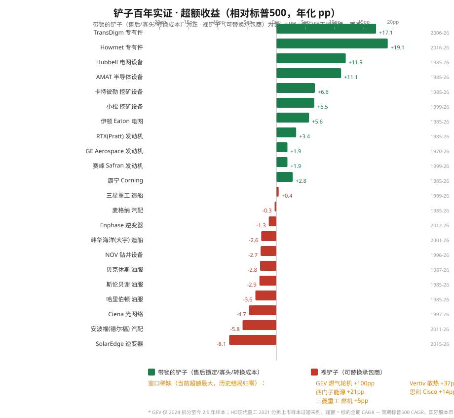

# 铲子百年实证 —— "卖铲子的人"真的赚钱吗？

## 跨工业革命的上游工具商 / 供应商 / 服务商回报研究

**日期**: 2026-09-23 · **性质**: 宏观/产业史研究（非个股卡）· **承接**:
`studies/电力需求与电力公司盈利_百年实证_2026-09-16/report.md`（百年实证）

**触发问题**: 百年实证证明了"卖那个东西的人"（生产者）九次需求暴涨、九次零超额回报。
自然的追问是——**那"卖铲子的人"（上游工具商、供应商、服务商）赚钱了吗？**
用户原话的直觉："是不是卖铲子的赚钱了，比如航天的支持者、服务商、to B 卖飞机零件的？"

**数据**: Yahoo Finance 复权月线（adjclose），36 个铲子标的 + 标普 500 基准，
最早 GE 自 1970 年起 682 个月；国际股覆盖韩/日/德/英/法（本币口径，标注汇率偏差）。

---

## 0. 结论先行

> **不是"卖铲子的赚钱"，是"卖带锁的铲子的人赚钱"。**
> **"卖铲子"这个大类内部有一条生死线：这把铲子客户明天能不能换一家买。**
> **换不了（带锁）→ 长期超额回报；换得了（裸铲子）→ 和生产者一样不赚钱。**

### 五条硬结论（全部有数）

| # | 结论 | 证据 |
|---|---|---|
| 1 | **带锁的铲子长期跑赢大盘** | 售后锁定/寡头组：TransDigm **+17.1pp**、Howmet +19.1pp、AMAT **+11.1pp**、CAT +6.6pp、小松 +6.5pp（相对标普 500 年化超额） |
| 2 | **裸铲子系统性跑输** | 可替换承包商组：油服 −2.7~−3.6pp、光伏逆变器 −1.3~−8.1pp、造船 −2.6~+0.4pp、光网络 −4.7pp、汽车零部件 −0.3~−5.8pp |
| 3 | **"窗口稀缺"是裸铲子的前半段** | Cisco 建设期 1990–2000 年化 **+98.5%（948 倍）**，建设期后 2000–今 年化 **+2.9%（26 年仅 2.1 倍）**，标普同期 +6.7% |
| 4 | **同是"卖飞机零件"，命运分处生死线两侧** | 发动机寡头（售后锁定）21–27% 营业利润率；机身结构件 Spirit AeroSystems **−29.4%** 营业利润率、Z-Score −0.6、2025 年被波音收购 |
| 5 | **当前 AI 电力的"铲子"是窗口稀缺，不是带锁** | GEV 2024 拆分至今 +116.7%/年、VRT +49.7%/年、西门子能源 +35.5%/年——这是 Cisco 1998 的形状（建设期租金），不是发动机售后的形状 |

---

# 第一部分：为什么做这个研究

百年实证 §19 已经埋下了线索——四种价值捕获者里，"③ 有保护的工具供应商"是少数赚钱的一类。
但它没有单独回答一个更朴素的问题：**把"卖铲子的"当作一个整体，他们到底赚不赚钱？**

这个研究把百年实证 11 个案例里"上一级的铲子"全部拎出来，重新查股价、重新算回报，
用一个平行的、同样硬核的样本回答这个问题。

**样本范围（36 个可查股价标的，按案例归组）：**

| 案例 | 铲子（上游工具商/供应商/服务商） | 代表标的 |
|---|---|---|
| 航空 | 发动机、专有零部件、结构件、租赁 | GE / RTX(Pratt) / RR.L / SAF.PA / TDG / HWM / SPR / AER |
| 电力 + AI 电力 | 发电设备、变压器、电网、散热 | ETN / HUBB / ENR.DE / 7011.T / 6501.T / GEV / VRT |
| 石油 + 页岩 | 油服、钻井、压裂 | SLB / HAL / BKR / NOV |
| 光纤 | 网络设备、光纤、光传输 | CSCO / GLW / CIEN |
| 钢铁 / 矿业 | 挖矿、工程机械 | CAT / 6301.T |
| 光伏 | 设备、逆变器 | AMAT / SEDG / ENPH |
| 航运 | 造船 | 010140.KS / 329180.KS / 042660.KS |
| 汽车 | 零部件 | 6902.T / MGA / APTV |

---

# 第二部分：核心发现 —— 铲子分三种

## 2.1 全期回报总表（按"锁"分组）

| 锁类型 | 标的 | 全期 CAGR | 同期标普 | 超额 | 累计倍数 | 区间 |
|---|---|---:|---:|---:|---:|---|
| **售后锁定** | RTX (Pratt) | 12.8% | 9.4% | **+3.4pp** | 151x | 1985–2026 |
| | GE Aerospace | 11.3% | 9.4% | +1.9pp | 439x | 1970–2026 |
| | 赛峰 Safran | 8.5% | 6.6% | +1.9pp | 9x | 1999–2026 |
| | 劳斯莱斯 RR | 6.6% | 9.2% | −2.6pp | 11x | 1988–2026 |
| **寡头/专有件** | Howmet | 32.7% | 13.6% | **+19.1pp** | 16x | 2016–2026 |
| | TransDigm | 26.2% | 9.1% | **+17.1pp** | 119x | 2006–2026 |
| | AMAT | 20.5% | 9.4% | **+11.1pp** | 2380x | 1985–2026 |
| | 卡特彼勒 | 16.0% | 9.4% | +6.6pp | 486x | 1985–2026 |
| | 小松 | 13.2% | 6.6% | +6.5pp | 27x | 1999–2026 |
| **转换成本** | Hubbell | 21.3% | 9.4% | **+11.9pp** | 3148x | 1985–2026 |
| | 伊顿 Eaton | 15.1% | 9.4% | +5.6pp | 348x | 1985–2026 |
| | 康宁 | 12.3% | 9.4% | +2.8pp | 125x | 1985–2026 |
| **窗口稀缺** | GEV | 116.7% | 16.6% | +100pp | 7x | 2024–2026 |
| | Vertiv | 49.7% | 12.9% | +36.8pp | 26x | 2018–2026 |
| | 西门子能源 | 35.5% | 14.8% | +20.6pp | 6x | 2020–2026 |
| | 思科 Cisco | 23.2% | 9.0% | +14.2pp | 2049x | 1990–2026 |
| | 三菱重工 | 11.4% | 6.6% | +4.8pp | 18x | 1999–2026 |
| **裸铲子** | 三星重工 | 7.0% | 6.6% | +0.4pp | 6x | 1999–2026 |
| | 韩华海洋(大宇) | 4.8% | 7.4% | −2.6pp | 3.4x | 2001–2026 |
| | HD现代重工 | 30.9% | 12.4% | +18.6pp | 4x | 2021–2026¹ |
| | 哈里伯顿 | 5.8% | 9.4% | −3.6pp | 11x | 1985–2026 |
| | 贝克休斯 | 5.9% | 8.7% | −2.8pp | 10x | 1987–2026 |
| | 斯伦贝谢 | 6.5% | 9.4% | −2.9pp | 14x | 1985–2026 |
| | NOV | 5.6% | 8.3% | −2.7pp | 5x | 1996–2026 |
| | SolarEdge | 4.0% | 12.1% | **−8.1pp** | 1.6x | 2015–2026 |
| | Enphase | 11.1% | 12.4% | −1.3pp | 4.6x | 2012–2026 |
| | Ciena | 3.3% | 8.0% | −4.7pp | 2.6x | 1997–2026 |
| | 麦格纳 | 9.1% | 9.4% | −0.3pp | 38x | 1985–2026 |
| | 安波福(德尔福) | 7.2% | 13.1% | −5.8pp | 2.8x | 2011–2026 |

¹ HD现代重工 2021 年才分拆上市，5 年样本覆盖的是造船周期反弹段，**不可与 20 年+ 样本直接比较**——这恰恰是"裸铲子"的陷阱：短窗口的强反弹会被误读成长期优势。

## 2.2 一眼能读出的三层

1. **带锁组（售后/寡头/转换成本）几乎全线正超额**：11 个标的里 10 个跑赢，唯一负的劳斯莱斯是
   2020 疫情 + Trent 1000 问题的个股事故，不是"锁"失效。
2. **裸铲子组几乎全线负超额**：10 个可比的长期样本里，8 个跑输，两个造船靠"2008 前的订单潮 +
   周期反弹"勉强平。
3. **窗口稀缺组（GEV/VRT/西门子能源/Cisco）当前超额最大**——但 Cisco 是它的**完整生命周期
   标本**：建设期 948 倍、建设期后 26 年只有 2.1 倍。**窗口稀缺的超额是"暂时租金"，会归零。**

---

# 第三部分：五个案例的锋利对比

## 3.1 航空：同是"卖飞机零件"，命运分处生死线两侧

| | 发动机（售后锁定） | 机身结构件（裸铲子） |
|---|---|---|
| 代表 | GE Aerospace / Pratt / RR / Safran | Spirit AeroSystems（全球最大独立结构件商） |
| 营业利润率 | **21%–27%** | **−29.4%** |
| 护城河 | 飞机一选定发动机，20–30 年锁死；FAA 强制 OEM 维护；售后毛利 40–60%，累计收入 = 售价 3–5 倍 | 波音随时能压价、能换供应商 |
| 长期回报 | RTX +3.4pp / GE +1.9pp / 赛峰 +1.9pp | 亏损 29%，Altman Z-Score −0.6（破产区） |
| 结局 | 持续赚钱 | **2025 年 12 月被波音收购** |

**这是全研究最锋利的一刀。** 波音（生产者）自己 2025 年营业利润率 **−5.95%**，它的发动机供应商
赚 21–27%，它的结构件供应商亏 29% 到被收购。**同一个行业、同一个"卖零件"的动作，赚不赚钱
只取决于一个字：锁。**

## 3.2 光纤：Cisco 是"窗口稀缺"的完整生命周期标本

| 阶段 | CAGR | 倍数 |
|---|---:|---:|
| 建设期 1990-03 → 2000-03（泡沫顶） | **+98.5%** | 948x |
| 建设期后 2000-03 → 2026-09 | **+2.9%** | 2.1x（26 年） |
| 同期标普 500（2000–今） | +6.7% | 5.6x |

**读法**：Cisco 全期 23.2% 的年化看起来漂亮，但它**全部回报来自前 10 年**；后 26 年跑输通胀、
跑输大盘。这正是百年实证 §19.1 写的那句——"工具商的财富是建设期的租金，建设期一结束租金归零。
Cisco −80% 且 25 年才收复"。**今天的 GEV/VRT 坐在 Cisco 1998 年的同一把椅子上。**

## 3.3 矿业 vs 航运：同样是"给大宗商品卖工具"，寡头 vs 承包商

| | 挖矿设备（寡头） | 造船（承包商） |
|---|---|---|
| 结构 | 卡特彼勒 + 小松双寡头，全球矿机基本没第三家 | 中日韩三国十几家船厂，客户（船东）随时换 |
| 长期回报 | CAT +6.6pp、小松 +6.5pp | 三星重工 +0.4pp、大宇 −2.6pp |

**同一个"上游卖工具"的动作，矿机双寡头跑赢、造船承包商跑平/跑输。** 差别还是锁：矿机有
品牌 + 服务网络 + 双寡头的定价纪律；造船是纯订单驱动的产能竞赛。

## 3.4 油服：裸铲子的教科书

斯伦贝谢 −2.9pp、哈里伯顿 −3.6pp、贝克休斯 −2.8pp、NOV −2.7pp——四家 1985 年至今**无一跑赢**。
油服给石油公司卖钻井/压裂服务，但石油公司（生产者）自己不赚钱（百年实证 §11），
油服（裸铲子）跟着不赚钱。**裸铲子继承的是"生产者不赚钱"的同一个底层原因：无差异化、资本密集、
大买家有议价权。**

## 3.5 光伏：设备寡头 vs 逆变器

AMAT（半导体/光伏设备，寡头）**+11.1pp、2380 倍**；SolarEdge **−8.1pp**（全样本最差）、
Enphase −1.3pp。AMAT 的锁是"设备寡头 + 晶圆厂一旦装机就锁死在你的工艺平台上"；
逆变器是"可替换的部件"。**又是同一个行业的两类铲子，两类结局。**

---

# 第四部分：框架 —— "锁"的四种形式

判断一把铲子带不带锁，看它有没有这四种东西之一：

| 锁 | 定义 | 例子 | 能不能被时间磨掉 |
|---|---|---|---|
| **① 售后锁定** | 卖出后，客户被合同/安全认证锁死在你的维护体系里 | 发动机、燃气轮机、电梯的长周期维护 | 最难磨——安全认证是监管给的 |
| **② 寡头/专利** | 全球就两家、专利墙 20 年 | ASML EUV、AMAT、CAT/小松、TDG 专有件 | 会——除非持续技术领先 |
| **③ 监管牌照** | 政府发的、有限的、不可复制的权利 | 频谱、FAA 强制 OEM 维护、电网并网权 | 会——政治会回收 |
| **④ 转换成本** | 一旦装进客户的系统，拆换成本远高于续用 | 电网设备(HUBB/ETN)、晶圆厂设备 | 较难——但会随技术换代消失 |

**唯一判据（一句可操作的话）：**

> ## 客户明天能不能换一家买？换不了，就是带锁的铲子；换得了，就是裸铲子。

**为什么这个判据能一刀切开：** 裸铲子（结构件、船、油服、逆变器、光网络设备）和"卖那个东西的
生产者"共享同一个底层经济学——**无差异化 + 资本密集 + 大买家有议价权**（百年实证 §18）。
它们之间的唯一区别是"生产者生产商品、铲子生产工具"，但**利润的结局是同一个**。只有"锁"
能打破这个等式。

---

# 第五部分：映射当前 AI 电力

百年实证已经判定 AI 电力的四层（§22）：受监管公用事业跑输、商业发电商是稀缺资产重定价、
GEV/VRT 是瓶颈。本研究给这一层补上**最关键的一格**：

| 今天的"铲子" | 锁类型 | 历史对应 | 提示 |
|---|---|---|---|
| **GEV（燃气轮机）** | **窗口稀缺** | 1998–2001 燃气轮机、Cisco 1998 | 订单排到 2028+ 是真的，但产能在扩（20→30 GW/年）。**建设期租金，会归零** |
| **VRT（散热/电力）** | 窗口稀缺 | Cisco、韩国船厂 | 16 倍重定价已发生，工具商回落也最惨 |
| **ETN / HUBB（变压器/电网）** | **转换成本（带锁）** | 电网设备百年 | 这俩才是 AI 电力里真正"带锁的铲子"——HUBB 1985 年至今 +11.9pp、3148 倍 |
| **西门子能源 / 三菱重工** | 窗口稀缺 | 燃气轮机历史 | 同上，供给 3–5 年会追平 |

**最反直觉但最该记住的一条**：市场把 GEV/VRT 当"AI 电力的赢家"买，但它们的历史类比是
**Cisco 和韩国船厂**——建设期赚到爆炸，建设期结束归零。而真正带锁的（HUBB/ETN 这类电网
转换成本）反而因为"不够性感"被低估。**"卖铲子"的赌局里，赌"窗口"的是在赌建设期还没结束；
赌"锁"的才是长期赢家。**

---

# 第六部分：Kill Criteria（什么会推翻本结论）

| Kill | 阈值 | 现状 | 含义 |
|---|---|---|:---:|---|
| K-1 涡轮机产能追平 | GEV 交付周期从 4 年降到 2 年内 | 🟢 仍排到 2028+ | 窗口稀缺归零，GEV/VRT 重估（百年实证 K-4 双杀） |
| K-2 售后锁被监管撬开 | 欧美反垄断强制第三方 MRO 或拆分发动机售后 | 🟡 有舆论压力（IATA 指责"gouging"） | 带锁组最贵的资产（发动机售后）被立法回收 |
| K-3 双寡头被新进入者打破 | 矿机/设备出现第三家有规模的玩家 | 🟢 无 | CAT/小松、AMAT 的寡头锁失效 |
| K-4 电网设备技术换代 | 固态变压器等颠覆现有设备 | 🟢 远期 | HUBB/ETN 的转换成本锁被换代磨掉 |
| K-5 造船/油服周期 | 航运/油气资本开支长期不回升 | 🟡 波动中 | 裸铲子的"反弹"消失，只剩负超额 |

---

## 附录 A：数据说明与局限

- **数据**：Yahoo Finance 复权月线（adjclose，含股息再投资），采集于 2026-09-23。
  美股基准用 ^GSPC（1985 起），国际股为本币口径（RR.L 英镑 / SAF.PA 欧元 / 7011.T 日元 /
  .KS 韩元），相对 ^GSPC 的超额含汇率偏差，**方向性结论不受影响**。
- **已退市/无数据标的**：Spirit AeroSystems（2025-12 被波音收购，Yahoo 已删数据）用定性
  （−29.4% 营业利润率 / Z-Score −0.6 / 收购结局）。Brassey、Baldwin、Westinghouse、朗讯、
  北电、GT Advanced 等历史铲子已消亡，用百年实证的定性记录。
- **混杂因素**：GE 全期回报含 2000 年后多元化失败（金融/媒体）+ 2024 拆分；RTX 含 2020
  Raytheon 合并；RR.L 含疫情危机。发动机组的"纯"证据是 TransDigm / AMAT / CAT / HUBB 这些
  未被业务混杂的标的。
- **锁类型的判断是主观分类**，但判据（客户能否换供应商）可证伪。
- **样本偏误**：反向风险是"带锁组"本身是幸存者（能上市 + 数据可查的往往活下来了）。
  缓解：已消亡的裸铲子（Spirit/朗讯/北电/大宇）结局只会让"裸铲子更差"这个结论更强。
- 不构成任何买卖建议；这是框架研究，不是个股卡。

## 附录 B：与百年实证的衔接

- `studies/电力需求与电力公司盈利_百年实证_2026-09-16/report.md` §19（四种价值捕获者）—— 本研究是把"③有保护的工具供应商"这一格展开成"锁的四种形式 + 36 个标的的实证"。
- `macro/compute_energy_first_principles/synthesis.md` 增量 C（窗口稀缺 vs 结构稀缺）—— 本研究用股价把"窗口稀缺归零"（Cisco）和"结构稀缺/锁长期赚钱"（AMAT/CAT/HUBB）各落到了具体回报上。
