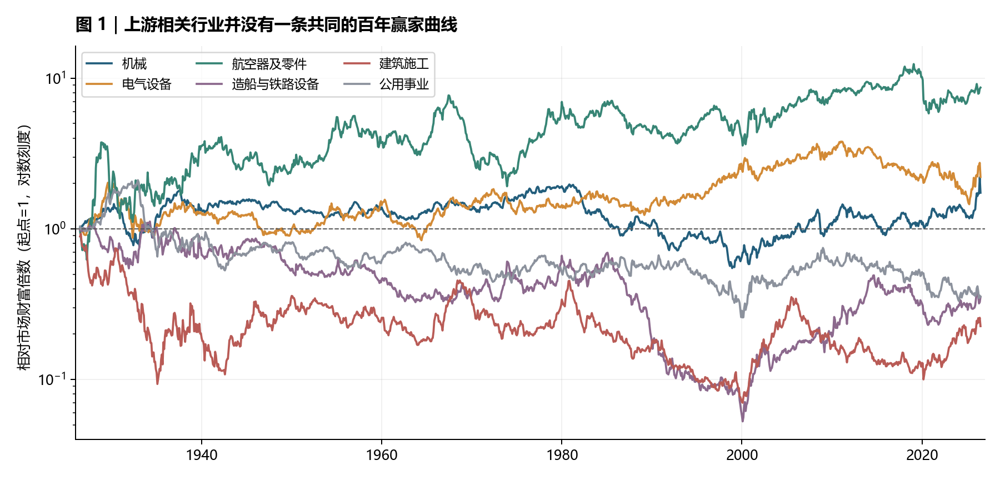
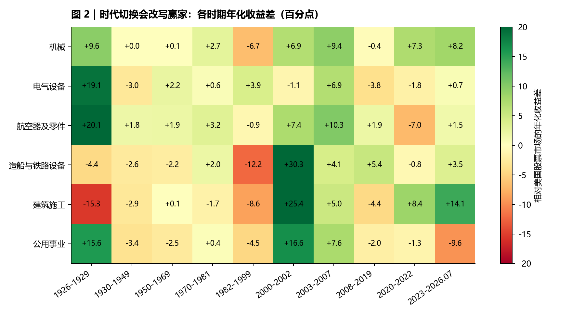
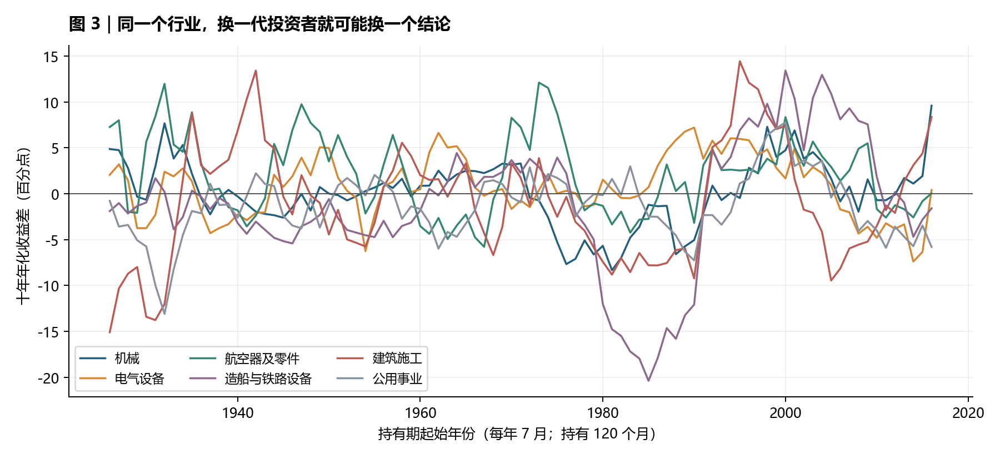
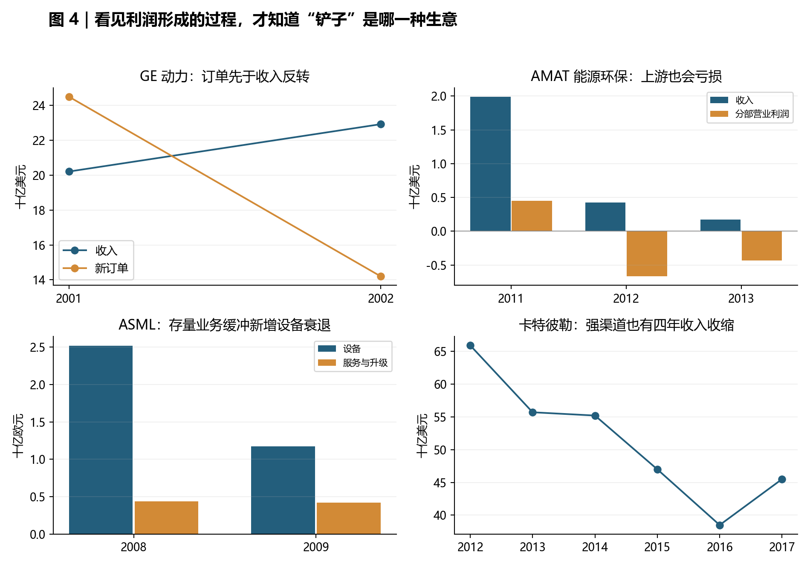

# 铲子百年实证

## 产业扩张的钱，究竟留在了谁手里？

**深研重写版 · 2026-09-23**

1926-2026 年行业回报 · 八组经营案例 · 现代公司共同窗口 · AI 电力映射

**研究结论：上游值得找，但“上游”本身不是优势。长期结果取决于新增设备能否形成有利润的存量业务、合同把风险交给谁、竞争如何响应，以及投资者买入时已支付多少未来增长。**

本报告把三个问题分开回答：需求潮创造了什么生意；公司到底留下多少利润与现金；买股票的人是否跑赢市场。百年部分使用美国行业组合，经营部分使用公司及监管披露，现代证券部分使用保存的复权价格序列。三个证据层互相约束，不互相冒充。

数据截止：行业月收益至 2026-07，现代个股至 2026-08 完整月；经营事实注明财年或披露日期。金额除特别注明外保留原币。历史数据会修订，本版原始文件与哈希已保存。

<!-- PAGEBREAK -->

## 阅读地图

| 章节 | 回答什么问题 |
|---|---|
| 1-3 百年行业检验 | 买一篮子上游相关行业，是否长期胜出？换时代和持有起点还成立吗？ |
| 4 电气与燃机 | 为什么电力需求增长，订单、收入和利润却可能先后转向？ |
| 5 航空供应链 | 都有认证、独家供应和长寿命，发动机、专有件、结构件为何不同？ |
| 6 通信设备 | Cisco 的问题究竟是需求消失、库存失控，还是买入价过高？ |
| 7 半导体与光伏 | 同一家 AMAT，为什么“半导体铲子”和“光伏铲子”能走向两端？ |
| 8 油服与机械 | 技术、渠道、售后为什么仍挡不住下游资本开支收缩？ |
| 9-10 造船与工程 | 排满订单的供应商，怎样在交付过程中把钱亏掉？ |
| 11 跨案例解释 | 哪些特征有重复证据，哪些仍只是看起来合理的解释？ |
| 12-13 股票与估值 | 统一窗口后谁胜谁负？经营成功要怎样才能变成投资成功？ |
| 14 AI 电力 | GEV、VRT、ETN、HUBB 各自靠什么挣钱，下一步观察什么？ |
| 附录 | 行业时代表、41 家候选证券、数据问题、复跑与证据边界 |

### 先看五个发现

**一，百年数据支持“上游内部有差异”，不支持“上游整体必胜”。** 机械、电气设备、航空器及零件组合的年化收益分别比美国股票市场高 0.61、0.88、2.41 个百分点；建筑施工、造船与铁路设备分别低 1.63、1.14 个百分点。航空组合包括整机与军工需求，不能把优势全记到发动机售后名下。

**二，持续优势比单次短缺重要，但持续优势也有周期。** ASML 在 2009 年设备销售下滑约 53%，服务与升级只下滑约 4%；服务确实起到缓冲作用。然而当年公司仍亏损，不能把“有售后”翻译成“利润不会下降”。[ASML 2009 结果](https://www.asml.com/en/news/press-releases/2010/asml-announces-2009-fourth-quarter-and-full-year-results)

**三，认证和独家供应能同时锁住双方。** Spirit 几乎独家供应的关系，没有使它免于客户集中和项目履约问题；GE 航空的存量发动机服务、TransDigm 的专有零件，则属于另一种现金流结构。先分析合同和现金来源，才能判断“锁”对谁有利。

**四，繁荣末期最容易误读的是当期利润。** GE 动力 2002 年收入增长 13%、分部利润增长 29%，新订单却下降约 42%。订单先转向、积压随后消耗、利润滞后反映的过程，比“产能三年后必然过剩”这种倒计时更值得跟踪。

**五，需求兑现仍可能没有好的股东回报。** Cisco 在 2002 财年已恢复盈利和强劲经营现金流；2000 年高位买入者长期落后市场，并不证明这家公司此后停止创造价值。AI 电力也必须同时研究经营和价格。

<!-- PAGEBREAK -->

## 1. 先把一百年放到同一把尺上

### 1.1 为什么不用今天的 36 家公司倒推百年

用今天仍上市的赢家回看历史，会把破产、并购、迁移和业务转型悄悄排除。原稿最强的数字又来自不同起点、不同币种和不同回报口径，不能承担“百年规律”的证明任务。因此本版先使用 Kenneth French 数据库的历史行业组合，再把公司案例放回去解释。

按研究问题预先选择五类上游相关行业：机械 Mach、电气设备 ElcEq、航空器及零件 Aero、造船与铁路设备 Ships、建筑施工 Cnstr；公用事业 Util 作为接近《电力百年》问题的对照。组合按历史 SIC 归类、随时间变化，使用市值加权月回报；基准为同库美国市场总回报 Mkt-RF 加 RF。它比固定挑选现存公司更适合长历史观察。[French 49 行业说明](https://mba.tuck.dartmouth.edu/pages/faculty/ken.french/Data_Library/det_49_ind_port.html)

但它仍不是“纯铲子指数”：机械含农机、矿机、油气设备、电梯等；电气含输配电、照明和电器；航空含整机；Ships 同时含铁路设备；施工含住宅、非住宅和专业承包；公用事业含电、气等。美国上市范围也不能代表英国工业革命、德国工业或韩国商船。行业归属、公司规模和商业模式会改变，不能假设 1926 年与 2026 年买的是同一种生意。

### 1.2 一百年的结果

从 1926-07 到 2026-07，共 **1,201 个月**。美国市场名义含分配再投资的复利年化为 **10.35%**。表内“差值”是两个年化率相减，不是风险调整 alpha；十年窗口每年 7 月开始，持有 120 个月，共 91 个重叠窗口。

{{century}}

来源：本版保存的 French 官方原始文件，自行复算。回撤取月末财富，日内或月内极值可能更深。重叠窗口高度相关，胜出次数不是 91 次独立试验。

这张图的重要信息是路径。电气设备在某些年代领先很快，也经历长时间优势回吐；机械的百年微弱领先，不等于随时买入都能胜出；建筑施工在整个世纪落后，也有明显的反超阶段。把终点高低解释成一个永恒的商业属性，会漏掉投资者实际经历的几十年。

### 1.3 “赚很多钱”与“赚到超额”是两件事

机械年化 10.97% 已经代表很强的长期复利，但同期市场为 10.35%，差值只有 0.61pp。大部分绝对财富增长也来自持有股票、承担风险和经济长期增长，不能全部归因于“卖铲子”。航空组合的差值较大，仍须拆出军费、整机、整合、估值与风险暴露。

最大的历史回撤同样不能删掉。长期领先组合在大萧条中也经历约九成的月末财富损失。今天的业务更成熟，不能机械预测会重复九成回撤；但用终点 CAGR 把持有过程描写成稳定收租，也不符合数据。

## 2. 同一行业，换一个时代就换一张成绩单

时代边界在计算前固定，目的在于检验结论是否依赖少数时期。它们不是由算法识别出的拐点；例如 2008-2019 同时包含金融危机与复苏，会掩盖内部变化。完整数字见附录 A。

### 2.1 1926-1949：技术扩散可以与资本损失并存

1926-1929 的电气设备年化比市场高 19.06pp，公用事业高 15.63pp。随后 1930-1949，电气设备相对市场低 2.96pp，公用事业低 3.45pp。前一阶段的赢家标签不能穿透估值、融资和宏观冲击。

这里能够确认的是回报变化，不能仅凭回报表声称某一政策或竞争因素解释了全部变化。对早期电气化，最稳妥的历史教训是：**社会越来越依赖电，并没有使电力产业链证券脱离资本市场风险。** 技术采用率和股东回报不是同一条曲线。

### 2.2 1950-1981：资本品也不是统一受益

1950-1969，电气设备与航空组合分别领先约 2.21、1.92pp；机械和施工基本与市场相当，船铁设备落后约 2.22pp。到 1970-1981，机械与船铁设备分别领先约 2.66、1.99pp，施工仍落后。即便不加入个股故事，单纯“上游比下游好”的解释已经不够。

这一结果也提醒我们，不要因为施工百年总体落后，就认为在工业扩张中施工者从没赚过钱；不要因为机械长期领先，就认为所有制造装备都能把通胀转给客户。行业内业务和合同差异，需要经营案例来辨别。

### 2.3 1982-2007：两次繁荣的受益层不同

1982-1999，电气设备领先市场 3.94pp，机械却落后 6.65pp，施工落后 8.60pp。2000-2002 市场年化为 -14.77%，而船铁设备、施工年化为正，形成很大的相对优势。这不是船铁设备突然变成永久垄断者，而是相对结果受此前估值、市场结构与周期位置影响。

2003-2007，五类上游相关组合与公用事业全部领先市场，机械领先 9.43pp，航空领先 10.27pp。共同繁荣可以暂时压过商业模式差异。因此，用一个建设旺季验证“这家公司有永久护城河”，容易把周期当成结构。

### 2.4 2008-2026：长期赢家也会轮换

2008-2019，航空和船铁设备领先，电气设备落后 3.82pp；2020-2022，机械和施工领先，航空落后 6.99pp；2023-2026 年 7 月，施工反而在五组中拥有最高相对年化收益，约 +14.10pp。短期窗口年化会放大变化，不应拿来预测下一十年。

这组历史检验对原稿构成直接约束：如果“裸铲子全线跑输”是一条稳固规律，施工、船铁设备就不该反复出现大幅领先阶段。它们不一定适合跨周期无条件持有，却可能是某一阶段表现很强的证券。

## 3. 一个人真实持有十年，会遇到什么？

电气设备在 91 个十年窗口中胜出 58 次，航空 57 次；机械仅 46 次，十年差值中位数接近零。行业选择确实可能改善胜算，但没有把买入时间和等待成本消掉。即使“方向看对”，投资者也可能整整十年没有比市场多赚。

### 3.1 去掉大萧条，结论会不会完全翻转？

从 1950-01 重新起算至 2026-07，市场年化 11.65%；机械 12.05%、电气设备 12.88%、航空 13.52%、船铁设备 11.07%、施工 11.03%、公用事业 10.48%。主排序没有完全反转，说明第一张表不只是 1930 年代的遗产；差值大小却确实变了。

### 3.2 改成等权，会不会得到另一个故事？

{{robustness}}

等权后航空年化显著升高，公用事业也与市值加权结论不同。等权增加小公司权重，并引入不同再平衡暴露，交易成本尚未扣除。**“行业回报”必须同时说明权重，不能只选最漂亮的一种口径。** 本文主结论始终使用市值加权；等权只作敏感性检查，不与市值加权市场比较后宣称 alpha。

这三节确定了研究底盘：行业有差异，差异跨时期不稳定，结果对权重和进入点敏感。下面进入经营过程，解释为何看起来都在卖设备，实际却不是一种生意。

<!-- PAGEBREAK -->

## 4. 电气与燃机：利润最好看的时候，订单可能已经转向

### 4.1 从电气化到燃机建设潮，需求传递的时钟不同

电厂、电网、工厂购买设备，形成的是投资支出；设备运行后产生发电、用电与维护需求。终端用电是存量系统的使用量，设备订单更接近新增容量、替换和技术改造的合计。只要已建容量能覆盖需求，新设备订单就可能下降，即使用电没有下降。

这个区别在世纪之交的美国燃机潮中非常明显。EIA 统计，2000-2010 年美国新增约 237GW 天然气发电容量，占同期全部新增容量约 81%。它是实实在在的建设潮，不是假需求；但设备供应商承接的是建设进度，并非此后每一度电的全部收入。[EIA 容量统计](https://www.eia.gov/todayinEnergy/detail.php?id=2070)

### 4.2 GE 2002：领先指标与滞后指标背离

| GE Power Systems，十亿美元 | 2001 | 2002 | 变化 |
|---|---:|---:|---:|
| 收入 | 20.211 | 22.926 | +13.4% |
| 分部利润 | 4.860 | 6.255 | +28.7% |
| 新订单 | 24.5 | 14.2 | -42.0% |
| 年末订单积压 | 28.9 | 16.7 | -42.2% |

来源：[GE 2002 业绩](https://www.ge.com/news/press-releases/ge-2002-earnings-grow-7-151-billion-cashflow-ex-progress-grows-10-152-billion)、[GE 2002 年报](https://www.sec.gov/Archives/edgar/data/40545/000004054503000016/frm10k.htm)。表内增幅由披露金额复算；分部利润不是集团净利润。业务包含燃机之外的服务及能源业务，不能看作纯燃机毛利表。

当期收入、利润还在兑现此前签订的订单；新订单和积压已经在揭示后续工作量。2002 年末积压中的产品订单为 131 亿美元，其中约 73% 原计划于 2003 年交付。随着旧订单被消耗，收入滞后下行的风险已在当时可以观察，而不需要等股价下跌后才解释。

同一时期 GE 已有服务合同。2002 年末披露能源服务合约覆盖 1,452 台燃机、582 个地点。因此，不能把这段历史简化成“当时没有锁，今天有售后就安全”；也不能说“有服务，所以新机繁荣结束不影响利润”。**正确拆法是新机收入、服务存量、执行利润与风险责任各算一遍。**

### 4.3 这段历史怎样约束今天的燃机研究

第一，缺货能提高新签合同条件，但过去低价订单仍可能决定近期利润。第二，增长中的预付款会改善现金，却带着未来交付义务；收钱早于赚钱。第三，装机增长留下服务机会，但服务收益还取决于使用小时、合同覆盖、保养周期、性能保证和成本。

本案不能直接给出 GE 股票的纯燃机收益。老 GE 同时经营金融、医疗、媒体等业务，如今 GE、GEHC、GEV 又已分拆。把跨数十年的一个代码曲线直接命名为“燃机回报”，会把集团业务与公司行动混进去。

**当时能看的信号：** 新订单/收入、取消与延期、积压净增、原定交付期、预收款及服务合同覆盖。它们能够帮助识别反转，却没有一个数字可以独立预测拐点。

图 4 金额取各公司披露；ASML 为欧元，其余为美元。各面板说明各自经营过程，不横向比较利润率。原值与来源保存在 case_facts.json。

## 5. 航空：同样难替换，为什么赚钱能力相差很大？

### 5.1 发动机：新机只是一次关系的开始

发动机供应商同时出售初始设备、备件、维修、升级及长期服务。一个机队选定机型和发动机后，改变动力系统的代价很高；随着运行小时增加，维修需求才逐渐兑现。长期价值来自整个使用周期的收入减去研发、初始让利和履约成本，不能只看交付一台发动机赚多少。

GE 航空 2025 年 CES（商用发动机与服务）约占集团收入 73%，服务约占 CES 收入 75%；这是实际业务结构，而不是一句“未来售后很大”。Rolls-Royce 2025 年民航基础营业利润率为 20.5%，2024 年为 16.6%；公司把改善归于大型发动机售后、合同利润改善等因素。[GE 2025 年报](https://www.sec.gov/Archives/edgar/data/40545/000004054526000008/ge-20251231.htm)、[Rolls-Royce 2025 结果](https://www.rolls-royce.com/investors/results-reports-and-presentations/financial-results/rr-holdings-plc-2025-full-year-results.aspx)

这里的“基础”是公司调整口径，不能与其他公司的 GAAP 利润率直接排队。GE 的 CES 也不是整个集团。原稿把不同主体、不同口径的利润率压成“发动机都赚 21%-27%”，会产生不必要的精确感。

### 5.2 按小时收费，也可能按小时承担风险

长期服务让现金流更持续，同时让供应商承担寿命估计、维修频率、材料、备发及性能风险。飞行小时上升可能增加收费，也可能增加维修支出；收了长期合同现金，不等于对应服务已经完成。应把合同收款、当期确认收入和剩余履约成本分开看。

Rolls-Royce 的历史说明技术位置不能替代合同审查。1971 年 RB211 困境及后续国家介入，不能被排除为“偶然个股事故”：技术开发、报价和履约义务，本来就是这种生意的组成部分。今天的上市实体与当年也不能直接接成连续无损回报。[英国议会历史记录](https://api.parliament.uk/historic-hansard/commons/1973/feb/13/rolls-royce-limited)

从今天的成功倒推“发动机从来是好生意”，会丢掉新项目失败、现金消耗与旧股东受损的阶段。应当问的是：成熟机队服务贡献能否覆盖新平台投入，工程改进能否真实降低每飞行小时的维护成本。

### 5.3 TransDigm 与 HEICO：价值可以留在不同位置

TransDigm 2025 财年估计约 90% 销售来自专有产品，约 55% 来自售后。零件的技术、认证、可得性和停机损失，共同影响客户选择；专有零件价值未必来自它占整机成本很大，而可能来自它对可靠运行重要。[TDG 2025 年报](https://www.sec.gov/Archives/edgar/data/1260221/000126022125000081/tdg-20250930.htm)

但原厂不是法律上永远独占。FAA 存在 PMA 替代件批准路径，HEICO 的零件业务正提供此类替代选择。替代供应商也可能通过验证、可靠性和节约客户成本创造价值。这意味着“有认证”支持的是进入门槛，不是永不受竞争的原厂租金。[FAA PMA](https://www.faa.gov/aircraft/air_cert/design_approvals/pma/pma_des)、[HEICO 零件业务](https://heico.com/parts-group/)

现代共同十年窗口中 HEI、TDG 都跑赢 SPY（见第 12 节）。这组并存结果比“垄断一定赢”更有信息：客户愿意为可靠性付费，也愿意为可信的替代方案付费。研究对象应该是产品和合同，不应事先把原厂与替代件只留一个赢家。

### 5.4 Spirit：独家关系也可能成为双方的约束

Spirit 2024 年报称，对 Boeing、Airbus 销售的产品几乎都是独家供应；两家分别贡献约 58%、21% 的收入。客户难以迅速换厂，并没有消除供应商对少数买方、生产计划和专用资产的依赖。[Spirit 2024 年报](https://d18rn0p25nwr6d.cloudfront.net/CIK-0001364885/5fcef623-24df-4ae5-896b-4831c73caa21.html)

发动机的成熟售后面向使用中的机队；机身结构件的经济结果更直接受 OEM 生产节奏、报价与成本承担方式约束。两者同样难以替换，但定价谈判和最终现金来源不同。这是原“客户明天能否换一家”判据漏掉的另一半：**供应商明天能否换一个客户，而不损失大量专用资本？**

2025 年 12 月收购完成时，Spirit 普通股每股换得 0.1955 股 Boeing。它是换股收购，不能因为原股票代码消失就记为股东财富归零。完整投资回报还需衔接换得证券；本版缺少这条完整价格现金流，因此不制造 SPR 的百年或终身 CAGR。[收购 8-K](https://www.sec.gov/Archives/edgar/data/1364885/000110465925119096/tm2532915d1_8k.htm)

**本案可推广的判断：** 长寿命、认证、独家供应都可能创造联合价值；利润留在哪一方，还取决于买方集中、替代选择、售价调整和履约责任。只测“锁有多牢”，不足以判断供应商回报。

## 6. Cisco：经营周期、库存冲击和估值损失是三件事

### 6.1 互联网建设没有取消库存风险

路由、交换和网络服务承接互联网基础设施投资。客户需要设备，不代表会均匀下单；当扩张预期被调低，设备商面对的不只是未来收入减少，还有已经采购或承诺采购的零件和库存。供应链为高增长准备得越充分，需求骤变时调整负担可能越大。

| Cisco 财年，十亿美元 | 2000 | 2001 | 2002 |
|---|---:|---:|---:|
| 收入 | 18.928 | 22.293 | 18.915 |
| GAAP 净利润 | 2.668 | -1.014 | 1.893 |

来源：[FY2001 公告](https://newsroom.cisco.com/c/r/newsroom/en/us/a/y2001/m08/cisco-systems-reports-fiscal-year-2001-and-fourth-quarter-earnings.html)、[FY2002 公告](https://newsroom.cisco.com/c/r/newsroom/en/us/a/y2002/m08/cisco-systems-reports-fourth-quarter-and-fiscal-year-2002-earnings.html)。FY2001 当年总体收入仍高于上一年，却已出现净亏损；全年数字会掩盖年内转向。

2001 年财报记录约 27.7 亿美元库存及采购承诺相关拨备，其中第三季度有 22.5 亿美元额外过剩库存费用。它显示需求变化会通过资产负债表进入利润，不只是“增速放慢几个百分点”。[Cisco 2001 财务报告](https://www.cisco.com/c/dam/en_us/about/ac49/ac20/downloads/customer/annualreport/ar2001/pdf/financ.pdf)

### 6.2 股价表现很差，不代表企业此后没有价值

2002 财年收入回落，净利润却恢复至约 18.9 亿美元，经营现金流约 66 亿美元。公司可以在需求较弱时期调整成本和周转，恢复现金创造；这与泡沫价买入者的糟糕长期表现并不矛盾。

Cisco 买入时点敏感性将在第 13 节逐项列示。2000-03 至 2026-08 的复权年化为 3.08%，同期 SPY 8.25%；若从 1998-03 开始则为 10.03%，同期 SPY 8.93%。不能把挑选高估值月份得到的结果，命名为“建设期结束后供应商必然失败”。

### 6.3 对 AI 的类比应停在哪里

Cisco 提供的是需要防范的机制：下游预算收缩、供应链预测过度、库存/采购义务和起始估值。它没有提供 GEV 或 VRT 的未来股价路线图。燃机与网络设备的使用寿命、供给扩张时间、维护合同、技术替代和客户付款条件都不同。

因此，“今天坐在 Cisco 1998 年那把椅子上”最多是待检验的警示，不能当研究结论。真正有用的对照是：新订单是否来自客户重复预订；取消权在谁手里；供应商已经承诺多少不可撤销采购；客户使用率和现金回收是否追得上扩张。

## 7. 半导体与光伏：同一家设备商，也能拥有两种命运

### 7.1 ASML 的设备与存量服务，可以直接做周期对照

| ASML，十亿欧元 | 2008 | 2009 | 变化 |
|---|---:|---:|---:|
| 新旧设备销售 | 2.517 | 1.175 | -53.3% |
| 服务与升级销售 | 0.437 | 0.421 | -3.7% |
| 总收入 | 2.954 | 1.596 | -46.0% |
| 净利润 | 0.322 | -0.151 | 转亏 |

来源：[ASML FY2009 公告](https://www.asml.com/en/news/press-releases/2010/asml-announces-2009-fourth-quarter-and-full-year-results)。同一公司、同一次下行，存量相关收入比新增设备收入更稳定；这比把不同公司放进两类后比较更能说明具体机制。不过服务规模当时还不足以使集团保持盈利。

到了 2025 年，ASML 披露总收入 326.67 亿欧元，其中装机基础管理收入 81.93 亿欧元，约占 25.1%。该项包含服务和现场升级，不应全部视为自动续费。2025 年新光刻系统销售数量下降而收入增长，也说明设备价值受产品组合、技术代际和单机价值影响，不能只数出货台数。[ASML FY2025 公告](https://www.asml.com/en/news/press-releases/2026/q4-2025-financial-results)

这里的强项是客户工艺与技术升级的关联，不只是一个静态的“稀缺产能”。弱点则是研发、客户资本开支、技术路线、出口许可和高估值。强技术可以改善竞争地位，仍不能取消需求周期。

### 7.2 AMAT 的光伏业务，是原论点最容易漏掉的失败

AMAT 2010 年宣布停止向新客户出售 SunFab 薄膜光伏整线，同时继续支持已有客户。退出一条技术路线，与“整个集团长期股价很好”完全可以同时发生。[AMAT 2010 重组公告](https://ir.appliedmaterials.com/news-releases/news-release-details/applied-materials-announces-restructuring-energy-and/)

此后能源环保业务的财务变化更加直接：

| AMAT EES 分部，百万美元 | FY2011 | FY2012 | FY2013 |
|---|---:|---:|---:|
| 新订单 | 1,684 | 195 | 166 |
| 收入 | 1,990 | 425 | 173 |
| 营业利润/亏损 | 453 | -668 | -433 |

来源：[AMAT FY2013 年报，第 46-47 页](https://ir.appliedmaterials.com/static-files/26df7d1f-2c60-4d72-a1ed-3955c633692a)。分部包含其能源环保设备业务，不能把所有亏损只归到已退出的新 SunFab 销售。2012 年收入中约 65% 来自此前年度已发出的产品，说明收入确认比新订单更滞后；亏损含减值和重组等项目，不能当作同额当期现金流出。

这是完整的传导链：客户扩张预期下降，设备订单骤降，存货与资产价值需要调整，收入仍可能靠此前交付支撑一段时间。作为“下游的上一级”，并没有躲开下游资本开支和技术路线的损失。

### 7.3 为何不能用 AMAT 总股价给光伏业务记功

集团还拥有半导体系统、全球服务与显示等业务。股东买到的是组合、资本配置和跨业务抵御冲击的能力。把后来的 AMAT 股票上涨全部归到光伏，相当于用另一项成功业务替失败业务结账。

现代共同窗口中 AMAT、ASML、LRCX、KLAC 均强于市场，支持进一步研究半导体设备，但仍不能单凭回报宣称共同因果：市场集中、先进工艺需求、研发规模、存量升级和进入估值可能同时起作用。必须把业务收入和利润归属先对齐，再谈“上一级更好”。

**本案信号：** 分技术路线订单、客户融资能力、订单/收入、延迟验收、存货与减值、服务占比，以及研发最终是否形成客户愿意支付的生产效率。技术重要不等于每一种设备路线都重要。

## 8. 油服与机械：服务的是“使用”，还是下一轮扩张？

### 8.1 油服不是没有技术，而是技术收入也依赖客户预算

SLB 的地层评价、钻完井与生产技术不能简单归为可随意替换的劳务。但客户如何使用这些技术，受油价、项目经济性、资本预算和既有产能影响。油还在被消费，并不意味着油企当年需要开出同样多的新井，也不意味着服务商能维持原来的价格与设备利用率。

| SLB，十亿美元 | 2014 | 2015 | 2016 |
|---|---:|---:|---:|
| 收入 | 48.580 | 35.475 | 27.810 |
| 归属公司的净利润/亏损 | 5.643 | 2.072 | -1.687 |

来源：[SLB 2015 年报](https://www.sec.gov/Archives/edgar/data/87347/000156459016012009/slb-10k_20151231.htm)、[SLB 2016 结果](https://www.slb.com/newsroom/press-release/2017/pr-2017-0120-q4-earnings)。2016 年包含收购 Cameron 后的收入，不能把三个年度当成完全同范围的有机增长序列；公司称剔除 Cameron 后 2016 年收入下降约 34%。

2016 年税前经营利润率降至约 11.8%，上年约 18.4%；同年经营现金流仍约 63 亿美元，公司定义的自由现金流约 25 亿美元。账面亏损、经营盈利能力下降和现金创造并不是同一件事。周期调整、非现金费用及营运资本释放，可能让这些指标暂时分离。

### 8.2 再向上一级：卖钻井设备也没有自动避险

NOV 为油气活动提供设备、零件与服务，是“卖铲子给卖铲子的人”的典型候选。若再上一级天然更安全，它应该避开油服客户的下行；财报给出了相反的提醒。

| NOV，十亿美元 | 2014 | 2015 | 2016 | 2017 |
|---|---:|---:|---:|---:|
| 收入 | 21.440 | 14.757 | 7.251 | 7.304 |
| 营业利润/亏损 | 3.613 | -0.390 | -2.411 | -0.277 |

来源：[NOV 2017 年报的历史比较表](https://www.sec.gov/Archives/edgar/data/1021860/000119312518048333/d495377d10k.htm)。营业亏损包含减值等项目；2014 年前后另有公司业务沿革，不能据此推算一个固定业务边界的终身收益。但 2015-2016 年收入下降约 51%，已经清楚表明设备需求并没有隔绝客户资本开支收缩。

**越靠近新增产能，订单可能越像终端需求的变化量。** 下游只需放慢新增投资，上游设备订单就可能大幅收缩；更上游的材料和零件又可能承受客户去库存。链条加长不一定降低波动，也可能放大波动。

### 8.3 Caterpillar：渠道和售后有价值，但不能取消四年下行

CAT 披露的收入从 2012 年约 659 亿美元，降至 2016 年约 385 亿美元；同期调整后营业利润率从 13.9% 降至 7.2%，2017 年收入回升至 455 亿美元、利润率回升至 12.5%。这是强制造商也会经历的经营周期。[CAT 2018Q2 投资者材料，第 12 页](https://www.caterpillar.com/content/dam/caterpillarDotCom/releases/2Q18%20Caterpillar%20Inc.%20Results%20Presentation%20Slides.pdf)

经销商、备件可得性、服务和二手残值，可以降低客户全生命周期使用成本，形成选择 CAT 的理由。但当客户已有足够设备、闲置机器可重新投入，品牌优势不能强迫客户继续买新机。分析要分终端用户需求、经销商库存和工厂发货；渠道补库可以使制造商发货短期快于真实使用需求。

这也解释为什么经营下行与好投资可以先后发生：本版 2016-08 至 2026-08 窗口中 CAT 年化比 SPY 高 13.06pp，起点接近前一轮收入低谷；换成二十年差值约 +4.81pp，期间月末最大回撤约 69%。前一数字不能抹掉后一个持有过程。

**本案留下的区别：** 附着于成熟设备运行的必要维护，往往与附着于新增设备投资的订单不同。但“服务”也要拆：有些收入服务于持续生产，有些服务于扩张钻井，两者周期敏感度并不相同。

## 9. 造船：全球贸易增长，为什么未必留下稳定利润？

### 9.1 船东买的是未来运力，船厂承担的是几年后的交付

航运需求、运价、船舶订单和船厂利润处在不同环节。船东在运价高、融资容易时下单，交付通常落在更晚的市场；船厂在签约与交付之间承担钢材、人工、工程修改、外购设备和汇率等风险。订单金额再大，也需要问原始报价是否覆盖最终成本。

这里比普通设备更容易出现“排产看起来很满，但项目经济性很弱”：产能占用时间长，交付资产体积大、转售和改用途不总是容易。客户延迟接船、融资能力变弱、规格发生变化，都可能改变合同经济性。以上是合同分析机制，不能用来替任何一家船厂断言实际亏损原因。

### 9.2 供给退出不一定像教科书那么快

OECD 2019 年研究指出，政策干预可能促成船舶过度订购，并让低效产能继续留在市场，从而延长下行。2026 年的 OECD 分析则观察到，部分 OECD 船厂转向 LNG、邮轮、海工等高价值细分领域，但这种转向只提供部分保护。[OECD 2019 研究](https://www.oecd.org/en/publications/an-analysis-of-market-distorting-factors-in-shipbuilding_b39ade10-en.html)、[OECD 2026 行业分析](https://www.oecd.org/en/blogs/2026/06/oecd-shipbuilding-economies-under-pressure-as-china-reshapes-global-competition.html)

这会改变“高技术自然高利润”的推论：技术门槛可以减少同类竞争，同时也可能把项目复杂度、成本估计和交付风险提高。传统造船转向复杂海工，不能只给技术壁垒加分，却不给工程风险计价。

对上一级同样如此。OECD 的资料指出，设备、钢材、涂料等中间投入在最终造船产出价值中占很大比重（约 70%-80%）。但这不代表它们分走了同等比例利润：采购支出、增加值和利润是三种不同口径。船用发动机、自动化、特种涂料与钢材，需要各自研究竞争和服务结构，不能合并成一个“上一级赢家”。[OECD 数据研究](https://read.oecd-ilibrary.org/en/publications/why-data-matters-for-shipbuilding-industrial-policy_9ab37ecb-en/full-report.html)

### 9.3 股票证据能说到哪里

百年 Ships 组合包括美国造船和铁路设备，不代表韩国商船，更不能用它证明全球造船百年年化。韩国个股还存在币种、增资、停牌与重组问题，本版保留供应商序列作描述，却不将其作为已重建的旧股东全现金流。

因此，本章的结论强度低于 GE、ASML 和 Cisco 的公司周期对照：**有一手行业证据支持供给退出缓慢与竞争扭曲，但没有完成全球船厂统一长期利润及股东回报面板。** 原来的“造船全线跑输”应撤回，不能用另一句相反口号替代。

研究船厂时更有用的观察顺序是：按签单年份分层的订单价格、材料和汇率对冲、预收与尾款、实际工时和项目损失、可退出产能、再到股权融资。研究船用设备商，则要额外识别装机备件与船厂新造订单各占多少。

## 10. 核电与工程：控制技术，不等于愿意承担所有风险

### 10.1 Westinghouse 的失败发生在什么层面

Westinghouse Electric Company 于 2017 年申请 Chapter 11，公司公告将美国新建核电项目的财务与建设挑战列为重组背景。东芝后续披露，Westinghouse 相关减值、出表、母公司担保和债权损失等，导致集团承受重大财务后果。[Westinghouse 公告](https://info.westinghousenuclear.com/news/westinghouse-announces-strategic-restructuring)、[东芝 2017 股东资料](https://www.global.toshiba/content/dam/toshiba/migration/corp/irAssets/about/ir/en/stock/pdf/tsm178e_oper.pdf)

这不是“核技术没有门槛”，而是项目风险能够超过技术业务赚取的收益。一个公司既可以掌握重要设计、燃料或服务能力，也可以在另一类建设合同中承担难以承受的成本与工期责任。客户需要项目，与项目对承包商有利，不是同一判断。

2017 年实体也不是从 1886 年起未经变化的上市股权。不能把品牌历史和一条连续股东收益混在一起，声称“百年 Westinghouse 投资最终归零”。经营失败足以检验合同风险，无需制造一条不存在的证券序列。

### 10.2 Fluor 的反应：改变接单方式，而非等待需求自动救回利润

Fluor 披露 2019 年持续经营净亏损约 17 亿美元，其中包含大额减值、退出、养老金结算和递延税项估值调整。能源化工分部收入从 2018 年约 77 亿美元降到 58 亿美元，分部利润从 3.35 亿美元转为亏损 0.95 亿美元。不能把 17 亿亏损全部说成工程超支。[Fluor 2019 结果](https://www.sec.gov/Archives/edgar/data/1124198/000110465920108501/tm2031261d3_ex99-1.htm)

更有价值的是行为变化：公司宣布能源化工业务不再参与竞争性一口价 EPC 投标，转向可偿付成本或开放账本转固定价等方式。公司明确认为原接单市场的风险分配不合理。对“订单越多越好”的假设，这是可以观察的反证。

### 10.3 为什么固定总价会使订单成为负债来源

设项目合同价 100、原估成本 90，预期利润 10。如果范围没有同步议价而最终成本变为 110，合同产生亏损 10；新增订单并不自动增加价值。这只是机制演示，不是对上述公司实际项目成本的估算。

风险可以被设计、进度控制、采购锁价、调价条款和责任上限减轻；成本补偿合同也可能带来激励、收款和争议风险。因此不能反过来说所有固定价必败。要检查的是公司是否以足够价格承担了自己有能力管理的风险，以及多个项目是否会同时恶化。

**同样是“铲子”，产品商可以只保证产品，系统商可能保证系统性能，EPC 还可能保证总造价和工期。** 越向整合方案延伸，收入可能扩大，承担的风险也可能跨过原有能力边界。

<!-- PAGEBREAK -->

## 11. 跨案例比较：不是给公司贴标签，而是拆利润来源

### 11.1 八组案例共同揭示了什么

| 案例组 | 价值从哪里来 | 最危险的误读 | 已观察的约束 |
|---|---|---|---|
| 电气与燃机 | 新装机、改造、存量维护 | 当前利润高就代表未来订单强 | GE 2002 收入/利润上升，订单大降 |
| 航空 | 飞行使用、专有件、维修 | 认证/独家关系自动有定价权 | Spirit 双向依赖；发动机履约风险 |
| 通信 | 网络建设、升级与服务 | 企业仍有价值就等于高价买入能赚钱 | Cisco 恢复盈利，高位投资仍落后 |
| 半导体/光伏 | 工艺价值、研发、服务 | 集团股价可以证明每项业务成功 | AMAT EES 衰退；ASML 服务缓冲 |
| 油服/机械 | 生产活动、设备使用与新增投资 | 向上再走一级就隔绝资本开支周期 | NOV 订单相关收入大幅收缩 |
| 造船 | 建造组织、细分技术与规模 | 全球需求增长会让低效产能及时退出 | 政策支持和复杂项目改变竞争 |
| 核电 | 技术、燃料、维护及工程 | 技术能力足以覆盖建设尾部损失 | 项目风险传到母公司财务 |
| 工程承包 | 管理、采购与执行 | 大积压订单等于确定利润 | Fluor 改变合同承接方式 |

案例用于辨别机制，不是八次独立实验。选择本来就围绕用户关心的行业，成功与失败也不构成随机样本。能做的是撤销明显不成立的绝对判断，提出证据更充分的条件判断。

### 11.2 三种收入时钟，比“带锁/裸铲子”更接近经营

**建设时钟：** 新容量、升级换代与替换驱动销售。收入受订单和交付时差影响，利润可能在订单见顶后继续走高。GE 动力、通信硬件和新造船都必须看这一层。

**使用时钟：** 成熟设备持续运转带来备件、维护和服务。ASML 的 2009 对照支持这一层能减轻新增设备下滑冲击，但它仍受使用强度、竞争与履约成本影响。油服中与新井活动相关的服务，不能全部放进低波动存量年金。

**技术时钟：** 工艺复杂度和替代路线决定客户必须买什么。赢家要持续研发、通过验证并形成商业价值；没有一次认证永久吃遍所有技术代际的保证。AMAT 的光伏业务与半导体业务不能因同一公司名称而合并判断。

一家集团可以同时有三种时钟。投资者要估的是它们各自的现金流、相关性与总风险，而不是挑一个最好听的词替整家公司定性。

### 11.3 “锁”必须同时通过两项检验

第一项是客户改用别家会损失什么，包括重新设计、验证、停机和可靠性。第二项是供应商不接该客户会损失什么，包括专用产线、研发、库存和收入集中。若双方都难退出，结果取决于合同、议价和融资承受力；不能只测客户转换成本。

而且，优质生意与优质资本配置不能混为一谈。收购专有技术能扩大收入，也可能买得太贵；高现金利润可以分红回购，也可能拿去补贴低回报扩张。经营利润最终成为每股财富，要再经过投资、负债和股本变化。

### 11.4 证据现在足以支持的排序

优先深入研究：具有真实存量使用收入、客户验证与技术价值，并能合理转嫁成本和控制履约责任的业务。谨慎看待：主要依赖一轮扩产、承诺多年固定成本或工期、客户高度集中且大量占用专用资本的业务。

这是研究优先级，**不是不看价格的股票排序**。百年行业结果与公司案例共同支持“不能只看需求与上游位置”，尚未证明某种商业特征控制风险和估值后必然产生 alpha。

## 12. 现代公司：把收益重新放到共同窗口

{{modern}}

## 13. 最后一道门：投资者为未来支付了多少？

{{cisco}}

{{valuation}}

<!-- PAGEBREAK -->

## 14. AI 电力：应拆成四类现金流，而非两队股票

### 14.1 需求有依据，但需求不是利润分配表

IEA 2026 年更新估计，全球数据中心用电从 2025 年约 485TWh 增至 2030 年约 950TWh。它是机构情景预测，不是已签订单；数据中心总用电也不等于全部来自 AI。增长需要经过选址、融资、电网接入、设备与施工，才能变成具体供应商的销售。[IEA 2026 更新](https://www.iea.org/reports/key-questions-on-energy-and-ai/executive-summary)

即使总需求兑现，受益也不均匀。并网瓶颈可能延迟机房设备验收，却提高局部配电改造需求；电源紧张可能推动现场发电，却增加燃机、燃料和许可约束；功率密度上升可能改变散热方案，使旧技术供应商承受替代压力。要以产品、地区和项目阶段研究，不能把全行业需求增幅直接乘到公司收入上。

### 14.2 GEV：新机紧缺和长期服务同时存在

2025 年末公司披露超过 7,000 台燃机装机基础、约 860 亿美元服务订单积压。这说明 GEV 的基础并不只是一轮短缺。另一方面，积压服务不是已收且无成本的永久年金，需要随使用、维护和合同履约兑现。[GEV 年报信](https://www.gevernova.com/investors/annual-report/ceo-letter)

2026 年 7 月披露的燃机设备订单积压与产能预留合计为 116GW；年产出计划在 2026 年三季度达 20GW、2028 年 24GW，争取 2030 年 30GW。预留与已执行合同不同，产能目标也不是实际交付；只拿 116 除以 20，不能得到确定的收入年限，更不能证明全球在三至五年后一定供需平衡。[GEV 2026Q2](https://www.gevernova.com/news/articles/ge-vernova-releases-second-quarter-2026-financial-results)

研究结论应是：**分别估新机利润、服务贡献与交付责任。** 若新机价格改善并留下更多有利服务合同，短缺可能转为长周期价值；若订单延期、成本和保修吃掉收益，强需求也可能没有相应现金回报。2002 年 GE 的背离告诉我们，未来应跟踪新订单与积压质量，不能只盯收入和当季利润创新高。

### 14.3 VRT：确有服务基础，新增产品仍是主要增长来源

2025 年 VRT 收入 102.299 亿美元，其中服务及备件 20.229 亿美元，约占 19.8%；2024 年相应占比约 22.0%。服务收入仍在增长，但产品收入增长更快。年底积压从上年约 72 亿增至 150 亿美元，公司明确说明订单可能取消或重新排期。[Vertiv 2025 年报](https://www.sec.gov/Archives/edgar/data/1674101/000167410126000008/vrt-20251231.htm)

这同时驳回两种简单化：VRT 并非只有一次设备销售；但也不能把约两成服务及备件直接当成高续约率订阅。服务合同期限、附着率、客户分布、升级替换和实际毛利，都需要进一步拆分。

对液冷等技术，最关键的是机柜和系统设计中的价值与替代路径。若客户愿意为系统集成、可靠运行和服务付费，产品可以沉淀长期关系；若规格标准化、多源供应和客户自研压低价差，销量增长也不等于同幅利润增长。当前证据不足以把它判为“窗口后归零”，也不足以证明所有现有优势永久持续。

### 14.4 ETN 与 HUBB：已有经营质量，不等于天然便宜

Eaton 2025 年 Electrical Americas 分部营业利润率为 29.9%，上年 30.2%；积压为 132.46 亿美元，上年 101.41 亿美元。强订单与高利润率可以并存，但利润率没有因需求上升就无限提高。该分部数据也不是集团所有业务的统一经济性。[Eaton 2025 年报](https://www.eaton.com/content/dam/eaton/company/investor-relations/annual-report/eaton-2025-annual-report.pdf)

Hubbell 2025 年收入 58.446 亿美元，GAAP 营业利润率 20.7%，经营现金流 10.298 亿美元，资本开支 1.551 亿美元。公司定义自由现金流为 8.747 亿美元，同时收购支出 9.583 亿美元。这提供了真实现金创造证据，也提醒我们自由现金流通常尚未扣除并购。[Hubbell 2025 年报](https://www.sec.gov/Archives/edgar/data/48898/000162828026007500/hubb-20251231.htm)

电气设备常有规格入围、渠道、可靠性和交付要求，但不同产品可替代程度不一样。应逐类看认证、价格、客户集中与扩产回报。原稿用异常的 1985 年起股价证明 HUBB “最有锁”，再据此说它被低估，既没有干净的收益证据，也没有估值证据。

### 14.5 实际观察表：什么会加强或削弱当前判断

| 对象 | 更支持长期价值的变化 | 会削弱判断的变化 |
|---|---|---|
| GEV 新机 | 新订单有利条款、交付与回款匹配、成本兑现 | 取消/延期增多、价格让步、保修和成本吞掉改善 |
| GEV 服务 | 装机运行、服务覆盖与单台净贡献同步增长 | 使用不足、合同不利、维修负担高于预估 |
| VRT | 系统价值和服务复购增长，增长不靠过度囤货 | 客户集中或多源替代压价，预订取消，技术迁移失位 |
| ETN/HUBB | 正常交期下仍有利润与现金回报，增量投资有效 | 交期恢复伴随净价下降，扩产闲置，收购吞噬回报 |
| 整条链 | 真实使用与客户现金回收支撑下一轮投入 | 建设速度持续快于使用，融资条件收紧 |

这些是复查方向，未将某个阈值伪装成经过统计验证的买卖信号。尤其不能把管理层远期目标直接当预测收益输入。

### 14.6 怎样把产业判断带进估值

估值至少拆成三块：正常化的新设备利润、可持续的存量服务贡献、当前短缺带来的临时额外利润。前两者也需减去研发、维持资本开支、营运资本、税和合理融资成本；临时利润不能永续化。

一个有用的压力测试是同时降低新订单增速与利润率，再看服务是否能覆盖固定支出；另一个是保留经营增长，却压低终值倍数，看股东回报是否仍可接受。第 13 节的算术说明，如果只有增长、利润率和估值同时保持最好状态才合理，产业方向正确也不足以支持买入。

本版没有完成四家公司截至当日的反向 DCF 与逐产品估值，因此不给“谁最便宜”的虚假排名。已经能够确定的是：**GEV 与 VRT 不应整体归为无持续价值的短缺品，ETN 与 HUBB 也不应因为名称不热门就被预设为低估。**

## 15. 研究结论与适用边界

百年行业组合显示，航空、电气与机械的长期回报强于市场，但幅度差异大、过程波动大，许多十年窗口仍落后。施工与船铁设备长期落后，却并非在每个时代失败。这个结果允许我们有偏好的研究方向，不允许给行业贴永久赢家或输家标签。

经营案例把差异进一步拆开：GE 的新订单领先利润转向；ASML 的服务收入缓冲设备衰退；AMAT 的光伏分部说明集团成功会遮住业务失败；航空独家关系说明转换成本可能束缚供应商；NOV 与工程承包说明向上游或系统整合延伸，会引入新的风险，而非自动避险。

所以，找“铲子”应继续，但顺序应改为：先定位收入对应的真实活动，再看竞争与合同怎样分配利润，接着核对全周期现金和资本投入，最后检查买入价格。投资者真正买的是未来归属于每股的现金，而不是产业链上的位置。

本报告已建立百年行业描述性证据和主要案例的经营对照；尚未建立全球退市公司全样本、历史时点的商业特征数据库，也未做风险因子控制后的因果检验。造船公司、早期铁路设备与十九世纪工程资本的证据较弱，不能用现代美国代理或创业者轶事填补。保留这些边界，是为了让报告的结论与它实际查到的证据相称。

<!-- PAGEBREAK -->

## 附录 A｜百年行业数据、方法与完整时代表

{{eras}}

表内除市场列为年化百分比外，其余为相对市场的年化百分点差。1926 年起点为 7 月；最后一期截至 2026 年 7 月，均非完整日历年。

**计算公式：** 月总回报逐月复乘，年化 = [连乘(1+r)]^(12/月数)-1。行业超额 = 行业 CAGR - 市场 CAGR；不是月超额收益的简单年化，也不是相对财富比率的 CAGR。最大回撤从期初财富 1 开始，对每个月末与此前最高财富比较。

**滚动窗口：** 每年 7 月开始，取连续 120 个月收益，最后一个完整窗口为 2016-07 至 2026-06，共 91 个。窗口有重叠，无法把胜率当作独立抽样的统计显著性。本版未做手续费、税、风险、规模或估值控制。

**数据版本：** 官方文件基于 2026 年 7 月 CRSP。French 自 2025 年起使用 CRSP CIZ 数据，月收益由日收益复合且股息按除息日再投资，与旧版 FIZ 方法存在区别；历史可能被更新。本版保存下载原文件，不把新版本与旧报告小数差异自动判为计算错误。[French 数据库说明](https://mba.tuck.dartmouth.edu/pages/faculty/ken.french/data_library.html)

**分类边界：** 组合使用美国上市股票及 SIC 行业划分，不是对每家企业的上游收入进行历史分部重建。Ships 必须译为造船与铁路设备；Aero 包含整机；Mach 包含多类机械；Util 并非纯电力。它解决了百年比较的一部分幸存者选择问题，没有解决行业混杂、权重、市场范围和因果识别问题。

原始下载： [49 行业组合](https://mba.tuck.dartmouth.edu/pages/faculty/ken.french/ftp/49_Industry_Portfolios_CSV.zip)、[市场因子](https://mba.tuck.dartmouth.edu/pages/faculty/ken.french/ftp/F-F_Research_Data_Factors_CSV.zip)、[SIC 定义](https://mba.tuck.dartmouth.edu/pages/faculty/ken.french/ftp/Siccodes49.zip)。本地文件位于 data/industry_raw，派生结果为 industry_analysis.json 与 industry_monthly.csv。

<!-- PAGEBREAK -->

## 附录 B｜现代证券的完整候选表

{{returns}}

<!-- PAGEBREAK -->

## 附录 C｜原结论的修正与尚未解决的数据项

### C.1 必须撤回的五个说法

| 原说法 | 本版处理 |
|---|---|
| 重新查了 36 家公司 | 原文件实际 33 家公司、32 家有价格；另有两个基准。扩展后 41 家候选、40 家取得价格 |
| 带锁全赢、裸铲子全输 | 行业时代与共同个股窗口均存在反例；撤回绝对规律 |
| 窗口结束归零 | 业务利润、相对回报、估值下降和股权归零分开判断 |
| HUBB 1985 年起 3148 倍证明壁垒 | 1994-09 至 1994-10 约 885.9% 月跳变未独立解释；隔离早期数据 |
| GEV/VRT 三至五年供给追平，ETN/HUBB 被低估 | 没有完整供需与估值模型支持；改为业务拆分和条件判断 |

### C.2 现代收益口径

个股与 SPY 均使用保存的 Yahoo 供应商复权月序列；外股按同月外汇换为美元。SPY 是费用已体现在净值中的 ETF 代理，百年部分则用 French 美国市场，两者并非同一基准，不能把两个部分的差值无缝拼接。

原稿以复权股票对比标普价格指数。1993-02 至 2026-08，本版 SPY 序列年化 10.84%，价格指数序列 8.89%，相差约 1.96pp。每个窗口都应重算，不能一律减 1.96pp。国际股还需处理币种与月份边界，不能以“只影响幅度”跳过。

HUBB 从 1995-01 起的供应商序列年化约 12.63%，同期 SPY 11.15%；这是另一个区间的结果，不是已经修复了 1985 年历史。APTV 2026 年分拆现金流未完整重建，暂停回报判断；SPR 缺少完整收购衔接，不记零。RR 配股权、部分重组股与其他公司行动仍未逐笔独立核验。

韩元供应商月线出现五个数量级异常点，本版改用保存的日线逐月最后有效值；这不是手工倍乘，也不能视为第二独立供应商校验。月末价格和外汇收盘仍有时区差。

### C.3 复跑与证据文件

| 文件/脚本 | 用途 |
|---|---|
| scripts/fetch_industry.py | 下载官方行业、因子与定义，保存哈希 |
| scripts/analyze_industry.py | 百年、时代、回撤、十年窗口与三张图 |
| scripts/build_research_tables.py | 行业表、经营案例原值与图 4 |
| scripts/fetch_audit_data.py | 现代证券与外汇原始响应 |
| scripts/rebuild_analysis.py | 现代共同窗口、起点与滚动分析 |
| scripts/verify_results.py | 原始哈希、隔离规则、共同窗口复算 |
| scripts/build_report.py / render_pdf.py | 合并报告并生成带书签和来源链接的 PDF |
| data/industry_analysis.json | 1,201 个月行业检验的计算结果 |
| data/case_facts.json | 图 4 的财务原值、单位和一手链接 |
| DATA_AUDIT.md / claim_ledger.md | 第一轮计算问题和关键主张审计记录 |
| archive/v1 / archive/v2_audit | 原版与前一审计稿，不覆盖历史 |

脚本校验通过只表示公式和工件一致，不表示原始供应商复权已全部独立审定，更不代表“铲子规律”通过因果检验。正文的财报、监管和行业研究链接是各项事实的直接来源；分析推论与情景演示已在所在段落区分。
